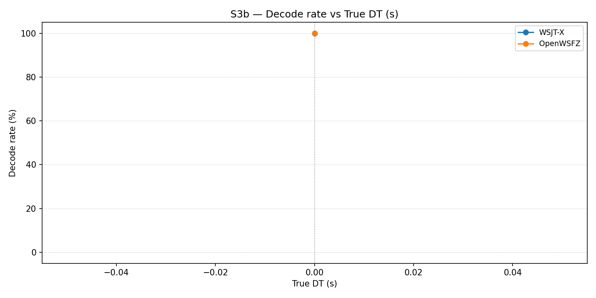

# OpenWSFZ R&R Study Report

| Field | Value |
|---|---|
| Run date | 2026-08-20 |
| OpenWSFZ SHA | `13f2890746d58f46c035e7499bcb92734fc805aa` |
| WSJT-X version | WSJT-X 2.7.0 (inferred from binary date 2025-02-04) |

## S3b — Negative-DT decode boundary

_Decode rate (% of injected messages recovered) as DT sweeps from 0.0 s down to −2.7 s.  Companion to S3; separates 'does it decode?' from 'does it report DT accurately?'.  Informational — no AIAG threshold._

### Per-part decode rate

| Part | True DT (s) | WSJT-X decoded | WSJT-X rate | OpenWSFZ decoded | OpenWSFZ rate |
|---|---|---|---|---|---|
| P0 | 0.00 | 100/100 | 100.00% | 100/100 | 100.00% |

**Overall decode rate — WSJT-X: 100.00%  OpenWSFZ: 100.00%**

## Summary

| Metric | Scope | Value | Verdict |
|---|---|---|---|

**Overall verdict: PASS**
