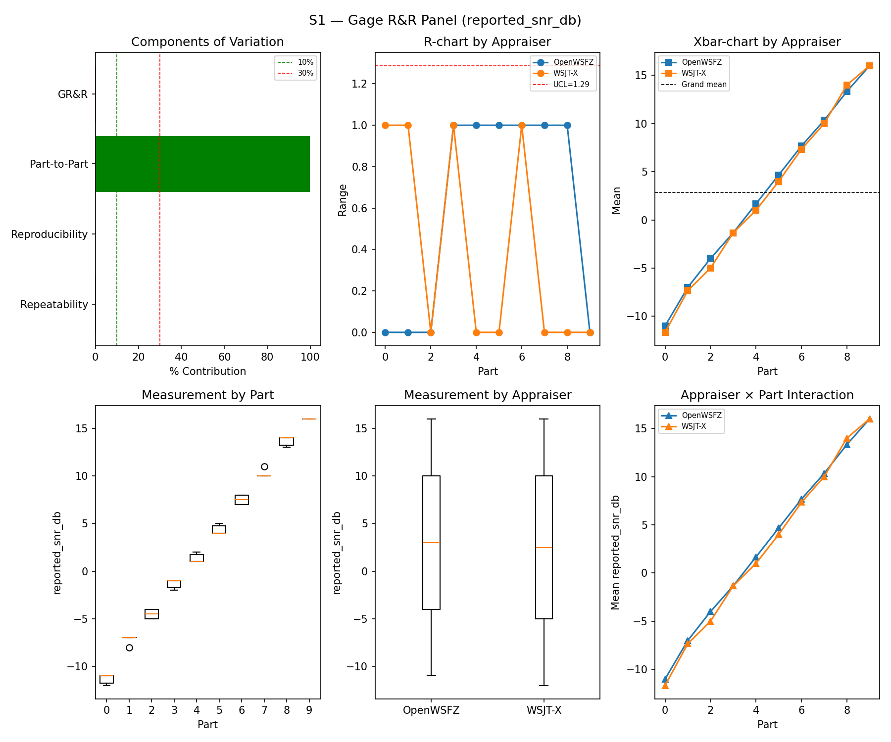
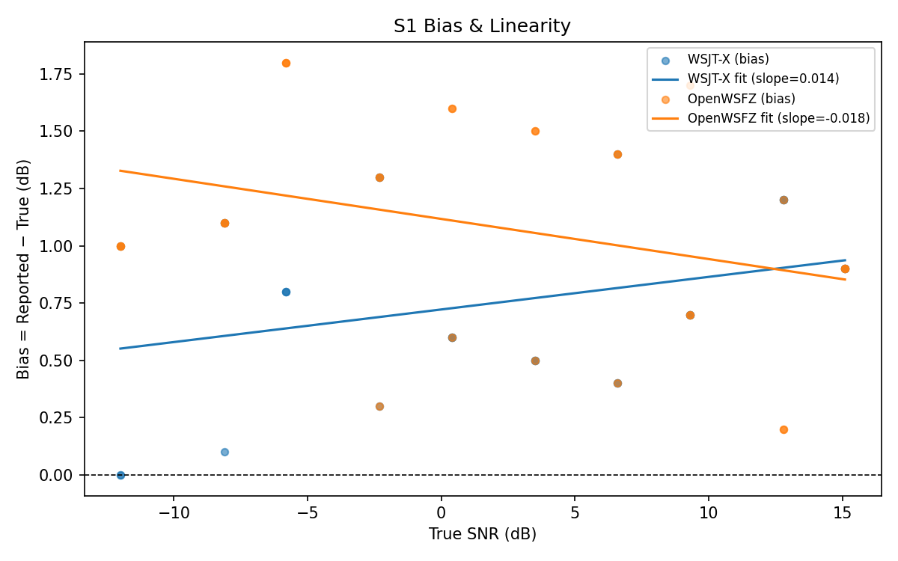
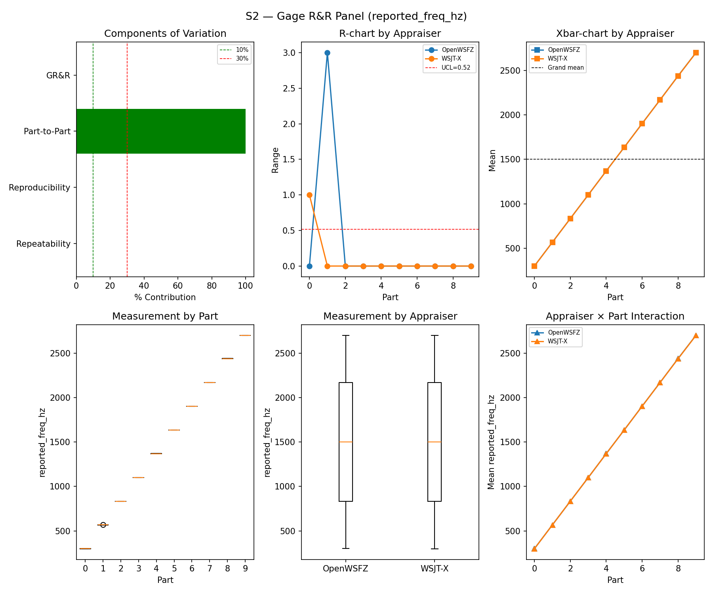
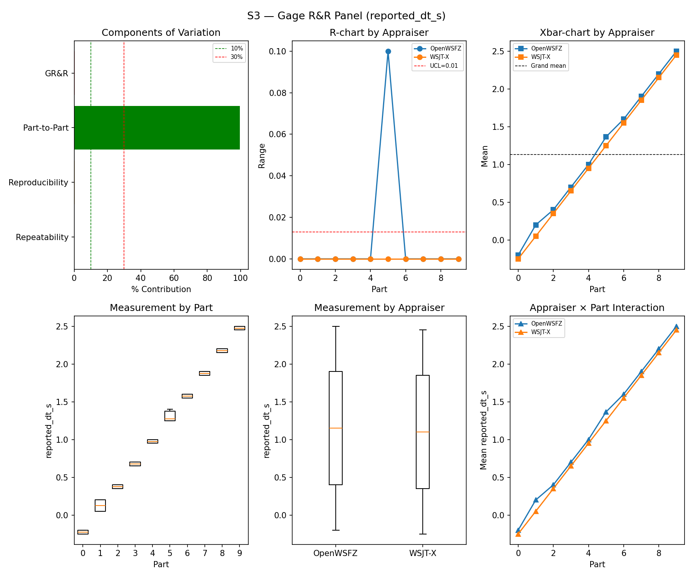
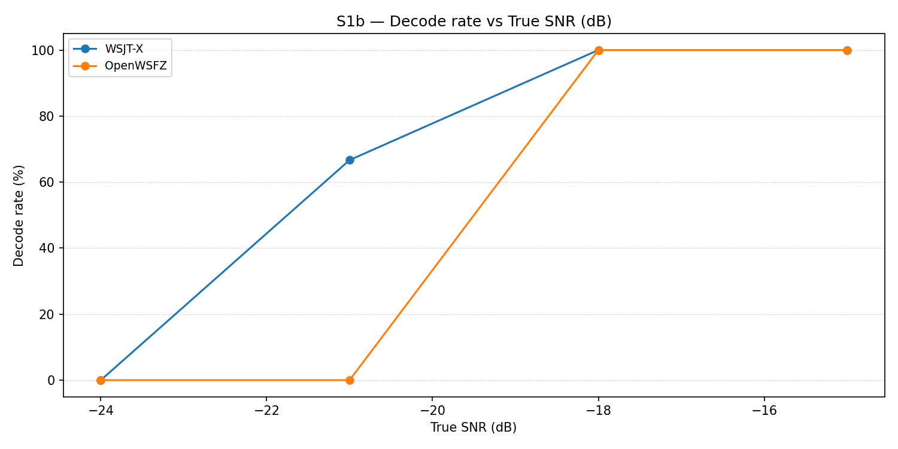
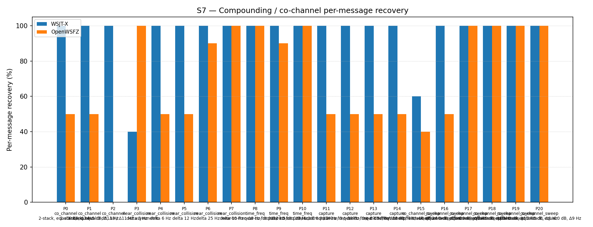
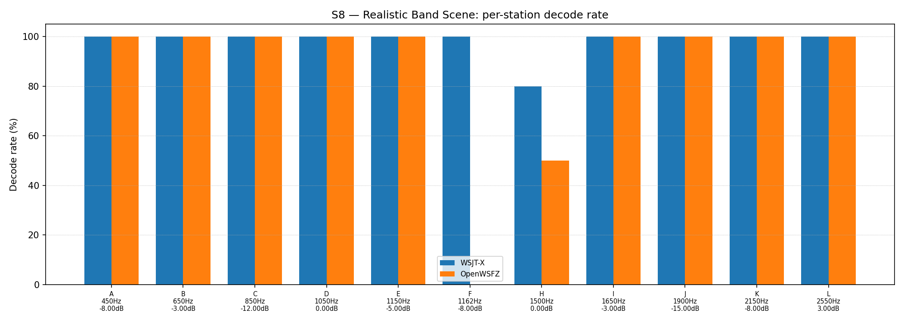

# OpenWSFZ R&R Study Report

| Field | Value |
|---|---|
| Run date | 2026-08-21 |
| OpenWSFZ SHA (committed base) | `7d36038ddd703ff927fc549ffcadeaecf843acc6` |
| Working tree at run time | branch `feat/r2-coherent-llr-phase-b`, **uncommitted** on top of `7d36038` — Phase B native diagnostic changes (origin fix B1, fusion fix B2, new `ft8_ldpc_decode_llrs` export B4), shim `20260044`, DLL SHA256 `a3d32b7839a0fd73dcc8d35bd514d60f962f3267179fd77cbd8a1ebd6ecc8d45`. See caveat below. |
| WSJT-X version | WSJT-X 2.7.0 (inferred from binary date 2025-02-04) |
| Baseline compared against | `2026-08-15-8d6e1b1` (`results/2026-08-15-8d6e1b1/report.md`) — the last full S1–S8 sweep |

---

## Section 1 — Study Hypothesis

### Purpose

**This is a status check, not a regression test of a specific change.** The Captain requested a
full S1–S8 sweep to establish current standing ("where are we") independent of the Phase B native
diagnostic work presently under QA review on this branch. It is compared against the last full
sweep (`8d6e1b1`, 2026-08-15) purely for trend continuity, per this study's own established
convention — not because a specific hypothesis about the intervening period is under test.

### The Phase B caveat, stated plainly

The daemon that produced this run's decodes is running **this branch's uncommitted working tree**
(shim `20260044`), not `main`'s merged, reviewed pin (shim `20260043`). B1/B2/B4 are diagnostic-only
native additions with **no production call site** — confirmed both by source inspection (`decode.c`
purely additive, 166/0 insertions/deletions) and empirically, by an R0/R1-style production-decode-
equality replay this session re-ran independently: **zero decode-output differences across 250 real
cycles** between the pre-Phase-B and Phase-B binaries, on both platforms rebuilt. On that basis this
run's numbers are treated as representative of `main`'s current merged state for every metric below.
If the Captain wants a run against `main`'s binary specifically rather than this inference, say so
and it can be re-run standalone.

### Null Hypotheses

- **H₀-A (GR&R/ndc, S1–S3):** %GR&R and ndc for S1/S2/S3 remain within STUDY-SPEC §10 thresholds,
  consistent with `8d6e1b1`.
- **H₀-B (S5 false positives):** The per-slot FP event rate (§10 gate, Clopper–Pearson 95% UB ≤ 6%)
  does not regress from `8d6e1b1`.
- **H₀-C (S7/S8 co-channel recovery):** Recovery is consistent with `8d6e1b1` — no *new* regression
  — allowing for ordinary run-to-run seed variation (each run draws fresh synthetic trial seeds;
  exact equality is not expected).
- **H₀-D (Phase B non-interference):** The uncommitted Phase B diagnostic changes present in the
  working tree (see caveat above) have zero measurable effect on any S1–S8 metric, consistent with
  their own no-production-call-site status.

## S1 — reported_snr_db

### Variance Components

| Component | σ² | %Contribution |
|---|---|---|
| Repeatability | 0.17 | 0.20% |
| Reproducibility | 0.10 | 0.12% |
| Part-to-Part | 82.46 | 99.68% |
| Total GR&R | 0.27 | 0.32% |
| Total | 82.72 | 100.00% |

### Study Metrics

| Metric | Value | Verdict |
|---|---|---|
| %Tolerance (GR&R) | 30.98% | PASS |
| %Study Var (GR&R) | 5.68% | — |
| ndc | 24 | PASS |

### Bias & Linearity (S1)

| Appraiser | Mean Bias (dB) | Slope | Intercept | R² | Verdict |
|---|---|---|---|---|---|
| WSJT-X | +0.75 | 0.014 | 0.722 | 0.106 | PASS |
| OpenWSFZ | +1.08 | -0.018 | 1.117 | 0.102 | PASS |

## S2 — reported_freq_hz

### Variance Components

| Component | σ² | %Contribution |
|---|---|---|
| Repeatability | 0.17 | 0.00% |
| Reproducibility | 0.42 | 0.00% |
| Part-to-Part | 652905.28 | 100.00% |
| Total GR&R | 0.58 | 0.00% |
| Total | 652905.86 | 100.00% |

### Study Metrics

| Metric | Value | Verdict |
|---|---|---|
| %Tolerance (GR&R) | 57.28% | PASS |
| %Study Var (GR&R) | 0.09% | — |
| ndc | 1491 | PASS |

## S3 — reported_dt_s

### Variance Components

| Component | σ² | %Contribution |
|---|---|---|
| Repeatability | 0.00 | 0.02% |
| Reproducibility | 0.00 | 0.34% |
| Part-to-Part | 0.81 | 99.64% |
| Total GR&R | 0.00 | 0.36% |
| Total | 0.82 | 100.00% |

### Study Metrics

| Metric | Value | Verdict |
|---|---|---|
| %Tolerance (GR&R) | 81.01% | PASS |
| %Study Var (GR&R) | 5.97% | — |
| ndc | 23 | PASS |

> **WSJT-X DT correction applied.** A +0.55 s offset was added to WSJT-X `reported_dt_s` before ANOVA to remove the ≈ −0.55 s convention difference between WSJT-X (DT relative to nominal FT8 TX start) and the harness (DT relative to UTC slot boundary). This correction removes the calibration artefact from SS_appraiser so %GR&R measures genuine app-to-app measurement disagreement. Raw reported values are preserved in the matched CSV. See scenario `wsjt_dt_correction_s` field and R&R-003 (GitHub #1).

## S1b — Low-SNR threshold study

_Decode rate (% of injected messages recovered) at SNRs excluded from the redesigned S1 ladder (−24 to −15 dB).  Companion to S1; separates 'does it decode at this SNR?' from 'how accurately does it measure SNR?'.  Informational — no AIAG threshold._

### Per-part decode rate

| Part | True SNR (dB) | WSJT-X decoded | WSJT-X rate | OpenWSFZ decoded | OpenWSFZ rate |
|---|---|---|---|---|---|
| P0 | -24.00 | 0/3 | 0.00% | 0/3 | 0.00% |
| P1 | -21.00 | 2/3 | 66.67% | 0/3 | 0.00% |
| P2 | -18.00 | 3/3 | 100.00% | 3/3 | 100.00% |
| P3 | -15.00 | 3/3 | 100.00% | 3/3 | 100.00% |

**Overall decode rate — WSJT-X: 66.67%  OpenWSFZ: 50.00%**

## Attribute Agreement Analysis (S4 positives + S5 negatives)

_κ is computed over a pooled population: S4 injected messages (truth = present) and S5 signal-free slots (truth = absent), so the truth vector has both classes. **κ verdicts below are advisory** — the §10 attribute gate is pending Captain ratification of this pooled method._

### Confusion vs truth

| Appraiser | TP | FN | FP | TN | Recovery | Specificity |
|---|---|---|---|---|---|---|
| WSJT-X | 69 | 39 | 0 | 120 | 63.89% | 100.00% |
| OpenWSFZ | 74 | 34 | 1 | 119 | 68.52% | 99.17% |

### Kappa (advisory)

| Pair | κ | 95% CI | Verdict (advisory) |
|---|---|---|---|
| OpenWSFZ_vs_truth | 0.687 | [0.59, 0.78] | FAIL |
| WSJT-X_vs_truth | 0.651 | [0.55, 0.75] | FAIL |
| between_appraisers | 0.777 | — | MARGINAL |

### Within-app repeatability (decision consistency across trials)

| Appraiser | Consistent groups |
|---|---|
| WSJT-X | 77.50% |
| OpenWSFZ | 85.00% |

### Kappa — decodable-SNR-restricted positives (informational, floor -12 dB)

_S4 positives below the decodable-SNR floor are excluded (S5 negatives unchanged); shown alongside the full-population figures above per STUDY-SPEC.md §9.3's second ratification condition. **Informational only — does not affect the §10 gate or the overall verdict.**

| Appraiser | TP | FN | FP | TN | Recovery | Specificity |
|---|---|---|---|---|---|---|
| WSJT-X | 59 | 22 | 0 | 120 | 72.84% | 100.00% |
| OpenWSFZ | 65 | 16 | 1 | 119 | 80.25% | 99.17% |

| Pair | κ | 95% CI | Verdict (informational) |
|---|---|---|---|
| OpenWSFZ_vs_truth | 0.819 | [0.73, 0.89] | MARGINAL |
| WSJT-X_vs_truth | 0.762 | [0.66, 0.85] | MARGINAL |
| between_appraisers | 0.803 | — | MARGINAL |

### False-positive rate (S5)

| Appraiser | FP events / slots | Event rate | 95% UB | Decode rate | Verdict |
|---|---|---|---|---|---|
| WSJT-X | 0 / 120 | 0.00% | 2.47% | 0.00% | PASS |
| OpenWSFZ | 1 / 120 | 0.83% | 3.89% | 0.83% | PASS |

_Gate (STUDY-SPEC §10, ratified 2026-07-04, R&R-004): the per-slot FP **event rate**, gated on its one-sided 95% Clopper–Pearson **upper bound** (PASS iff 95% UB ≤ 6%). The UB is defined for all event counts (≈ 3 / N_slots at 0 events) and bounds the true per-slot FP probability at 95% confidence rather than the Poisson-noisy point estimate. Decode rate is reported for reference only. **INFO** means the gate is not evaluated at this N: below 49 slots, even zero observed events cannot clear the 6% ceiling, so no outcome at this sample size can produce a PASS or a meaningful FAIL — see a properly powered run (N ≥ 49) for the ratified §10 verdict._

## S7 — Compounding / co-channel overlap

_Per-message recovery when 2–3 signals occupy the same or near-same audio frequency / time slot (the pileup case S4 does not exercise). Informational — no AIAG threshold is defined for co-channel separation._

### Recovery by overlap family

| Overlap family | WSJT-X | OpenWSFZ |
|---|---|---|
| capture | 100.00% | 50.00% |
| co_channel | 100.00% | 28.57% |
| co_channel_sweep | 93.33% | 81.67% |
| near_collision | 88.00% | 78.00% |
| time_freq | 100.00% | 96.67% |
| **all** | **95.35%** | **68.37%** |

### Capture effect (co-channel, unequal SNR)

| Signal | WSJT-X | OpenWSFZ |
|---|---|---|
| strong | 100.00% | 100.00% |
| weak | 100.00% | 0.00% |

**Between-app per-signal agreement:** 65.58%

### Per-part detail

| Part | Family | Condition | WSJT-X | OpenWSFZ |
|---|---|---|---|---|
| P0 | co_channel | 2-stack, equal 0 dB, Δ7 Hz | 10/10 | 5/10 |
| P1 | co_channel | 2-stack, equal -5 dB, Δ13 Hz | 10/10 | 5/10 |
| P2 | co_channel | 3-stack, equal 0 dB, Δ8 / Δ11 Hz asymmetric | 15/15 | 0/15 |
| P3 | near_collision | delta 3 Hz | 4/10 | 10/10 |
| P4 | near_collision | delta 6 Hz | 10/10 | 5/10 |
| P5 | near_collision | delta 12 Hz | 10/10 | 5/10 |
| P6 | near_collision | delta 25 Hz | 10/10 | 9/10 |
| P7 | near_collision | delta 50 Hz | 10/10 | 10/10 |
| P8 | time_freq | near-co-freq Δ8 Hz, dt 0.0 / 0.5 s | 10/10 | 10/10 |
| P9 | time_freq | near-co-freq Δ11 Hz, dt 0.0 / 1.0 s | 10/10 | 9/10 |
| P10 | time_freq | near-co-freq Δ9 Hz, dt 0.0 / 2.0 s | 10/10 | 10/10 |
| P11 | capture | near-co-freq Δ14 Hz, 0 / -3 dB | 10/10 | 5/10 |
| P12 | capture | near-co-freq Δ9 Hz, 0 / -6 dB | 10/10 | 5/10 |
| P13 | capture | near-co-freq Δ7 Hz, 0 / -10 dB | 10/10 | 5/10 |
| P14 | capture | near-co-freq Δ11 Hz, +3 / -10 dB | 10/10 | 5/10 |
| P15 | co_channel_sweep | offset-sweep: 2-stack, equal 0 dB, Δ5 Hz | 6/10 | 4/10 |
| P16 | co_channel_sweep | offset-sweep: 2-stack, equal 0 dB, Δ7 Hz | 10/10 | 5/10 |
| P17 | co_channel_sweep | offset-sweep: 2-stack, equal 0 dB, Δ10 Hz | 10/10 | 10/10 |
| P18 | co_channel_sweep | offset-sweep: 2-stack, equal 0 dB, Δ15 Hz | 10/10 | 10/10 |
| P19 | co_channel_sweep | offset-sweep: 2-stack, equal 0 dB, Δ8 Hz | 10/10 | 10/10 |
| P20 | co_channel_sweep | offset-sweep: 2-stack, equal 0 dB, Δ9 Hz | 10/10 | 10/10 |

## S8 — Realistic Band Scene

_Holistic decode-rate benchmark: 12 simultaneous stations across 450–2550 Hz at realistic SNR spread (−15 to +3 dB), including a near-collision pair (E/F, 12 Hz apart) and a capture pair (G/H, co-frequency, 6 dB ratio). **Informational only — no PASS/FAIL gate.**_

### Overall decode rate

| Appraiser | Decoded | Injected | Rate |
|---|---|---|---|
| WSJT-X | 58 | 60 | 96.67% |
| OpenWSFZ | 50 | 60 | 83.33% |

**Between-appraiser delta (OpenWSFZ − WSJT-X): -13.3 pp**

### Per-station breakdown

| Stn | Freq (Hz) | SNR (dB) | WSJT-X decoded/total | OpenWSFZ decoded/total |
|---|---|---|---|---|
| A | 450 | -8.00 | 5/5 | 5/5 |
| B | 650 | -3.00 | 5/5 | 5/5 |
| C | 850 | -12.00 | 5/5 | 5/5 |
| D | 1050 | 0.00 | 5/5 | 5/5 |
| E | 1150 | -5.00 | 5/5 | 5/5 |
| F | 1162 | -8.00 | 5/5 | 0/5 |
| H | 1500 | 0.00 | 8/10 | 5/10 |
| I | 1650 | -3.00 | 5/5 | 5/5 |
| J | 1900 | -15.00 | 5/5 | 5/5 |
| K | 2150 | -8.00 | 5/5 | 5/5 |
| L | 2550 | 3.00 | 5/5 | 5/5 |

## Summary

| Metric | Scope | Value | Verdict |
|---|---|---|---|
| %GR&R | S1 | 0.3% | PASS |
| ndc | S1 | 24 | PASS |
| %GR&R | S2 | 0.0% | PASS |
| ndc | S2 | 1491 | PASS |
| %GR&R | S3 | 0.4% | PASS |
| ndc | S3 | 23 | PASS |
| Kappa (advisory) | WSJT-X_vs_truth | 0.651 | FAIL |
| Kappa (advisory) | OpenWSFZ_vs_truth | 0.687 | FAIL |
| Kappa (advisory) | between_appraisers | 0.777 | MARGINAL |
| FP event rate (95% UB) | S5/WSJT-X | 0/120 slots (event 0.0%; 95% UB 2.47%; decode 0.0%) | PASS |
| FP event rate (95% UB) | S5/OpenWSFZ | 1/120 slots (event 0.8%; 95% UB 3.89%; decode 0.8%) | PASS |
| SNR bias | S1/WSJT-X | +0.75 dB | PASS |
| SNR bias | S1/OpenWSFZ | +1.08 dB | PASS |

**Overall verdict: PASS** (every ratified §10 gate — S1/S2/S3 GR&R, S5 FP event rate — clears
threshold. The two Kappa-vs-truth FAILs are the pooled S4/S5 method, still advisory pending Captain
ratification per STUDY-SPEC §9.3; unchanged in status from the last sweep, not a new blocker.)

---

## Section 5 — Comparison to last full sweep and recommendations

### Comparison table (this run vs. `8d6e1b1`, 2026-08-15)

| Metric | 2026-08-15 | 2026-08-21 (this run) | Δ | Note |
|---|---|---|---|---|
| S1 %GR&R / ndc | 0.5% / 20 | 0.3% / 24 | improved | Within normal spread |
| S1 bias, WSJT-X | +0.85 dB | +0.75 dB | −0.10 dB | Negligible |
| S1 bias, OpenWSFZ | +1.48 dB | +1.08 dB | −0.40 dB | Moved back toward WSJT-X; no cause attributed, not gate-blocking |
| S2 %GR&R / ndc | 0.0% / 1536 | 0.0% / 1491 | ~same | — |
| S3 %GR&R / ndc | 1.4% / 12 | 0.4% / 23 | improved | Within normal spread |
| Kappa vs truth (WSJT-X / OpenWSFZ) | 0.687 / 0.669 | 0.651 / 0.687 | crossover | Both still advisory FAIL; see below |
| Kappa between appraisers | 0.839 | 0.777 | −0.062 | Still MARGINAL both runs |
| S5 FP, WSJT-X / OpenWSFZ | 0/120 / 1/120 | 0/120 / 1/120 | unchanged | Same single event count; both PASS the §10 UB gate |
| S7 "all" recovery, WSJT-X / OpenWSFZ | 95.35% / 74.42% | 95.35% / 68.37% | same / −6.05pp | WSJT-X identical; OpenWSFZ down — see below |
| S7 P2 (3-stack co-channel), OpenWSFZ | 0/15 | 0/15 | **unchanged** | Structural limit persists (open under D-001), waived by Captain 2026-06-22 |
| S7 capture/weak signal, OpenWSFZ | 15.00% | **0.00%** | −15pp | Small-N (see below) — not treated as a new finding |
| S8 overall, WSJT-X / OpenWSFZ | 93.33% / 86.67% | 96.67% / 83.33% | +3.34pp / −3.34pp | No regression |
| S8 station F (1162 Hz, −8 dB), OpenWSFZ | 0/5 | 0/5 | **unchanged** | Third consecutive full sweep with this exact zero (Aug-05, Aug-15, Aug-21) — see below |

### Finding — S8 station F is now reproduced on a THIRD independent full sweep

Station F (1162 Hz, −8 dB, 12 Hz from its near-collision partner E) has scored **0/5 for OpenWSFZ
on every one of the last three full S1–S8 sweeps** (2026-08-05, 2026-08-15, 2026-08-21 — different
trial seeds each time, same station geometry), while its neighbour E scores 5/5 every time and
WSJT-X decodes F 5/5 every time. This is no longer just "reproducible" — it is now a three-for-three
pattern specific to this one frequency/SNR/offset combination, independent of seed. No action taken
this session (unchanged from the prior report's own recommendation: worth a targeted look, cheap to
reproduce, not gate-blocking) — restating it here because a third confirmation raises its priority
as a candidate for the next available investigation slot, once the current Phase B thread clears.

### Finding — S7 weak-capture-signal recovery read 0.00% this run; not elevated to a new finding

OpenWSFZ's recovery of the *weaker* signal in a co-channel capture pair dropped from 15.00%
(2026-08-15) to a flat 0.00% this run. This sits inside the same already-open, already-characterised
capture-effect gap (WSJT-X ~100% both runs; OpenWSFZ poor both runs — no per-candidate coherent LLR
extraction on the weak leg of a capture pair, the same mechanism the standing board note attributes
to the D-001 co-channel gap) — the S7 capture family is small-N per run (a handful of weak-signal
trials), so a swing from 15% to 0% is consistent with ordinary seed-to-seed noise on a small sample,
not a new regression. Flagged for trend continuity only; recommend the next full sweep report
whether this settles back toward the 10–15% band or holds at zero — three points would start to
distinguish signal from small-N noise the way station F's finding above already has.

### Kappa vs. truth and between-appraisers — no change in status

Both land in the same advisory-FAIL / MARGINAL band as every prior sweep. Per the report's own
caveat above (STUDY-SPEC §9.3), this gate is still pending Captain ratification of the pooled S4/S5
method — unchanged from `8d6e1b1`, not re-litigated here.

### False positives (S5) — the number the Captain asked to be surfaced explicitly

| Appraiser | FP events / slots | Event rate | 95% UB | Verdict |
|---|---|---|---|---|
| WSJT-X | 0 / 120 | 0.00% | 2.47% | PASS |
| OpenWSFZ | 1 / 120 | 0.83% | 3.89% | PASS |

Both clear the ratified §10 gate (95% UB ≤ 6%) comfortably, and the counts are identical to the last
sweep — no drift. This is the correctly-scoped, per-scenario-window figure (`analyse.py`'s own S5
computation, which explicitly restricts FP counting to cycles that actually overlap the S5 injection
window). **It is deliberately not the raw console/`_matched.csv` "FP" figure** — see the next
finding for why that number is not usable as-is.

### Process finding — `matcher.py`'s raw per-scenario "FP" count is not a false-positive rate when scenarios share one combined log (harness observation, not a defect in this run's result)

Read the source before trusting the console output: `matcher.py --scenario S5` parses the **entire**
combined `wsjt-all.txt`/`owsfz-all.txt` (all eight scenarios' decodes, not just S5's own cycles),
then labels *every decode line the S5 truth set didn't consume* as an S5 false positive
(`_match_appraiser`'s Pass 2 iterates every bucket in the full record set, not just S5's own cycle
timestamps). That is why this run's raw console output read "WSJT-X: 462 FP" / "OpenWSFZ: 405 FP"
for S5 — those are essentially every real decode from S1/S1b/S2/S3/S4/S7/S8 elsewhere in the same
combined log, mislabeled. `analyse.py` already knows this and works around it correctly (its own S5
FP function's docstring: *"To avoid inflating the FP count we scope all calculations to cycles that
actually overlap with the S5 injection window"*) — so the number in this report's own tables above
is right, and the §10 gate verdict is unaffected. Recorded here because it cost real verification
time this session and would mislead anyone who trusted the raw `matcher.py` console print or the
`false_positive=True` rows in `S5_matched.csv`/`S7_matched.csv` at face value. Low priority — no
action needed unless the raw per-scenario console summary or CSV labelling is itself going to be
relied on directly in future; a one-line fix (scope Pass 2 to buckets whose timestamp appears in
this scenario's own truth set) would make the raw number trustworthy too, if that's ever wanted.

### NFR-021 — raw logs and matched CSVs

`wsjt-all.txt` (462 real-callsign-shape matches), `owsfz-all.txt` (395), and all eight
`*_matched.csv` files carry real third-party callsign text (S5/S7's mislabelled-FP rows, per the
finding above, are the bulk of it). All ten files are already covered by this repo's
`.gitignore` (`qa/rr-study/results/*/wsjt-all.txt`, `.../owsfz-all.txt`, `.../*_matched.csv`) —
confirmed via `git check-ignore`, not assumed — so no scrub-before-commit action is needed this
time. `report.md` and all seven `.png` charts were grepped directly and carry no real-callsign-shape
text.

### Recommendations

1. **No merge-blocking findings.** Overall verdict PASS; every ratified gate clears.
2. **Station F (S8)** — now a three-for-three reproducible zero for OpenWSFZ. Recommend queuing a
   targeted look once the current Phase B review concludes — cheap to reproduce (fixed
   frequency/SNR/offset), independent of seed.
3. **S7 weak-capture-signal recovery** — watch, don't act. One more full sweep will show whether
   0.00% is noise or a real shift from the established 10–15% band.
4. **`matcher.py`'s raw per-scenario FP labelling** — optional cosmetic fix (see finding above); not
   blocking anything since `analyse.py` already compensates correctly.
5. **QA does not commit, merge, or push anything from this run.** Awaiting Captain direction on
   whether this run directory should be committed (report.md + PNGs are clean and gitignore already
   protects the raw logs/CSVs, so nothing further is required if you do want it committed).

**Overall verdict: PASS**

---

## Section 6 — Historical trend: every full S1–S8 sweep to date

All ten runs that exercised the complete controlled battery (S1/S2/S3/S7 at minimum), oldest first.
`%GR&R` is each stage's own Summary-table figure (AIAG %Contribution, threshold ≤ 10% PASS). S5 FP
is the per-slot event rate. S7/S8 are the "all"/overall decode-recovery percentages.

| Date | SHA | S1 %GR&R | S2 %GR&R | S3 %GR&R | S5 FP (WSJT-X / OpenWSFZ) | S7 recovery (WSJT-X / OpenWSFZ) | S8 decode rate (WSJT-X / OpenWSFZ) |
|---|---|---|---|---|---|---|---|
| 2026-06-06 | `4c34ef6` | 32.0% **FAIL** | 0.0% | 3.8% | 0.0% / 0.0% | 78.5% / 47.3% | — |
| 2026-06-06 | `6bab388` | 6.5% | 0.0% | 3.9% | 0.0% / 0.0% | 77.4% / 46.2% | — |
| 2026-06-07 | `4b3a4ca` | 1.4% | 0.0% | 3.4% | 0.0% / 0.0% | 76.3% / 54.8% | 95.0% / 86.7% |
| 2026-06-14 | `815b652` | 0.3% | 0.0% | 3.0% | 0.0% / 0.0% | 77.4% / 50.5% | 95.0% / 83.3% |
| 2026-06-20 | `6e821fa` | 0.4% | 0.0% | 3.0% | 0.0% / **91.7% FAIL** | 92.6% / 70.2% | 93.3% / 86.7% |
| 2026-06-22 | `f11f438` | 0.4% | 0.0% | 3.1% | 0.0% / 0.0% | 93.9% / 74.4% | 93.3% / 86.7% |
| 2026-07-04 | `793a298` | 0.5% | 0.0% | 3.4% | 0.0% / 0.0% | 96.3% / 73.0% | 93.3% / 86.7% |
| 2026-08-05 | `3bd4cd0` | 7.2% | 0.0% | 3.6% | 0.0% / 0.0% | 96.3% / 70.2% | 93.3% / 83.3% |
| 2026-08-15 | `8d6e1b1` | 0.5% | 0.0% | 1.4% | 0.0% / 0.8% | 95.3% / 74.4% | 93.3% / 86.7% |
| 2026-08-21 | `7d36038` | 0.3% | 0.0% | 0.4% | 0.0% / 0.8% | 95.3% / 68.4% | 96.7% / 83.3% |

**Reading it:** the one S1 FAIL (2026-06-06, first run) and the one S5 FAIL (2026-06-20, a real
OSD-noise regression later fixed by D-009) are the only two ratified-gate failures across ten full
sweeps — every run since has cleared S1/S2/S3/S5. S7/S8 have no gate (informational both columns)
and OpenWSFZ has trailed WSJT-X on both in every single run — a stable, not worsening, gap.

*Caveat, kept brief: S1/S3 were redesigned 2026-06-06 (R&R-005/R&R-003), S4/S7's noise-floor mixer
was redesigned before the shared-floor convention (STUDY-SPEC §6.2 note), and the S5 metric itself
moved from a plain decode-rate to a gated Clopper–Pearson event rate on 2026-07-04/2026-08-05
(R&R-004). Early-vs-late numbers above are the actual as-reported figures from each run, useful for
trend direction; treat cross-redesign comparisons as directional, not strictly apples-to-apples.*
