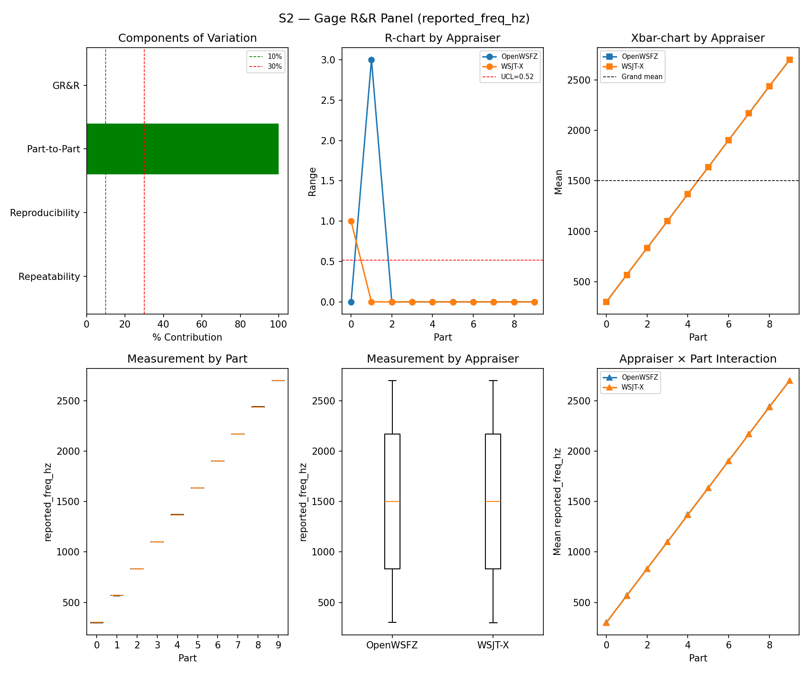
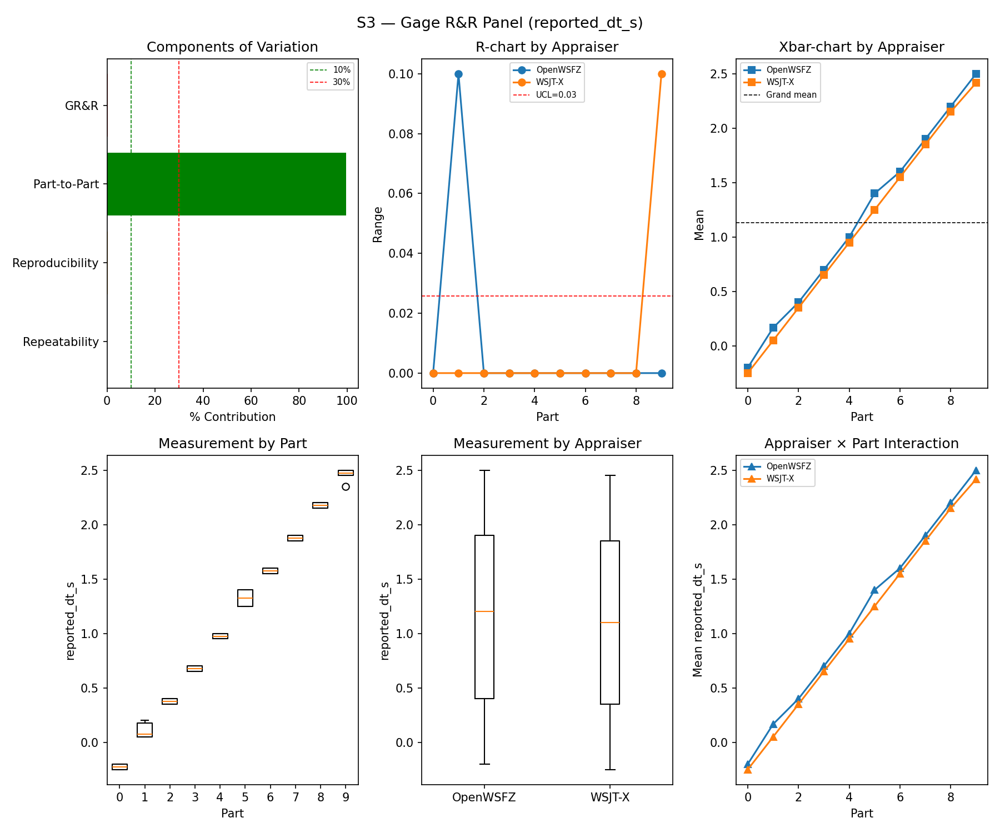

# OpenWSFZ R&R Study Report

| Field | Value |
|---|---|
| Run date | 2026-08-22 |
| OpenWSFZ SHA | `d4ce25460f1428f250b71f34a1484567ababbff3` |
| WSJT-X version | WSJT-X 2.7.0 (inferred from binary date 2025-02-04) |

## S2 — reported_freq_hz

### Variance Components

| Component | σ² | %Contribution |
|---|---|---|
| Repeatability | 0.17 | 0.00% |
| Reproducibility | 0.42 | 0.00% |
| Part-to-Part | 652934.67 | 100.00% |
| Total GR&R | 0.58 | 0.00% |
| Total | 652935.25 | 100.00% |

### Study Metrics

| Metric | Value | Verdict |
|---|---|---|
| %Tolerance (GR&R) | 57.28% | PASS |
| %Study Var (GR&R) | 0.09% | — |
| ndc | 1491 | PASS |

## S3 — reported_dt_s

### Variance Components

| Component | σ² | %Contribution |
|---|---|---|
| Repeatability | 0.00 | 0.04% |
| Reproducibility | 0.00 | 0.36% |
| Part-to-Part | 0.81 | 99.60% |
| Total GR&R | 0.00 | 0.40% |
| Total | 0.82 | 100.00% |

### Study Metrics

| Metric | Value | Verdict |
|---|---|---|
| %Tolerance (GR&R) | 85.51% | PASS |
| %Study Var (GR&R) | 6.31% | — |
| ndc | 22 | PASS |

> **WSJT-X DT correction applied.** A +0.55 s offset was added to WSJT-X `reported_dt_s` before ANOVA to remove the ≈ −0.55 s convention difference between WSJT-X (DT relative to nominal FT8 TX start) and the harness (DT relative to UTC slot boundary). This correction removes the calibration artefact from SS_appraiser so %GR&R measures genuine app-to-app measurement disagreement. Raw reported values are preserved in the matched CSV. See scenario `wsjt_dt_correction_s` field and R&R-003 (GitHub #1).

## S8 — Realistic Band Scene

_Holistic decode-rate benchmark: 12 simultaneous stations across 450–2550 Hz at realistic SNR spread (−15 to +3 dB), including a near-collision pair (E/F, 12 Hz apart) and a capture pair (G/H, co-frequency, 6 dB ratio). **Informational only — no PASS/FAIL gate.**_

### Overall decode rate

| Appraiser | Decoded | Injected | Rate |
|---|---|---|---|
| WSJT-X | 58 | 60 | 96.67% |
| OpenWSFZ | 50 | 60 | 83.33% |

**Between-appraiser delta (OpenWSFZ − WSJT-X): -13.3 pp**

### Per-station breakdown

| Stn | Freq (Hz) | SNR (dB) | WSJT-X decoded/total | OpenWSFZ decoded/total |
|---|---|---|---|---|
| A | 450 | -8.00 | 5/5 | 5/5 |
| B | 650 | -3.00 | 5/5 | 5/5 |
| C | 850 | -12.00 | 5/5 | 5/5 |
| D | 1050 | 0.00 | 5/5 | 5/5 |
| E | 1150 | -5.00 | 5/5 | 5/5 |
| F | 1162 | -8.00 | 5/5 | 0/5 |
| H | 1500 | 0.00 | 8/10 | 5/10 |
| I | 1650 | -3.00 | 5/5 | 5/5 |
| J | 1900 | -15.00 | 5/5 | 5/5 |
| K | 2150 | -8.00 | 5/5 | 5/5 |
| L | 2550 | 3.00 | 5/5 | 5/5 |

## Summary

| Metric | Scope | Value | Verdict |
|---|---|---|---|
| %GR&R | S2 | 0.0% | PASS |
| ndc | S2 | 1491 | PASS |
| %GR&R | S3 | 0.4% | PASS |
| ndc | S3 | 22 | PASS |

**Overall verdict: PASS**
