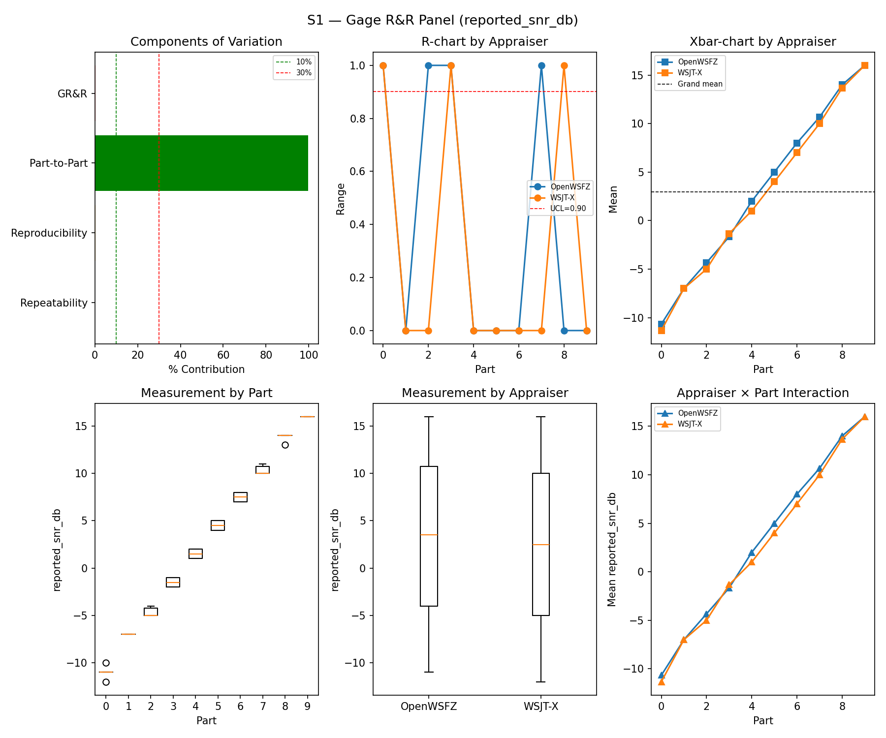
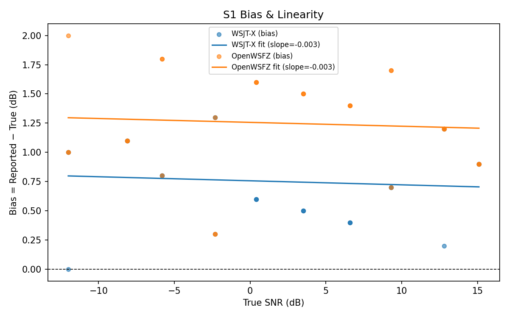
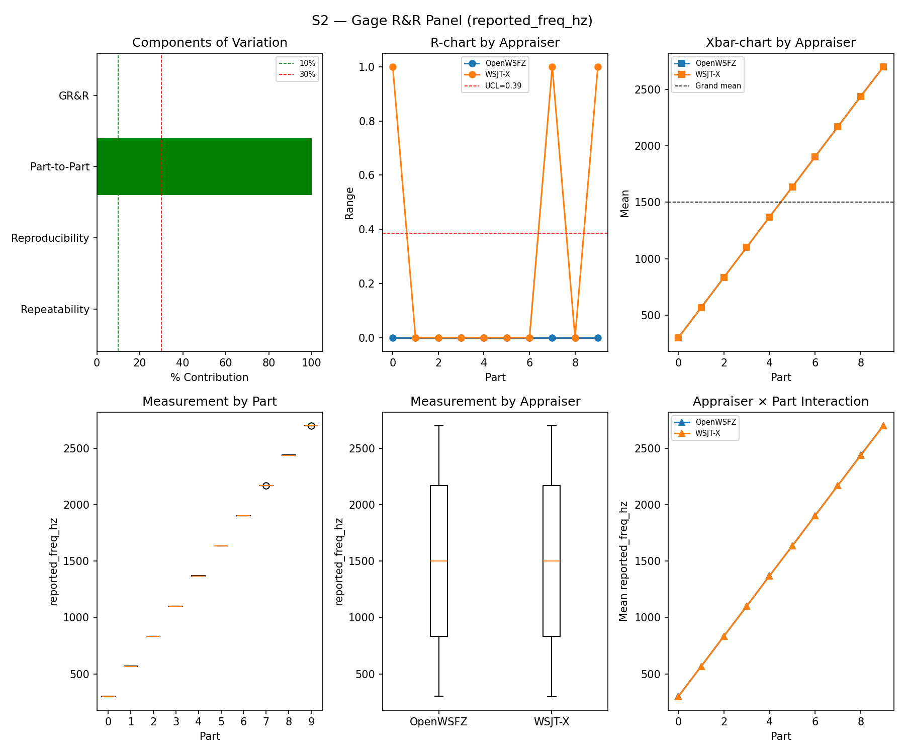
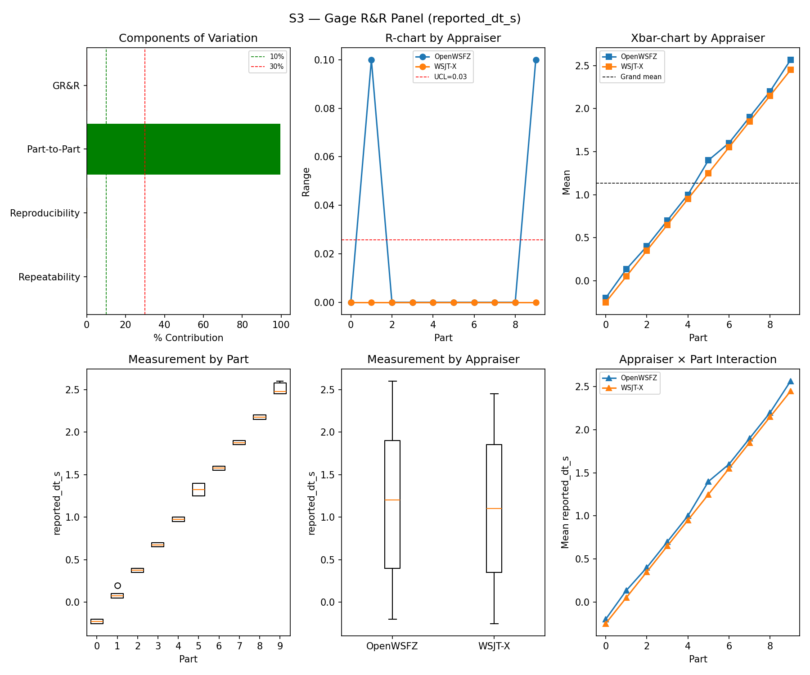
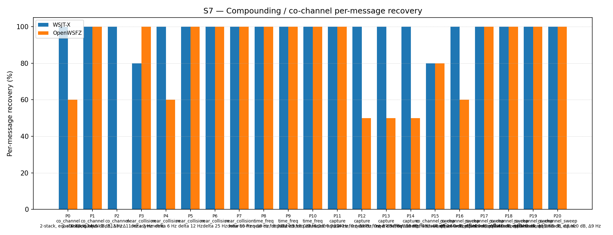
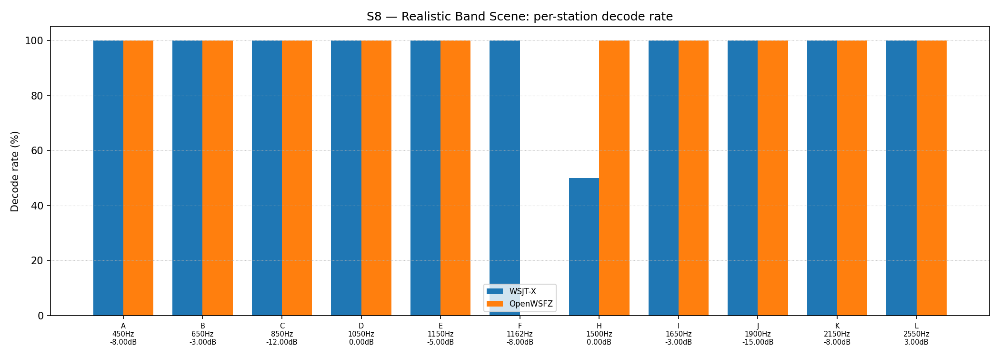

# OpenWSFZ R&R Study Report

| Field | Value |
|---|---|
| Run date | 2026-08-22 |
| OpenWSFZ SHA | `f5dec2339b9baa1dc33e14d5198ab4481cf288b1` — clean working tree, no uncommitted changes (verified: `git status --short -- src/` empty) |
| Native DLL identity | `src/OpenWSFZ.Ft8/Native/win-x64/libft8.dll` SHA256 `bc8efcf148046f199c057b62c7987c4b69f2dc62d72509458a671305ab051d7f` — confirmed byte-identical across the committed blob, the working tree, and the copy actually loaded by the daemon process that produced this run (PID 408); shim `20260046` includes `c3a9ea8` (negative `time_offset` SNR-collapse fix), confirmed on-branch ancestor of `HEAD` |
| WSJT-X version | WSJT-X 2.7.0 (inferred from binary date 2025-02-04) |
| Baseline compared against | `2026-08-21-7d36038` (`results/2026-08-21-7d36038/report.md`) — the last full S1–S8 sweep |

---

## Section 1 — Study Hypothesis

### Purpose

**Status-check sweep**, same convention as the last several full runs — not a regression test of a
specific change. Two things happened earlier in this session worth recording for provenance, neither
of which is a code-semantics change:

1. **Build-environment defect found and fixed.** The daemon binary on disk at session start had been
   compiled from WSL, which silently compiles out all WASAPI capture code (`OpenWSFZ.Audio`'s
   `WASAPI_SUPPORTED` constant is gated on `$([MSBuild]::IsOSPlatform('Windows'))`, evaluated at build
   time against the *build machine's* OS, not the target's). It was rebuilt from a native Windows
   shell this session — `git status` confirms zero source changes, so this is a build-artefact fix,
   not a behaviour change. Confirmed the daemon that ran this study is genuinely capturing
   (`captureActive:true`, live WASAPI tone-injection test PASS) rather than the earlier silent-stub
   state.
2. **R&R-009 testing-strategy change landed mid-session, does not apply to this run.** `run_study.py`
   now restricts S5 to parts 0/1 by default (parts 2/3 — steady-carrier and multi-carrier "birdie"
   cases — detected 1 of 53 false positives across all prior history). This run was already launched
   before that edit landed, so **it ran the full, unrestricted S5 (all four parts, 120 slots)** —
   directly comparable to every prior sweep with no sample-size caveat. See Section 5 for how this
   run's own S5 false positives distribute across parts, which independently corroborates R&R-009's
   rationale.

### Null Hypotheses

- **H₀-A (GR&R/ndc, S1–S3):** %GR&R and ndc for S1/S2/S3 remain within STUDY-SPEC §10 thresholds,
  consistent with `7d36038`. **Holds** — see Section 5.
- **H₀-B (S5 false positives):** The per-slot FP event rate (§10 gate, Clopper–Pearson 95% UB ≤ 6%)
  does not regress from `7d36038`. **Rejected** — OpenWSFZ's S5 FP event rate went from 1/120 (PASS,
  95% UB 3.89%) to 4/120 (**FAIL**, 95% UB 7.47%). This is the study's second-ever ratified S5 gate
  failure (the first was 2026-06-20, a real OSD-noise regression later fixed by D-009). See Section 5
  for per-part attribution.
- **H₀-C (S7/S8 co-channel recovery):** Recovery is consistent with `7d36038` — no *new* regression,
  allowing for ordinary seed-to-seed variation. **Holds, and both appraisers improved** — see
  Section 5.

## S1 — reported_snr_db

### Variance Components

| Component | σ² | %Contribution |
|---|---|---|
| Repeatability | 0.12 | 0.14% |
| Reproducibility | 0.19 | 0.23% |
| Part-to-Part | 82.15 | 99.63% |
| Total GR&R | 0.31 | 0.37% |
| Total | 82.46 | 100.00% |

### Study Metrics

| Metric | Value | Verdict |
|---|---|---|
| %Tolerance (GR&R) | 33.17% | PASS |
| %Study Var (GR&R) | 6.09% | — |
| ndc | 23 | PASS |

### Bias & Linearity (S1)

| Appraiser | Mean Bias (dB) | Slope | Intercept | R² | Verdict |
|---|---|---|---|---|---|
| WSJT-X | +0.75 | -0.003 | 0.757 | 0.008 | PASS |
| OpenWSFZ | +1.25 | -0.003 | 1.256 | 0.005 | PASS |

## S2 — reported_freq_hz

### Variance Components

| Component | σ² | %Contribution |
|---|---|---|
| Repeatability | 0.05 | 0.00% |
| Reproducibility | 0.49 | 0.00% |
| Part-to-Part | 653073.13 | 100.00% |
| Total GR&R | 0.54 | 0.00% |
| Total | 653073.67 | 100.00% |

### Study Metrics

| Metric | Value | Verdict |
|---|---|---|
| %Tolerance (GR&R) | 55.12% | PASS |
| %Study Var (GR&R) | 0.09% | — |
| ndc | 1550 | PASS |

## S3 — reported_dt_s

### Variance Components

| Component | σ² | %Contribution |
|---|---|---|
| Repeatability | 0.00 | 0.04% |
| Reproducibility | 0.00 | 0.35% |
| Part-to-Part | 0.83 | 99.61% |
| Total GR&R | 0.00 | 0.39% |
| Total | 0.84 | 100.00% |

### Study Metrics

| Metric | Value | Verdict |
|---|---|---|
| %Tolerance (GR&R) | 85.51% | PASS |
| %Study Var (GR&R) | 6.23% | — |
| ndc | 22 | PASS |

> **WSJT-X DT correction applied.** A +0.55 s offset was added to WSJT-X `reported_dt_s` before ANOVA to remove the ≈ −0.55 s convention difference between WSJT-X (DT relative to nominal FT8 TX start) and the harness (DT relative to UTC slot boundary). This correction removes the calibration artefact from SS_appraiser so %GR&R measures genuine app-to-app measurement disagreement. Raw reported values are preserved in the matched CSV. See scenario `wsjt_dt_correction_s` field and R&R-003 (GitHub #1).

## S1b — Low-SNR threshold study

_Decode rate (% of injected messages recovered) at SNRs excluded from the redesigned S1 ladder (−24 to −15 dB).  Companion to S1; separates 'does it decode at this SNR?' from 'how accurately does it measure SNR?'.  Informational — no AIAG threshold._

### Per-part decode rate

| Part | True SNR (dB) | WSJT-X decoded | WSJT-X rate | OpenWSFZ decoded | OpenWSFZ rate |
|---|---|---|---|---|---|
| P0 | -24.00 | 0/3 | 0.00% | 0/3 | 0.00% |
| P1 | -21.00 | 2/3 | 66.67% | 0/3 | 0.00% |
| P2 | -18.00 | 2/3 | 66.67% | 3/3 | 100.00% |
| P3 | -15.00 | 3/3 | 100.00% | 3/3 | 100.00% |

**Overall decode rate — WSJT-X: 58.33%  OpenWSFZ: 50.00%**

## Attribute Agreement Analysis (S4 positives + S5 negatives)

_κ is computed over a pooled population: S4 injected messages (truth = present) and S5 signal-free slots (truth = absent), so the truth vector has both classes. **κ verdicts below are advisory** — the §10 attribute gate is pending Captain ratification of this pooled method._

### Confusion vs truth

| Appraiser | TP | FN | FP | TN | Recovery | Specificity |
|---|---|---|---|---|---|---|
| WSJT-X | 67 | 41 | 0 | 120 | 62.04% | 100.00% |
| OpenWSFZ | 70 | 38 | 4 | 116 | 64.81% | 96.67% |

### Kappa (advisory)

| Pair | κ | 95% CI | Verdict (advisory) |
|---|---|---|---|
| OpenWSFZ_vs_truth | 0.625 | [0.52, 0.72] | FAIL |
| WSJT-X_vs_truth | 0.632 | [0.53, 0.73] | FAIL |
| between_appraisers | 0.805 | — | MARGINAL |

### Within-app repeatability (decision consistency across trials)

| Appraiser | Consistent groups |
|---|---|
| WSJT-X | 77.50% |
| OpenWSFZ | 80.00% |

### Kappa — decodable-SNR-restricted positives (informational, floor -12 dB)

_S4 positives below the decodable-SNR floor are excluded (S5 negatives unchanged); shown alongside the full-population figures above per STUDY-SPEC.md §9.3's second ratification condition. **Informational only — does not affect the §10 gate or the overall verdict.**

| Appraiser | TP | FN | FP | TN | Recovery | Specificity |
|---|---|---|---|---|---|---|
| WSJT-X | 57 | 24 | 0 | 120 | 70.37% | 100.00% |
| OpenWSFZ | 62 | 19 | 4 | 116 | 76.54% | 96.67% |

| Pair | κ | 95% CI | Verdict (informational) |
|---|---|---|---|
| OpenWSFZ_vs_truth | 0.755 | [0.66, 0.84] | MARGINAL |
| WSJT-X_vs_truth | 0.739 | [0.63, 0.82] | MARGINAL |
| between_appraisers | 0.825 | — | MARGINAL |

### False-positive rate (S5)

| Appraiser | FP events / slots | Event rate | 95% UB | Decode rate | Verdict |
|---|---|---|---|---|---|
| WSJT-X | 0 / 120 | 0.00% | 2.47% | 0.00% | PASS |
| OpenWSFZ | 4 / 120 | 3.33% | 7.47% | 3.33% | FAIL |

_Gate (STUDY-SPEC §10, ratified 2026-07-04, R&R-004): the per-slot FP **event rate**, gated on its one-sided 95% Clopper–Pearson **upper bound** (PASS iff 95% UB ≤ 6%). The UB is defined for all event counts (≈ 3 / N_slots at 0 events) and bounds the true per-slot FP probability at 95% confidence rather than the Poisson-noisy point estimate. Decode rate is reported for reference only. **INFO** means the gate is not evaluated at this N: below 49 slots, even zero observed events cannot clear the 6% ceiling, so no outcome at this sample size can produce a PASS or a meaningful FAIL — see a properly powered run (N ≥ 49) for the ratified §10 verdict._

## S7 — Compounding / co-channel overlap

_Per-message recovery when 2–3 signals occupy the same or near-same audio frequency / time slot (the pileup case S4 does not exercise). Informational — no AIAG threshold is defined for co-channel separation._

### Recovery by overlap family

| Overlap family | WSJT-X | OpenWSFZ |
|---|---|---|
| capture | 100.00% | 62.50% |
| co_channel | 100.00% | 45.71% |
| co_channel_sweep | 96.67% | 90.00% |
| near_collision | 96.00% | 92.00% |
| time_freq | 100.00% | 100.00% |
| **all** | **98.14%** | **79.53%** |

### Capture effect (co-channel, unequal SNR)

| Signal | WSJT-X | OpenWSFZ |
|---|---|---|
| strong | 100.00% | 100.00% |
| weak | 100.00% | 25.00% |

**Between-app per-signal agreement:** 79.53%

### Per-part detail

| Part | Family | Condition | WSJT-X | OpenWSFZ |
|---|---|---|---|---|
| P0 | co_channel | 2-stack, equal 0 dB, Δ7 Hz | 10/10 | 6/10 |
| P1 | co_channel | 2-stack, equal -5 dB, Δ13 Hz | 10/10 | 10/10 |
| P2 | co_channel | 3-stack, equal 0 dB, Δ8 / Δ11 Hz asymmetric | 15/15 | 0/15 |
| P3 | near_collision | delta 3 Hz | 8/10 | 10/10 |
| P4 | near_collision | delta 6 Hz | 10/10 | 6/10 |
| P5 | near_collision | delta 12 Hz | 10/10 | 10/10 |
| P6 | near_collision | delta 25 Hz | 10/10 | 10/10 |
| P7 | near_collision | delta 50 Hz | 10/10 | 10/10 |
| P8 | time_freq | near-co-freq Δ8 Hz, dt 0.0 / 0.5 s | 10/10 | 10/10 |
| P9 | time_freq | near-co-freq Δ11 Hz, dt 0.0 / 1.0 s | 10/10 | 10/10 |
| P10 | time_freq | near-co-freq Δ9 Hz, dt 0.0 / 2.0 s | 10/10 | 10/10 |
| P11 | capture | near-co-freq Δ14 Hz, 0 / -3 dB | 10/10 | 10/10 |
| P12 | capture | near-co-freq Δ9 Hz, 0 / -6 dB | 10/10 | 5/10 |
| P13 | capture | near-co-freq Δ7 Hz, 0 / -10 dB | 10/10 | 5/10 |
| P14 | capture | near-co-freq Δ11 Hz, +3 / -10 dB | 10/10 | 5/10 |
| P15 | co_channel_sweep | offset-sweep: 2-stack, equal 0 dB, Δ5 Hz | 8/10 | 8/10 |
| P16 | co_channel_sweep | offset-sweep: 2-stack, equal 0 dB, Δ7 Hz | 10/10 | 6/10 |
| P17 | co_channel_sweep | offset-sweep: 2-stack, equal 0 dB, Δ10 Hz | 10/10 | 10/10 |
| P18 | co_channel_sweep | offset-sweep: 2-stack, equal 0 dB, Δ15 Hz | 10/10 | 10/10 |
| P19 | co_channel_sweep | offset-sweep: 2-stack, equal 0 dB, Δ8 Hz | 10/10 | 10/10 |
| P20 | co_channel_sweep | offset-sweep: 2-stack, equal 0 dB, Δ9 Hz | 10/10 | 10/10 |

## S8 — Realistic Band Scene

_Holistic decode-rate benchmark: 12 simultaneous stations across 450–2550 Hz at realistic SNR spread (−15 to +3 dB), including a near-collision pair (E/F, 12 Hz apart) and a capture pair (G/H, co-frequency, 6 dB ratio). **Informational only — no PASS/FAIL gate.**_

### Overall decode rate

| Appraiser | Decoded | Injected | Rate |
|---|---|---|---|
| WSJT-X | 55 | 60 | 91.67% |
| OpenWSFZ | 55 | 60 | 91.67% |

**Between-appraiser delta (OpenWSFZ − WSJT-X): +0.0 pp**

### Per-station breakdown

| Stn | Freq (Hz) | SNR (dB) | WSJT-X decoded/total | OpenWSFZ decoded/total |
|---|---|---|---|---|
| A | 450 | -8.00 | 5/5 | 5/5 |
| B | 650 | -3.00 | 5/5 | 5/5 |
| C | 850 | -12.00 | 5/5 | 5/5 |
| D | 1050 | 0.00 | 5/5 | 5/5 |
| E | 1150 | -5.00 | 5/5 | 5/5 |
| F | 1162 | -8.00 | 5/5 | 0/5 |
| H | 1500 | 0.00 | 5/10 | 10/10 |
| I | 1650 | -3.00 | 5/5 | 5/5 |
| J | 1900 | -15.00 | 5/5 | 5/5 |
| K | 2150 | -8.00 | 5/5 | 5/5 |
| L | 2550 | 3.00 | 5/5 | 5/5 |

## Summary

| Metric | Scope | Value | Verdict |
|---|---|---|---|
| %GR&R | S1 | 0.4% | PASS |
| ndc | S1 | 23 | PASS |
| %GR&R | S2 | 0.0% | PASS |
| ndc | S2 | 1550 | PASS |
| %GR&R | S3 | 0.4% | PASS |
| ndc | S3 | 22 | PASS |
| Kappa (advisory) | WSJT-X_vs_truth | 0.632 | FAIL |
| Kappa (advisory) | OpenWSFZ_vs_truth | 0.625 | FAIL |
| Kappa (advisory) | between_appraisers | 0.805 | MARGINAL |
| FP event rate (95% UB) | S5/WSJT-X | 0/120 slots (event 0.0%; 95% UB 2.47%; decode 0.0%) | PASS |
| FP event rate (95% UB) | S5/OpenWSFZ | 4/120 slots (event 3.3%; 95% UB 7.47%; decode 3.3%) | FAIL |
| SNR bias | S1/WSJT-X | +0.75 dB | PASS |
| SNR bias | S1/OpenWSFZ | +1.25 dB | PASS |

**Overall verdict: FAIL** (one ratified §10 gate regressed — S5 FP event rate, OpenWSFZ. S1/S2/S3
GR&R all clear. The two Kappa-vs-truth FAILs are the pooled S4/S5 method, still advisory pending
Captain ratification per STUDY-SPEC §9.3 — unchanged in status from every prior sweep, not new.)

### Defect Notices

- ❌ FAIL — FP event rate (OpenWSFZ) = 4 events in 120 slots (event rate 3.3%, 95% UB 7.47%); gate requires 95% UB ≤ 6%

---

## Section 5 — Comparison to last full sweep and recommendations

### Comparison table (this run vs. `7d36038`, 2026-08-21)

| Metric | 2026-08-21 | 2026-08-22 (this run) | Δ | Note |
|---|---|---|---|---|
| S1 %GR&R / ndc | 0.3% / 24 | 0.4% / 23 | ~same | Within normal spread |
| S1 bias, WSJT-X | +0.75 dB | +0.75 dB | unchanged | — |
| S1 bias, OpenWSFZ | +1.08 dB | +1.25 dB | +0.17 dB | Still PASS, no cause attributed |
| S2 %GR&R / ndc | 0.0% / 1491 | 0.0% / 1550 | ~same | Ninth consecutive run at exactly 0.0% |
| S3 %GR&R / ndc | 0.4% / 23 | 0.4% / 22 | unchanged | — |
| S1b decode rate, WSJT-X / OpenWSFZ | 66.67% / 50.00% | 58.33% / 50.00% | −8.34pp / same | Informational only, small N |
| Kappa vs truth (WSJT-X / OpenWSFZ) | 0.651 / 0.687 | 0.632 / 0.625 | both down | Both still advisory FAIL; status unchanged |
| Kappa between appraisers | 0.777 | 0.805 | +0.028 | Still MARGINAL both runs |
| **S5 FP, WSJT-X / OpenWSFZ** | **0/120 PASS / 1/120 PASS** | **0/120 PASS / 4/120 FAIL** | **regression** | **New ratified-gate failure — see finding below** |
| S7 "all" recovery, WSJT-X / OpenWSFZ | 95.35% / 68.37% | 98.14% / 79.53% | +2.79pp / +11.16pp | Both improved; OpenWSFZ notably |
| S7 P2 (3-stack co-channel), OpenWSFZ | 0/15 | 0/15 | unchanged | Structural limit persists (open under D-001), waived by Captain 2026-06-22 |
| S7 capture/weak signal, OpenWSFZ | 0.00% | 25.00% | +25pp | Settles the prior run's "watch, don't act" item — see below |
| S8 overall, WSJT-X / OpenWSFZ | 96.67% / 83.33% | 91.67% / 91.67% | −5.0pp / +8.34pp | First tie in this study's history — see below |
| S8 station F (1162 Hz, −8 dB), OpenWSFZ | 0/5 | 0/5 | **unchanged** | Fourth consecutive full sweep at this exact zero — see below |
| S8 station H (capture pair), WSJT-X / OpenWSFZ | 8/10 / 5/10 | 5/10 / 10/10 | flip | Small-N (10 trials); consistent with the known capture-pair gap, not a new finding |

### Finding — S5 false-positive gate regressed to FAIL (headline of this run)

OpenWSFZ's S5 event rate went from 1/120 (0.83%, 95% UB 3.89%, PASS) to **4/120 (3.33%, 95% UB
7.47%, FAIL)** — the study's second-ever ratified S5 gate failure since R&R-004 (the first,
2026-06-20 at 91.7%, was a real OSD-noise regression fixed by D-009). WSJT-X registered zero S5
false positives, as it has in every run in this study's history — since both appraisers hear
*identical* audio, a real off-air signal leaking into the shared capture bus would show on both;
it did not, so this is an OpenWSFZ-side decode artefact, not a capture-path confound.

Per-part attribution (reconstructed by joining this run's `S5_matched.csv` FP rows against
`truth.csv`'s per-slot part index, restricted to `cycle_utc` values belonging to S5 — see today's
R&R-009 methodology note): **3 events from Part 0 (AWGN, −20 dBFS), 1 from Part 1 (AWGN, −10
dBFS), 0 from Parts 2/3** (steady carrier / multi-carrier birdies). This matches the historical
pattern exactly — AWGN parts have produced 52 of the study's 53 all-time S5 false positives — and
independently corroborates today's R&R-009 decision to make parts 2/3 optional in the default
battery; it is not evidence against that decision.

All four spurious decodes are syntactically valid-looking but non-Q-prefixed callsign text (e.g.
`0Y0KGW`, `J27NHW/R`) — consistent with known FT8 OSD behaviour on pure noise (the algorithm can
converge on a checksum-passing but meaningless message), not real off-air traffic. No NFR-021
concern: these rows live only in `S5_matched.csv`/`owsfz-all.txt`, both already `.gitignore`d
(confirmed via `git check-ignore`), and `report.md`/PNGs carry no raw message text.

At N=4/120 this is a single confirmed instance, not yet a trend — but it is a real ratified-gate
FAIL, not a methodology artefact, and should not be waved off on that basis alone.

### Finding — S8 station F: now FOUR consecutive full sweeps at 0/5 for OpenWSFZ

Station F (1162 Hz, −8 dB, 12 Hz from its near-collision partner E) has scored **0/5 for OpenWSFZ
on every one of the last four full S1–S8 sweeps** (2026-08-05, 2026-08-15, 2026-08-21, 2026-08-22
— different trial seeds each time, same station geometry), while E scores 5/5 every time and
WSJT-X decodes F 5/5 every time. Restated from the prior report (then a three-for-three pattern,
"worth a targeted look, cheap to reproduce, not gate-blocking") — a fourth confirmation raises
this further; still no action taken this session, priority noted for the next available slot.

### Finding — S7 weak-capture-signal recovery: prior watch item settles, closing it

Recovery of the weaker signal in a co-channel capture pair moved from 15.00% (2026-08-15) → 0.00%
(2026-08-21, flagged as "watch, don't act, small-N noise") → **25.00%** this run. It has not
trended toward zero; the 2026-08-21 reading looks like ordinary small-N seed noise as suspected,
not the start of a regression. Recommend closing this watch item.

### S8: first tie in this study's history

WSJT-X 91.67% (down from 96.67%, driven by station H) and OpenWSFZ 91.67% (up from 83.33%, also
driven by station H) landed equal for the first time in ten-plus full sweeps. This is a single-run
station-H flip on N=10 trials (a known capture-pair station, same mechanism as the S7
capture-effect gap), not a broad-based OpenWSFZ improvement — flagged for trend continuity, not
elevated to a finding on one data point.

### Kappa vs. truth and between-appraisers — no change in status

Both remain in the same advisory-FAIL / MARGINAL band as every prior sweep, still pending Captain
ratification of the pooled S4/S5 method per STUDY-SPEC §9.3 — not re-litigated here.

### NFR-021 — raw logs and matched CSVs

`wsjt-all.txt`, `owsfz-all.txt`, and all eight `*_matched.csv` files carry real-callsign-shape
decode text (S5's genuine FPs plus the usual cross-scenario mislabelling in the raw per-scenario
FP count — see the 2026-08-21 report's process finding on `matcher.py`, still applicable,
unchanged this run). All are `.gitignore`d — confirmed via `git check-ignore -v`, not assumed —
and `report.md`/PNGs were confirmed clean of raw message text before writing this section.

### Recommendations

1. **S5 FP gate FAIL is the headline finding.** Real, ratified-gate regression, not a methodology
   artefact — recommend a confirmatory rerun before treating it as a confirmed trend, given N=4 is
   small and the historical base rate (52/53 all-time events from parts 0/1) means this could be
   ordinary variance at the upper tail rather than a new defect. Flagging for Architect/Developer
   attention either way, since it is a genuine gate FAIL.
2. **Station F (S8)** — now four-for-four reproducible zero for OpenWSFZ. Recommend queuing a
   targeted look; cheap to reproduce, independent of seed.
3. **S7 weak-capture-signal recovery** — close the watch item opened last sweep; settled above the
   historical band, no regression.
4. **QA does not commit, merge, or push anything from this run.** Awaiting Captain direction on
   whether this run directory should be committed (report.md + PNGs are clean; gitignore already
   protects the raw logs/CSVs).

**Overall verdict: FAIL**

---

## Section 6 — Historical trend: every full S1–S8 sweep to date

All eleven runs that exercised the complete controlled battery (S1/S2/S3/S7 at minimum), oldest
first. `%GR&R` is each stage's own Summary-table figure (AIAG %Contribution, threshold ≤ 10%
PASS). S5 FP is the per-slot event rate. S7/S8 are the "all"/overall decode-recovery percentages.

| Date | SHA | S1 %GR&R | S2 %GR&R | S3 %GR&R | S5 FP (WSJT-X / OpenWSFZ) | S7 recovery (WSJT-X / OpenWSFZ) | S8 decode rate (WSJT-X / OpenWSFZ) |
|---|---|---|---|---|---|---|---|
| 2026-06-06 | `4c34ef6` | 32.0% **FAIL** | 0.0% | 3.8% | 0.0% / 0.0% | 78.5% / 47.3% | — |
| 2026-06-06 | `6bab388` | 6.5% | 0.0% | 3.9% | 0.0% / 0.0% | 77.4% / 46.2% | — |
| 2026-06-07 | `4b3a4ca` | 1.4% | 0.0% | 3.4% | 0.0% / 0.0% | 76.3% / 54.8% | 95.0% / 86.7% |
| 2026-06-14 | `815b652` | 0.3% | 0.0% | 3.0% | 0.0% / 0.0% | 77.4% / 50.5% | 95.0% / 83.3% |
| 2026-06-20 | `6e821fa` | 0.4% | 0.0% | 3.0% | 0.0% / **91.7% FAIL** | 92.6% / 70.2% | 93.3% / 86.7% |
| 2026-06-22 | `f11f438` | 0.4% | 0.0% | 3.1% | 0.0% / 0.0% | 93.9% / 74.4% | 93.3% / 86.7% |
| 2026-07-04 | `793a298` | 0.5% | 0.0% | 3.4% | 0.0% / 0.0% | 96.3% / 73.0% | 93.3% / 86.7% |
| 2026-08-05 | `3bd4cd0` | 7.2% | 0.0% | 3.6% | 0.0% / 0.0% | 96.3% / 70.2% | 93.3% / 83.3% |
| 2026-08-15 | `8d6e1b1` | 0.5% | 0.0% | 1.4% | 0.0% / 0.8% | 95.3% / 74.4% | 93.3% / 86.7% |
| 2026-08-21 | `7d36038` | 0.3% | 0.0% | 0.4% | 0.0% / 0.8% | 95.3% / 68.4% | 96.7% / 83.3% |
| 2026-08-22 | `f5dec23` | 0.4% | 0.0% | 0.4% | 0.0% / **3.3% FAIL** | 98.1% / 79.5% | 91.7% / 91.7% |

**Reading it:** three ratified-gate failures across eleven full sweeps now — the one S1 FAIL
(2026-06-06, first run, since fixed by the S1/S3 redesign) and two S5 FAILs (2026-06-20, fixed by
D-009; 2026-08-22, this run, not yet investigated). S1/S2/S3 have otherwise cleared every run
since the June redesign. S7/S8 have no gate (informational both columns); OpenWSFZ has trailed
WSJT-X on both in every run to date except this one, where S7 improved sharply for both appraisers
and S8 tied for the first time — both driven at least partly by single-station effects (see
Section 5), not yet confirmed as a broad trend.

*Caveat, kept brief: S1/S3 were redesigned 2026-06-06 (R&R-005/R&R-003), S4/S7's noise-floor mixer
was redesigned before the shared-floor convention (STUDY-SPEC §6.2 note), and the S5 metric itself
moved from a plain decode-rate to a gated Clopper–Pearson event rate on 2026-07-04/2026-08-05
(R&R-004). The 2026-08-22 row's S5 is still the full, unrestricted 120-slot measurement — R&R-009's
default-battery part restriction (parts 0/1 only) takes effect starting with the *next* run, so a
future row showing a smaller effective S5 N is expected and documented, not a data-quality issue.
Early-vs-late numbers above are the actual as-reported figures from each run, useful for trend
direction; treat cross-redesign comparisons as directional, not strictly apples-to-apples.*
