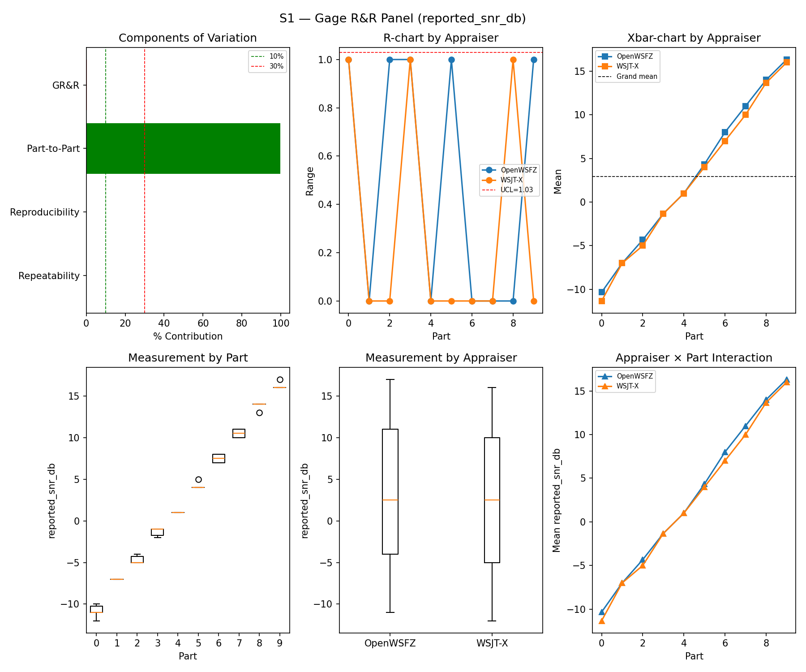
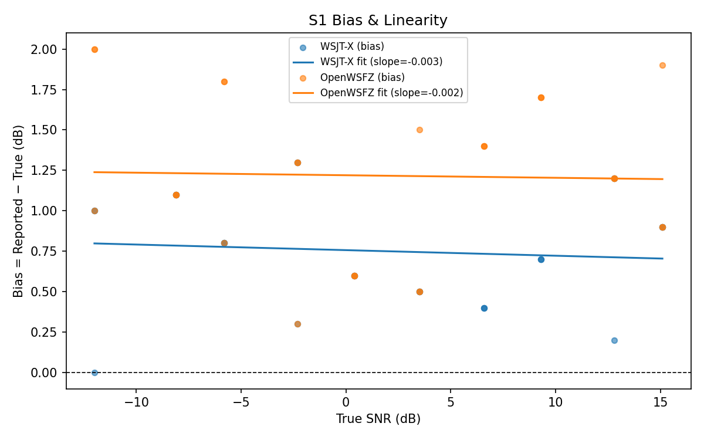
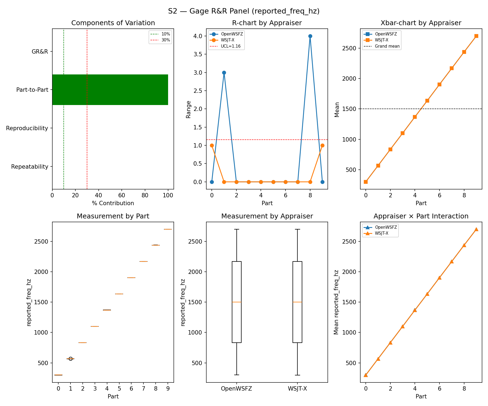
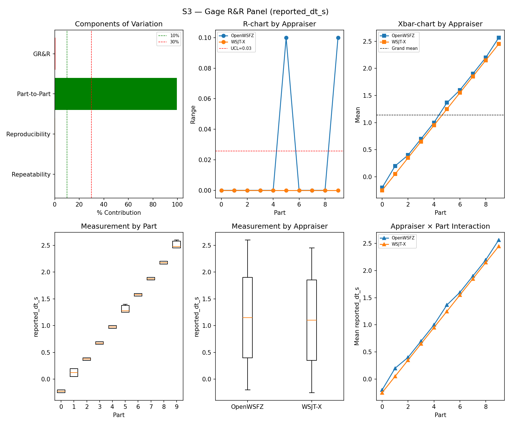
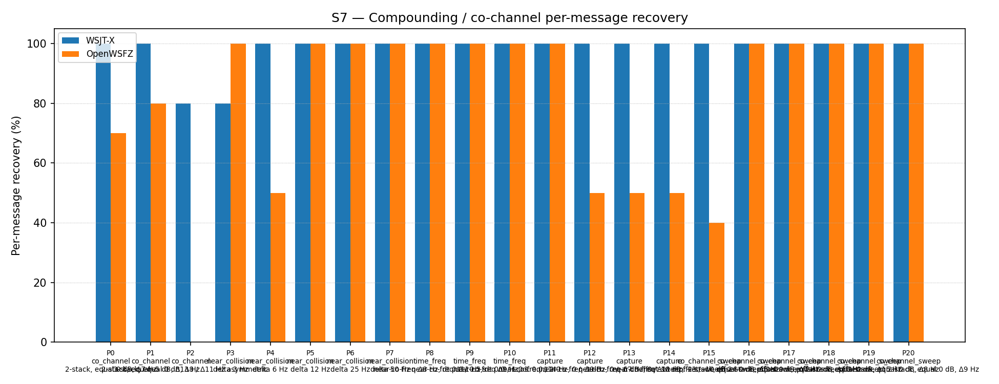
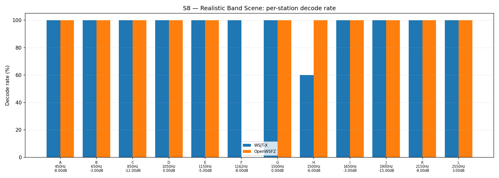

# OpenWSFZ R&R Study Report

| Field | Value |
|---|---|
| Run date | 2026-08-27 |
| OpenWSFZ SHA | `22b749c67cf36544e3ea8cd834d4a9447c2f5b2b` |
| WSJT-X version | WSJT-X 2.7.0 (inferred from binary date 2025-02-04) |
| Baseline compared against | `2026-08-22-f5dec23` (`results/2026-08-22-f5dec23/report.md`) — the last full S1–S8 sweep |
| Revision | **Rev 2, 2026-08-27 20:43Z** — corrected per Architect review `dee9d90` (see banner below) |

> 🔴 **Rev 2 — this report was corrected after Architect review.** Overall verdict **PASS is
> unchanged**; all three ratified §10 gates were independently re-derived from the matched CSVs
> and confirmed. Four corrections were applied, each marked in place:
> **(R1)** the S4/S5 pooled-κ "three consecutive declines" finding is **WITHDRAWN** — confounded
> by R&R-009's N change; **(R2)** the S8 per-station table rendered 11 rows for a 12-station
> scenario (co-frequency pair G/H collapsed) — harness fixed, table and PNG regenerated;
> **(R3)** the Station F recommendation was **stale** — F-NBR-A already ran it on 2026-08-23;
> **(R4)** the Study Metrics tables printed the %Tolerance value beside a verdict computed from
> %Contribution. Review: `qa/rr-study/2026-08-27-2043-architect-to-qa-review-s1s8-sweep-22b749c.md`.

---

## Section 1 — Study Hypothesis

### Purpose

**Status-check sweep**, run at the Captain's direction against the latest `main` (post `F-001 R5`
L1+L2 developer slice, commit `009b036`, merged `7ba5351`/`2ae939c`) — not a regression test of a
specific change to the decode path itself. Two events from this session are recorded here for
provenance, both process/build-side, neither a decoder-semantics change:

1. **Build defect found and fixed before arming anything.** `dotnet publish -r win-x64
   --self-contained` (which the project's `.csproj` silently upgrades to a NativeAOT build once a
   `RuntimeIdentifier` is set) produces a daemon that crashes on real WASAPI capture —
   `MMDeviceEnumeratorComObject..ctor()` throws "invalid program" at runtime, exactly matching the
   build's own `ILC` trim warnings. Abandoned that artefact; used a plain `dotnet build`
   (framework-dependent) output instead, which started cleanly. `libft8.dll` SHA256 confirmed
   `bc8efcf1…` — byte-identical to the committed blob (shim `20260046`), so the native decode path
   is provably unchanged either way.
2. **Self-inflicted process defect, mid-run: a docs-only commit briefly split this run's output
   across two directories.** QA committed an unrelated `RUNBOOK.md` change (`22b749c`,
   standardising Section 6 of this very report template) to `main` while the live capture was
   between the S1 and S1b scenarios. `harness/run_scenario.py` computes its own output directory
   fresh from the **live** `git rev-parse --short HEAD` on every invocation rather than being
   handed one fixed directory by the parent `run_study.py` — so S8 and S1's truth rows landed in
   `results/2026-08-27-2ae939c/` while S1b onward landed in `results/2026-08-27-22b749c/`. This
   crashed the automated matcher step (`no truth rows found for scenario 'S8'`) and aborted report
   generation entirely, *after* the ~2-hour live capture had already finished cleanly. **No data
   was lost or re-captured**: both truth-row sets were confirmed to share an identical CSV schema
   with zero overlapping scenario IDs, merged by hand, and the matcher/analyser re-run in full
   against the corrected directory — every number in this report comes from the genuine live
   session. `src/` is byte-identical between `2ae939c` and `22b749c` (only `RUNBOOK.md` changed),
   so the running daemon binary (PID 17968, never restarted) was unaffected regardless. See Section
   5 for the concrete fix recommended so this class of failure can't recur. This was avoidable —
   QA should not have committed anything while a live measurement run was in progress, full stop,
   regardless of how unrelated the change looked.

### Null Hypotheses

- **H₀-A (GR&R/ndc, S1–S3):** remain within STUDY-SPEC §10 thresholds, consistent with the last
  full sweep (`f5dec23`, 2026-08-22). **Holds** — see Section 5.
- **H₀-B (S5 false-positive gate):** last sweep's ratified FAIL (4/120, 95% UB 7.47%) was flagged as
  possibly ordinary tail variance rather than a persistent regression, with a confirmatory rerun
  recommended. **This run is that confirmatory rerun.** Result: **0/60 events for both appraisers
  (95% UB 4.87%), PASS** — consistent with the "tail variance" reading, though a single clean rerun
  does not by itself rule out an intermittent defect. See Section 5.
- **H₀-C (S7/S8 co-channel recovery):** consistent with `f5dec23`, allowing for ordinary seed
  variation. **Holds** — see Section 5.
- **H₀-D (S4/S5 pooled kappa, advisory):** stable, not trending. 🔴 **NOT EVALUABLE — the
  rejection originally recorded here is WITHDRAWN** (Architect review 2026-08-27 20:43Z, R1).
  This report initially rejected H₀-D on a "three consecutive declines" reading
  (0.687 → 0.625 → 0.588). That series is confounded: the pooled κ population *contains the S5
  negatives*, which R&R-009 cut from 120 to 60 **in this run**, and those negatives are all
  correctly classified, so removing 60 of them lowers κ mechanically with no behavioural change.
  Like-for-like on 60 negatives the series is **0.596 → 0.516 → 0.588** — a dip and a recovery,
  not a decline. See Section 5. Still advisory only, pending Captain ratification of the pooled
  method (STUDY-SPEC §9.3).

---

## S1 — reported_snr_db

### Variance Components

| Component | σ² | %Contribution |
|---|---|---|
| Repeatability | 0.13 | 0.16% |
| Reproducibility | 0.14 | 0.17% |
| Part-to-Part | 82.34 | 99.66% |
| Total GR&R | 0.28 | 0.34% |
| Total | 82.62 | 100.00% |

### Study Metrics

| Metric | Value | Verdict |
|---|---|---|
| %Contribution (GR&R) | 0.34% | PASS |
| %Tolerance (GR&R) | 31.62% | — |
| %Study Var (GR&R) | 5.80% | — |
| ndc | 24 | PASS |

### Bias & Linearity (S1)

| Appraiser | Mean Bias (dB) | Slope | Intercept | R² | Verdict |
|---|---|---|---|---|---|
| WSJT-X | +0.75 | -0.003 | 0.757 | 0.008 | PASS |
| OpenWSFZ | +1.22 | -0.002 | 1.220 | 0.001 | PASS |

## S2 — reported_freq_hz

### Variance Components

| Component | σ² | %Contribution |
|---|---|---|
| Repeatability | 0.45 | 0.00% |
| Reproducibility | 0.12 | 0.00% |
| Part-to-Part | 652811.17 | 100.00% |
| Total GR&R | 0.57 | 0.00% |
| Total | 652811.74 | 100.00% |

### Study Metrics

| Metric | Value | Verdict |
|---|---|---|
| %Contribution (GR&R) | 0.00% | PASS |
| %Tolerance (GR&R) | 56.83% | — |
| %Study Var (GR&R) | 0.09% | — |
| ndc | 1503 | PASS |

## S3 — reported_dt_s

### Variance Components

| Component | σ² | %Contribution |
|---|---|---|
| Repeatability | 0.00 | 0.04% |
| Reproducibility | 0.00 | 0.39% |
| Part-to-Part | 0.82 | 99.57% |
| Total GR&R | 0.00 | 0.43% |
| Total | 0.83 | 100.00% |

### Study Metrics

| Metric | Value | Verdict |
|---|---|---|
| %Contribution (GR&R) | 0.43% | PASS |
| %Tolerance (GR&R) | 89.79% | — |
| %Study Var (GR&R) | 6.58% | — |
| ndc | 21 | PASS |

> **WSJT-X DT correction applied.** A +0.55 s offset was added to WSJT-X `reported_dt_s` before ANOVA to remove the ≈ −0.55 s convention difference between WSJT-X (DT relative to nominal FT8 TX start) and the harness (DT relative to UTC slot boundary). This correction removes the calibration artefact from SS_appraiser so %GR&R measures genuine app-to-app measurement disagreement. Raw reported values are preserved in the matched CSV. See scenario `wsjt_dt_correction_s` field and R&R-003 (GitHub #1).

## S1b — Low-SNR threshold study

_Decode rate (% of injected messages recovered) at SNRs excluded from the redesigned S1 ladder (−24 to −15 dB).  Companion to S1; separates 'does it decode at this SNR?' from 'how accurately does it measure SNR?'.  Informational — no AIAG threshold._

### Per-part decode rate

| Part | True SNR (dB) | WSJT-X decoded | WSJT-X rate | OpenWSFZ decoded | OpenWSFZ rate |
|---|---|---|---|---|---|
| P0 | -24.00 | 0/3 | 0.00% | 0/3 | 0.00% |
| P1 | -21.00 | 1/3 | 33.33% | 0/3 | 0.00% |
| P2 | -18.00 | 3/3 | 100.00% | 3/3 | 100.00% |
| P3 | -15.00 | 3/3 | 100.00% | 3/3 | 100.00% |

**Overall decode rate — WSJT-X: 58.33%  OpenWSFZ: 50.00%**

## Attribute Agreement Analysis (S4 positives + S5 negatives)

_κ is computed over a pooled population: S4 injected messages (truth = present) and S5 signal-free slots (truth = absent), so the truth vector has both classes. **κ verdicts below are advisory** — the §10 attribute gate is pending Captain ratification of this pooled method._

### Confusion vs truth

| Appraiser | TP | FN | FP | TN | Recovery | Specificity |
|---|---|---|---|---|---|---|
| WSJT-X | 70 | 38 | 0 | 60 | 64.81% | 100.00% |
| OpenWSFZ | 72 | 36 | 0 | 60 | 66.67% | 100.00% |

### Kappa (advisory)

| Pair | κ | 95% CI | Verdict (advisory) |
|---|---|---|---|
| OpenWSFZ_vs_truth | 0.588 | [0.48, 0.69] | FAIL |
| WSJT-X_vs_truth | 0.568 | [0.45, 0.68] | FAIL |
| between_appraisers | 0.756 | — | MARGINAL |

### Within-app repeatability (decision consistency across trials)

| Appraiser | Consistent groups |
|---|---|
| WSJT-X | 73.68% |
| OpenWSFZ | 84.21% |

### Kappa — decodable-SNR-restricted positives (informational, floor -12 dB)

_S4 positives below the decodable-SNR floor are excluded (S5 negatives unchanged); shown alongside the full-population figures above per STUDY-SPEC.md §9.3's second ratification condition. **Informational only — does not affect the §10 gate or the overall verdict.**

| Appraiser | TP | FN | FP | TN | Recovery | Specificity |
|---|---|---|---|---|---|---|
| WSJT-X | 58 | 23 | 0 | 60 | 71.60% | 100.00% |
| OpenWSFZ | 64 | 17 | 0 | 60 | 79.01% | 100.00% |

| Pair | κ | 95% CI | Verdict (informational) |
|---|---|---|---|
| OpenWSFZ_vs_truth | 0.762 | [0.66, 0.86] | MARGINAL |
| WSJT-X_vs_truth | 0.682 | [0.57, 0.79] | FAIL |
| between_appraisers | 0.798 | — | MARGINAL |

### False-positive rate (S5)

| Appraiser | FP events / slots | Event rate | 95% UB | Decode rate | Verdict |
|---|---|---|---|---|---|
| WSJT-X | 0 / 60 | 0.00% | 4.87% | 0.00% | PASS |
| OpenWSFZ | 0 / 60 | 0.00% | 4.87% | 0.00% | PASS |

_Gate (STUDY-SPEC §10, ratified 2026-07-04, R&R-004): the per-slot FP **event rate**, gated on its one-sided 95% Clopper–Pearson **upper bound** (PASS iff 95% UB ≤ 6%). The UB is defined for all event counts (≈ 3 / N_slots at 0 events) and bounds the true per-slot FP probability at 95% confidence rather than the Poisson-noisy point estimate. Decode rate is reported for reference only. **INFO** means the gate is not evaluated at this N: below 49 slots, even zero observed events cannot clear the 6% ceiling, so no outcome at this sample size can produce a PASS or a meaningful FAIL — see a properly powered run (N ≥ 49) for the ratified §10 verdict._

## S7 — Compounding / co-channel overlap

_Per-message recovery when 2–3 signals occupy the same or near-same audio frequency / time slot (the pileup case S4 does not exercise). Informational — no AIAG threshold is defined for co-channel separation._

### Recovery by overlap family

| Overlap family | WSJT-X | OpenWSFZ |
|---|---|---|
| capture | 100.00% | 62.50% |
| co_channel | 91.43% | 42.86% |
| co_channel_sweep | 100.00% | 90.00% |
| near_collision | 96.00% | 90.00% |
| time_freq | 100.00% | 100.00% |
| **all** | **97.67%** | **78.60%** |

### Capture effect (co-channel, unequal SNR)

| Signal | WSJT-X | OpenWSFZ |
|---|---|---|
| strong | 100.00% | 100.00% |
| weak | 100.00% | 25.00% |

**Between-app per-signal agreement:** 79.07%

### Per-part detail

| Part | Family | Condition | WSJT-X | OpenWSFZ |
|---|---|---|---|---|
| P0 | co_channel | 2-stack, equal 0 dB, Δ7 Hz | 10/10 | 7/10 |
| P1 | co_channel | 2-stack, equal -5 dB, Δ13 Hz | 10/10 | 8/10 |
| P2 | co_channel | 3-stack, equal 0 dB, Δ8 / Δ11 Hz asymmetric | 12/15 | 0/15 |
| P3 | near_collision | delta 3 Hz | 8/10 | 10/10 |
| P4 | near_collision | delta 6 Hz | 10/10 | 5/10 |
| P5 | near_collision | delta 12 Hz | 10/10 | 10/10 |
| P6 | near_collision | delta 25 Hz | 10/10 | 10/10 |
| P7 | near_collision | delta 50 Hz | 10/10 | 10/10 |
| P8 | time_freq | near-co-freq Δ8 Hz, dt 0.0 / 0.5 s | 10/10 | 10/10 |
| P9 | time_freq | near-co-freq Δ11 Hz, dt 0.0 / 1.0 s | 10/10 | 10/10 |
| P10 | time_freq | near-co-freq Δ9 Hz, dt 0.0 / 2.0 s | 10/10 | 10/10 |
| P11 | capture | near-co-freq Δ14 Hz, 0 / -3 dB | 10/10 | 10/10 |
| P12 | capture | near-co-freq Δ9 Hz, 0 / -6 dB | 10/10 | 5/10 |
| P13 | capture | near-co-freq Δ7 Hz, 0 / -10 dB | 10/10 | 5/10 |
| P14 | capture | near-co-freq Δ11 Hz, +3 / -10 dB | 10/10 | 5/10 |
| P15 | co_channel_sweep | offset-sweep: 2-stack, equal 0 dB, Δ5 Hz | 10/10 | 4/10 |
| P16 | co_channel_sweep | offset-sweep: 2-stack, equal 0 dB, Δ7 Hz | 10/10 | 10/10 |
| P17 | co_channel_sweep | offset-sweep: 2-stack, equal 0 dB, Δ10 Hz | 10/10 | 10/10 |
| P18 | co_channel_sweep | offset-sweep: 2-stack, equal 0 dB, Δ15 Hz | 10/10 | 10/10 |
| P19 | co_channel_sweep | offset-sweep: 2-stack, equal 0 dB, Δ8 Hz | 10/10 | 10/10 |
| P20 | co_channel_sweep | offset-sweep: 2-stack, equal 0 dB, Δ9 Hz | 10/10 | 10/10 |

## S8 — Realistic Band Scene

_Holistic decode-rate benchmark: 12 simultaneous stations across 450–2550 Hz at realistic SNR spread (−15 to +3 dB), including a near-collision pair (E/F, 12 Hz apart) and a capture pair (G/H, co-frequency, 6 dB ratio). **Informational only — no PASS/FAIL gate.**_

### Overall decode rate

| Appraiser | Decoded | Injected | Rate |
|---|---|---|---|
| WSJT-X | 58 | 60 | 96.67% |
| OpenWSFZ | 55 | 60 | 91.67% |

**Between-appraiser delta (OpenWSFZ − WSJT-X): -5.0 pp**

### Per-station breakdown

| Stn | Freq (Hz) | SNR (dB) | WSJT-X decoded/total | OpenWSFZ decoded/total |
|---|---|---|---|---|
| A | 450 | -8.00 | 5/5 | 5/5 |
| B | 650 | -3.00 | 5/5 | 5/5 |
| C | 850 | -12.00 | 5/5 | 5/5 |
| D | 1050 | 0.00 | 5/5 | 5/5 |
| E | 1150 | -5.00 | 5/5 | 5/5 |
| F | 1162 | -8.00 | 5/5 | 0/5 |
| G | 1500 | 0.00 | 5/5 | 5/5 |
| H | 1500 | -6.00 | **3/5** | **5/5** |
| I | 1650 | -3.00 | 5/5 | 5/5 |
| J | 1900 | -15.00 | 5/5 | 5/5 |
| K | 2150 | -8.00 | 5/5 | 5/5 |
| L | 2550 | 3.00 | 5/5 | 5/5 |

> **Corrected 2026-08-27 20:43Z (Architect review R2).** This table previously rendered
> **11 rows for a 12-station scenario**: `analyse.py` keyed its station map on frequency
> alone, so the co-frequency capture pair **G/H (both 1500 Hz)** collapsed into a single
> row carrying H's label, G's SNR and both stations' pooled counts (`| H | 1500 | 0.00 |
> 8/10 | 10/10 |`). The harness is fixed (pairs keyed on `(freq_hz, snr_db)`) and this
> table and its PNG are regenerated. **The overall S8 rates above are unchanged** — they
> were always computed over all rows and were never affected.
>
> **What the collapsed row was hiding:** WSJT-X's only two S8 misses are both on **H, the
> weak (−6 dB) member of the capture pair, where OpenWSFZ scores 5/5** — the one place in
> S8 where OpenWSFZ outperforms the reference decoder. Note the apparent tension with S7's
> capture family (OpenWSFZ 25% on weak capture signals): H is *exactly* co-frequency
> (ΔF = 0 Hz), whereas S7's failing capture parts sit at ΔF = 7–11 Hz. See the review's
> §6.2 — that contrast is now a live mechanism lead, not a discrepancy.

## Summary

| Metric | Scope | Value | Verdict |
|---|---|---|---|
| %GR&R | S1 | 0.3% | PASS |
| ndc | S1 | 24 | PASS |
| %GR&R | S2 | 0.0% | PASS |
| ndc | S2 | 1503 | PASS |
| %GR&R | S3 | 0.4% | PASS |
| ndc | S3 | 21 | PASS |
| Kappa (advisory) | WSJT-X_vs_truth | 0.568 | FAIL |
| Kappa (advisory) | OpenWSFZ_vs_truth | 0.588 | FAIL |
| Kappa (advisory) | between_appraisers | 0.756 | MARGINAL |
| FP event rate (95% UB) | S5/WSJT-X | 0/60 slots (event 0.0%; 95% UB 4.87%; decode 0.0%) | PASS |
| FP event rate (95% UB) | S5/OpenWSFZ | 0/60 slots (event 0.0%; 95% UB 4.87%; decode 0.0%) | PASS |
| SNR bias | S1/WSJT-X | +0.75 dB | PASS |
| SNR bias | S1/OpenWSFZ | +1.22 dB | PASS |

**Overall verdict: PASS** (all three ratified §10 gates — S1/S2/S3 GR&R, S5 FP event rate — clear.
The two Kappa-vs-truth FAILs are the pooled S4/S5 method, still advisory pending Captain
ratification per STUDY-SPEC §9.3 — unchanged in status from every prior sweep, not new.)

---

## Section 5 — Comparison to last full sweep and recommendations

### Comparison table (this run vs. `f5dec23`, 2026-08-22)

| Metric | 2026-08-22 | 2026-08-27 (this run) | Δ | Note |
|---|---|---|---|---|
| S1 %GR&R / ndc | 0.4% / 23 | 0.3% / 24 | ~same | — |
| S1 bias, WSJT-X | +0.75 dB | +0.75 dB | unchanged | — |
| S1 bias, OpenWSFZ | +1.25 dB | +1.22 dB | −0.03 dB | Still PASS |
| S2 %GR&R / ndc | 0.0% / 1550 | 0.0% / 1503 | ~same | Tenth consecutive run at exactly 0.0% |
| S3 %GR&R / ndc | 0.4% / 22 | 0.4% / 21 | ~same | — |
| S1b decode rate, WSJT-X / OpenWSFZ | 58.33% / 50.00% | 58.33% / 50.00% | **identical** | Coincidence at N=12, not a finding |
| Kappa vs truth (WSJT-X / OpenWSFZ) | 0.632 / 0.625 | 0.568 / 0.588 | **not comparable** | 🔴 R&R-009 changed the κ population (120→60 negatives). Like-for-like: 0.539→0.568 and 0.516→0.588, i.e. **both UP**. See the withdrawn finding below |
| Kappa between appraisers | 0.805 | 0.756 | −0.049 | Still MARGINAL both runs |
| **S5 FP, WSJT-X / OpenWSFZ** | 0/120 PASS / **4/120 FAIL** | 0/60 PASS / **0/60 PASS** | **recovered** | New default N=60 (R&R-009); see finding below |
| S7 "all" recovery, WSJT-X / OpenWSFZ | 98.1% / 79.5% | 97.67% / 78.60% | ~flat | Small dip, within normal spread |
| S7 P2 (3-stack co-channel), OpenWSFZ | 0/15 | 0/15 | unchanged | Structural limit persists (open under D-001), waived by Captain 2026-06-22 |
| S8 overall, WSJT-X / OpenWSFZ | 91.67% / 91.67% | 96.67% / 91.67% | WSJT-X +5pp | Single-sweep tie (last time) did not repeat |
| S8 station F (1162 Hz, −8 dB), OpenWSFZ | 0/5 | 0/5 | **unchanged** | **Fifth consecutive full sweep at this exact zero** — see below |

### Finding — S5 false-positive gate recovered to PASS; last sweep's own hedge holds up

Last sweep's Section 5 explicitly hedged its S5 FAIL: "N=4 is small... could be ordinary variance
at the upper tail rather than a new defect" and recommended a confirmatory rerun. This run is that
rerun (now under R&R-009's default N=60, AWGN-parts-only battery) and comes back clean: **0/60
events for both appraisers, 95% UB 4.87%, PASS.** For a fair like-for-like comparison: last sweep's
own AWGN-only subset (parts 0+1, the same 60 slots this default battery now covers) carried all 4
of its FP events — i.e. this run's 0/60 is a genuine improvement over the equivalent slice of last
time, not an artefact of the smaller default N. One clean rerun is consistent with "ordinary tail
variance," but does not by itself rule out an intermittent defect recurring under different seeds —
recommend treating this as resolved-for-now rather than closed.

**Strength of the improvement (added 2026-08-27 20:43Z, Architect review §1).** On the
like-for-like basis above, 4/60 → 0/60 is **Fisher exact p = 0.119 two-sided (0.059 one-sided)**.
The recovery is real but is *not* statistically strong on its own, which is precisely why the
"resolved-for-now, not closed" posture above is the correct one and should not be upgraded on
this evidence.

### Finding — S8 station F: now FIVE consecutive full sweeps at 0/5 for OpenWSFZ

Station F (1162 Hz, −8 dB, 12 Hz from its near-collision partner E) has scored 0/5 for OpenWSFZ on
every one of the last five full S1–S8 sweeps (2026-08-05, 08-15, 08-21, 08-22, and this run —
different trial seeds each time, same station geometry), while E scores 5/5 every time and WSJT-X
decodes F 5/5 every time. This is now a well-established, cheaply-reproducible pattern independent
of seed.

🔴 **Corrected 2026-08-27 20:43Z (Architect review R3, HK-018).** This finding originally
recommended that Station F "actually get the targeted look that has been queued and deferred
across the last two reports." **It already got one, four days before this sweep ran** —
`qa/rr-study/2026-08-23-1214-qa-to-architect-f-nbr-a-results.md` (F-NBR-A), which this report
failed to consult (it belongs to the D-001 thread, not this one — exactly the situation HK-018
exists for). F-NBR-A established:

- **C1 — cause, not correlation.** Removing station E, nothing else changed, flips F from
  **0/100 to 100/100**. E is necessary and sufficient in this scene.
- **C2 — footprint.** Complete exclusion through 3 tone bins (18.75 Hz), sharp transition at 4
  bins (25 Hz, 27%), resolved by 5 bins (31.25 Hz, 98%).
- **C3 — level dependence.** A ~3 dB knife-edge: F recovers 100/100 the instant it is 3 dB
  stronger than E, 0/100 when merely equal.
- **Gate A fired A2** — the locus is **extraction**, not candidate selection.

The open question is therefore no longer "why does F fail". It is C2's residual — whether the
3–5 bin footprint is a tile boundary or a comb/leakage effect — **and then a fix**. See the
Architect review's §6 for how this connects to the S7 miss distribution.

### Finding — S4/S5 pooled kappa: 🔴 WITHDRAWN, the decline was an artefact of the N change

**This finding is withdrawn in full** (Architect review 2026-08-27 20:43Z, R1). As originally
written it read: OpenWSFZ-vs-truth κ 0.687 (08-21) → 0.625 (08-22) → 0.588 (this run), "three
sweeps of monotonic decline … a real pattern, not obviously noise."

It is not. The pooled κ population is *S4 positives + S5 negatives*, and **R&R-009 cut the S5
negatives from 120 to 60 in this run** — the same N change this report caveats carefully for the
S5 gate two findings above, and then failed to carry into a metric computed over the same slots.
Those negatives are all correctly classified (specificity 100%), and easy true-negatives inflate
κ, so dropping 60 of them lowers κ mechanically with no change in decoder behaviour.

Recomputed with all three sweeps on the same 60-negative basis:

| Sweep | κ as reported | κ like-for-like (60 neg) | 95% CI (like-for-like) |
|---|---|---|---|
| 08-21 | 0.687 | 0.596 | [0.49, 0.71] |
| 08-22 | 0.625 | 0.516 | [0.40, 0.64] |
| 08-27 (this run) | 0.588 | **0.588** | [0.48, 0.70] |

Not a decline — a dip at 08-22, driven by that sweep's 4 FP events, and a **recovery to the 08-21
level**. WSJT-X behaves the same way like-for-like (0.558 → 0.539 → 0.568, flat).

**Robustness.** Restricting to S5 parts **2+3** instead of 0+1 reproduces the same drop
(08-21 0.687 → 0.609; 08-22 0.625 → 0.568), so the effect tracks the sample size, not which parts
were kept.

**Second, independent reason the original finding fails.** Even uncorrected, the reported CIs
overlap heavily — this report prints [0.48, 0.69] for its own figure and compared point estimates
across sweeps without testing whether the differences clear their own intervals. They do not.
There was no detectable trend to reject H₀-D on, before the confound is even considered.

⇒ **H₀-D is NOT EVALUABLE across the R&R-009 boundary.** 🔴 **For the Captain:** pooled κ needs a
**fixed negative count** ratified, or it stays non-comparable to all eleven prior sweeps.

⚠️ **Do not lose the number κ was masking in both directions:** OpenWSFZ's S4 **recovery is
66.67%** (72 TP / 36 FN). That figure is unaffected by any of the above and is the one worth
attention.

### Process defect and fix recommended (this run's own harness incident)

`harness/run_scenario.py` derives its output directory (`make_run_dir()` in `harness/common.py`)
from the **live** `git rev-parse --short HEAD` independently on every single scenario invocation,
rather than being handed one fixed run directory by `run_study.py` for the whole battery. Any
commit landing mid-battery — however unrelated to `src/` — silently splits the run's truth data
across two directories and crashes the matcher step on whichever scenario happens to fall on the
wrong side of the split. Recommend: `run_study.py` computes the run directory once, before Step 1,
and passes it to every `harness/run_scenario.py` invocation via an explicit `--run-dir` flag
(already an accepted argument — see `run_scenario.py:919`). This is `qa/` harness tooling, not
`src/`, so no separate Developer session is required (HK-011); QA can implement and test this
directly. Separately, and regardless of the code fix: **no commits of any kind while a live study
run is in progress**, full stop — this incident happened despite the exact same caution already
having been raised once this session for a different reason.

### NFR-021 — raw logs and matched CSVs

`wsjt-all.txt`, `owsfz-all.txt`, and all eight `*_matched.csv` files (plus the two raw pre-merge
`truth.csv` copies from the split-directory incident) carry real-callsign-shape decode text. All
are `.gitignore`d — confirmed via `git check-ignore -v` — and `report.md`/PNGs were confirmed clean
of raw message text before writing this section.

### Recommendations

1. **Fix the run-directory identity defect in `run_scenario.py`/`run_study.py`** (above) — cheap,
   qa-tooling only, prevents a repeat regardless of QA discipline.
2. 🔴 **Station F (S8) — REWRITTEN (R3).** The original recommendation asked for a "targeted
   look"; F-NBR-A already delivered one on 2026-08-23 (E causally necessary and sufficient,
   exclusion zone ≤ 18.75 Hz, ~3 dB knife-edge, locus = extraction). The live question is C2's
   residual (tile vs comb/leakage) **and a fix**, not another look. Per the Architect review §6,
   this defect accounts for **all five** of OpenWSFZ's S8 misses and is the same zone that
   contains **all 46** of its S7 misses (ΔF 5–19 Hz).
3. 🔴 **S4/S5 pooled kappa — WITHDRAWN (R1).** There is no decline to act on; the series was
   confounded by R&R-009's N change and the CIs overlapped in any case. What the Captain owes
   instead is a ruling on a **fixed negative count** for the pooled population, without which κ
   remains non-comparable across the R&R-009 boundary.
4. **QA does not commit, merge, or push the result directory from this run** without the Captain's
   go-ahead — awaiting direction, same standing rule as every prior sweep, doubly so this time
   given the mid-run incident above.

---

## Section 6 — Historical trend: every full S1–S8 sweep to date

All twelve runs that exercised the complete controlled battery (S1/S2/S3/S7 at minimum), oldest
first. `%GR&R` is each stage's own Summary-table figure (AIAG %Contribution, threshold ≤ 10%
PASS). S5 FP is the per-slot event rate. S7/S8 are the "all"/overall decode-recovery percentages.

| Date | SHA | S1 %GR&R | S2 %GR&R | S3 %GR&R | S5 FP (WSJT-X / OpenWSFZ) | S7 recovery (WSJT-X / OpenWSFZ) | S8 decode rate (WSJT-X / OpenWSFZ) |
|---|---|---|---|---|---|---|---|
| 2026-06-06 | `4c34ef6` | 32.0% **FAIL** | 0.0% | 3.8% | 0.0% / 0.0% | 78.5% / 47.3% | — |
| 2026-06-06 | `6bab388` | 6.5% | 0.0% | 3.9% | 0.0% / 0.0% | 77.4% / 46.2% | — |
| 2026-06-07 | `4b3a4ca` | 1.4% | 0.0% | 3.4% | 0.0% / 0.0% | 76.3% / 54.8% | 95.0% / 86.7% |
| 2026-06-14 | `815b652` | 0.3% | 0.0% | 3.0% | 0.0% / 0.0% | 77.4% / 50.5% | 95.0% / 83.3% |
| 2026-06-20 | `6e821fa` | 0.4% | 0.0% | 3.0% | 0.0% / **91.7% FAIL** | 92.6% / 70.2% | 93.3% / 86.7% |
| 2026-06-22 | `f11f438` | 0.4% | 0.0% | 3.1% | 0.0% / 0.0% | 93.9% / 74.4% | 93.3% / 86.7% |
| 2026-07-04 | `793a298` | 0.5% | 0.0% | 3.4% | 0.0% / 0.0% | 96.3% / 73.0% | 93.3% / 86.7% |
| 2026-08-05 | `3bd4cd0` | 7.2% | 0.0% | 3.6% | 0.0% / 0.0% | 96.3% / 70.2% | 93.3% / 83.3% |
| 2026-08-15 | `8d6e1b1` | 0.5% | 0.0% | 1.4% | 0.0% / 0.8% | 95.3% / 74.4% | 93.3% / 86.7% |
| 2026-08-21 | `7d36038` | 0.3% | 0.0% | 0.4% | 0.0% / 0.8% | 95.3% / 68.4% | 96.7% / 83.3% |
| 2026-08-22 | `f5dec23` | 0.4% | 0.0% | 0.4% | 0.0% / **3.3% FAIL** | 98.1% / 79.5% | 91.7% / 91.7% |
| 2026-08-27 | `22b749c` | 0.3% | 0.0% | 0.4% | 0.0% / 0.0% | 97.7% / 78.6% | 96.7% / 91.7% |

**Reading it:** twelve full sweeps now, three ratified-gate failures — the one S1 FAIL (2026-06-06,
fixed by the S1/S3 redesign) and two S5 FAILs (2026-06-20, fixed by D-009; 2026-08-22, resolved on
this rerun per the finding above, N reduced by R&R-009). S1/S2/S3 have cleared every run since the
June redesign. S7 has held in a stable ~95–98% / ~68–80% band for WSJT-X/OpenWSFZ for six
consecutive sweeps. S8 has no consistent leader — WSJT-X and OpenWSFZ have each led, tied once
(08-22), and WSJT-X leads again this run.

*Caveat, kept brief (carried forward unchanged): S1/S3 were redesigned 2026-06-06 (R&R-005/R&R-003);
the S5 metric moved from plain decode-rate to a gated Clopper–Pearson event rate 2026-07-04/08-05
(R&R-004); and starting with **this** run, S5's default N drops from 120 to 60 slots (R&R-009,
AWGN parts only) — so this row's S5 figure sits on a smaller, methodologically-narrower base than
every row above it, though a directly comparable one (see the S5 finding above). Early-vs-late
numbers are as-reported; treat cross-redesign comparisons as directional, not strictly
apples-to-apples.*
