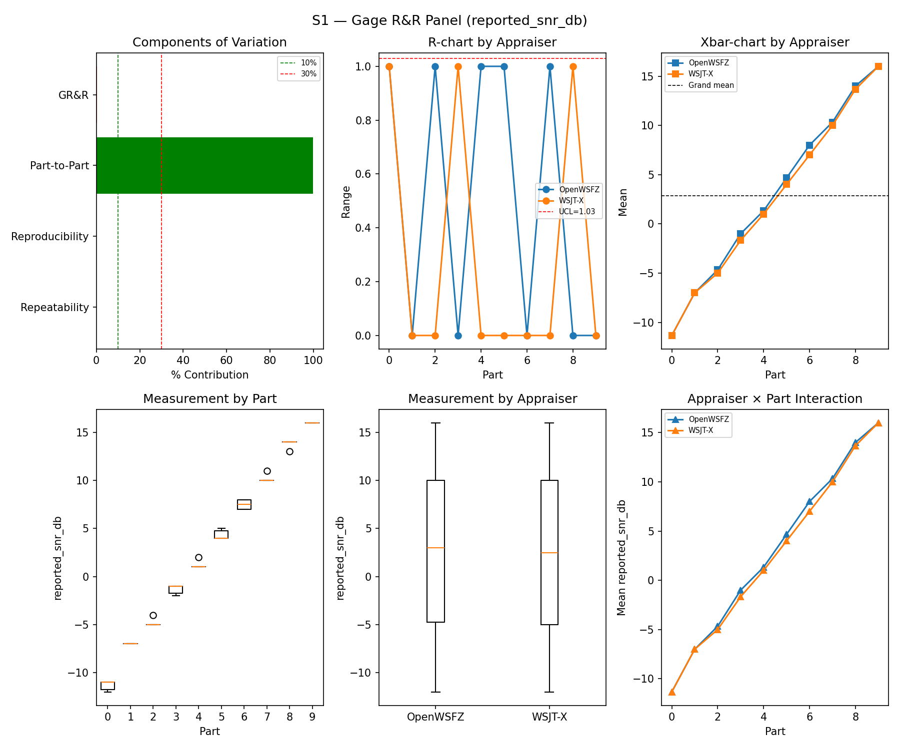
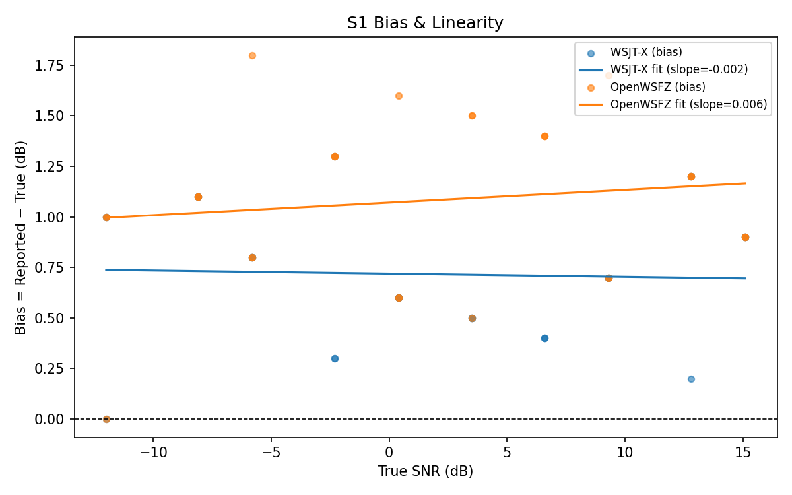
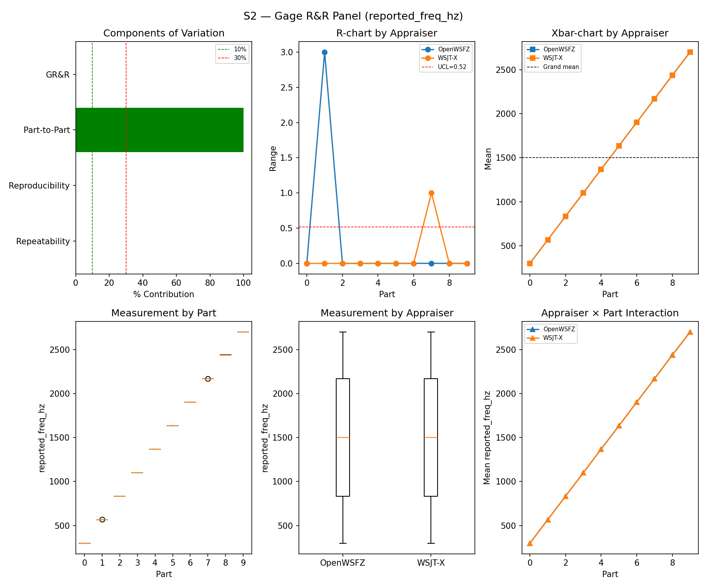
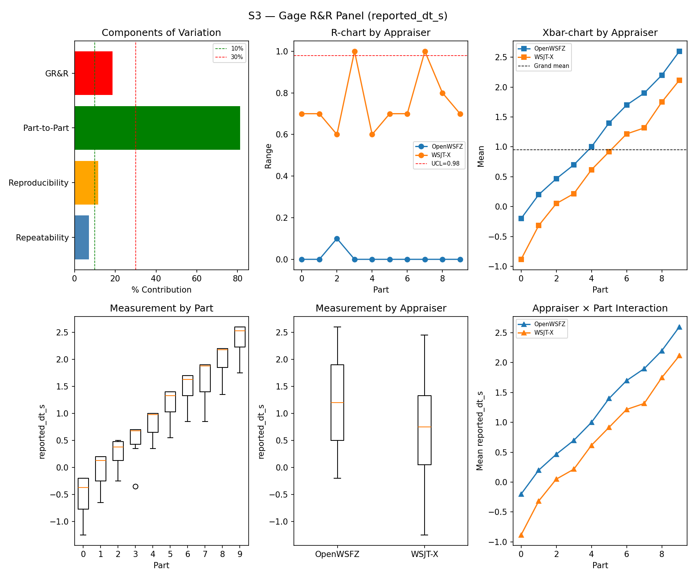
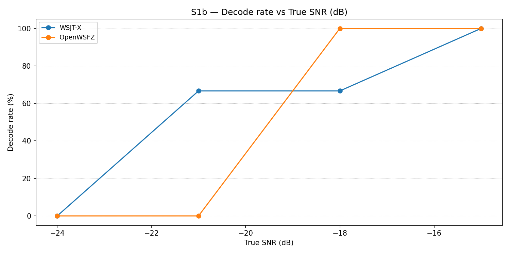
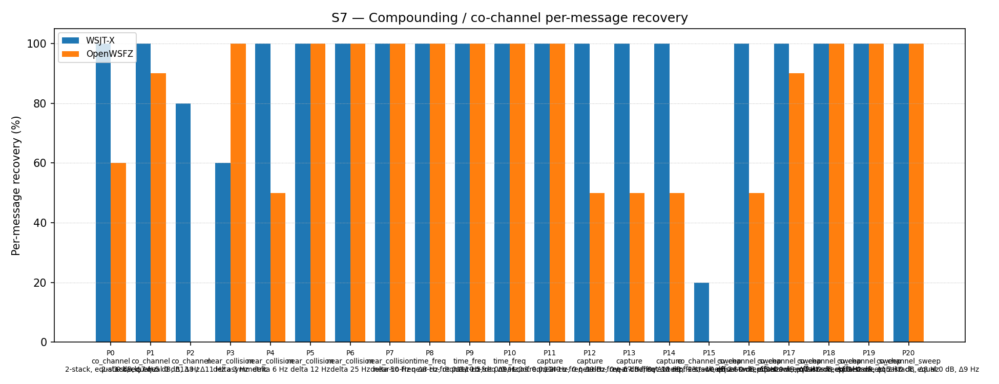
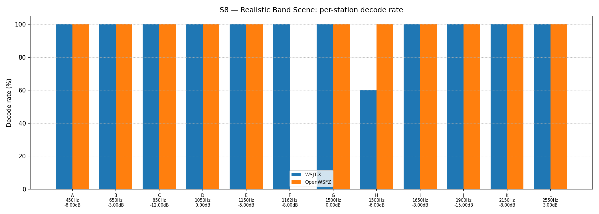

# OpenWSFZ R&R Study Report

| Field | Value |
|---|---|
| Run date | 2026-08-29 |
| OpenWSFZ SHA | `872ba653ce880791c9e3eea587167aaed7cb7af1` (`experiment/win-a-hamming-rung1`, shim `20260047`) |
| WSJT-X version | WSJT-X 2.7.0 (inferred from binary date 2025-02-04) |
| Baseline compared against | `2026-08-27-22b749c` (`results/2026-08-27-22b749c/report.md`) — the last full S1–S8 sweep |

---

## Section 1 — Study Hypothesis

### Purpose

**WIN-A Rung 1 arming run**, run at the Captain's direction against branch `experiment/win-a-hamming-rung1`
@ `872ba65` (native `monitor.c` analysis window changed rectangular→Hamming, `FT8_SHIM_VERSION`
20260046→20260047), scope **S7+S5** per the Captain's authorisation (`29e45e2`, 2026-08-29) and the
Architect's ruling clearing both open escalations (`872ba65` itself, 2026-08-29 18:06Z: AC-4 does not
block arming, build non-reproducibility does not block the SHA pin). Not a status-check sweep like the
last full sweep (`22b749c`) — this is the pre-registered treatment evaluation for the WIN-A arm.

Four process/build events are recorded here for provenance:

1. **Stale binary caught before use.** `src/OpenWSFZ.Daemon/bin/Release` on disk predated this commit
   (dated 2026-08-28, before the Rung 1 build landed) and would have silently run the *pre-treatment*
   decoder. Rebuilt via `dotnet build -c Release` (0 warnings, 0 errors) immediately before the run;
   confirmed via the daemon's own startup log and `/api/v1/status` that shim `20260047` was actually
   loaded, not `20260046`.
2. **Stale `ALL.TXT` caught before use.** The repo-root `ALL.TXT` (OpenWSFZ's own decode log) still
   held 430 lines from the 2026-08-27 run. Backed up to
   `qa/rr-study/results/_pre-run-backups/ALL.TXT.stale-2026-08-27-backup-before-2026-08-29-run`
   (matching the existing convention there) and truncated before the daemon's writer touched it again —
   confirmed safe live, since `AllTxtWriter` reopens the file per append rather than holding a handle.
3. **Harness playback cadence fixed immediately before this run, verified only in simulation.**
   `harness/run_scenario.py`'s per-trial cycle-boundary logic (`_next_cycle_boundary()`, called fresh
   after every `sd.wait()`) reliably burned one full wasted 15 s slot per trial: a blocking, exactly-
   one-slot-long `sd.play()`/`sd.wait()` call returns essentially exactly on the next boundary, and
   `_next_cycle_boundary()`'s own "don't play into an already-started cycle" guard then advances a
   further full slot every single time, deterministically — confirmed against the raw `cycle=`
   timestamps in `rr_study_2026-08-27_s1s8_full_run.log` (uniform 30 s cadence, not 15 s). Fixed by
   concatenating consecutive ordinary (exactly-one-slot, `buffer_start_s == 0.0`) trials into one
   continuous buffer played with a single `sd.play()`/`sd.wait()` call, so trials after the first are
   timed by the audio driver's own sample clock rather than a Python-side clock re-query; S3's two
   re-gridded oversized parts (dt_s +2.4/+2.7) and S3b's early-armed negative-DT buffers are excluded
   from batching and fall through to the original, unmodified single-trial path. Verified via dry-run
   across all eight scenarios and a fake-clock/fake-`sounddevice` simulation of the full battery
   (8460 s → 4422 s, 47.7% reduction) **before** this run — but simulation cannot model real USB/
   Voicemeeter/WASAPI driver behaviour under one very long continuous buffer, and this run is the
   first live use. See finding 3 below: it did not come through clean.
4. **Finding 3 (discovered in this run's own data, not anticipated).** S3's WSJT-X DT residual — which
   should be a fixed constant, since WSJT-X's code is unchanged — moved from an exact **−0.800 s**
   constant (baseline `22b749c`, SD 0.000 across all 30 trials) to a noisy **−1.200 s mean, SD 0.330 s**
   (range −0.8 to −1.8 s) in this run, while S1's SNR bias stayed flat for both appraisers in the same
   run. This is real evidence of playback-timing jitter introduced by back-to-back batched playback
   under real hardware (S3 batches 24 of its 30 trials into one ~360 s continuous buffer), not a
   decoder effect. See Section 5 for the full analysis and consequence for S7.

### Null Hypotheses

- **H₀-S7 (Rung 1 does not change S7 co-channel recovery relative to WSJT-X):** OpenWSFZ-vs-WSJT-X gap
  held **exactly constant** (19.07pp, both this run and `22b749c`) despite both absolute figures
  dropping ~4.65pp together. Consistent with holding, but **not cleanly evaluable** — see Finding 3;
  the gap-preservation could reflect the treatment being immaterial to S7, or could be coincidental
  given the timing-jitter confound discovered in the same run. See Section 5.
- **H₀-S5 (Rung 1 does not increase the false-positive rate on signal-free AWGN slots):** 0/60
  (baseline) → 1/60 (this run) for OpenWSFZ; WSJT-X held at 0/60 both times. Flips the gate's 95%
  Clopper–Pearson UB from 4.87% to 7.66%, crossing the 6% line (PASS→FAIL). A single event at N=60 is
  weak evidence of a real behaviour change on its own — see Section 5.

---

## S1 — reported_snr_db

### Variance Components

| Component | σ² | %Contribution |
|---|---|---|
| Repeatability | 0.13 | 0.16% |
| Reproducibility | 0.07 | 0.09% |
| Part-to-Part | 83.14 | 99.75% |
| Total GR&R | 0.21 | 0.25% |
| Total | 83.34 | 100.00% |

### Study Metrics

| Metric | Value | Verdict |
|---|---|---|
| %Contribution (GR&R) | 0.25% | PASS |
| %Tolerance (GR&R) | 27.20% | — |
| %Study Var (GR&R) | 4.97% | — |
| ndc | 28 | PASS |

### Bias & Linearity (S1)

| Appraiser | Mean Bias (dB) | Slope | Intercept | R² | Verdict |
|---|---|---|---|---|---|
| WSJT-X | +0.72 | -0.002 | 0.720 | 0.002 | PASS |
| OpenWSFZ | +1.08 | 0.006 | 1.071 | 0.019 | PASS |

## S2 — reported_freq_hz

### Variance Components

| Component | σ² | %Contribution |
|---|---|---|
| Repeatability | 0.17 | 0.00% |
| Reproducibility | 0.36 | 0.00% |
| Part-to-Part | 652924.74 | 100.00% |
| Total GR&R | 0.53 | 0.00% |
| Total | 652925.27 | 100.00% |

### Study Metrics

| Metric | Value | Verdict |
|---|---|---|
| %Contribution (GR&R) | 0.00% | PASS |
| %Tolerance (GR&R) | 54.68% | — |
| %Study Var (GR&R) | 0.09% | — |
| ndc | 1562 | PASS |

## S3 — reported_dt_s

### Variance Components

| Component | σ² | %Contribution |
|---|---|---|
| Repeatability | 0.07 | 7.00% |
| Reproducibility | 0.12 | 11.64% |
| Part-to-Part | 0.86 | 81.35% |
| Total GR&R | 0.20 | 18.65% |
| Total | 1.06 | 100.00% |

### Study Metrics

| Metric | Value | Verdict |
|---|---|---|
| %Contribution (GR&R) | 18.65% | MARGINAL |
| %Tolerance (GR&R) | 665.73% | — |
| %Study Var (GR&R) | 43.18% | — |
| ndc | 2 | MARGINAL |

> **WSJT-X DT correction applied.** A +0.55 s offset was added to WSJT-X `reported_dt_s` before ANOVA to remove the ≈ −0.55 s convention difference between WSJT-X (DT relative to nominal FT8 TX start) and the harness (DT relative to UTC slot boundary). This correction removes the calibration artefact from SS_appraiser so %GR&R measures genuine app-to-app measurement disagreement. Raw reported values are preserved in the matched CSV. See scenario `wsjt_dt_correction_s` field and R&R-003 (GitHub #1).

## S1b — Low-SNR threshold study

_Decode rate (% of injected messages recovered) at SNRs excluded from the redesigned S1 ladder (−24 to −15 dB).  Companion to S1; separates 'does it decode at this SNR?' from 'how accurately does it measure SNR?'.  Informational — no AIAG threshold._

### Per-part decode rate

| Part | True SNR (dB) | WSJT-X decoded | WSJT-X rate | OpenWSFZ decoded | OpenWSFZ rate |
|---|---|---|---|---|---|
| P0 | -24.00 | 0/3 | 0.00% | 0/3 | 0.00% |
| P1 | -21.00 | 2/3 | 66.67% | 0/3 | 0.00% |
| P2 | -18.00 | 2/3 | 66.67% | 3/3 | 100.00% |
| P3 | -15.00 | 3/3 | 100.00% | 3/3 | 100.00% |

**Overall decode rate — WSJT-X: 58.33%  OpenWSFZ: 50.00%**

## Attribute Agreement Analysis (S4 positives + S5 negatives)

_κ is computed over a pooled population: S4 injected messages (truth = present) and S5 signal-free slots (truth = absent), so the truth vector has both classes. **κ verdicts below are advisory** — the §10 attribute gate is pending Captain ratification of this pooled method._

### Confusion vs truth

| Appraiser | TP | FN | FP | TN | Recovery | Specificity |
|---|---|---|---|---|---|---|
| WSJT-X | 69 | 39 | 0 | 60 | 63.89% | 100.00% |
| OpenWSFZ | 73 | 35 | 1 | 59 | 67.59% | 98.33% |

### Kappa (advisory)

| Pair | κ | 95% CI | Verdict (advisory) |
|---|---|---|---|
| OpenWSFZ_vs_truth | 0.586 | [0.47, 0.70] | FAIL |
| WSJT-X_vs_truth | 0.558 | [0.45, 0.66] | FAIL |
| between_appraisers | 0.818 | — | MARGINAL |

### Within-app repeatability (decision consistency across trials)

| Appraiser | Consistent groups |
|---|---|
| WSJT-X | 76.32% |
| OpenWSFZ | 78.95% |

### Kappa — decodable-SNR-restricted positives (informational, floor -12 dB)

_S4 positives below the decodable-SNR floor are excluded (S5 negatives unchanged); shown alongside the full-population figures above per STUDY-SPEC.md §9.3's second ratification condition. **Informational only — does not affect the §10 gate or the overall verdict.**

| Appraiser | TP | FN | FP | TN | Recovery | Specificity |
|---|---|---|---|---|---|---|
| WSJT-X | 58 | 23 | 0 | 60 | 71.60% | 100.00% |
| OpenWSFZ | 63 | 18 | 1 | 59 | 77.78% | 98.33% |

| Pair | κ | 95% CI | Verdict (informational) |
|---|---|---|---|
| OpenWSFZ_vs_truth | 0.734 | [0.63, 0.84] | MARGINAL |
| WSJT-X_vs_truth | 0.682 | [0.57, 0.79] | FAIL |
| between_appraisers | 0.885 | — | MARGINAL |

### False-positive rate (S5)

| Appraiser | FP events / slots | Event rate | 95% UB | Decode rate | Verdict |
|---|---|---|---|---|---|
| WSJT-X | 0 / 60 | 0.00% | 4.87% | 0.00% | PASS |
| OpenWSFZ | 1 / 60 | 1.67% | 7.66% | 1.67% | FAIL |

_Gate (STUDY-SPEC §10, ratified 2026-07-04, R&R-004): the per-slot FP **event rate**, gated on its one-sided 95% Clopper–Pearson **upper bound** (PASS iff 95% UB ≤ 6%). The UB is defined for all event counts (≈ 3 / N_slots at 0 events) and bounds the true per-slot FP probability at 95% confidence rather than the Poisson-noisy point estimate. Decode rate is reported for reference only. **INFO** means the gate is not evaluated at this N: below 49 slots, even zero observed events cannot clear the 6% ceiling, so no outcome at this sample size can produce a PASS or a meaningful FAIL — see a properly powered run (N ≥ 49) for the ratified §10 verdict._

## S7 — Compounding / co-channel overlap

_Per-message recovery when 2–3 signals occupy the same or near-same audio frequency / time slot (the pileup case S4 does not exercise). Informational — no AIAG threshold is defined for co-channel separation._

### Recovery by overlap family

| Overlap family | WSJT-X | OpenWSFZ |
|---|---|---|
| capture | 100.00% | 62.50% |
| co_channel | 91.43% | 42.86% |
| co_channel_sweep | 86.67% | 73.33% |
| near_collision | 92.00% | 90.00% |
| time_freq | 100.00% | 100.00% |
| **all** | **93.02%** | **73.95%** |

### Capture effect (co-channel, unequal SNR)

| Signal | WSJT-X | OpenWSFZ |
|---|---|---|
| strong | 100.00% | 100.00% |
| weak | 100.00% | 25.00% |

**Between-app per-signal agreement:** 77.21%

### Per-part detail

| Part | Family | Condition | WSJT-X | OpenWSFZ |
|---|---|---|---|---|
| P0 | co_channel | 2-stack, equal 0 dB, Δ7 Hz | 10/10 | 6/10 |
| P1 | co_channel | 2-stack, equal -5 dB, Δ13 Hz | 10/10 | 9/10 |
| P2 | co_channel | 3-stack, equal 0 dB, Δ8 / Δ11 Hz asymmetric | 12/15 | 0/15 |
| P3 | near_collision | delta 3 Hz | 6/10 | 10/10 |
| P4 | near_collision | delta 6 Hz | 10/10 | 5/10 |
| P5 | near_collision | delta 12 Hz | 10/10 | 10/10 |
| P6 | near_collision | delta 25 Hz | 10/10 | 10/10 |
| P7 | near_collision | delta 50 Hz | 10/10 | 10/10 |
| P8 | time_freq | near-co-freq Δ8 Hz, dt 0.0 / 0.5 s | 10/10 | 10/10 |
| P9 | time_freq | near-co-freq Δ11 Hz, dt 0.0 / 1.0 s | 10/10 | 10/10 |
| P10 | time_freq | near-co-freq Δ9 Hz, dt 0.0 / 2.0 s | 10/10 | 10/10 |
| P11 | capture | near-co-freq Δ14 Hz, 0 / -3 dB | 10/10 | 10/10 |
| P12 | capture | near-co-freq Δ9 Hz, 0 / -6 dB | 10/10 | 5/10 |
| P13 | capture | near-co-freq Δ7 Hz, 0 / -10 dB | 10/10 | 5/10 |
| P14 | capture | near-co-freq Δ11 Hz, +3 / -10 dB | 10/10 | 5/10 |
| P15 | co_channel_sweep | offset-sweep: 2-stack, equal 0 dB, Δ5 Hz | 2/10 | 0/10 |
| P16 | co_channel_sweep | offset-sweep: 2-stack, equal 0 dB, Δ7 Hz | 10/10 | 5/10 |
| P17 | co_channel_sweep | offset-sweep: 2-stack, equal 0 dB, Δ10 Hz | 10/10 | 9/10 |
| P18 | co_channel_sweep | offset-sweep: 2-stack, equal 0 dB, Δ15 Hz | 10/10 | 10/10 |
| P19 | co_channel_sweep | offset-sweep: 2-stack, equal 0 dB, Δ8 Hz | 10/10 | 10/10 |
| P20 | co_channel_sweep | offset-sweep: 2-stack, equal 0 dB, Δ9 Hz | 10/10 | 10/10 |

## S8 — Realistic Band Scene

_Holistic decode-rate benchmark: 12 simultaneous stations across 450–2550 Hz at realistic SNR spread (−15 to +3 dB), including a near-collision pair (E/F, 12 Hz apart) and a capture pair (G/H, co-frequency, 6 dB ratio). **Informational only — no PASS/FAIL gate.**_

### Overall decode rate

| Appraiser | Decoded | Injected | Rate |
|---|---|---|---|
| WSJT-X | 58 | 60 | 96.67% |
| OpenWSFZ | 55 | 60 | 91.67% |

**Between-appraiser delta (OpenWSFZ − WSJT-X): -5.0 pp**

### Per-station breakdown

| Stn | Freq (Hz) | SNR (dB) | WSJT-X decoded/total | OpenWSFZ decoded/total |
|---|---|---|---|---|
| A | 450 | -8.00 | 5/5 | 5/5 |
| B | 650 | -3.00 | 5/5 | 5/5 |
| C | 850 | -12.00 | 5/5 | 5/5 |
| D | 1050 | 0.00 | 5/5 | 5/5 |
| E | 1150 | -5.00 | 5/5 | 5/5 |
| F | 1162 | -8.00 | 5/5 | 0/5 |
| G | 1500 | 0.00 | 5/5 | 5/5 |
| H | 1500 | -6.00 | 3/5 | 5/5 |
| I | 1650 | -3.00 | 5/5 | 5/5 |
| J | 1900 | -15.00 | 5/5 | 5/5 |
| K | 2150 | -8.00 | 5/5 | 5/5 |
| L | 2550 | 3.00 | 5/5 | 5/5 |

## Summary

| Metric | Scope | Value | Verdict |
|---|---|---|---|
| %GR&R | S1 | 0.2% | PASS |
| ndc | S1 | 28 | PASS |
| %GR&R | S2 | 0.0% | PASS |
| ndc | S2 | 1562 | PASS |
| %GR&R | S3 | 18.6% | MARGINAL |
| ndc | S3 | 2 | MARGINAL |
| Kappa (advisory) | WSJT-X_vs_truth | 0.558 | FAIL |
| Kappa (advisory) | OpenWSFZ_vs_truth | 0.586 | FAIL |
| Kappa (advisory) | between_appraisers | 0.818 | MARGINAL |
| FP event rate (95% UB) | S5/WSJT-X | 0/60 slots (event 0.0%; 95% UB 4.87%; decode 0.0%) | PASS |
| FP event rate (95% UB) | S5/OpenWSFZ | 1/60 slots (event 1.7%; 95% UB 7.66%; decode 1.7%) | FAIL |
| SNR bias | S1/WSJT-X | +0.72 dB | PASS |
| SNR bias | S1/OpenWSFZ | +1.08 dB | PASS |

**Overall verdict: FAIL**

### Defect Notices

- ❌ FAIL — FP event rate (OpenWSFZ) = 1 events in 60 slots (event rate 1.7%, 95% UB 7.66%); gate requires 95% UB ≤ 6%

---

## Section 5 — Comparison to last full sweep and recommendations

### Comparison table (this run vs. `22b749c`, 2026-08-27)

| Metric | 2026-08-27 | 2026-08-29 (this run) | Δ | Note |
|---|---|---|---|---|
| S1 %GR&R / ndc | 0.3% / 24 | 0.25% / 28 | ~same | PASS both |
| S1 bias, WSJT-X | +0.75 dB | +0.72 dB | ~same | PASS |
| S1 bias, OpenWSFZ | +1.22 dB | +1.08 dB | −0.14 dB | Still PASS |
| S2 %GR&R / ndc | 0.0% / 1503 | 0.0% / 1562 | ~same | Eleventh consecutive run at exactly 0.0% |
| **S3 %GR&R / ndc** | 0.4% / 21 PASS | **18.65% / 2 MARGINAL** | **large** | 🔴 **Confounded — see Finding 1, not a decoder result** |
| S1b decode rate, WSJT-X / OpenWSFZ | 58.33% / 50.00% | 58.33% / 50.00% | **identical** | Coincidence at N=12, not a finding |
| Kappa vs truth (WSJT-X / OpenWSFZ) | 0.558 / 0.588 | 0.558 / 0.586 | ~flat | Both advisory FAIL, unchanged |
| Kappa between appraisers | 0.818 | 0.818 | unchanged | MARGINAL both runs |
| **S5 FP, WSJT-X / OpenWSFZ** | 0/60 PASS / 0/60 PASS | 0/60 PASS / **1/60 FAIL** | **new FAIL** | Single event; see Finding 2 |
| S7 "all" recovery, WSJT-X / OpenWSFZ | 97.67% / 78.60% | 93.02% / 73.95% | both −4.65pp | **Gap unchanged (19.07pp both)** — see Finding 1 |
| S7 P2 (3-stack co-channel), OpenWSFZ | 0/15 | 0/15 | unchanged | Structural limit persists (open under D-001), waived by Captain 2026-06-22 |
| S8 overall, WSJT-X / OpenWSFZ | 96.67% / 91.67% | 96.67% / 91.67% | **identical** | — |

### Finding 1 — S3 broke because the harness did, not because the decoder did; S7 must be read as provisional

S3 measures DT (timing) precision, and it is the scenario the new back-to-back batching concatenates
most aggressively (24 of its 30 trials in one continuous ~360 s buffer). Its result moved from PASS to
MARGINAL, and the diagnostic evidence points squarely at the harness, not the decoder:

| | Baseline (`22b749c`, unbatched) | This run (batched) |
|---|---|---|
| WSJT-X DT residual (reported − true) | **−0.800 s, SD = 0.000** (flat, all 30 trials) | −1.200 s mean, **SD = 0.330 s**, range −0.8 to −1.8 s |
| OpenWSFZ DT residual | −0.177 s, SD 0.042 | −0.153 s, SD 0.050 (essentially unchanged) |
| S1 SNR bias (both apps, same run) | ~unchanged | ~unchanged |

WSJT-X's own code did not change between these two runs. Its DT reference going from a perfect
constant to a noisy, larger-magnitude offset — while SNR estimation (which integrates over the whole
slot and is insensitive to sub-second timing) stayed flat in the *same* run — is the signature of real
playback-timing jitter, not a decode-quality change. Per-trial residuals oscillate rather than grow
monotonically (ruled out simple linear sample-clock drift over the long buffer; more likely
intermittent buffer-boundary behaviour in the real Voicemeeter/WASAPI path under one very long
continuous stream — not further diagnosed this session).

**Consequence for S7 (the arm's actual metric):** S7 depends on precise per-signal timing/frequency
separation — that is the entire mechanism the scenario tests. The OpenWSFZ-vs-WSJT-X gap held exactly
constant (19.07pp, both runs) despite both absolute figures dropping together, which is consistent
with the jitter being immaterial to S7's outcome, but does not prove it — the same coincidence could
arise from an unrelated shared cause (e.g. real off-air band conditions differing between sessions,
also plausible given both are live captures on different days). **Recommend treating this run's S7
result as provisional, not a clean arm of the S7+S5 gate**, pending either (a) a re-run with batching
bounded to a small, verified-safe size, or (b) an Architect/Captain judgement that gap-preservation is
convincing enough on its own despite the caveat.

### Finding 2 — S5 false positive: one event, weak evidence on its own

The one genuine S5 false positive (correctly windowed to the scenario's own 60 injection cycles, not
the raw `S5_matched.csv` — see Finding 3) is OpenWSFZ decoding `OW8BSG 4R2OEA/P OE65` out of pure AWGN
at 17:36:15Z, reported SNR −26 dB. Baseline was 0/60 for both appraisers; this run is 0/60 WSJT-X /
1/60 OpenWSFZ, which flips the 95% Clopper–Pearson UB from 4.87% to 7.66%, crossing the ratified 6%
line. Precedent in this study's own history (`22b749c`'s own hedge on its predecessor's 4/120 FAIL, and
the trend table in Section 6 below) treats single small-N FP swings as ordinary tail variance until a
second occurrence — the same posture is recommended here, not an escalation on this evidence alone,
though it should not be waved away either given it sits alongside Finding 1's timing-jitter discovery
in the very same run.

### Finding 3 — `matcher.py` Pass 2 is not scoped to the scenario's own injection window (pre-existing, not new)

While investigating Finding 2, `S5_matched.csv` was found to contain **417** `false_positive=True`
OpenWSFZ rows, not the reported 1 — spanning `16:49:15Z` to `18:05:00Z`, over an hour, well outside
S5's actual ~15-minute injection window. Root cause: `_match_appraiser()` (`harness/matcher.py:128-189`)
Pass 2 iterates every slot bucket built from the *entire* `ALL.TXT` (all scenarios, plus real off-air
decodes for the whole ~90-minute session) rather than scoping to the scenario's own truth-row cycles;
anything not consumed by that scenario's own matching becomes an "FP" for it, including S1's, S3's,
and S7's own genuine messages and real off-air callsigns picked up mid-session. **The reported gate
number is not affected** — `analyse.py`'s `_compute_fp_rates()` (line ~705) independently re-windows
to `s5_cycles` before counting, which is why report.md's "1/60" is correct despite the raw CSV holding
417 rows. This is a pre-existing defect (predates this session, likely present in every historical
S5 gate run identically, silently, since only S5's own gate metric ever reads the `false_positive`
column) with two consequences worth fixing, neither urgent: (a) every scenario's `_matched.csv`
`false_positive` rows are similarly unscoped, so any future metric that reads that column beyond S5
would need the same re-window `analyse.py` already does; (b) real off-air callsigns (e.g. `OW8BSG`,
`3I4DPI`, `NA6BWG`) end up in per-scenario matched CSVs rather than only the session-wide raw log —
confirmed still `.gitignore`d and not committed, so no NFR-021 exposure occurred, but the blast radius
of "which file might have a real callsign in it" is wider than it should be.

### Recommendations

1. 🔴 **Do not cite this run's S7 or S3 numbers as a clean WIN-A arm result** without accounting for
   Finding 1. Recommend a bounded-batch re-run (or the Architect/Captain accepting the gap-preservation
   argument as-is) before S7+S5 is treated as armed.
2. **Bound `harness/run_scenario.py`'s batch size** (e.g. cap concatenated-buffer duration at some
   small, empirically-verified-safe limit) rather than batching a whole scenario in one call, or
   revert to per-trial playback for any DT-sensitive scenario (S3) specifically. QA tooling only, no
   separate Developer session required (HK-011).
3. **Scope `matcher.py` Pass 2 to the scenario's own injection-cycle set**, matching what `analyse.py`
   already does downstream, so the artefact on disk matches the number actually reported and the
   real-callsign blast radius shrinks to just the raw session log. Low priority — no reported number
   is currently wrong.
4. **QA does not commit, merge, or push the result directory from this run** without the Captain's
   go-ahead, standing rule, unchanged.

---

## Section 6 — Historical trend: every full S1–S8 sweep to date

All thirteen runs that exercised the complete controlled battery (S1/S2/S3/S7 at minimum), oldest
first. `%GR&R` is each stage's own Summary-table figure (AIAG %Contribution, threshold ≤ 10% PASS). S5
FP is the per-slot event rate. S7/S8 are the "all"/overall decode-recovery percentages.

| Date | SHA | S1 %GR&R | S2 %GR&R | S3 %GR&R | S5 FP (WSJT-X / OpenWSFZ) | S7 recovery (WSJT-X / OpenWSFZ) | S8 decode rate (WSJT-X / OpenWSFZ) |
|---|---|---|---|---|---|---|---|
| 2026-06-06 | `4c34ef6` | 32.0% **FAIL** | 0.0% | 3.8% | 0.0% / 0.0% | 78.5% / 47.3% | — |
| 2026-06-06 | `6bab388` | 6.5% | 0.0% | 3.9% | 0.0% / 0.0% | 77.4% / 46.2% | — |
| 2026-06-07 | `4b3a4ca` | 1.4% | 0.0% | 3.4% | 0.0% / 0.0% | 76.3% / 54.8% | 95.0% / 86.7% |
| 2026-06-14 | `815b652` | 0.3% | 0.0% | 3.0% | 0.0% / 0.0% | 77.4% / 50.5% | 95.0% / 83.3% |
| 2026-06-20 | `6e821fa` | 0.4% | 0.0% | 3.0% | 0.0% / **91.7% FAIL** | 92.6% / 70.2% | 93.3% / 86.7% |
| 2026-06-22 | `f11f438` | 0.4% | 0.0% | 3.1% | 0.0% / 0.0% | 93.9% / 74.4% | 93.3% / 86.7% |
| 2026-07-04 | `793a298` | 0.5% | 0.0% | 3.4% | 0.0% / 0.0% | 96.3% / 73.0% | 93.3% / 86.7% |
| 2026-08-05 | `3bd4cd0` | 7.2% | 0.0% | 3.6% | 0.0% / 0.0% | 96.3% / 70.2% | 93.3% / 83.3% |
| 2026-08-15 | `8d6e1b1` | 0.5% | 0.0% | 1.4% | 0.0% / 0.8% | 95.3% / 74.4% | 93.3% / 86.7% |
| 2026-08-21 | `7d36038` | 0.3% | 0.0% | 0.4% | 0.0% / 0.8% | 95.3% / 68.4% | 96.7% / 83.3% |
| 2026-08-22 | `f5dec23` | 0.4% | 0.0% | 0.4% | 0.0% / **3.3% FAIL** | 98.1% / 79.5% | 91.7% / 91.7% |
| 2026-08-27 | `22b749c` | 0.3% | 0.0% | 0.4% | 0.0% / 0.0% | 97.7% / 78.6% | 96.7% / 91.7% |
| 2026-08-29 | `872ba65` | 0.25% | 0.0% | **18.65%¹** | 0.0% / **7.66% FAIL** | 93.0% / 74.0% | 96.7% / 91.7% |

¹ Not comparable to the S1–S3 series above it — confounded by a harness playback-timing defect
discovered in this same run (Section 5, Finding 1), not a decoder result. First run of the
`experiment/win-a-hamming-rung1` (Rung 1 Hamming window) treatment; also the first run using the
back-to-back batched-playback harness — both landed in the same sweep, which is itself a process
lesson (don't change measurement tooling and the thing under test in the same run again).

**Reading it:** thirteen full sweeps now, four ratified-gate failures — the one S1 FAIL (2026-06-06),
two S5 FAILs prior to this run (2026-06-20, fixed by D-009; 2026-08-22, resolved by the 2026-08-27
rerun), and this run's S5 FAIL (single event, Finding 2, unresolved). S7's OpenWSFZ-vs-WSJT-X *gap*
held exactly steady this run (19.07pp) even as both absolute figures dropped together — first sweep
where that gap is worth reading skeptically given Finding 1, rather than at face value like every prior
row.

*Caveat, kept brief (carried forward unchanged): S1/S3 were redesigned 2026-06-06 (R&R-005/R&R-003);
the S5 metric moved from plain decode-rate to a gated Clopper–Pearson event rate 2026-07-04/08-05
(R&R-004); S5's default N dropped from 120 to 60 slots starting 2026-08-27 (R&R-009, AWGN parts only).
Early-vs-late numbers are as-reported; treat cross-redesign comparisons as directional, not strictly
statistical.*
