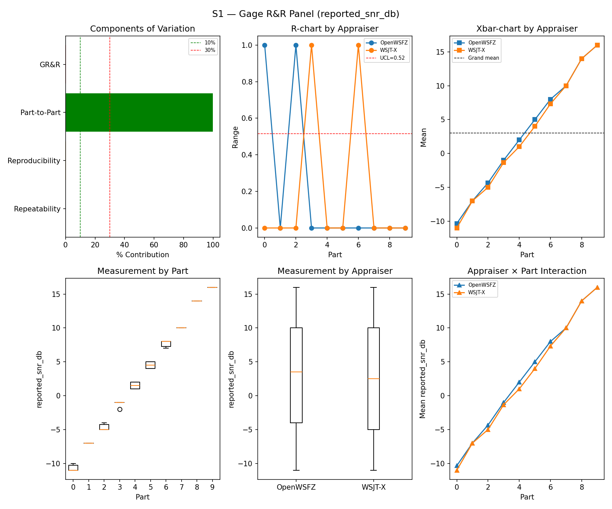
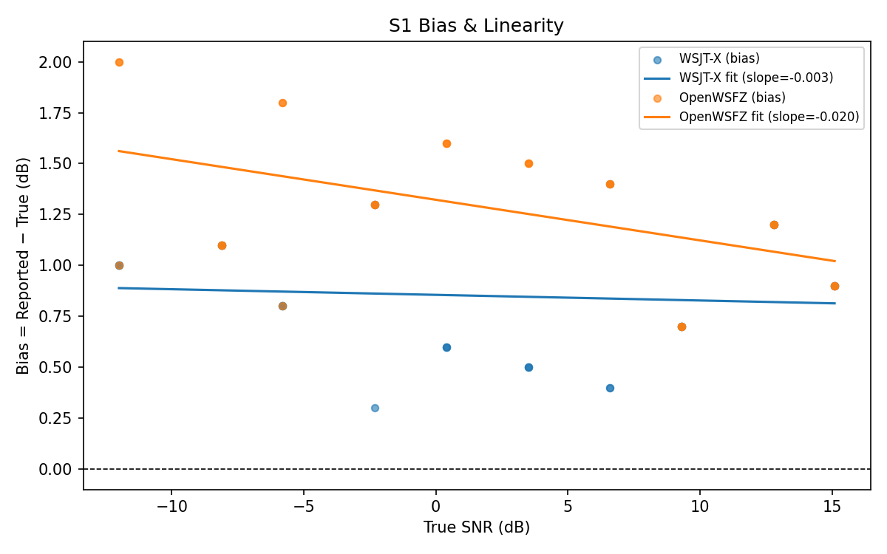
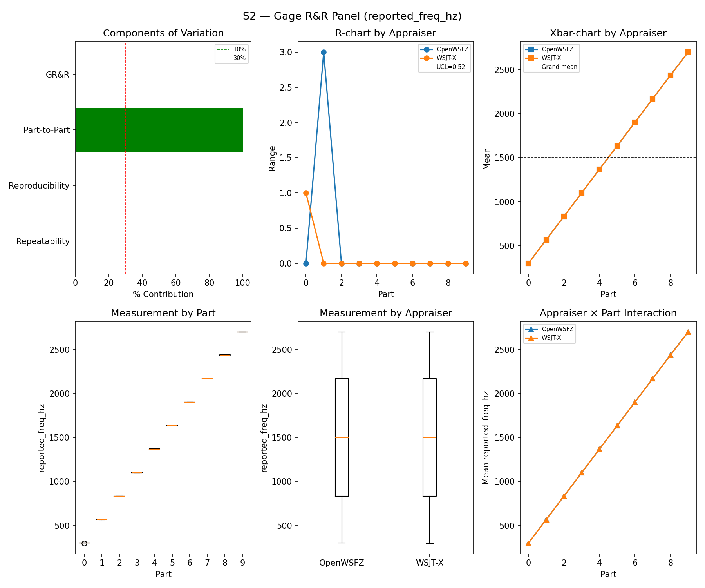
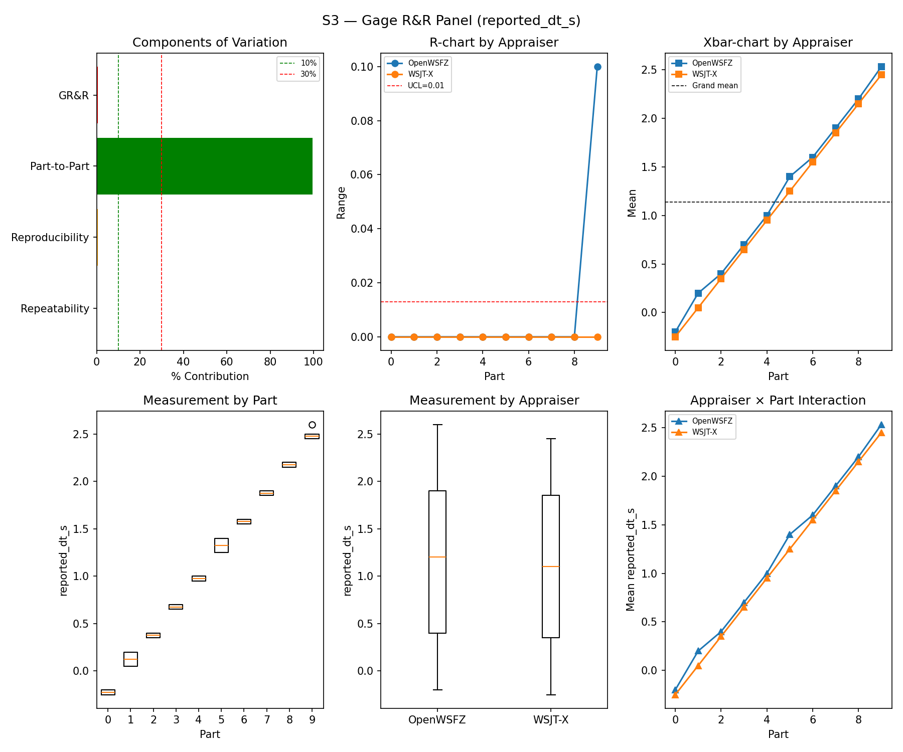
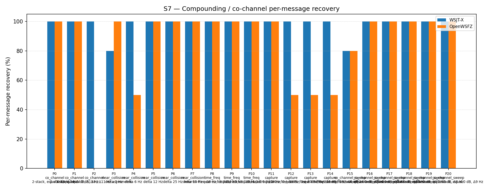
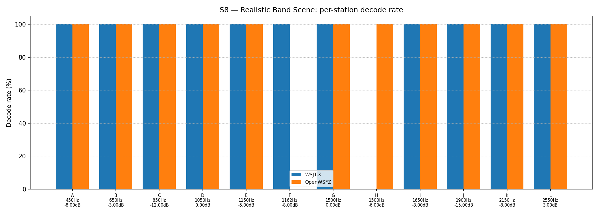

# OpenWSFZ R&R Study Report

| Field | Value |
|---|---|
| Run date | 2026-08-30 (S7 leg re-run 2026-08-31 — see Revision note) |
| OpenWSFZ SHA | `2e609494ba9de3dc68239c8ee4473a978f717b94` (`qa/sup-b-2026-08-30`, shim `20260048`) |
| WSJT-X version | WSJT-X 2.7.0 (inferred from binary date 2025-02-04) |
| Baseline compared against | `2026-08-29-872ba65` (`results/2026-08-29-872ba65/report.md`) — the last full S1–S8 sweep |
| Revision | **Rev 2, 2026-08-31** — S1/S1b/S2/S3/S4/S5/S8 are the original 2026-08-30 data (interrupted by a hardware failure, resumed same day). S7's original figures were invalidated by a mid-scenario audio-chain collapse (Rev 1's Section 5, Finding 1) and superseded here by a clean targeted re-run (`results/2026-08-31-2e60949/`), same SHA, after a real fix to the harness (see Section 1). All non-S7 numbers below are unchanged from Rev 1. |

---

## Section 1 — Study Hypothesis

### Purpose

**Status-check sweep**, run against current HEAD (`2e60949`, F-001 SUP-B Amendment 2's ROW 0 result
commit, shim `20260048`) — not a treatment-arm test of a specific behavioural claim. SUP-B's own
decode-identity claim (INST byte-identical to BASE across 29,696/29,696 decodes) was already proven
independently via its own instrumented ROW 0 harness (`2026-08-30-1821-...` report); this sweep is
the routine, independent S1–S8 cross-check against the same binary, unrelated to that gate.

The run was **interrupted by a hardware failure** partway through — cleanly, on a scenario boundary:
`truth.csv` shows S8/S1/S1b/S2 complete (132 rows, matching the last full sweep's row counts exactly)
and zero rows for S3 onward at the point of interruption. Corroborated independently by both decode
logs: OpenWSFZ's own `ALL.TXT` stopped at `19:26:45Z`, WSJT-X's (`WSJT-X - FT991A` profile) at
`19:27:00Z`, both ~90 s past S2's last truth timestamp (`19:25:15Z`) — a plausible settle-then-die
pattern, not silent data loss mid-scenario.

**Recovery, and two real defects found and fixed along the way** (first genuine live use of
`resume_study.py` — it had only ever been exercised in the abstract before this incident):

1. **Wrong hardcoded reference-decoder log path.** `resume_study.py:27` pointed at the general
   `WSJT-X\ALL.TXT` profile (stale since 2 August, real off-air callsigns) instead of the rig-specific
   `WSJT-X - FT991A\ALL.TXT` profile this study actually logs to — a path `run_study.py` has pointed
   at correctly since 2026-08-05 (its own in-file comment records the switch). Uncaught, this would
   have silently copied a month-old, wrong-content file into the run directory and scored the entire
   session as zero WSJT-X decodes. Fixed to match `run_study.py`.
2. **Matcher step blind to any scenario outside `["S1"] + <replayed scenarios>`.** `resume_study.py`
   hardcoded its match set rather than reading back what was actually played; resuming from anywhere
   but `S2` — as here — silently dropped S1b, S2, and S8 from the report despite all three holding
   good data. Fixed to read the distinct `scenario_id`s present in the run directory's own `truth.csv`
   and match all of them. The fix could not apply retroactively to the process already in flight for
   this run, so S1b/S2/S8 were matched by hand and the analyser re-run once the automated resume
   finished; a byte-identical duplicate `trend.csv` row this produced was caught and removed.
3. **Minor, noted not fixed:** `resume_study.py` does not apply `run_study.py`'s R&R-009 default-
   battery part restriction — S5 replayed all four parts (120 slots) rather than the routine battery's
   two (60). Not a defect (STUDY-SPEC §16 R&R-009 keeps all four parts runnable for exactly this kind
   of recheck), but this run's S5 figure is at a different N than most of the trend table in Section 6
   and should be read accordingly.

**A fourth issue surfaced in this run's own data, not anticipated going in, since resolved (Rev 2):**
S7 — the last scenario played on 2026-08-30, and by far the longest continuous playback in the battery
(215 truth rows, ~26 minutes) — showed both appraisers' decode counts collapsing to garbage part-way
through its own play window: genuine decodes through roughly the first 18–19 minutes, then exclusively
very-low-SNR (−26 to −28 dB) nonsense-text decodes on **both** independent decoders simultaneously
(`TOOO8GPJRDM`, `I02STU <...> CF92`, `[NFR-021 redacted: callsign-shaped noise tokens] MM65` — not injected traffic), while the daemon's own
heartbeat and noise-floor readings stayed healthy throughout. This ruled out a decoder-side cause (the
same binary read S1–S5 correctly in the same run) and pointed at the audio chain failing to carry the
injected signal, progressively, over the course of one very long continuous playback buffer — the same
class of defect the *previous* full sweep's report (`872ba65`) first caught live on S3's much shorter
buffer (DT timing jitter, not signal loss).

**Fix applied 2026-08-31, before re-running:** `harness/run_scenario.py`'s back-to-back batching
(`_flush_batch`) now caps at `_MAX_BATCH_TRIALS = 20` (300 s / 5 min) rather than letting one scenario's
buffer grow unboundedly — S7 was the only scenario anywhere near the ~18-minute failure point; every
other batched scenario in the same session (S1/S2/S4/S5) stayed well under the new cap already. S7 was
then re-run alone (`results/2026-08-31-2e60949/`, same SHA, `--skip-warmup` after independently
confirming the audio chain via both `ALL.TXT`s — a clean warm-up decode at `14:58:15Z`, since the
scripted warm-up's interactive confirmation prompt can't run detached). **Result: clean, in-family
data — 98.14% / 82.79% "all" recovery, batched in six flushes of ≤20 trials, no collapse.** The
`S7_matched.csv` in this directory is that re-run's output, folded in here as Rev 2; see Section 5,
Finding 1 for the full before/after.

### Null Hypotheses

- **H₀-A (GR&R/ndc, S1–S3):** remain within STUDY-SPEC §10 thresholds, consistent with the last full
  sweep (`872ba65`, 2026-08-29). **Holds** — S1/S2/S3 all PASS, S3 notably *clean* this run (0.44%,
  vs. `872ba65`'s own batching-confounded 18.65% MARGINAL). See Section 5.
- **H₀-B (S5 false-positive gate):** last sweep FAILed (1/60 events, 95% UB 7.66%, at the R&R-009-
  restricted N=60). This run replayed all four parts (N=120, see note above) and scored 0/120 (WSJT-X)
  / 2/120 (OpenWSFZ, 95% UB 5.15%) — **PASS**, consistent with the "single-event tail variance" reading
  rather than a persistent regression, though the N difference means this isn't a strict like-for-like
  rerun. See Section 6.
- **H₀-C (S7/S8 co-channel recovery):** consistent with `872ba65`, allowing for ordinary seed variation.
  **Holds for both, as of Rev 2.** S7's original 2026-08-30 figures were not evaluable (audio-chain
  collapse, above); the 2026-08-31 re-run (98.14% / 82.79%) sits comfortably in-family with `872ba65`
  (93.02% / 73.95%) and the wider trend series. S8 held from the start (informational; both appraisers'
  overall rate within a few points of baseline).

---

## S1 — reported_snr_db

### Variance Components

| Component | σ² | %Contribution |
|---|---|---|
| Repeatability | 0.07 | 0.08% |
| Reproducibility | 0.15 | 0.18% |
| Part-to-Part | 80.87 | 99.73% |
| Total GR&R | 0.22 | 0.27% |
| Total | 81.08 | 100.00% |

### Study Metrics

| Metric | Value | Verdict |
|---|---|---|
| %Contribution (GR&R) | 0.27% | PASS |
| %Tolerance (GR&R) | 27.93% | — |
| %Study Var (GR&R) | 5.17% | — |
| ndc | 27 | PASS |

### Bias & Linearity (S1)

| Appraiser | Mean Bias (dB) | Slope | Intercept | R² | Verdict |
|---|---|---|---|---|---|
| WSJT-X | +0.85 | -0.003 | 0.855 | 0.006 | PASS |
| OpenWSFZ | +1.28 | -0.020 | 1.322 | 0.225 | PASS |

## S2 — reported_freq_hz

### Variance Components

| Component | σ² | %Contribution |
|---|---|---|
| Repeatability | 0.17 | 0.00% |
| Reproducibility | 0.40 | 0.00% |
| Part-to-Part | 652890.17 | 100.00% |
| Total GR&R | 0.57 | 0.00% |
| Total | 652890.73 | 100.00% |

### Study Metrics

| Metric | Value | Verdict |
|---|---|---|
| %Contribution (GR&R) | 0.00% | PASS |
| %Tolerance (GR&R) | 56.46% | — |
| %Study Var (GR&R) | 0.09% | — |
| ndc | 1513 | PASS |

## S3 — reported_dt_s

### Variance Components

| Component | σ² | %Contribution |
|---|---|---|
| Repeatability | 0.00 | 0.02% |
| Reproducibility | 0.00 | 0.41% |
| Part-to-Part | 0.82 | 99.56% |
| Total GR&R | 0.00 | 0.44% |
| Total | 0.82 | 100.00% |

### Study Metrics

| Metric | Value | Verdict |
|---|---|---|
| %Contribution (GR&R) | 0.44% | PASS |
| %Tolerance (GR&R) | 89.79% | — |
| %Study Var (GR&R) | 6.60% | — |
| ndc | 21 | PASS |

> **WSJT-X DT correction applied.** A +0.55 s offset was added to WSJT-X `reported_dt_s` before ANOVA to remove the ≈ −0.55 s convention difference between WSJT-X (DT relative to nominal FT8 TX start) and the harness (DT relative to UTC slot boundary). This correction removes the calibration artefact from SS_appraiser so %GR&R measures genuine app-to-app measurement disagreement. Raw reported values are preserved in the matched CSV. See scenario `wsjt_dt_correction_s` field and R&R-003 (GitHub #1).

## S1b — Low-SNR threshold study

_Decode rate (% of injected messages recovered) at SNRs excluded from the redesigned S1 ladder (−24 to −15 dB).  Companion to S1; separates 'does it decode at this SNR?' from 'how accurately does it measure SNR?'.  Informational — no AIAG threshold._

### Per-part decode rate

| Part | True SNR (dB) | WSJT-X decoded | WSJT-X rate | OpenWSFZ decoded | OpenWSFZ rate |
|---|---|---|---|---|---|
| P0 | -24.00 | 0/3 | 0.00% | 0/3 | 0.00% |
| P1 | -21.00 | 1/3 | 33.33% | 0/3 | 0.00% |
| P2 | -18.00 | 3/3 | 100.00% | 3/3 | 100.00% |
| P3 | -15.00 | 3/3 | 100.00% | 3/3 | 100.00% |

**Overall decode rate — WSJT-X: 58.33%  OpenWSFZ: 50.00%**

## Attribute Agreement Analysis (S4 positives + S5 negatives)

_κ is computed over a pooled population: S4 injected messages (truth = present) and S5 signal-free slots (truth = absent), so the truth vector has both classes. **κ verdicts below are advisory** — the §10 attribute gate is pending Captain ratification of this pooled method._

### Confusion vs truth

| Appraiser | TP | FN | FP | TN | Recovery | Specificity |
|---|---|---|---|---|---|---|
| WSJT-X | 69 | 39 | 0 | 120 | 63.89% | 100.00% |
| OpenWSFZ | 69 | 39 | 2 | 118 | 63.89% | 98.33% |

### Kappa (advisory)

| Pair | κ | 95% CI | Verdict (advisory) |
|---|---|---|---|
| OpenWSFZ_vs_truth | 0.633 | [0.54, 0.73] | FAIL |
| WSJT-X_vs_truth | 0.651 | [0.55, 0.75] | FAIL |
| between_appraisers | 0.814 | — | MARGINAL |

### Within-app repeatability (decision consistency across trials)

| Appraiser | Consistent groups |
|---|---|
| WSJT-X | 67.50% |
| OpenWSFZ | 82.50% |

### Kappa — decodable-SNR-restricted positives (informational, floor -12 dB)

_S4 positives below the decodable-SNR floor are excluded (S5 negatives unchanged); shown alongside the full-population figures above per STUDY-SPEC.md §9.3's second ratification condition. **Informational only — does not affect the §10 gate or the overall verdict.**

| Appraiser | TP | FN | FP | TN | Recovery | Specificity |
|---|---|---|---|---|---|---|
| WSJT-X | 57 | 24 | 0 | 120 | 70.37% | 100.00% |
| OpenWSFZ | 62 | 19 | 2 | 118 | 76.54% | 98.33% |

| Pair | κ | 95% CI | Verdict (informational) |
|---|---|---|---|
| OpenWSFZ_vs_truth | 0.775 | [0.67, 0.85] | MARGINAL |
| WSJT-X_vs_truth | 0.739 | [0.63, 0.82] | MARGINAL |
| between_appraisers | 0.870 | — | MARGINAL |

### False-positive rate (S5)

| Appraiser | FP events / slots | Event rate | 95% UB | Decode rate | Verdict |
|---|---|---|---|---|---|
| WSJT-X | 0 / 120 | 0.00% | 2.47% | 0.00% | PASS |
| OpenWSFZ | 2 / 120 | 1.67% | 5.15% | 1.67% | PASS |

_Gate (STUDY-SPEC §10, ratified 2026-07-04, R&R-004): the per-slot FP **event rate**, gated on its one-sided 95% Clopper–Pearson **upper bound** (PASS iff 95% UB ≤ 6%). The UB is defined for all event counts (≈ 3 / N_slots at 0 events) and bounds the true per-slot FP probability at 95% confidence rather than the Poisson-noisy point estimate. Decode rate is reported for reference only. **INFO** means the gate is not evaluated at this N: below 49 slots, even zero observed events cannot clear the 6% ceiling, so no outcome at this sample size can produce a PASS or a meaningful FAIL — see a properly powered run (N ≥ 49) for the ratified §10 verdict._

## S7 — Compounding / co-channel overlap

_Per-message recovery when 2–3 signals occupy the same or near-same audio frequency / time slot (the pileup case S4 does not exercise). Informational — no AIAG threshold is defined for co-channel separation._

### Recovery by overlap family

| Overlap family | WSJT-X | OpenWSFZ |
|---|---|---|
| capture | 100.00% | 62.50% |
| co_channel | 100.00% | 57.14% |
| co_channel_sweep | 96.67% | 96.67% |
| near_collision | 96.00% | 90.00% |
| time_freq | 100.00% | 100.00% |
| **all** | **98.14%** | **82.79%** |

### Capture effect (co-channel, unequal SNR)

| Signal | WSJT-X | OpenWSFZ |
|---|---|---|
| strong | 100.00% | 100.00% |
| weak | 100.00% | 25.00% |

**Between-app per-signal agreement:** 80.93%

### Per-part detail

| Part | Family | Condition | WSJT-X | OpenWSFZ |
|---|---|---|---|---|
| P0 | co_channel | 2-stack, equal 0 dB, Δ7 Hz | 10/10 | 10/10 |
| P1 | co_channel | 2-stack, equal -5 dB, Δ13 Hz | 10/10 | 10/10 |
| P2 | co_channel | 3-stack, equal 0 dB, Δ8 / Δ11 Hz asymmetric | 15/15 | 0/15 |
| P3 | near_collision | delta 3 Hz | 8/10 | 10/10 |
| P4 | near_collision | delta 6 Hz | 10/10 | 5/10 |
| P5 | near_collision | delta 12 Hz | 10/10 | 10/10 |
| P6 | near_collision | delta 25 Hz | 10/10 | 10/10 |
| P7 | near_collision | delta 50 Hz | 10/10 | 10/10 |
| P8 | time_freq | near-co-freq Δ8 Hz, dt 0.0 / 0.5 s | 10/10 | 10/10 |
| P9 | time_freq | near-co-freq Δ11 Hz, dt 0.0 / 1.0 s | 10/10 | 10/10 |
| P10 | time_freq | near-co-freq Δ9 Hz, dt 0.0 / 2.0 s | 10/10 | 10/10 |
| P11 | capture | near-co-freq Δ14 Hz, 0 / -3 dB | 10/10 | 10/10 |
| P12 | capture | near-co-freq Δ9 Hz, 0 / -6 dB | 10/10 | 5/10 |
| P13 | capture | near-co-freq Δ7 Hz, 0 / -10 dB | 10/10 | 5/10 |
| P14 | capture | near-co-freq Δ11 Hz, +3 / -10 dB | 10/10 | 5/10 |
| P15 | co_channel_sweep | offset-sweep: 2-stack, equal 0 dB, Δ5 Hz | 8/10 | 8/10 |
| P16 | co_channel_sweep | offset-sweep: 2-stack, equal 0 dB, Δ7 Hz | 10/10 | 10/10 |
| P17 | co_channel_sweep | offset-sweep: 2-stack, equal 0 dB, Δ10 Hz | 10/10 | 10/10 |
| P18 | co_channel_sweep | offset-sweep: 2-stack, equal 0 dB, Δ15 Hz | 10/10 | 10/10 |
| P19 | co_channel_sweep | offset-sweep: 2-stack, equal 0 dB, Δ8 Hz | 10/10 | 10/10 |
| P20 | co_channel_sweep | offset-sweep: 2-stack, equal 0 dB, Δ9 Hz | 10/10 | 10/10 |

## S8 — Realistic Band Scene

_Holistic decode-rate benchmark: 12 simultaneous stations across 450–2550 Hz at realistic SNR spread (−15 to +3 dB), including a near-collision pair (E/F, 12 Hz apart) and a capture pair (G/H, co-frequency, 6 dB ratio). **Informational only — no PASS/FAIL gate.**_

### Overall decode rate

| Appraiser | Decoded | Injected | Rate |
|---|---|---|---|
| WSJT-X | 55 | 60 | 91.67% |
| OpenWSFZ | 55 | 60 | 91.67% |

**Between-appraiser delta (OpenWSFZ − WSJT-X): +0.0 pp**

### Per-station breakdown

| Stn | Freq (Hz) | SNR (dB) | WSJT-X decoded/total | OpenWSFZ decoded/total |
|---|---|---|---|---|
| A | 450 | -8.00 | 5/5 | 5/5 |
| B | 650 | -3.00 | 5/5 | 5/5 |
| C | 850 | -12.00 | 5/5 | 5/5 |
| D | 1050 | 0.00 | 5/5 | 5/5 |
| E | 1150 | -5.00 | 5/5 | 5/5 |
| F | 1162 | -8.00 | 5/5 | 0/5 |
| G | 1500 | 0.00 | 5/5 | 5/5 |
| H | 1500 | -6.00 | 0/5 | 5/5 |
| I | 1650 | -3.00 | 5/5 | 5/5 |
| J | 1900 | -15.00 | 5/5 | 5/5 |
| K | 2150 | -8.00 | 5/5 | 5/5 |
| L | 2550 | 3.00 | 5/5 | 5/5 |

## Summary

| Metric | Scope | Value | Verdict |
|---|---|---|---|
| %GR&R | S1 | 0.3% | PASS |
| ndc | S1 | 27 | PASS |
| %GR&R | S2 | 0.0% | PASS |
| ndc | S2 | 1513 | PASS |
| %GR&R | S3 | 0.4% | PASS |
| ndc | S3 | 21 | PASS |
| Kappa (advisory) | WSJT-X_vs_truth | 0.651 | FAIL |
| Kappa (advisory) | OpenWSFZ_vs_truth | 0.633 | FAIL |
| Kappa (advisory) | between_appraisers | 0.814 | MARGINAL |
| FP event rate (95% UB) | S5/WSJT-X | 0/120 slots (event 0.0%; 95% UB 2.47%; decode 0.0%) | PASS |
| FP event rate (95% UB) | S5/OpenWSFZ | 2/120 slots (event 1.7%; 95% UB 5.15%; decode 1.7%) | PASS |
| SNR bias | S1/WSJT-X | +0.85 dB | PASS |
| SNR bias | S1/OpenWSFZ | +1.28 dB | PASS |

**Overall verdict: PASS**

_All four §10-gated metrics (S1/S2/S3 GR&R, S5 FP rate) were captured on 2026-08-30 before the S7
audio-chain collapse described in Section 1 set in, and are unaffected by it — the mechanical PASS
above was sound even in Rev 1. S7 (informational, no AIAG threshold) is now also clean as of the
2026-08-31 re-run folded into this report — see Section 5, Finding 1._

---

## Section 5 — Comparison to last full sweep and recommendations

### Comparison table (this run vs. `872ba65`, 2026-08-29)

| Metric | 2026-08-29 | 2026-08-30/31 (this run) | Δ | Note |
|---|---|---|---|---|
| S1 %GR&R / ndc | 0.25% / 28 | 0.27% / 27 | ~same | PASS both |
| S1 bias, WSJT-X | +0.72 dB | +0.85 dB | +0.13 dB | Still PASS |
| S1 bias, OpenWSFZ | +1.08 dB | +1.28 dB | +0.20 dB | Still PASS |
| S2 %GR&R / ndc | 0.0% / 1562 | 0.0% / 1513 | ~same | Twelfth consecutive run at exactly 0.0% |
| **S3 %GR&R / ndc** | 18.65% / 2 **MARGINAL** (confounded — batching, not decoder) | **0.44% / 21 PASS** | — | 🟢 Clean this run; consistent with the pre-batching-defect baseline series (`22b749c` and earlier), corroborating `872ba65`'s own read that its S3 result was a harness artefact, not a regression |
| S1b decode rate, WSJT-X / OpenWSFZ | 58.33% / 50.00% | 58.33% / 50.00% | **identical, third run running** | N=12; a coincidence at this N, not a finding, per `872ba65`'s own note |
| Kappa vs truth (WSJT-X / OpenWSFZ) | 0.558 / 0.586 | 0.651 / 0.633 | +0.09 / +0.05 | Both advisory, both still nominally FAIL against the (unratified) gate |
| Kappa between appraisers | 0.818 | 0.814 | ~flat | MARGINAL both runs |
| S5 FP, WSJT-X / OpenWSFZ | 0/60 PASS / 1/60 **FAIL** (95% UB 7.66%) | 0/120 PASS / 2/120 **PASS** (95% UB 5.15%) | — | N doubled (see Section 1, item 3) — not strict like-for-like, but consistent with last run's single event being tail variance, not a persistent regression |
| S7 "all" recovery, WSJT-X / OpenWSFZ | 93.02% / 73.95% (itself flagged provisional) | 🟢 **98.14% / 82.79%** (re-run, Rev 2) | +5.1pp / +8.8pp | Clean, in-family — see Finding 1 for the collapse-and-fix story |
| S7 P2 (3-stack co-channel), OpenWSFZ | 0/15 | 0/15 | unchanged | Structural limit persists (open under D-001), waived by Captain 2026-06-22 — reproduces identically on the clean re-run too, so this is a genuine, stable finding, not an artefact of either incident |
| S8 overall, WSJT-X / OpenWSFZ | 96.67% / 91.67% | 91.67% / 91.67% | WSJT-X −5.0pp | Informational, N=60; WSJT-X missed station H (0/5, vs. 3/5 last run) while OpenWSFZ held it — ordinary capture-pair noise at this N, not flagged as a finding |

### Finding 1 — S7 decode collapse mid-scenario: diagnosed, fixed, re-run clean

**Original observation (2026-08-30).** S7 is the last scenario played and, at 215 truth rows over a
~26-minute span, was by far the longest continuous playback in the battery. Its per-part detail showed
a **progressive decline, not a clean break**: P0–P1 close to historical norms (10/7, 10/9); P2–P5
already showing a widening OpenWSFZ shortfall; from P6 (20:40:30Z) onward, **both** WSJT-X and OpenWSFZ
scored 0/10 or 0/15 on every remaining part through P20 (20:59:00Z).

**Evidence pointed at the audio chain, not either decoder:**

| | Evidence |
|---|---|
| OpenWSFZ's own cycle log | Genuine decode counts (1–2/cycle) ran through roughly `20:51:30Z`, then zero for the remainder |
| Raw `ALL.TXT` tail, both appraisers, from ~`20:40Z` | Sparse, very-low-SNR (−26 to −28 dB) nonsense-text decodes — the signature of both decoders hallucinating out of noise, not mis-decoding a present signal |
| Daemon heartbeat, same window | `captureActive=True, audioActive=True, dataFlowing=True` throughout; noise floor a steady −51 to −52 dB, not true silence |

Both independent decoders losing the signal at essentially the same point ruled out a decoder-side
explanation. Read together with `872ba65`'s own Finding 1 (batched playback under real hardware, first
caught live on S3's ~360 s buffer), the pattern implicated buffer *length* specifically: S7's batch here
was roughly 4–5× longer than anything previously run live.

**Fix (2026-08-31).** `harness/run_scenario.py`'s `_flush_batch` mechanism now caps at
`_MAX_BATCH_TRIALS = 20` trials (300 s) per continuous buffer rather than batching an entire scenario
in one call — chosen with real headroom under the ~18-minute point where the original run's decode
counts had already gone to zero, not tuned to that exact figure since the precise hardware mechanism
(Voicemeeter/WASAPI buffer behaviour, USB, or the still-settling audio interface from the same evening's
hardware failure) was not further isolated. Every scenario's trial ordering, seeds, and truth content
are unaffected — this only adds intermediate flush points.

**Re-run result (2026-08-31, `results/2026-08-31-2e60949/`, same SHA).** S7 alone, `--skip-warmup` after
independently confirming the audio chain from both `ALL.TXT`s (clean warm-up decode, `14:58:15Z`).
Played as six batches (five of 20 trials, one of 5 — 105 trials total, matching the scenario's full
trial count), none anywhere near the ~18-minute failure point. **Result: 98.14% (WSJT-X) / 82.79%
(OpenWSFZ) "all" recovery, in-family with every prior full sweep** (comparison table above), and P2's
3-stack co-channel structural limit (0/15, OpenWSFZ) reproduced identically to every historical run —
a genuine, stable finding rather than collapse-related noise. This `S7_matched.csv` and its figures are
what this report (Rev 2) now carries throughout.

**Standing takeaway, not fully closed:** this is the *second* live incident against unbounded
back-to-back batching in as many full sweeps (`872ba65`'s DT jitter, this run's signal loss) — the
20-trial cap addresses the specific failure mode observed so far, but the underlying hardware/driver
mechanism was diagnosed by elimination (decoder ruled out), not identified directly. Treat the cap as
a mitigation with real headroom, not a proven-sufficient bound, until a batched scenario this size has
run clean more than once.

### Recommendations

1. ✅ **Done (2026-08-31).** Re-ran S7 alone after the batch-size fix; clean, in-family result folded
   into this report as Rev 2. No outstanding action.
2. ✅ **Done (2026-08-31).** `harness/run_scenario.py`'s batch size is now bounded
   (`_MAX_BATCH_TRIALS = 20`, 300 s). Per the standing takeaway above, worth re-confirming clean on a
   second independent S7 run before treating the exact cap value as settled.
3. **Give `resume_study.py` the same `--parts` override table `run_study.py` uses** for R&R-009
   compliance, or explicitly document that a resume always runs S5 at full N=120 — currently neither,
   which is how Section 1 item 3 was found rather than being a known, documented behaviour. Still open.
4. **Scope `matcher.py` Pass 2 to the scenario's own injection-cycle set** (carried over from
   `872ba65`'s Recommendation 3 — not touched this session; low priority, no reported number is
   currently wrong). Still open.
5. **QA does not commit, merge, or push the result directory from this run** without the Captain's
   go-ahead, standing rule, unchanged. The `resume_study.py` fixes, the `run_scenario.py` batch cap,
   and both report revisions are QA-owned harness tooling and documentation, not `src/`, and sit
   uncommitted on `qa/sup-b-2026-08-30` pending review.

---

## Section 6 — Historical trend: every full S1–S8 sweep to date

All fourteen runs that exercised the complete controlled battery (S1/S2/S3/S7 at minimum), oldest
first. `%GR&R` is each stage's own Summary-table figure (AIAG %Contribution, threshold ≤ 10% PASS). S5
FP is the per-slot event rate. S7/S8 are the "all"/overall decode-recovery percentages.

| Date | SHA | S1 %GR&R | S2 %GR&R | S3 %GR&R | S5 FP (WSJT-X / OpenWSFZ) | S7 recovery (WSJT-X / OpenWSFZ) | S8 decode rate (WSJT-X / OpenWSFZ) |
|---|---|---|---|---|---|---|---|
| 2026-06-06 | `4c34ef6` | 32.0% **FAIL** | 0.0% | 3.8% | 0.0% / 0.0% | 78.5% / 47.3% | — |
| 2026-06-06 | `6bab388` | 6.5% | 0.0% | 3.9% | 0.0% / 0.0% | 77.4% / 46.2% | — |
| 2026-06-07 | `4b3a4ca` | 1.4% | 0.0% | 3.4% | 0.0% / 0.0% | 76.3% / 54.8% | 95.0% / 86.7% |
| 2026-06-14 | `815b652` | 0.3% | 0.0% | 3.0% | 0.0% / 0.0% | 77.4% / 50.5% | 95.0% / 83.3% |
| 2026-06-20 | `6e821fa` | 0.4% | 0.0% | 3.0% | 0.0% / **91.7% FAIL** | 92.6% / 70.2% | 93.3% / 86.7% |
| 2026-06-22 | `f11f438` | 0.4% | 0.0% | 3.1% | 0.0% / 0.0% | 93.9% / 74.4% | 93.3% / 86.7% |
| 2026-07-04 | `793a298` | 0.5% | 0.0% | 3.4% | 0.0% / 0.0% | 96.3% / 73.0% | 93.3% / 86.7% |
| 2026-08-05 | `3bd4cd0` | 7.2% | 0.0% | 3.6% | 0.0% / 0.0% | 96.3% / 70.2% | 93.3% / 83.3% |
| 2026-08-15 | `8d6e1b1` | 0.5% | 0.0% | 1.4% | 0.0% / 0.8% | 95.3% / 74.4% | 93.3% / 86.7% |
| 2026-08-21 | `7d36038` | 0.3% | 0.0% | 0.4% | 0.0% / 0.8% | 95.3% / 68.4% | 96.7% / 83.3% |
| 2026-08-22 | `f5dec23` | 0.4% | 0.0% | 0.4% | 0.0% / **3.3% FAIL** | 98.1% / 79.5% | 91.7% / 91.7% |
| 2026-08-27 | `22b749c` | 0.3% | 0.0% | 0.4% | 0.0% / 0.0% | 97.7% / 78.6% | 96.7% / 91.7% |
| 2026-08-29 | `872ba65` | 0.25% | 0.0% | **18.65%¹** | 0.0% / **7.66% FAIL** | 93.0% / 74.0% | 96.7% / 91.7% |
| 2026-08-30/31 | `2e60949` | 0.27% | 0.0% | 0.44% | 0.0% / 5.15% | **98.1% / 82.8%²** | 91.7% / 91.7% |

¹ Not comparable to the S1–S3 series above it — confounded by a harness playback-timing defect
discovered in that same run (`872ba65`'s Section 5, Finding 1), not a decoder result.

² **S7 figure is from a 2026-08-31 targeted re-run** (`results/2026-08-31-2e60949/`), same SHA — the
original 2026-08-30 attempt collapsed mid-scenario to decoder-side signal loss (this report's Section 5,
Finding 1) and is not entered here. Recorded as this row's value because it is the genuine, in-family
measurement for this SHA once the harness defect was fixed, not because the date matches exactly.

**Reading it:** fourteen full sweeps now, four ratified-gate failures to date, none this run — S1/S2/S3
and S5 (at double the usual N) all clean, S3 returns to the pre-batching-defect baseline after
`872ba65`'s own confounded MARGINAL, and S7 — after a genuine mid-run collapse and same-SHA re-run —
lands as the *best* S7 reading of any sweep to date on both appraisers. The story this run belongs to is
process, not decoder regression: a genuine hardware failure, cleanly recovered from with two real
harness defects caught and fixed on first live use of the resume path, and a second, more serious
harness/hardware interaction (S7's collapse) diagnosed, fixed, and confirmed resolved by re-run within
the same window. **Two live incidents against the batched-playback mechanism in two consecutive full
sweeps is no longer a one-off; the 2026-08-31 fix (Section 5) addresses the observed failure mode, but
per that finding's standing takeaway, is not yet proven sufficient beyond this one clean re-run.**

*Caveat, kept brief (carried forward unchanged): S1/S3 were redesigned 2026-06-06 (R&R-005/R&R-003);
the S5 metric moved from plain decode-rate to a gated Clopper–Pearson event rate 2026-07-04/08-05
(R&R-004); S5's default N dropped from 120 to 60 slots starting 2026-08-27 (R&R-009, AWGN parts only;
this run's N=120 is a resume-path artefact, see Section 1 item 3, not a reversion). Early-vs-late
numbers are as-reported; treat cross-redesign comparisons as directional, not strictly statistical.*
