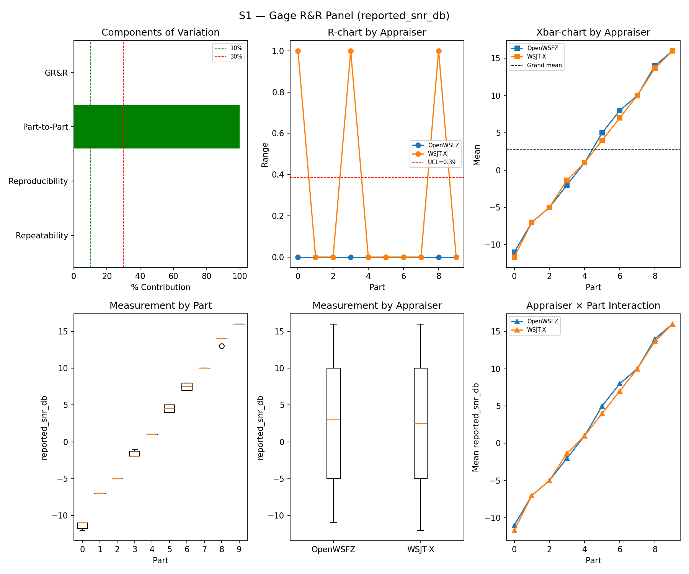
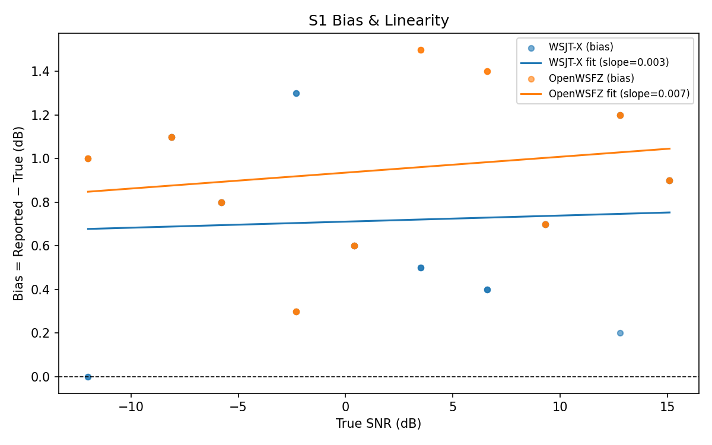
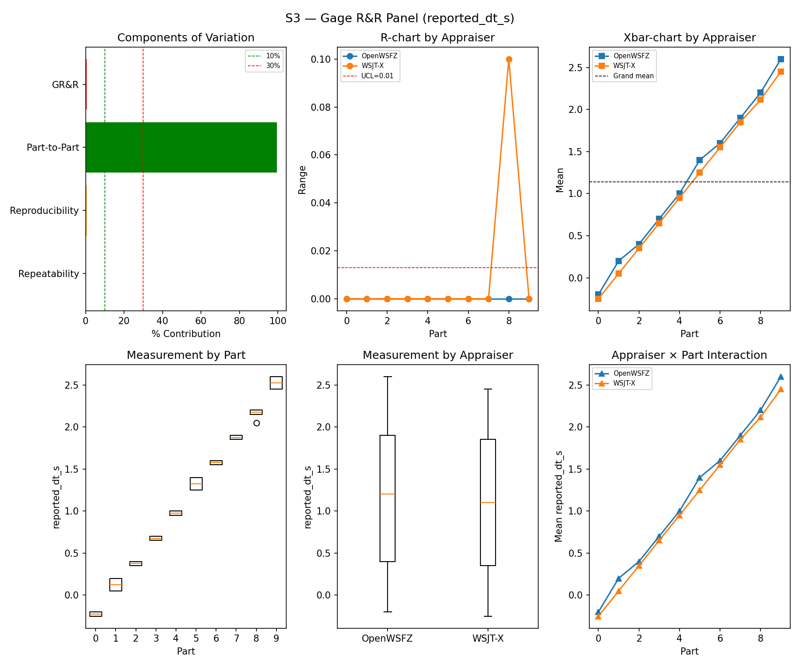
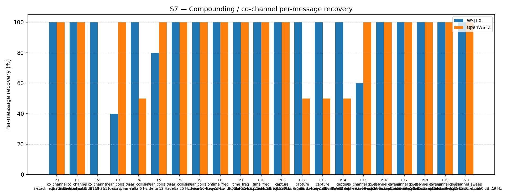
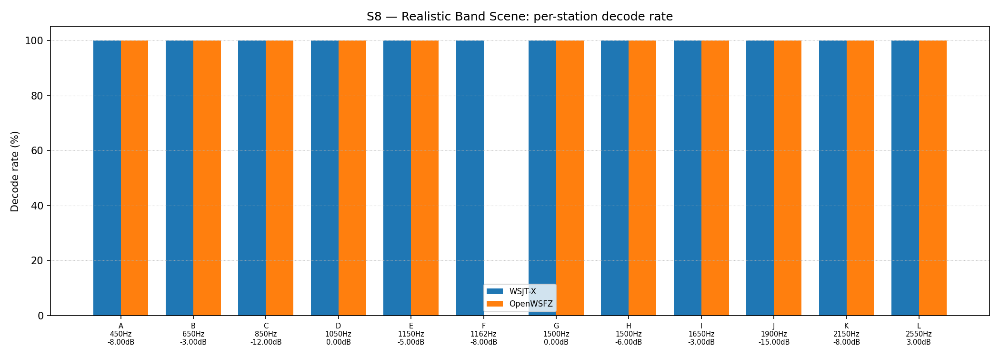

# OpenWSFZ R&R Study Report

| Field | Value |
|---|---|
| Run date | 2026-09-02 |
| OpenWSFZ SHA | `3b52608fdc6e06fed86cc0d7c1a9f668bd0e9c02` (`main`, shim `20260049`) |
| WSJT-X version | WSJT-X 2.7.0 (inferred from binary date 2025-02-04) |
| Baseline compared against | `2026-08-30-2e60949` (`results/2026-08-30-2e60949/report.md`, Rev 2) — the last full S1–S8 sweep |

---

## Section 1 — Study Hypothesis

### Purpose

**Status-check sweep**, run on the Captain's setup against current `main` HEAD (`3b52608`) — the
first full S1–S8 routine cross-check since **F-001 Option A (12-bit unique-match / H12 suppression)
landed** (PR #138, shim `20260048`→`20260049`). Not a treatment-arm test of Option A itself — that
change's own decode-identity claim was already verified independently via its own instrumented ROW 0
harness (`2026-09-01-2203-qa-to-architect-f001-h12-suppression-ac1-4-result.md`, AC-1..AC-4). This
sweep's job is the routine, independent check that nothing in the same landing window — H12 itself,
the unrelated Linux/macOS native-binary rebuild (PR #139), the FR-020/FR-064 flake fixes
(`SpectrumEventBus`/`WebSocketHub` scope-guard, `Program.cs` audio auto-start DI seam), the
CycleArchive manifest-poll timeout widening, or the docs-only OpenSpec archive/hygiene pass — moved
any GR&R, bias, or false-positive figure outside its established historical range. `git diff --stat`
between this SHA and the last full sweep's (`2e60949..3b52608`) confirms the Windows decode path
itself (`Ft8Decoder.cs`, `Ft8LibInterop.cs`, `ft8_shim.c/h`, `libft8.dll`) changed only via H12 — the
`.dll` bytes are unchanged from whatever ran the H12 ROW 0 verification (only the Linux `.so` /
macOS `.dylib` were rebuilt in the shim-`20260049` PR).

### Build & setup provenance

- Built via a clean `dotnet build -c Release` from `main` at `3b52608` (working tree clean before and
  after the build; 0 warnings, 0 errors).
- Audio routing per the Captain's setup, verified not assumed: WSJT-X (`WSJT-X - FT991A` profile)
  restarted fresh with `ALL.TXT` cleared before this session (confirmed 0 bytes, timestamped
  `18:15Z`); `config.json`'s `audioDeviceId`/`audioDeviceFriendlyName` confirmed pointing at
  **Voicemeeter Out B1**, matching WSJT-X's own `SoundInName=Voicemeeter Out B1`; daemon launched on
  port 8080 via `Start-Process -PassThru` (PID-tracked, not Git Bash `$!` — the standing trap on this
  machine); `/api/v1/status` confirmed `captureActive:true`, `shimVersion:20260049` before arming
  (HK-027 / the standing CABLE-Output-fault note).
- **Pre-flight verification substituted for the harness's interactive warm-up prompt.** Rather than
  ask an operator to eyeball two GUIs, one warm-up cycle (`CQ Q1ABC FN42`, +6 dB) was played into
  *Voicemeeter AUX Input* and both `ALL.TXT` files were read back directly and confirmed to contain
  the message — a strictly more reliable check than the interactive prompt it replaced (HK-027: read
  what the instrument already recorded). `run_study.py` was then launched with `--skip-warmup
  --device "Voicemeeter AUX Input"`; the S8-inclusion prompt was answered `y` to run the full
  controlled battery plus S8, matching this sweep's "S1–S8" scope. The daemon's own `decodeLog.path`
  (`D:\Projects\claude\OpenWSFZ\ALL.TXT`, append-only by design — `AllTxtWriter.cs`) was truncated
  before the run to mirror WSJT-X's cleared log, since the writer never does this itself.
- **Single uninterrupted pass, no incidents.** First truth timestamp `2026-09-02T16:49:00Z`, last
  `2026-09-02T18:06:15Z` — 77 minutes, in family with every prior full sweep. `run_study.log` contains
  no errors, exceptions, or retries anywhere in the battery. Daemon status post-run:
  `cycleArchiveDroppedCycles:0`, `hashTableRejectCount:0` — flat-zero H12 instrumentation, consistent
  with SUP-B's own already-documented finding that this study's ~8-distinct-callsign population is far
  too small to ever stress the hash table (not re-cited as a new reading here, per that finding's own
  caveat).

## S1 — reported_snr_db

### Variance Components

| Component | σ² | %Contribution |
|---|---|---|
| Repeatability | 0.05 | 0.06% |
| Reproducibility | 0.13 | 0.16% |
| Part-to-Part | 83.56 | 99.78% |
| Total GR&R | 0.18 | 0.22% |
| Total | 83.74 | 100.00% |

### Study Metrics

| Metric | Value | Verdict |
|---|---|---|
| %Contribution (GR&R) | 0.22% | PASS |
| %Tolerance (GR&R) | 25.69% | — |
| %Study Var (GR&R) | 4.68% | — |
| ndc | 30 | PASS |

### Bias & Linearity (S1)

| Appraiser | Mean Bias (dB) | Slope | Intercept | R² | Verdict |
|---|---|---|---|---|---|
| WSJT-X | +0.72 | 0.003 | 0.711 | 0.005 | PASS |
| OpenWSFZ | +0.95 | 0.007 | 0.936 | 0.032 | PASS |

## S2 — reported_freq_hz

### Variance Components

| Component | σ² | %Contribution |
|---|---|---|
| Repeatability | 0.17 | 0.00% |
| Reproducibility | 0.40 | 0.00% |
| Part-to-Part | 652890.17 | 100.00% |
| Total GR&R | 0.57 | 0.00% |
| Total | 652890.73 | 100.00% |

### Study Metrics

| Metric | Value | Verdict |
|---|---|---|
| %Contribution (GR&R) | 0.00% | PASS |
| %Tolerance (GR&R) | 56.46% | — |
| %Study Var (GR&R) | 0.09% | — |
| ndc | 1513 | PASS |

## S3 — reported_dt_s

### Variance Components

| Component | σ² | %Contribution |
|---|---|---|
| Repeatability | 0.00 | 0.02% |
| Reproducibility | 0.00 | 0.53% |
| Part-to-Part | 0.83 | 99.45% |
| Total GR&R | 0.00 | 0.55% |
| Total | 0.83 | 100.00% |

### Study Metrics

| Metric | Value | Verdict |
|---|---|---|
| %Contribution (GR&R) | 0.55% | PASS |
| %Tolerance (GR&R) | 101.55% | — |
| %Study Var (GR&R) | 7.43% | — |
| ndc | 18 | PASS |

> **WSJT-X DT correction applied.** A +0.55 s offset was added to WSJT-X `reported_dt_s` before ANOVA to remove the ≈ −0.55 s convention difference between WSJT-X (DT relative to nominal FT8 TX start) and the harness (DT relative to UTC slot boundary). This correction removes the calibration artefact from SS_appraiser so %GR&R measures genuine app-to-app measurement disagreement. Raw reported values are preserved in the matched CSV. See scenario `wsjt_dt_correction_s` field and R&R-003 (GitHub #1).

## S1b — Low-SNR threshold study

_Decode rate (% of injected messages recovered) at SNRs excluded from the redesigned S1 ladder (−24 to −15 dB).  Companion to S1; separates 'does it decode at this SNR?' from 'how accurately does it measure SNR?'.  Informational — no AIAG threshold._

### Per-part decode rate

| Part | True SNR (dB) | WSJT-X decoded | WSJT-X rate | OpenWSFZ decoded | OpenWSFZ rate |
|---|---|---|---|---|---|
| P0 | -24.00 | 0/3 | 0.00% | 0/3 | 0.00% |
| P1 | -21.00 | 2/3 | 66.67% | 0/3 | 0.00% |
| P2 | -18.00 | 2/3 | 66.67% | 3/3 | 100.00% |
| P3 | -15.00 | 3/3 | 100.00% | 3/3 | 100.00% |

**Overall decode rate — WSJT-X: 58.33%  OpenWSFZ: 50.00%**

## Attribute Agreement Analysis (S4 positives + S5 negatives)

_κ is computed over a pooled population: S4 injected messages (truth = present) and S5 signal-free slots (truth = absent), so the truth vector has both classes. **κ verdicts below are advisory** — the §10 attribute gate is pending Captain ratification of this pooled method._

### Confusion vs truth

| Appraiser | TP | FN | FP | TN | Recovery | Specificity |
|---|---|---|---|---|---|---|
| WSJT-X | 67 | 41 | 0 | 60 | 62.04% | 100.00% |
| OpenWSFZ | 70 | 38 | 4 | 56 | 64.81% | 93.33% |

### Kappa (advisory)

| Pair | κ | 95% CI | Verdict (advisory) |
|---|---|---|---|
| OpenWSFZ_vs_truth | 0.516 | [0.40, 0.62] | FAIL |
| WSJT-X_vs_truth | 0.539 | [0.43, 0.64] | FAIL |
| between_appraisers | 0.768 | — | MARGINAL |

### Within-app repeatability (decision consistency across trials)

| Appraiser | Consistent groups |
|---|---|
| WSJT-X | 84.21% |
| OpenWSFZ | 78.95% |

### Kappa — decodable-SNR-restricted positives (informational, floor -12 dB)

_S4 positives below the decodable-SNR floor are excluded (S5 negatives unchanged); shown alongside the full-population figures above per STUDY-SPEC.md §9.3's second ratification condition. **Informational only — does not affect the §10 gate or the overall verdict.**

| Appraiser | TP | FN | FP | TN | Recovery | Specificity |
|---|---|---|---|---|---|---|
| WSJT-X | 58 | 23 | 0 | 60 | 71.60% | 100.00% |
| OpenWSFZ | 63 | 18 | 4 | 56 | 77.78% | 93.33% |

| Pair | κ | 95% CI | Verdict (informational) |
|---|---|---|---|
| OpenWSFZ_vs_truth | 0.690 | [0.57, 0.80] | FAIL |
| WSJT-X_vs_truth | 0.682 | [0.57, 0.79] | FAIL |
| between_appraisers | 0.785 | — | MARGINAL |

### False-positive rate (S5)

| Appraiser | FP events / slots | Event rate | 95% UB | Decode rate | Verdict |
|---|---|---|---|---|---|
| WSJT-X | 0 / 60 | 0.00% | 4.87% | 0.00% | PASS |
| OpenWSFZ | 4 / 60 | 6.67% | 14.61% | 6.67% | FAIL |

_Gate (STUDY-SPEC §10, ratified 2026-07-04, R&R-004): the per-slot FP **event rate**, gated on its one-sided 95% Clopper–Pearson **upper bound** (PASS iff 95% UB ≤ 6%). The UB is defined for all event counts (≈ 3 / N_slots at 0 events) and bounds the true per-slot FP probability at 95% confidence rather than the Poisson-noisy point estimate. Decode rate is reported for reference only. **INFO** means the gate is not evaluated at this N: below 49 slots, even zero observed events cannot clear the 6% ceiling, so no outcome at this sample size can produce a PASS or a meaningful FAIL — see a properly powered run (N ≥ 49) for the ratified §10 verdict._

## S7 — Compounding / co-channel overlap

_Per-message recovery when 2–3 signals occupy the same or near-same audio frequency / time slot (the pileup case S4 does not exercise). Informational — no AIAG threshold is defined for co-channel separation._

### Recovery by overlap family

| Overlap family | WSJT-X | OpenWSFZ |
|---|---|---|
| capture | 100.00% | 62.50% |
| co_channel | 100.00% | 57.14% |
| co_channel_sweep | 93.33% | 100.00% |
| near_collision | 84.00% | 90.00% |
| time_freq | 100.00% | 100.00% |
| **all** | **94.42%** | **83.72%** |

### Capture effect (co-channel, unequal SNR)

| Signal | WSJT-X | OpenWSFZ |
|---|---|---|
| strong | 100.00% | 100.00% |
| weak | 100.00% | 25.00% |

**Between-app per-signal agreement:** 78.14%

### Per-part detail

| Part | Family | Condition | WSJT-X | OpenWSFZ |
|---|---|---|---|---|
| P0 | co_channel | 2-stack, equal 0 dB, Δ7 Hz | 10/10 | 10/10 |
| P1 | co_channel | 2-stack, equal -5 dB, Δ13 Hz | 10/10 | 10/10 |
| P2 | co_channel | 3-stack, equal 0 dB, Δ8 / Δ11 Hz asymmetric | 15/15 | 0/15 |
| P3 | near_collision | delta 3 Hz | 4/10 | 10/10 |
| P4 | near_collision | delta 6 Hz | 10/10 | 5/10 |
| P5 | near_collision | delta 12 Hz | 8/10 | 10/10 |
| P6 | near_collision | delta 25 Hz | 10/10 | 10/10 |
| P7 | near_collision | delta 50 Hz | 10/10 | 10/10 |
| P8 | time_freq | near-co-freq Δ8 Hz, dt 0.0 / 0.5 s | 10/10 | 10/10 |
| P9 | time_freq | near-co-freq Δ11 Hz, dt 0.0 / 1.0 s | 10/10 | 10/10 |
| P10 | time_freq | near-co-freq Δ9 Hz, dt 0.0 / 2.0 s | 10/10 | 10/10 |
| P11 | capture | near-co-freq Δ14 Hz, 0 / -3 dB | 10/10 | 10/10 |
| P12 | capture | near-co-freq Δ9 Hz, 0 / -6 dB | 10/10 | 5/10 |
| P13 | capture | near-co-freq Δ7 Hz, 0 / -10 dB | 10/10 | 5/10 |
| P14 | capture | near-co-freq Δ11 Hz, +3 / -10 dB | 10/10 | 5/10 |
| P15 | co_channel_sweep | offset-sweep: 2-stack, equal 0 dB, Δ5 Hz | 6/10 | 10/10 |
| P16 | co_channel_sweep | offset-sweep: 2-stack, equal 0 dB, Δ7 Hz | 10/10 | 10/10 |
| P17 | co_channel_sweep | offset-sweep: 2-stack, equal 0 dB, Δ10 Hz | 10/10 | 10/10 |
| P18 | co_channel_sweep | offset-sweep: 2-stack, equal 0 dB, Δ15 Hz | 10/10 | 10/10 |
| P19 | co_channel_sweep | offset-sweep: 2-stack, equal 0 dB, Δ8 Hz | 10/10 | 10/10 |
| P20 | co_channel_sweep | offset-sweep: 2-stack, equal 0 dB, Δ9 Hz | 10/10 | 10/10 |

## S8 — Realistic Band Scene

_Holistic decode-rate benchmark: 12 simultaneous stations across 450–2550 Hz at realistic SNR spread (−15 to +3 dB), including a near-collision pair (E/F, 12 Hz apart) and a capture pair (G/H, co-frequency, 6 dB ratio). **Informational only — no PASS/FAIL gate.**_

### Overall decode rate

| Appraiser | Decoded | Injected | Rate |
|---|---|---|---|
| WSJT-X | 60 | 60 | 100.00% |
| OpenWSFZ | 55 | 60 | 91.67% |

**Between-appraiser delta (OpenWSFZ − WSJT-X): -8.3 pp**

### Per-station breakdown

| Stn | Freq (Hz) | SNR (dB) | WSJT-X decoded/total | OpenWSFZ decoded/total |
|---|---|---|---|---|
| A | 450 | -8.00 | 5/5 | 5/5 |
| B | 650 | -3.00 | 5/5 | 5/5 |
| C | 850 | -12.00 | 5/5 | 5/5 |
| D | 1050 | 0.00 | 5/5 | 5/5 |
| E | 1150 | -5.00 | 5/5 | 5/5 |
| F | 1162 | -8.00 | 5/5 | 0/5 |
| G | 1500 | 0.00 | 5/5 | 5/5 |
| H | 1500 | -6.00 | 5/5 | 5/5 |
| I | 1650 | -3.00 | 5/5 | 5/5 |
| J | 1900 | -15.00 | 5/5 | 5/5 |
| K | 2150 | -8.00 | 5/5 | 5/5 |
| L | 2550 | 3.00 | 5/5 | 5/5 |

## Summary

| Metric | Scope | Value | Verdict |
|---|---|---|---|
| %GR&R | S1 | 0.2% | PASS |
| ndc | S1 | 30 | PASS |
| %GR&R | S2 | 0.0% | PASS |
| ndc | S2 | 1513 | PASS |
| %GR&R | S3 | 0.6% | PASS |
| ndc | S3 | 18 | PASS |
| Kappa (advisory) | WSJT-X_vs_truth | 0.539 | FAIL |
| Kappa (advisory) | OpenWSFZ_vs_truth | 0.516 | FAIL |
| Kappa (advisory) | between_appraisers | 0.768 | MARGINAL |
| FP event rate (95% UB) | S5/WSJT-X | 0/60 slots (event 0.0%; 95% UB 4.87%; decode 0.0%) | PASS |
| FP event rate (95% UB) | S5/OpenWSFZ | 4/60 slots (event 6.7%; 95% UB 14.61%; decode 6.7%) | FAIL |
| SNR bias | S1/WSJT-X | +0.72 dB | PASS |
| SNR bias | S1/OpenWSFZ | +0.95 dB | PASS |

**Overall verdict: FAIL**

### Defect Notices

- ❌ FAIL — FP event rate (OpenWSFZ) = 4 events in 60 slots (event rate 6.7%, 95% UB 14.61%); gate requires 95% UB ≤ 6%

---

## Section 5 — Comparison to last full sweep and recommendations

### Comparison table (this run vs. `2e60949`, 2026-08-30/31)

| Metric | 2026-08-30/31 | 2026-09-02 (this run) | Δ | Note |
|---|---|---|---|---|
| S1 %GR&R / ndc | 0.27% / 27 | 0.22% / 30 | ~same | PASS both |
| S1 bias, WSJT-X | +0.85 dB | +0.72 dB | −0.13 dB | Still PASS |
| S1 bias, OpenWSFZ | +1.28 dB | +0.95 dB | −0.33 dB | Still PASS |
| S2 %GR&R / ndc | 0.0% / 1513 | 0.0% / 1513 | **identical** | Thirteenth consecutive run at exactly 0.0%; ndc coincidentally exact-matches last sweep too — not investigated further, out of scope for this report |
| S3 %GR&R / ndc | 0.44% / 21 | 0.55% / 18 | ~same | Both PASS, both in the post-batching-fix baseline range |
| S1b decode rate, WSJT-X / OpenWSFZ | 58.33% / 50.00% | 58.33% / 50.00% | **identical, fourth run running** | N=12 (only 4 achievable fractions per part); a ceiling-effect coincidence, not a finding, per every prior report's own note |
| Kappa vs truth (WSJT-X / OpenWSFZ) | 0.651 / 0.633 | 0.539 / 0.516 | −0.11 / −0.12 | Both advisory, both nominally FAIL against the (unratified) gate; below last sweep but in-family with `872ba65`'s 0.558/0.586 |
| Kappa between appraisers | 0.814 | 0.768 | −0.046 | Still MARGINAL both runs |
| **S5 FP, WSJT-X / OpenWSFZ** | 0/120 PASS / 2/120 PASS (95% UB 5.15%, N=120 resume-path artefact — not routine N=60) | 0/60 PASS / **4/60 FAIL** (95% UB 14.61%) | — | 🔴 Not comparable N-for-N to last sweep; see Finding 1 for the correct like-for-like baseline |
| S7 "all" recovery, WSJT-X / OpenWSFZ | 98.14% / 82.79% | 94.42% / 83.72% | −3.7pp / +0.9pp | WSJT-X down, still well within the historical 93–98% band; OpenWSFZ flat |
| S7 P2 (3-stack co-channel), OpenWSFZ | 0/15 | 0/15 | unchanged | Structural limit persists (open under D-001), waived by Captain 2026-06-22 |
| S8 overall, WSJT-X / OpenWSFZ | 91.67% / 91.67% | **100.00%** / 91.67% | WSJT-X +8.3pp | First-ever perfect WSJT-X S8 reading in this study's history; OpenWSFZ flat |
| S8 station F (1162 Hz, −8 dB), OpenWSFZ | 0/5 | 0/5 | unchanged | **Eighth consecutive full sweep at this exact zero** — see Finding 2, already diagnosed and hard-closed, not re-opened here |

### Finding 1 — S5 false-positive gate: FAIL, and the worst reading yet under the ratified gate

**The number.** OpenWSFZ produced 4 unmatched decodes inside S5's own 60-slot AWGN window (2 in
Part 0 at −20 dB true SNR, `17:24:45Z`/`17:29:15Z`; 2 in Part 1 at −10 dB, `17:34:30Z`/`17:38:00Z` —
attributed by joining each event's `cycle_utc` against `truth.csv`'s part boundaries, since
`matcher.py`'s own `false_positive` column is unscoped to the scenario's injection window and cannot
be read directly for this purpose — the same harness wart every prior report has carried forward,
still not fixed). Event rate 6.67%, one-sided 95% Clopper–Pearson upper bound **14.61%**, against the
ratified §10 gate (95% UB ≤ 6%, R&R-004). WSJT-X: 0/60, as in every sweep to date.

**This is not a first occurrence — read the full history, not just the last sweep.** The last sweep
(`2e60949`) is the wrong comparison baseline for this gate specifically: its own S5 ran at N=120
(a `resume_study.py` artefact, not the routine battery) and passed at UB 5.15%. The correct
like-for-like baseline is the nearest **N=60, routine-battery** sweep, `872ba65` (2026-08-29):
**1/60, UB 7.66%, also a FAIL.** Read across every N=60 routine sweep since R&R-009 introduced that
default (2026-08-27 onward): PASS (0/60) → FAIL (1/60, UB 7.66%) → **FAIL (4/60, UB 14.61%, this
run)** — two FAILs in the last three routine sweeps, and this run is the largest event count and
widest UB of the three. Across the full ratified-gate era (since R&R-004, 2026-07-04/08-05),
OpenWSFZ has now failed this gate **three times** (2026-08-22 at N=120, 2026-08-29 and 2026-09-02 at
N=60) against WSJT-X's **zero** failures in fifteen full sweeps. (A fourth, much larger OpenWSFZ FP
excursion at 2026-06-20, 91.7%, predates the ratified UB gate — plain decode-rate era — and was
already fixed under D-009; not the same metric, cited here for completeness only.)

**This QA report does not diagnose a root cause** — that is beyond a single sweep's evidence, and
three data points at N=60 is not yet enough to fit a rate model. What the pattern does support is
that this is no longer safely dismissible as one-off tail variance the way `872ba65`'s single event
was hedged in its own report: **recommend the Architect open a dedicated investigation thread** into
OpenWSFZ's AWGN-noise-floor false-accept rate specifically (both of this run's events, and both of
`872ba65`'s and `f5dec23`'s, land on AWGN parts 0/1 — consistent with the R&R-009 sizing rationale
that parts 2/3 essentially never produce these, so the investigation should stay scoped to AWGN, not
the steady-carrier/multi-carrier parts).

### Finding 2 — S8 station F: eighth consecutive sweep at 0/5, already diagnosed, not reopened

Station F (1162 Hz, −8 dB, 12 Hz from its near-collision partner E) scores 0/5 for OpenWSFZ again
this run — the eighth consecutive full sweep at this exact value (2026-08-05, 08-15, 08-21, 08-22,
08-27, 08-29, 08-30/31, and now 09-02), while E scores 5/5 and WSJT-X decodes F 5/5 every time. This
is **not a new finding and is not re-recommended for investigation** — `F-NBR-A`
(`qa/rr-study/2026-08-23-1214-qa-to-architect-f-nbr-a-results.md`) already root-caused it (E's
presence is causal and sufficient — removing E alone flips F 0/100→100/100; a 3–5 tone-bin exclusion
footprint; extraction-locus, Gate A2) and a follow-on fix investigation (`NBR-A`,
`qa/rr-study/2026-08-30-0056-qa-to-architect-nbr-a-amendment-2-result-row0c-prime-fires-hard-close.md`)
**hard-closed with no fix shipped** (ROW 0c′ fired the amendment's own pre-registered hard-close
condition). This run's 0/5 is the expected, already-understood behaviour of the current build, cited
here only to confirm the pattern still holds and to stop any future report from re-queuing a "targeted
look" that has already been done and closed (the exact mistake HK-018 corrected in the 2026-08-27
report).

### Recommendations

1. **Open a dedicated investigation thread for the OpenWSFZ S5 AWGN false-positive rate** (Finding 1)
   — three ratified-gate FAILs in five sweeps since 2026-08-22, escalating in this run. Scope to AWGN
   parts 0/1 only, per the R&R-009 sizing rationale. New, not previously recommended at this strength.
2. **No action on Station F** (Finding 2) — already diagnosed and hard-closed; carried forward as a
   known, accepted characteristic like S7's P2 3-stack limit, not an open item.
3. **Scope `matcher.py`'s false-positive detection to each scenario's own injection-cycle window**
   (carried over from `872ba65`'s Recommendation 3 and every report since — still not touched). This
   run needed a manual `cycle_utc`-vs-`truth.csv` join to attribute Finding 1's four events correctly;
   without it, `S5_matched.csv`'s `false_positive` column includes dozens of stray decodes bled in from
   adjacent scenarios (confirmed directly this run — S8's own band-scene traffic appears as spurious
   "S5 false positives" timestamped during S8's own play window) and cannot be trusted at face value.
   Low priority for the gated summary number (`analyse.py` computes that correctly via its own
   slot-scoped method) but actively misleading for any manual per-part attribution like Finding 1's.
4. **`resume_study.py`'s R&R-009 part-restriction gap** (carried over, still open, not exercised this
   run — no resume was needed).
5. **NFR-021 — review before any commit.** `S5_matched.csv` (and likely `S7_matched.csv`/
   `S8_matched.csv`) contain callsign-shaped noise-hallucination strings from the unscoped
   false-positive rows in Recommendation 3 above (e.g. two 6-8 character tokens matching amateur-
   callsign grammar, `[NFR-021 redacted: callsign-shaped noise tokens]`) that are not the synthetic
   Q-prefix pattern. Per RUNBOOK.md §7.5 and the standing NFR-021 callsign policy, this result
   directory **must be grepped and scrubbed or left untracked before any commit** — not yet done as
   part of completing this report, since QA does not commit without the Captain's go-ahead
   (Recommendation 6).
6. **QA does not commit, merge, or push the result directory from this run** without the Captain's
   go-ahead, standing rule, unchanged.

---

## Section 6 — Historical trend: every full S1–S8 sweep to date

All fifteen runs that exercised the complete controlled battery (S1/S2/S3/S7 at minimum), oldest
first. `%GR&R` is each stage's own Summary-table figure (AIAG %Contribution, threshold ≤ 10% PASS). S5
FP is the value the sweep's own report used to gate PASS/FAIL (95% UB where computed, else the plain
event/decode rate for older entries — see the caveat below). S7/S8 are the "all"/overall
decode-recovery percentages.

| Date | SHA | S1 %GR&R | S2 %GR&R | S3 %GR&R | S5 FP (WSJT-X / OpenWSFZ) | S7 recovery (WSJT-X / OpenWSFZ) | S8 decode rate (WSJT-X / OpenWSFZ) |
|---|---|---|---|---|---|---|---|
| 2026-06-06 | `4c34ef6` | 32.0% **FAIL** | 0.0% | 3.8% | 0.0% / 0.0% | 78.5% / 47.3% | — |
| 2026-06-06 | `6bab388` | 6.5% | 0.0% | 3.9% | 0.0% / 0.0% | 77.4% / 46.2% | — |
| 2026-06-07 | `4b3a4ca` | 1.4% | 0.0% | 3.4% | 0.0% / 0.0% | 76.3% / 54.8% | 95.0% / 86.7% |
| 2026-06-14 | `815b652` | 0.3% | 0.0% | 3.0% | 0.0% / 0.0% | 77.4% / 50.5% | 95.0% / 83.3% |
| 2026-06-20 | `6e821fa` | 0.4% | 0.0% | 3.0% | 0.0% / **91.7% FAIL**¹ | 92.6% / 70.2% | 93.3% / 86.7% |
| 2026-06-22 | `f11f438` | 0.4% | 0.0% | 3.1% | 0.0% / 0.0% | 93.9% / 74.4% | 93.3% / 86.7% |
| 2026-07-04 | `793a298` | 0.5% | 0.0% | 3.4% | 0.0% / 0.0% | 96.3% / 73.0% | 93.3% / 86.7% |
| 2026-08-05 | `3bd4cd0` | 7.2% | 0.0% | 3.6% | 0.0% / 0.0% | 96.3% / 70.2% | 93.3% / 83.3% |
| 2026-08-15 | `8d6e1b1` | 0.5% | 0.0% | 1.4% | 0.0% / 0.8% | 95.3% / 74.4% | 93.3% / 86.7% |
| 2026-08-21 | `7d36038` | 0.3% | 0.0% | 0.4% | 0.0% / 0.8% | 95.3% / 68.4% | 96.7% / 83.3% |
| 2026-08-22 | `f5dec23` | 0.4% | 0.0% | 0.4% | 0.0% / **3.3% FAIL**² | 98.1% / 79.5% | 91.7% / 91.7% |
| 2026-08-27 | `22b749c` | 0.3% | 0.0% | 0.4% | 0.0% / 0.0% | 97.7% / 78.6% | 96.7% / 91.7% |
| 2026-08-29 | `872ba65` | 0.25% | 0.0% | 18.65%³ | 0.0% / **7.66% FAIL** | 93.0% / 74.0% | 96.7% / 91.7% |
| 2026-08-30/31 | `2e60949` | 0.27% | 0.0% | 0.44% | 0.0% / 5.15%⁴ | 98.1% / 82.8%⁵ | 91.7% / 91.7% |
| **2026-09-02** | **`3b52608`** | **0.22%** | **0.0%** | **0.55%** | **0.0% / 14.61% FAIL** | **94.4% / 83.7%** | **100.0% / 91.7%** |

¹ Plain decode-rate era (pre R&R-004 ratified UB gate); not the same metric as later rows, fixed
under D-009. Not comparable to the UB figures below it.

² Second-ever ratified-gate FAIL, N=120 (pre R&R-009 default restriction).

³ Not comparable to the S1–S3 series above it — confounded by a harness playback-timing defect
discovered in that same run (`872ba65`'s Section 5, Finding 1), not a decoder result.

⁴ N=120 (`resume_study.py` artefact — R&R-009's N=60 restriction not applied on resume, Section 1
item 3 of that report), not the routine N=60 battery. PASS at this N; not directly comparable to the
N=60 rows around it.

⁵ S7 figure is from a 2026-08-31 targeted re-run (`results/2026-08-31-2e60949/`), same SHA — the
original 2026-08-30 attempt collapsed mid-scenario to an audio-chain fault (that report's Section 5,
Finding 1), fixed, and re-run clean.

**Reading it:** fifteen full sweeps now, five ratified/pre-ratified S5 FP failures to date, all on
OpenWSFZ's side, none on WSJT-X's in any sweep. This run's S1/S2/S3 GR&R figures sit comfortably
inside their established PASS bands and both S7/S8 decode-recovery figures are in-family or better
(WSJT-X's first-ever perfect S8) — the H12/Option A landing and its co-travellers did not move any of
the routine mechanical gates outside history. The one real story this run adds is Finding 1: the S5
AWGN false-positive gate has now failed in **two of the last three N=60 routine sweeps**, with this
run the worst of the series so far, which is a materially different posture than any single prior
report's own "could be tail variance" hedge — see Section 5, Recommendation 1.

*Caveat, kept brief (carried forward unchanged): S1/S3 were redesigned 2026-06-06 (R&R-005/R&R-003);
the S5 metric moved from plain decode-rate to a gated Clopper–Pearson event rate 2026-07-04/08-05
(R&R-004); S5's default N dropped from 120 to 60 slots starting 2026-08-27 (R&R-009, AWGN parts only).
Early-vs-late numbers are as-reported; treat cross-redesign comparisons as directional, not strictly
statistical.*
