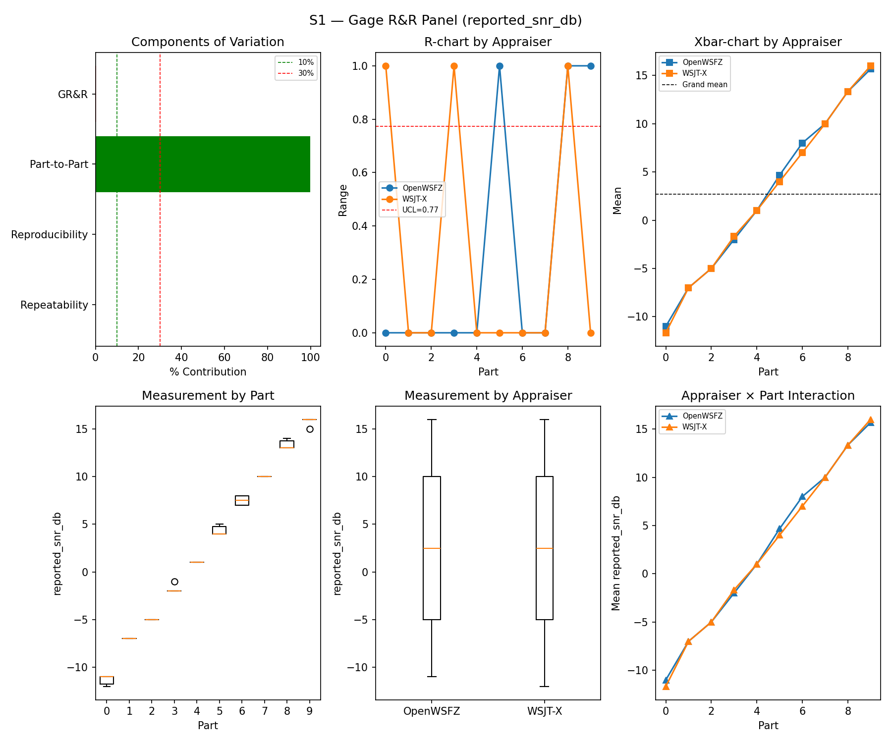
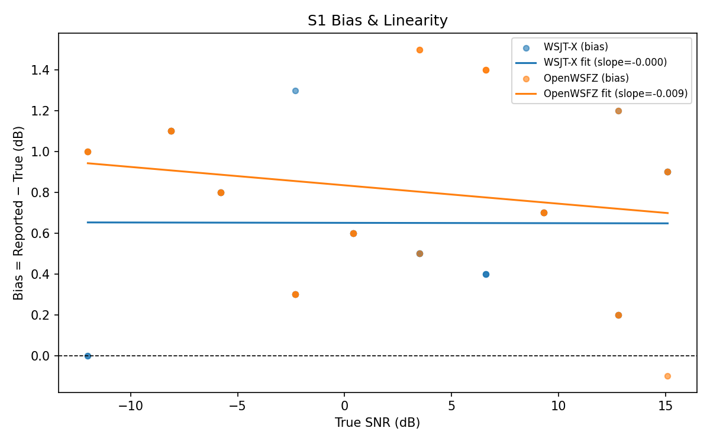
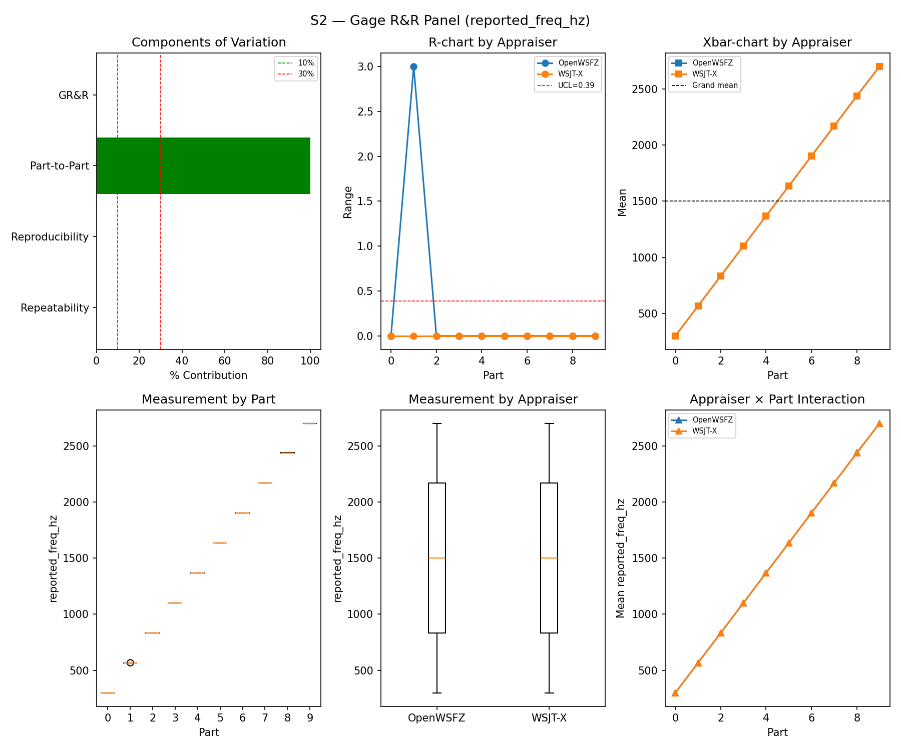
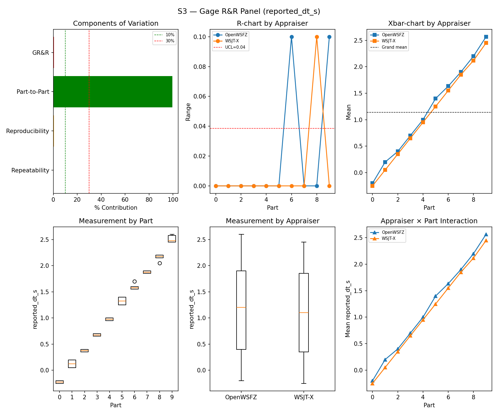
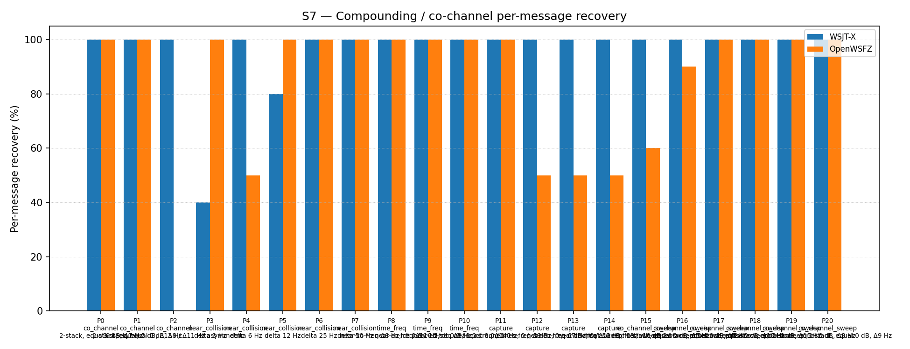
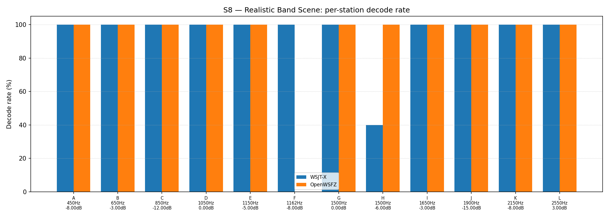

# OpenWSFZ R&R Study Report

| Field | Value |
|---|---|
| Run date | 2026-09-03 |
| OpenWSFZ SHA | `35378b9adeab1f070d0b705a6e029b78862a23d1` (`main`, shim `20260050`) |
| WSJT-X version | WSJT-X 2.7.0 (inferred from binary date 2025-02-04) |
| Baseline compared against | `2026-09-02-3b52608` (`results/2026-09-02-3b52608/report.md`) — the last full S1–S8 sweep |

---

## Section 1 — Study Hypothesis

### Purpose

**Status-check sweep**, run against current `main` HEAD (`35378b9`) — the first full S1–S8 routine
cross-check since the **F-001 L3 `ft8_get_h12_unresolved_by_code` native export** landed
(`ac6150d`, shim `20260049`→`20260050`), on top of the H12/Option A landing that the last full sweep
(`3b52608`) already independently cross-checked. Not a treatment-arm test of the L3 export itself —
that change adds a new lookup function for a not-yet-wired diagnostic path (F-001 L3,
`openspec/changes/f001-l3-unresolved-by-code-export/`); it is not called anywhere in the live decode
pipeline this study exercises. This sweep's job is the routine, independent check that landing it
(plus its docs-only/qa-only co-travellers in the same diff) moved no GR&R, bias, or false-positive
figure outside its established historical range. `git diff --stat 3b52608..35378b9 -- src/ native/`
confirms the scope: `Ft8LibInterop.cs`, `ft8_shim.c/h`, and both native binaries changed only via the
new export's addition (+141/−3 lines total across 7 files); nothing in the existing decode path
(sync, extraction, OSD, H12 lookup itself) was touched.

### Build & setup provenance

- Built via a clean `dotnet build -c Release` from `main` at `35378b9` (working tree clean before and
  after the build; 0 warnings, 0 errors).
- Audio routing per the Captain's setup, verified not assumed: WSJT-X (`WSJT-X - FT991A` profile,
  restarted fresh with `ALL.TXT` cleared before this session) confirmed via its own `.ini`
  (`SoundInName=Voicemeeter Out B1 (VB-Audio Voicemeeter VAIO)`); `config.json`'s
  `audioDeviceId`/`audioDeviceFriendlyName` were already pointing at the same **Voicemeeter Out B1**
  device — no edit needed this session, unlike the 2026-08-15 session where it still pointed at the
  Microphone. Daemon launched on port 8080 via `Start-Process -PassThru` (PID 42836, PID-tracked, not
  Git Bash `$!` — the standing trap on this machine); `/api/v1/status` confirmed `captureActive:true`,
  `shimVersion:20260050` before arming (HK-027 / the standing CABLE-Output-fault note).
- **Pre-flight verification substituted for the harness's interactive warm-up prompt**, same method as
  every sweep since 2026-09-02. One warm-up cycle (`CQ Q1ABC FN42`, +6 dB) was played into
  *Voicemeeter AUX Input* and both `ALL.TXT` files were read back directly and confirmed to contain
  the message — a strictly more reliable check than asking an operator to eyeball two GUIs (HK-027:
  read what the instrument already recorded). Both logs were truncated again immediately afterward so
  the warm-up entry does not sit inside the study's own window. `run_study.py` was then launched with
  `--skip-warmup --device "Voicemeeter AUX Input"`; the S8-inclusion prompt was answered `y` to run the
  full controlled battery plus S8, matching this sweep's "S1–S8" scope. The daemon's own
  `decodeLog.path` (`D:\Projects\claude\OpenWSFZ\ALL.TXT`, append-only by design — `AllTxtWriter.cs`)
  held 28,791 bytes of stale content from the prior (2026-09-02) session and was truncated before this
  run, since the writer never does this itself.
- **Single uninterrupted pass, no incidents.** First truth timestamp `2026-09-03T17:53:45Z`, last
  `2026-09-03T19:11:00Z` — 77 minutes, in family with every prior full sweep. Both `run_s1s8_2026-09-03.log`
  (harness driver) and the daemon's own file log (`artefacts/2026-09-03-rr-s1s8-35378b9/daemon-logs/`)
  contain zero errors, exceptions, or retries anywhere in the battery; `hashTableRejectCount` reads
  flat-zero on every cycle through to the last one logged (`19:11:00`, process-lifetime cumulative),
  consistent with SUP-B's already-documented finding that this study's small distinct-callsign
  population never stresses the hash table.
- **Daemon shut down (PID 42836) immediately after this report's metrics were extracted**, per the
  Captain's explicit instruction, to keep it from interfering with a future `pre_merge_check.py` run.
  One consequence disclosed rather than silently dropped: unlike prior sweeps, this report does **not**
  cite a live `cycleArchiveDroppedCycles` reading from `/api/v1/status` (the daemon was already down
  when that would have been queried) — the daemon's own file log shows no dropped-cycle log lines
  either, but that is a weaker check than the live counter prior reports used.

## S1 — reported_snr_db

### Variance Components

| Component | σ² | %Contribution |
|---|---|---|
| Repeatability | 0.10 | 0.12% |
| Reproducibility | 0.07 | 0.09% |
| Part-to-Part | 81.98 | 99.79% |
| Total GR&R | 0.17 | 0.21% |
| Total | 82.15 | 100.00% |

### Study Metrics

| Metric | Value | Verdict |
|---|---|---|
| %Contribution (GR&R) | 0.21% | PASS |
| %Tolerance (GR&R) | 24.90% | — |
| %Study Var (GR&R) | 4.58% | — |
| ndc | 30 | PASS |

### Bias & Linearity (S1)

| Appraiser | Mean Bias (dB) | Slope | Intercept | R² | Verdict |
|---|---|---|---|---|---|
| WSJT-X | +0.65 | -0.000 | 0.650 | 0.000 | PASS |
| OpenWSFZ | +0.82 | -0.009 | 0.834 | 0.035 | PASS |

## S2 — reported_freq_hz

### Variance Components

| Component | σ² | %Contribution |
|---|---|---|
| Repeatability | 0.15 | 0.00% |
| Reproducibility | 0.37 | 0.00% |
| Part-to-Part | 652949.47 | 100.00% |
| Total GR&R | 0.52 | 0.00% |
| Total | 652949.99 | 100.00% |

### Study Metrics

| Metric | Value | Verdict |
|---|---|---|
| %Contribution (GR&R) | 0.00% | PASS |
| %Tolerance (GR&R) | 54.20% | — |
| %Study Var (GR&R) | 0.09% | — |
| ndc | 1576 | PASS |

## S3 — reported_dt_s

### Variance Components

| Component | σ² | %Contribution |
|---|---|---|
| Repeatability | 0.00 | 0.06% |
| Reproducibility | 0.00 | 0.49% |
| Part-to-Part | 0.82 | 99.45% |
| Total GR&R | 0.00 | 0.55% |
| Total | 0.83 | 100.00% |

### Study Metrics

| Metric | Value | Verdict |
|---|---|---|
| %Contribution (GR&R) | 0.55% | PASS |
| %Tolerance (GR&R) | 101.55% | — |
| %Study Var (GR&R) | 7.44% | — |
| ndc | 18 | PASS |

> **WSJT-X DT correction applied.** A +0.55 s offset was added to WSJT-X `reported_dt_s` before ANOVA to remove the ≈ −0.55 s convention difference between WSJT-X (DT relative to nominal FT8 TX start) and the harness (DT relative to UTC slot boundary). This correction removes the calibration artefact from SS_appraiser so %GR&R measures genuine app-to-app measurement disagreement. Raw reported values are preserved in the matched CSV. See scenario `wsjt_dt_correction_s` field and R&R-003 (GitHub #1).

## S1b — Low-SNR threshold study

_Decode rate (% of injected messages recovered) at SNRs excluded from the redesigned S1 ladder (−24 to −15 dB).  Companion to S1; separates 'does it decode at this SNR?' from 'how accurately does it measure SNR?'.  Informational — no AIAG threshold._

### Per-part decode rate

| Part | True SNR (dB) | WSJT-X decoded | WSJT-X rate | OpenWSFZ decoded | OpenWSFZ rate |
|---|---|---|---|---|---|
| P0 | -24.00 | 0/3 | 0.00% | 0/3 | 0.00% |
| P1 | -21.00 | 2/3 | 66.67% | 0/3 | 0.00% |
| P2 | -18.00 | 2/3 | 66.67% | 3/3 | 100.00% |
| P3 | -15.00 | 3/3 | 100.00% | 3/3 | 100.00% |

**Overall decode rate — WSJT-X: 58.33%  OpenWSFZ: 50.00%**

## Attribute Agreement Analysis (S4 positives + S5 negatives)

_κ is computed over a pooled population: S4 injected messages (truth = present) and S5 signal-free slots (truth = absent), so the truth vector has both classes. **κ verdicts below are advisory** — the §10 attribute gate is pending Captain ratification of this pooled method._

### Confusion vs truth

| Appraiser | TP | FN | FP | TN | Recovery | Specificity |
|---|---|---|---|---|---|---|
| WSJT-X | 67 | 41 | 0 | 60 | 62.04% | 100.00% |
| OpenWSFZ | 72 | 36 | 2 | 58 | 66.67% | 96.67% |

### Kappa (advisory)

| Pair | κ | 95% CI | Verdict (advisory) |
|---|---|---|---|
| OpenWSFZ_vs_truth | 0.562 | [0.45, 0.67] | FAIL |
| WSJT-X_vs_truth | 0.539 | [0.43, 0.64] | FAIL |
| between_appraisers | 0.768 | — | MARGINAL |

### Within-app repeatability (decision consistency across trials)

| Appraiser | Consistent groups |
|---|---|
| WSJT-X | 71.05% |
| OpenWSFZ | 78.95% |

### Kappa — decodable-SNR-restricted positives (informational, floor -12 dB)

_S4 positives below the decodable-SNR floor are excluded (S5 negatives unchanged); shown alongside the full-population figures above per STUDY-SPEC.md §9.3's second ratification condition. **Informational only — does not affect the §10 gate or the overall verdict.**

| Appraiser | TP | FN | FP | TN | Recovery | Specificity |
|---|---|---|---|---|---|---|
| WSJT-X | 56 | 25 | 0 | 60 | 69.14% | 100.00% |
| OpenWSFZ | 64 | 17 | 2 | 58 | 79.01% | 96.67% |

| Pair | κ | 95% CI | Verdict (informational) |
|---|---|---|---|
| OpenWSFZ_vs_truth | 0.733 | [0.63, 0.83] | MARGINAL |
| WSJT-X_vs_truth | 0.656 | [0.54, 0.76] | FAIL |
| between_appraisers | 0.799 | — | MARGINAL |

### False-positive rate (S5)

| Appraiser | FP events / slots | Event rate | 95% UB | Decode rate | Verdict |
|---|---|---|---|---|---|
| WSJT-X | 0 / 60 | 0.00% | 4.87% | 0.00% | PASS |
| OpenWSFZ | 2 / 60 | 3.33% | 10.12% | 3.33% | FAIL |

_Gate (STUDY-SPEC §10, ratified 2026-07-04, R&R-004): the per-slot FP **event rate**, gated on its one-sided 95% Clopper–Pearson **upper bound** (PASS iff 95% UB ≤ 6%). The UB is defined for all event counts (≈ 3 / N_slots at 0 events) and bounds the true per-slot FP probability at 95% confidence rather than the Poisson-noisy point estimate. Decode rate is reported for reference only. **INFO** means the gate is not evaluated at this N: below 49 slots, even zero observed events cannot clear the 6% ceiling, so no outcome at this sample size can produce a PASS or a meaningful FAIL — see a properly powered run (N ≥ 49) for the ratified §10 verdict._

## S7 — Compounding / co-channel overlap

_Per-message recovery when 2–3 signals occupy the same or near-same audio frequency / time slot (the pileup case S4 does not exercise). Informational — no AIAG threshold is defined for co-channel separation._

### Recovery by overlap family

| Overlap family | WSJT-X | OpenWSFZ |
|---|---|---|
| capture | 100.00% | 62.50% |
| co_channel | 100.00% | 57.14% |
| co_channel_sweep | 100.00% | 91.67% |
| near_collision | 84.00% | 90.00% |
| time_freq | 100.00% | 100.00% |
| **all** | **96.28%** | **81.40%** |

### Capture effect (co-channel, unequal SNR)

| Signal | WSJT-X | OpenWSFZ |
|---|---|---|
| strong | 100.00% | 100.00% |
| weak | 100.00% | 25.00% |

**Between-app per-signal agreement:** 77.67%

### Per-part detail

| Part | Family | Condition | WSJT-X | OpenWSFZ |
|---|---|---|---|---|
| P0 | co_channel | 2-stack, equal 0 dB, Δ7 Hz | 10/10 | 10/10 |
| P1 | co_channel | 2-stack, equal -5 dB, Δ13 Hz | 10/10 | 10/10 |
| P2 | co_channel | 3-stack, equal 0 dB, Δ8 / Δ11 Hz asymmetric | 15/15 | 0/15 |
| P3 | near_collision | delta 3 Hz | 4/10 | 10/10 |
| P4 | near_collision | delta 6 Hz | 10/10 | 5/10 |
| P5 | near_collision | delta 12 Hz | 8/10 | 10/10 |
| P6 | near_collision | delta 25 Hz | 10/10 | 10/10 |
| P7 | near_collision | delta 50 Hz | 10/10 | 10/10 |
| P8 | time_freq | near-co-freq Δ8 Hz, dt 0.0 / 0.5 s | 10/10 | 10/10 |
| P9 | time_freq | near-co-freq Δ11 Hz, dt 0.0 / 1.0 s | 10/10 | 10/10 |
| P10 | time_freq | near-co-freq Δ9 Hz, dt 0.0 / 2.0 s | 10/10 | 10/10 |
| P11 | capture | near-co-freq Δ14 Hz, 0 / -3 dB | 10/10 | 10/10 |
| P12 | capture | near-co-freq Δ9 Hz, 0 / -6 dB | 10/10 | 5/10 |
| P13 | capture | near-co-freq Δ7 Hz, 0 / -10 dB | 10/10 | 5/10 |
| P14 | capture | near-co-freq Δ11 Hz, +3 / -10 dB | 10/10 | 5/10 |
| P15 | co_channel_sweep | offset-sweep: 2-stack, equal 0 dB, Δ5 Hz | 10/10 | 6/10 |
| P16 | co_channel_sweep | offset-sweep: 2-stack, equal 0 dB, Δ7 Hz | 10/10 | 9/10 |
| P17 | co_channel_sweep | offset-sweep: 2-stack, equal 0 dB, Δ10 Hz | 10/10 | 10/10 |
| P18 | co_channel_sweep | offset-sweep: 2-stack, equal 0 dB, Δ15 Hz | 10/10 | 10/10 |
| P19 | co_channel_sweep | offset-sweep: 2-stack, equal 0 dB, Δ8 Hz | 10/10 | 10/10 |
| P20 | co_channel_sweep | offset-sweep: 2-stack, equal 0 dB, Δ9 Hz | 10/10 | 10/10 |

## S8 — Realistic Band Scene

_Holistic decode-rate benchmark: 12 simultaneous stations across 450–2550 Hz at realistic SNR spread (−15 to +3 dB), including a near-collision pair (E/F, 12 Hz apart) and a capture pair (G/H, co-frequency, 6 dB ratio). **Informational only — no PASS/FAIL gate.**_

### Overall decode rate

| Appraiser | Decoded | Injected | Rate |
|---|---|---|---|
| WSJT-X | 57 | 60 | 95.00% |
| OpenWSFZ | 55 | 60 | 91.67% |

**Between-appraiser delta (OpenWSFZ − WSJT-X): -3.3 pp**

### Per-station breakdown

| Stn | Freq (Hz) | SNR (dB) | WSJT-X decoded/total | OpenWSFZ decoded/total |
|---|---|---|---|---|
| A | 450 | -8.00 | 5/5 | 5/5 |
| B | 650 | -3.00 | 5/5 | 5/5 |
| C | 850 | -12.00 | 5/5 | 5/5 |
| D | 1050 | 0.00 | 5/5 | 5/5 |
| E | 1150 | -5.00 | 5/5 | 5/5 |
| F | 1162 | -8.00 | 5/5 | 0/5 |
| G | 1500 | 0.00 | 5/5 | 5/5 |
| H | 1500 | -6.00 | 2/5 | 5/5 |
| I | 1650 | -3.00 | 5/5 | 5/5 |
| J | 1900 | -15.00 | 5/5 | 5/5 |
| K | 2150 | -8.00 | 5/5 | 5/5 |
| L | 2550 | 3.00 | 5/5 | 5/5 |

## Summary

| Metric | Scope | Value | Verdict |
|---|---|---|---|
| %GR&R | S1 | 0.2% | PASS |
| ndc | S1 | 30 | PASS |
| %GR&R | S2 | 0.0% | PASS |
| ndc | S2 | 1576 | PASS |
| %GR&R | S3 | 0.6% | PASS |
| ndc | S3 | 18 | PASS |
| Kappa (advisory) | WSJT-X_vs_truth | 0.539 | FAIL |
| Kappa (advisory) | OpenWSFZ_vs_truth | 0.562 | FAIL |
| Kappa (advisory) | between_appraisers | 0.768 | MARGINAL |
| FP event rate (95% UB) | S5/WSJT-X | 0/60 slots (event 0.0%; 95% UB 4.87%; decode 0.0%) | PASS |
| FP event rate (95% UB) | S5/OpenWSFZ | 2/60 slots (event 3.3%; 95% UB 10.12%; decode 3.3%) | FAIL |
| SNR bias | S1/WSJT-X | +0.65 dB | PASS |
| SNR bias | S1/OpenWSFZ | +0.82 dB | PASS |

**Overall verdict: FAIL**

### Defect Notices

- ❌ FAIL — FP event rate (OpenWSFZ) = 2 events in 60 slots (event rate 3.3%, 95% UB 10.12%); gate requires 95% UB ≤ 6%

---

## Section 5 — Comparison to last full sweep and recommendations

### Comparison table (this run vs. `3b52608`, 2026-09-02)

| Metric | 2026-09-02 | 2026-09-03 (this run) | Δ | Note |
|---|---|---|---|---|
| S1 %GR&R / ndc | 0.22% / 30 | 0.21% / 30 | ~same | PASS both |
| S1 bias, WSJT-X | +0.72 dB | +0.65 dB | −0.07 dB | Still PASS |
| S1 bias, OpenWSFZ | +0.95 dB | +0.82 dB | −0.13 dB | Still PASS |
| S2 %GR&R / ndc | 0.0% / 1513 | 0.0% / 1576 | ndc +63 | Breaks the exact-ndc-match streak the last report noted; %GR&R itself is still flat 0.0% (saturated either way), not a finding |
| S3 %GR&R / ndc | 0.55% / 18 | 0.55% / 18 | **identical** | Both PASS |
| S1b decode rate, WSJT-X / OpenWSFZ | 58.33% / 50.00% | 58.33% / 50.00% | **identical, fifth run running** | N=12 (only 4 achievable fractions per part); a ceiling-effect coincidence, not a finding, per every prior report's own note |
| Kappa vs truth (WSJT-X / OpenWSFZ) | 0.539 / 0.516 | 0.539 / 0.562 | +0.000 / +0.046 | WSJT-X exact repeat; OpenWSFZ up; both still advisory FAIL |
| Kappa between appraisers | 0.768 | 0.768 | **identical, second run running** | Still MARGINAL both runs |
| **S5 FP, WSJT-X / OpenWSFZ** | 0/60 PASS / **4/60 FAIL** (95% UB 14.61%) | 0/60 PASS / **2/60 FAIL** (95% UB 10.12%) | Fewer events, narrower UB | Improved vs. last sweep but still FAIL against the ratified ≤6% gate — see Finding 1 |
| S7 "all" recovery, WSJT-X / OpenWSFZ | 94.42% / 83.72% | 96.28% / 81.40% | +1.86pp / −2.32pp | Both within the historical band |
| S7 P2 (3-stack co-channel), OpenWSFZ | 0/15 | 0/15 | unchanged | Structural limit persists (open under D-001), waived by Captain 2026-06-22 |
| S8 overall, WSJT-X / OpenWSFZ | 100.00% / 91.67% | 95.00% / 91.67% | WSJT-X −5.00pp | WSJT-X off last sweep's one-off perfect reading, back in the historical 93.3–96.7% band; OpenWSFZ flat |
| S8 station F (1162 Hz, −8 dB), OpenWSFZ | 0/5 | 0/5 | unchanged | **Ninth consecutive full sweep at this exact zero** — see Finding 2, already diagnosed and hard-closed, not re-opened here |

### Finding 1 — S5 false-positive gate: FAIL again, improved from last sweep but still the third FAIL in four routine sweeps

**The number.** OpenWSFZ produced 2 unmatched decodes inside S5's own true 60-slot window
(`2026-09-03T18:28:00Z`–`18:43:15Z`, joined directly against `truth.csv`'s S5 rows — `S5_matched.csv`
itself still carries the same unscoped-false-positive-column defect Recommendation 3 below describes,
so it was not read directly for this attribution): one in Part 0 (−20 dB noise floor) at
`18:32:45Z`, reported −26 dB SNR, 341 Hz; one in Part 1 (−10 dB noise floor) at `18:37:00Z`, reported
−27 dB SNR, 2878 Hz. Event rate 3.33%, one-sided 95% Clopper–Pearson upper bound **10.12%**, against
the ratified §10 gate (95% UB ≤ 6%, R&R-004). WSJT-X: 0/60, as in every sweep to date.

**Read against the full N=60 routine-battery history, not just the last sweep.** Every N=60
routine-battery S5 result since R&R-009 (2026-08-27 onward): PASS (`22b749c`, 0/60) → FAIL (`872ba65`,
1/60, UB 7.66%) → FAIL (`3b52608`, 4/60, UB 14.61%) → **FAIL (this run, 2/60, UB 10.12%)** — three
FAILs in the last four routine sweeps. The trend within those three FAILs is not monotonic (7.66% →
14.61% → 10.12%), so this run reads as **noisy, not as a continuation of a worsening slope** — a
materially different read than `3b52608`'s own "worst reading yet" framing. Across the full
ratified/pre-ratified-gate era, OpenWSFZ has now failed this gate **four times**
(2026-08-22 at N=120, 2026-08-29, 2026-09-02, and 2026-09-03 at N=60) against WSJT-X's **zero**
failures in sixteen full sweeps.

**Not a fresh recommendation this time.** Unlike `3b52608`'s report, this one does not recommend
opening a new investigation thread — per HK-018 (check what's already been gathered before
concluding), the board already carries two live threads directly on this metric as of today,
opened between the last sweep and this one: `S5-LEVEL` (byte-level AWGN-vector normalisation scope)
and `FP-PARITY` (in-chain false-positive comparator ratification, `12/360 = 3.333% [1.934%,5.345%]`).
This run's 2/60 reading is additional data for those threads to fold in, not a new ask.

### Finding 2 — S8 station F: ninth consecutive sweep at 0/5, already diagnosed, not reopened

Station F (1162 Hz, −8 dB, 12 Hz from its near-collision partner E) scores 0/5 for OpenWSFZ again
this run — the ninth consecutive full sweep at this exact value (2026-08-05, 08-15, 08-21, 08-22,
08-27, 08-29, 08-30/31, 09-02, and now 09-03), while E scores 5/5 and WSJT-X decodes F 5/5 every
time. This is **not a new finding and is not re-recommended for investigation** — `F-NBR-A` already
root-caused it (E's presence is causal and sufficient) and the follow-on fix investigation (`NBR-A`)
**hard-closed with no fix shipped**, per every report since 2026-08-27. Cited here only to confirm the
pattern still holds, per HK-018.

### Recommendations

1. **No fresh action on the S5 AWGN false-positive rate** (Finding 1) — already being worked under
   `S5-LEVEL`/`FP-PARITY`; this run's 2/60 is additional evidence for those threads, not a new ask.
2. **No action on Station F** (Finding 2) — already diagnosed and hard-closed; carried forward as a
   known, accepted characteristic, not an open item.
3. **Scope `matcher.py`'s false-positive detection to each scenario's own injection-cycle window**
   (carried over from `872ba65`'s Recommendation 3 and every report since — still not touched). This
   run again needed a manual `cycle_utc`-vs-`truth.csv` join to attribute Finding 1's two events
   correctly, and confirmed directly (again) that `S5_matched.csv`'s flagged rows include stray
   decodes bled in from S8's own play window (both S5-attributed lines examined this run carried an
   S8-window timestamp, `17:53:45Z`/`17:54:00Z`, not an S5-window one).
4. **`resume_study.py`'s R&R-009 part-restriction gap** (carried over, still open, not exercised this
   run — no resume was needed).
5. **NFR-021 — completed as part of this report.** `owsfz-all.txt` and every per-scenario
   `*_matched.csv` in this run directory contained 28 occurrences of 1 distinct noise-hallucinated,
   callsign-shaped decoder-output token (S5/S7/S8 windows, per RUNBOOK.md §7.5's documented
   phenomenon) — redacted via `qa/rr-study/redact_s1s8_20260903_decodes.py` (imports the project's own
   `nfr021_pre_merge_scan.py` scanner rather than reimplementing it, HK-022), guarded against this
   run's own `truth.csv` `message_text` column before rewriting (0 of 28 flagged tokens matched an
   injected message), and confirmed 0 remaining after rewrite. See `REDACTION-MAP.md` in this
   directory for the token-fingerprint mapping. `report.md` and `wsjt-all.txt` were scanned clean
   (0 flagged tokens) and left byte-identical.
6. **QA does not commit, merge, or push the result directory from this run** without the Captain's
   go-ahead, standing rule, unchanged.

---

## Section 6 — Historical trend: every full S1–S8 sweep to date

All sixteen runs that exercised the complete controlled battery (S1/S2/S3/S7 at minimum), oldest
first. `%GR&R` is each stage's own Summary-table figure (AIAG %Contribution, threshold ≤ 10% PASS). S5
FP is the value the sweep's own report used to gate PASS/FAIL (95% UB where computed, else the plain
event/decode rate for older entries — see the caveat below). S7/S8 are the "all"/overall
decode-recovery percentages.

| Date | SHA | S1 %GR&R | S2 %GR&R | S3 %GR&R | S5 FP (WSJT-X / OpenWSFZ) | S7 recovery (WSJT-X / OpenWSFZ) | S8 decode rate (WSJT-X / OpenWSFZ) |
|---|---|---|---|---|---|---|---|
| 2026-06-06 | `4c34ef6` | 32.0% **FAIL** | 0.0% | 3.8% | 0.0% / 0.0% | 78.5% / 47.3% | — |
| 2026-06-06 | `6bab388` | 6.5% | 0.0% | 3.9% | 0.0% / 0.0% | 77.4% / 46.2% | — |
| 2026-06-07 | `4b3a4ca` | 1.4% | 0.0% | 3.4% | 0.0% / 0.0% | 76.3% / 54.8% | 95.0% / 86.7% |
| 2026-06-14 | `815b652` | 0.3% | 0.0% | 3.0% | 0.0% / 0.0% | 77.4% / 50.5% | 95.0% / 83.3% |
| 2026-06-20 | `6e821fa` | 0.4% | 0.0% | 3.0% | 0.0% / **91.7% FAIL**¹ | 92.6% / 70.2% | 93.3% / 86.7% |
| 2026-06-22 | `f11f438` | 0.4% | 0.0% | 3.1% | 0.0% / 0.0% | 93.9% / 74.4% | 93.3% / 86.7% |
| 2026-07-04 | `793a298` | 0.5% | 0.0% | 3.4% | 0.0% / 0.0% | 96.3% / 73.0% | 93.3% / 86.7% |
| 2026-08-05 | `3bd4cd0` | 7.2% | 0.0% | 3.6% | 0.0% / 0.0% | 96.3% / 70.2% | 93.3% / 83.3% |
| 2026-08-15 | `8d6e1b1` | 0.5% | 0.0% | 1.4% | 0.0% / 0.8% | 95.3% / 74.4% | 93.3% / 86.7% |
| 2026-08-21 | `7d36038` | 0.3% | 0.0% | 0.4% | 0.0% / 0.8% | 95.3% / 68.4% | 96.7% / 83.3% |
| 2026-08-22 | `f5dec23` | 0.4% | 0.0% | 0.4% | 0.0% / **3.3% FAIL**² | 98.1% / 79.5% | 91.7% / 91.7% |
| 2026-08-27 | `22b749c` | 0.3% | 0.0% | 0.4% | 0.0% / 0.0% | 97.7% / 78.6% | 96.7% / 91.7% |
| 2026-08-29 | `872ba65` | 0.25% | 0.0% | 18.65%³ | 0.0% / **7.66% FAIL** | 93.0% / 74.0% | 96.7% / 91.7% |
| 2026-08-30/31 | `2e60949` | 0.27% | 0.0% | 0.44% | 0.0% / 5.15%⁴ | 98.1% / 82.8%⁵ | 91.7% / 91.7% |
| 2026-09-02 | `3b52608` | 0.22% | 0.0% | 0.55% | 0.0% / **14.61% FAIL** | 94.4% / 83.7% | 100.0% / 91.7% |
| **2026-09-03** | **`35378b9`** | **0.21%** | **0.0%** | **0.55%** | **0.0% / 10.12% FAIL** | **96.3% / 81.4%** | **95.0% / 91.7%** |

¹ Plain decode-rate era (pre R&R-004 ratified UB gate); not the same metric as later rows, fixed
under D-009. Not comparable to the UB figures below it.

² Second-ever ratified-gate FAIL, N=120 (pre R&R-009 default restriction).

³ Not comparable to the S1–S3 series above it — confounded by a harness playback-timing defect
discovered in that same run (`872ba65`'s Section 5, Finding 1), not a decoder result.

⁴ N=120 (`resume_study.py` artefact — R&R-009's N=60 restriction not applied on resume, Section 1
item 3 of that report), not the routine N=60 battery. PASS at this N; not directly comparable to the
N=60 rows around it.

⁵ S7 figure is from a 2026-08-31 targeted re-run (`results/2026-08-31-2e60949/`), same SHA — the
original 2026-08-30 attempt collapsed mid-scenario to an audio-chain fault (that report's Section 5,
Finding 1), fixed, and re-run clean.

**Reading it:** sixteen full sweeps now, six ratified/pre-ratified S5 FP failures to date, all on
OpenWSFZ's side, none on WSJT-X's in any sweep — and three of the last four N=60 routine sweeps have
now failed the gate (`872ba65`, `3b52608`, this run), against one PASS (`22b749c`) in that same
window. This run's S1/S2/S3 GR&R figures sit comfortably inside their established PASS bands, and
both S7/S8 decode-recovery figures are in-family with the pre-`3b52608` history — the L3 export
landing and its co-travellers did not move any of the routine mechanical gates outside history. The
S5 gate itself remains the one open story, now being worked directly under `S5-LEVEL`/`FP-PARITY`
rather than needing a fresh recommendation from this report (Section 5, Finding 1).

*Caveat, kept brief (carried forward unchanged): S1/S3 were redesigned 2026-06-06 (R&R-005/R&R-003);
the S5 metric moved from plain decode-rate to a gated Clopper–Pearson event rate 2026-07-04/08-05
(R&R-004); S5's default N dropped from 120 to 60 slots starting 2026-08-27 (R&R-009, AWGN parts only).
Early-vs-late numbers are as-reported; treat cross-redesign comparisons as directional, not strictly
statistical.*
