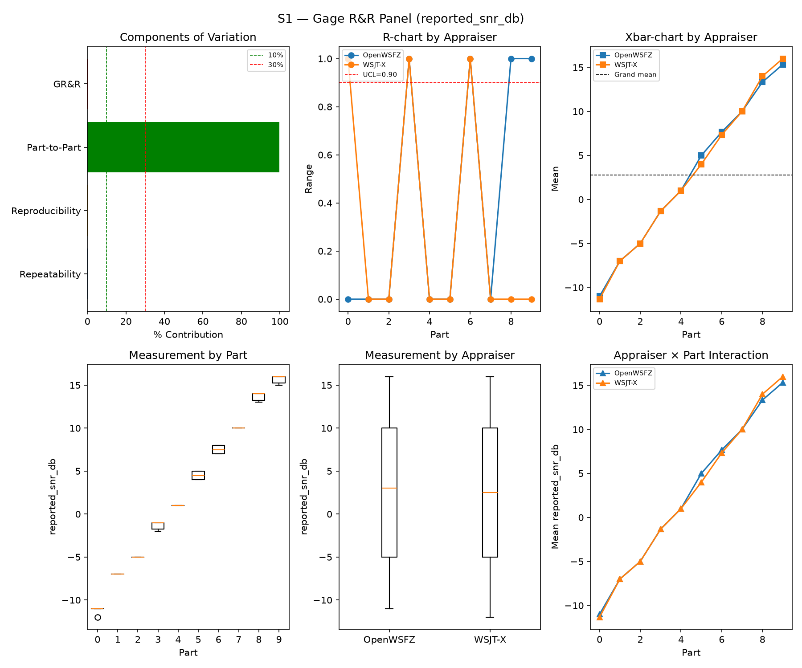
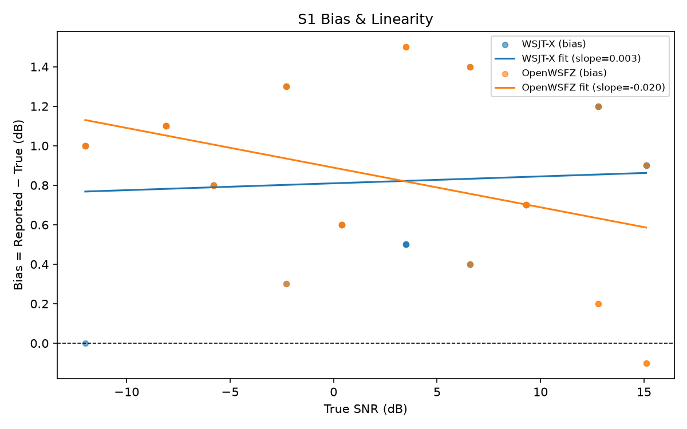
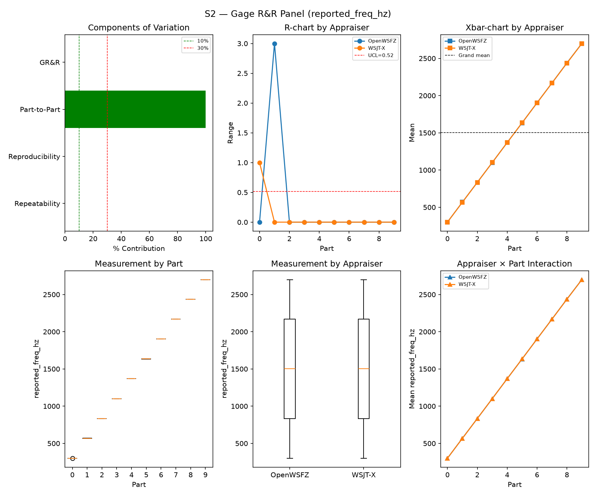
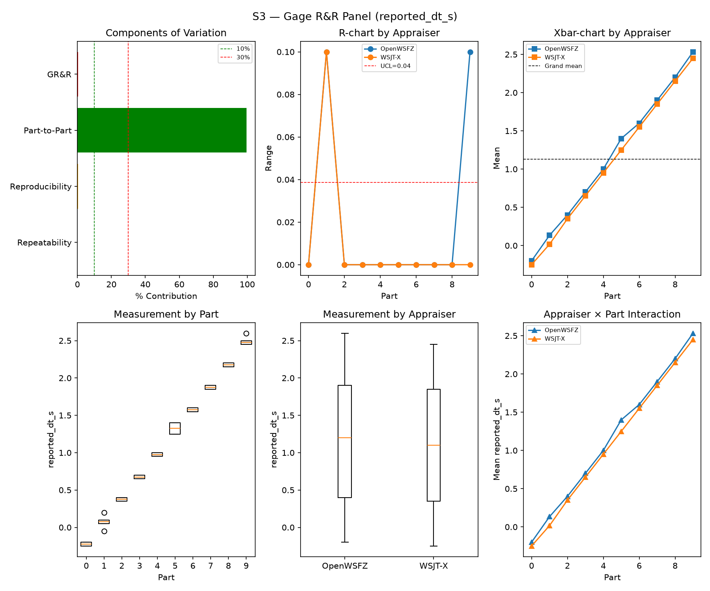
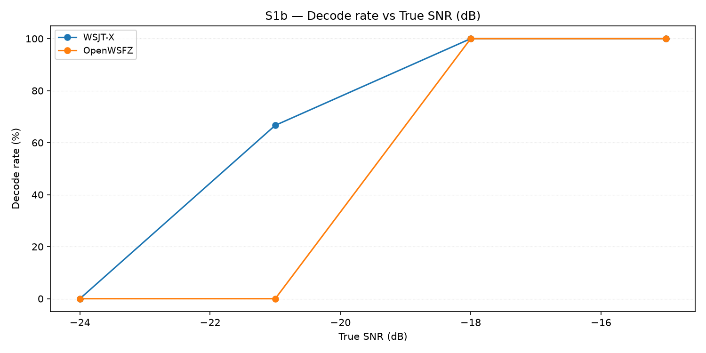
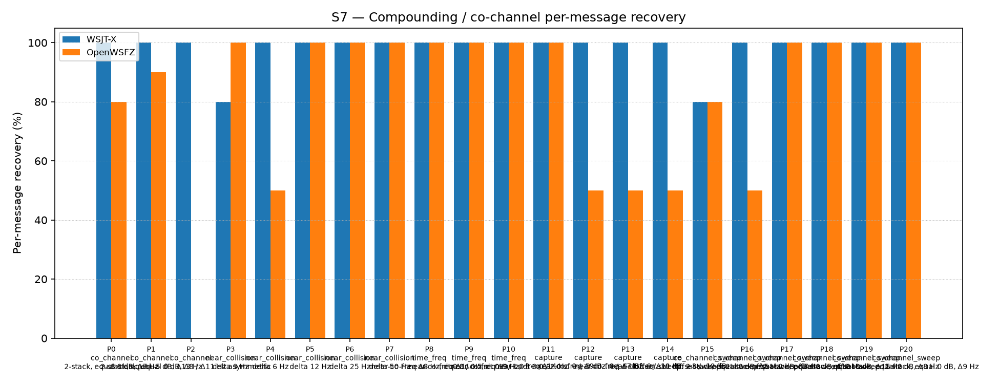
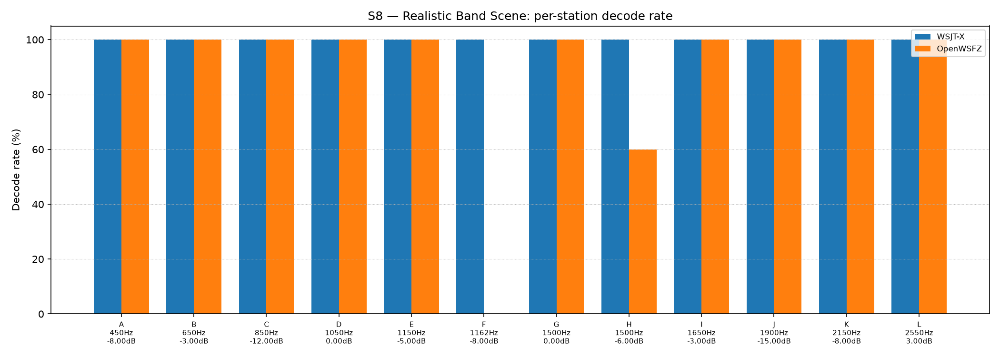

# OpenWSFZ R&R Study Report

| Field | Value |
|---|---|
| Run date | 2026-09-06 |
| OpenWSFZ SHA | `4c7d5ade4f0cd9aa15a2722a96be31ac9ad98761` (`main`, shim `20260050`) |
| WSJT-X version | WSJT-X 2.7.0 (inferred from binary date 2025-02-04) |
| Baseline compared against | `2026-09-03-35378b9` (`results/2026-09-03-35378b9/report.md`) — the last full S1–S8 sweep |

---

## Section 1 — Study Hypothesis

### Purpose

**Status-check sweep**, run against current `main` HEAD (`4c7d5ad`) — the first full S1–S8 routine
cross-check since the persona/worktree migration to nested per-persona git worktrees
(`operational-note-persona-worktrees-2026-09-06.md`) and since the `FP-PARITY` P3→P4b arc closed
(P4b: ROW 3 fires, PARKED — `F−T=5.378 dB` against the 6.0 dB bar, both populations, no dev-task).
Not a treatment-arm test of either event: the worktree migration is docs-only (persona `CLAUDE.md`/
`prompts/*.md` identity blocks) and P3/P4b are measurement/adjudication work against already-frozen
data, neither touching the live decode pipeline. `git diff --stat 35378b9..4c7d5ad -- src/ native/`
confirms the scope: **zero C# source changes**, and native changed only `linux-x64/libft8.so` and
`osx-arm64/libft8.dylib` (shim-version rebuild, `bf21e97`) — **`win-x64/libft8.dll` is byte-identical
to the SHA this study last ran against.** Any metric movement in this report versus `35378b9` is
therefore run-to-run/seed noise or an artefact of the new build/run environment, not a decoder change
— that distinction is checked explicitly in Section 5.

### Build & setup provenance

- **First full sweep run from the new nested QA worktree** (`D:\Projects\claude\OpenWSFZ\worktrees\qa`,
  branch `qa/2026-09-06-idle` @ `4c7d5ad`, itself even with `origin/main`), not the pre-split shared
  tree. Built via a clean `dotnet build src/OpenWSFZ.Daemon/OpenWSFZ.Daemon.csproj -c Release` from
  that worktree (0 warnings, 0 errors). `/api/v1/status` confirmed `shimVersion:20260050` before
  arming.
- **Runtime data paths deliberately kept anchored at the pre-split location**
  (`D:\Projects\claude\OpenWSFZ\` — the Architect's worktree root), not moved into the QA worktree:
  `decodeLog.path`, `logging.directory`, and `cycleAudioArchive.directory` in the live
  `%APPDATA%\OpenWSFZ\config.json` all still point there, matching every prior sweep and
  `run_study.py`'s own hardcoded `OWSFZ_ALL_TXT` constant. This is a deliberate choice, not an
  oversight: `qa/ARTEFACT_INVENTORY.md` and `run_study.py` both assume that location, and worktrees
  split source control, not artefact storage (gitignored data does not travel with a worktree split —
  `operational-note-persona-worktrees-2026-09-06.md`). Only `logging.directory`/
  `cycleAudioArchive.directory`'s dated leaf changed, to `artefacts/2026-09-06-rr-s1s8-4c7d5ad/`.
- **Audio routing per the Captain's setup, verified not assumed.** WSJT-X (`WSJT-X - FT991A` profile,
  restarted fresh, `ALL.TXT` already at 0 lines) confirmed via its own `.ini`
  (`SoundInName=Voicemeeter Out B1 (VB-Audio Voicemeeter VAIO)`, `Mode=FT8`, `MonitorOFF=false`);
  `config.json`'s `audioDeviceFriendlyName` already pointed at the same **Voicemeeter Out B1** device
  (unchanged from the 2026-09-03 session) — cross-checked against `Get-PnpDevice -Class AudioEndpoint`
  to confirm the endpoint GUID is still live (`{8dbb88e8-…}`, matches `config.json` exactly; no stale-
  GUID drift this session). `Voicemeeter AUX Input` (the harness's own playback device, routed to B1
  per the Captain's Voicemeeter setup) confirmed present and unambiguous (single live endpoint).
- **OpenWSFZ's own `ALL.TXT` was NOT already clear** (7 stale lines from the 2026-09-03 run) — backed
  up to `artefacts/_pre-run-backups/ALL.TXT.stale-2026-09-03-backup-before-2026-09-06-run` and
  truncated before arming. `cat.enabled:false` and `tx.autoAnswer:false` confirmed in the live config
  before start — no rig-CAT or auto-answer path was live during this run.
- **Pre-flight verification substituted for the harness's interactive warm-up prompt**, same method as
  every sweep since 2026-09-02 (`_qa_preflight_check.py` — HK-027, reads the instrument's own
  `ALL.TXT` record rather than an operator eyeballing two GUIs). One warm-up cycle (`CQ Q1ABC FN42`,
  +6 dB) via *Voicemeeter AUX Input*; both `ALL.TXT` files confirmed to gain the message. `run_study.py`
  was launched `--skip-warmup --device "Voicemeeter AUX Input"`; the S8-inclusion prompt was answered
  `y` (Captain's explicit choice) to run the full "S1–S8" scope.
- **Harness venv did not survive the worktree split** (gitignored, as expected) and was rebuilt from
  scratch in the QA worktree (`qa/rr-study/.venv`). `requirements.txt` and `RUNBOOK.md`'s checklist
  together do not cover the full dependency set the harness actually needs: `harness/analyse.py`'s
  attribute-agreement step imports `sklearn.metrics.cohen_kappa_score`, undeclared anywhere, which
  crashed the analyser (`ModuleNotFoundError`) after all eight scenarios and every per-scenario
  matcher pass had already completed cleanly. Fixed in-session (`pip install scikit-learn`) and the
  analyser re-run standalone against the already-collected `results/2026-09-06-4c7d5ad/` directory —
  no re-decoding, no data at risk; see Recommendation 4.
- **Single uninterrupted pass, no incidents in the decode battery itself.** All eight scenarios
  (S8, S1, S1b, S2, S3, S4, S5 [parts 0/1], S7) and all eight matcher passes completed with `[OK]`
  and no errors, exceptions, or retries in `rr_study_2026-09-06_run.log`.

## S1 — reported_snr_db

### Variance Components

| Component | σ² | %Contribution |
|---|---|---|
| Repeatability | 0.12 | 0.14% |
| Reproducibility | 0.08 | 0.10% |
| Part-to-Part | 81.36 | 99.76% |
| Total GR&R | 0.19 | 0.24% |
| Total | 81.55 | 100.00% |

### Study Metrics

| Metric | Value | Verdict |
|---|---|---|
| %Contribution (GR&R) | 0.24% | PASS |
| %Tolerance (GR&R) | 26.46% | — |
| %Study Var (GR&R) | 4.88% | — |
| ndc | 28 | PASS |

### Bias & Linearity (S1)

| Appraiser | Mean Bias (dB) | Slope | Intercept | R² | Verdict |
|---|---|---|---|---|---|
| WSJT-X | +0.82 | 0.003 | 0.810 | 0.008 | PASS |
| OpenWSFZ | +0.85 | -0.020 | 0.889 | 0.148 | PASS |

## S2 — reported_freq_hz

### Variance Components

| Component | σ² | %Contribution |
|---|---|---|
| Repeatability | 0.17 | 0.00% |
| Reproducibility | 0.45 | 0.00% |
| Part-to-Part | 652668.00 | 100.00% |
| Total GR&R | 0.62 | 0.00% |
| Total | 652668.62 | 100.00% |

### Study Metrics

| Metric | Value | Verdict |
|---|---|---|
| %Contribution (GR&R) | 0.00% | PASS |
| %Tolerance (GR&R) | 58.90% | — |
| %Study Var (GR&R) | 0.10% | — |
| ndc | 1450 | PASS |

## S3 — reported_dt_s

### Variance Components

| Component | σ² | %Contribution |
|---|---|---|
| Repeatability | 0.00 | 0.06% |
| Reproducibility | 0.00 | 0.34% |
| Part-to-Part | 0.83 | 99.60% |
| Total GR&R | 0.00 | 0.40% |
| Total | 0.83 | 100.00% |

### Study Metrics

| Metric | Value | Verdict |
|---|---|---|
| %Contribution (GR&R) | 0.40% | PASS |
| %Tolerance (GR&R) | 86.96% | — |
| %Study Var (GR&R) | 6.34% | — |
| ndc | 22 | PASS |

> **WSJT-X DT correction applied.** A +0.55 s offset was added to WSJT-X `reported_dt_s` before ANOVA to remove the ≈ −0.55 s convention difference between WSJT-X (DT relative to nominal FT8 TX start) and the harness (DT relative to UTC slot boundary). This correction removes the calibration artefact from SS_appraiser so %GR&R measures genuine app-to-app measurement disagreement. Raw reported values are preserved in the matched CSV. See scenario `wsjt_dt_correction_s` field and R&R-003 (GitHub #1).

## S1b — Low-SNR threshold study

_Decode rate (% of injected messages recovered) at SNRs excluded from the redesigned S1 ladder (−24 to −15 dB).  Companion to S1; separates 'does it decode at this SNR?' from 'how accurately does it measure SNR?'.  Informational — no AIAG threshold._

### Per-part decode rate

| Part | True SNR (dB) | WSJT-X decoded | WSJT-X rate | OpenWSFZ decoded | OpenWSFZ rate |
|---|---|---|---|---|---|
| P0 | -24.00 | 0/3 | 0.00% | 0/3 | 0.00% |
| P1 | -21.00 | 2/3 | 66.67% | 0/3 | 0.00% |
| P2 | -18.00 | 3/3 | 100.00% | 3/3 | 100.00% |
| P3 | -15.00 | 3/3 | 100.00% | 3/3 | 100.00% |

**Overall decode rate — WSJT-X: 66.67%  OpenWSFZ: 50.00%**

## Attribute Agreement Analysis (S4 positives + S5 negatives)

_κ is computed over a pooled population: S4 injected messages (truth = present) and S5 signal-free slots (truth = absent), so the truth vector has both classes. **κ verdicts below are advisory** — the §10 attribute gate is pending Captain ratification of this pooled method._

### Confusion vs truth

| Appraiser | TP | FN | FP | TN | Recovery | Specificity |
|---|---|---|---|---|---|---|
| WSJT-X | 69 | 39 | 0 | 60 | 63.89% | 100.00% |
| OpenWSFZ | 73 | 35 | 3 | 57 | 67.59% | 95.00% |

### Kappa (advisory)

| Pair | κ | 95% CI | Verdict (advisory) |
|---|---|---|---|
| OpenWSFZ_vs_truth | 0.560 | [0.45, 0.67] | FAIL |
| WSJT-X_vs_truth | 0.558 | [0.44, 0.66] | FAIL |
| between_appraisers | 0.746 | — | MARGINAL |

### Within-app repeatability (decision consistency across trials)

| Appraiser | Consistent groups |
|---|---|
| WSJT-X | 81.58% |
| OpenWSFZ | 76.32% |

### Kappa — decodable-SNR-restricted positives (informational, floor -12 dB)

_S4 positives below the decodable-SNR floor are excluded (S5 negatives unchanged); shown alongside the full-population figures above per STUDY-SPEC.md §9.3's second ratification condition. **Informational only — does not affect the §10 gate or the overall verdict.**

| Appraiser | TP | FN | FP | TN | Recovery | Specificity |
|---|---|---|---|---|---|---|
| WSJT-X | 59 | 22 | 0 | 60 | 72.84% | 100.00% |
| OpenWSFZ | 63 | 18 | 3 | 57 | 77.78% | 95.00% |

| Pair | κ | 95% CI | Verdict (informational) |
|---|---|---|---|
| OpenWSFZ_vs_truth | 0.705 | [0.58, 0.81] | MARGINAL |
| WSJT-X_vs_truth | 0.695 | [0.58, 0.80] | FAIL |
| between_appraisers | 0.814 | — | MARGINAL |

### False-positive rate (S5)

| Appraiser | FP events / slots | Event rate | 95% UB | Decode rate | Verdict |
|---|---|---|---|---|---|
| WSJT-X | 0 / 60 | 0.00% | 4.87% | 0.00% | PASS |
| OpenWSFZ | 3 / 60 | 5.00% | 12.42% | 5.00% | FAIL |

_Gate (STUDY-SPEC §10, ratified 2026-07-04, R&R-004): the per-slot FP **event rate**, gated on its one-sided 95% Clopper–Pearson **upper bound** (PASS iff 95% UB ≤ 6%). The UB is defined for all event counts (≈ 3 / N_slots at 0 events) and bounds the true per-slot FP probability at 95% confidence rather than the Poisson-noisy point estimate. Decode rate is reported for reference only. **INFO** means the gate is not evaluated at this N: below 49 slots, even zero observed events cannot clear the 6% ceiling, so no outcome at this sample size can produce a PASS or a meaningful FAIL — see a properly powered run (N ≥ 49) for the ratified §10 verdict._

## S7 — Compounding / co-channel overlap

_Per-message recovery when 2–3 signals occupy the same or near-same audio frequency / time slot (the pileup case S4 does not exercise). Informational — no AIAG threshold is defined for co-channel separation._

### Recovery by overlap family

| Overlap family | WSJT-X | OpenWSFZ |
|---|---|---|
| capture | 100.00% | 62.50% |
| co_channel | 100.00% | 48.57% |
| co_channel_sweep | 96.67% | 88.33% |
| near_collision | 96.00% | 90.00% |
| time_freq | 100.00% | 100.00% |
| **all** | **98.14%** | **79.07%** |

### Capture effect (co-channel, unequal SNR)

| Signal | WSJT-X | OpenWSFZ |
|---|---|---|
| strong | 100.00% | 100.00% |
| weak | 100.00% | 25.00% |

**Between-app per-signal agreement:** 79.07%

### Per-part detail

| Part | Family | Condition | WSJT-X | OpenWSFZ |
|---|---|---|---|---|
| P0 | co_channel | 2-stack, equal 0 dB, Δ7 Hz | 10/10 | 8/10 |
| P1 | co_channel | 2-stack, equal -5 dB, Δ13 Hz | 10/10 | 9/10 |
| P2 | co_channel | 3-stack, equal 0 dB, Δ8 / Δ11 Hz asymmetric | 15/15 | 0/15 |
| P3 | near_collision | delta 3 Hz | 8/10 | 10/10 |
| P4 | near_collision | delta 6 Hz | 10/10 | 5/10 |
| P5 | near_collision | delta 12 Hz | 10/10 | 10/10 |
| P6 | near_collision | delta 25 Hz | 10/10 | 10/10 |
| P7 | near_collision | delta 50 Hz | 10/10 | 10/10 |
| P8 | time_freq | near-co-freq Δ8 Hz, dt 0.0 / 0.5 s | 10/10 | 10/10 |
| P9 | time_freq | near-co-freq Δ11 Hz, dt 0.0 / 1.0 s | 10/10 | 10/10 |
| P10 | time_freq | near-co-freq Δ9 Hz, dt 0.0 / 2.0 s | 10/10 | 10/10 |
| P11 | capture | near-co-freq Δ14 Hz, 0 / -3 dB | 10/10 | 10/10 |
| P12 | capture | near-co-freq Δ9 Hz, 0 / -6 dB | 10/10 | 5/10 |
| P13 | capture | near-co-freq Δ7 Hz, 0 / -10 dB | 10/10 | 5/10 |
| P14 | capture | near-co-freq Δ11 Hz, +3 / -10 dB | 10/10 | 5/10 |
| P15 | co_channel_sweep | offset-sweep: 2-stack, equal 0 dB, Δ5 Hz | 8/10 | 8/10 |
| P16 | co_channel_sweep | offset-sweep: 2-stack, equal 0 dB, Δ7 Hz | 10/10 | 5/10 |
| P17 | co_channel_sweep | offset-sweep: 2-stack, equal 0 dB, Δ10 Hz | 10/10 | 10/10 |
| P18 | co_channel_sweep | offset-sweep: 2-stack, equal 0 dB, Δ15 Hz | 10/10 | 10/10 |
| P19 | co_channel_sweep | offset-sweep: 2-stack, equal 0 dB, Δ8 Hz | 10/10 | 10/10 |
| P20 | co_channel_sweep | offset-sweep: 2-stack, equal 0 dB, Δ9 Hz | 10/10 | 10/10 |

## S8 — Realistic Band Scene

_Holistic decode-rate benchmark: 12 simultaneous stations across 450–2550 Hz at realistic SNR spread (−15 to +3 dB), including a near-collision pair (E/F, 12 Hz apart) and a capture pair (G/H, co-frequency, 6 dB ratio). **Informational only — no PASS/FAIL gate.**_

### Overall decode rate

| Appraiser | Decoded | Injected | Rate |
|---|---|---|---|
| WSJT-X | 60 | 60 | 100.00% |
| OpenWSFZ | 53 | 60 | 88.33% |

**Between-appraiser delta (OpenWSFZ − WSJT-X): -11.7 pp**

### Per-station breakdown

| Stn | Freq (Hz) | SNR (dB) | WSJT-X decoded/total | OpenWSFZ decoded/total |
|---|---|---|---|---|
| A | 450 | -8.00 | 5/5 | 5/5 |
| B | 650 | -3.00 | 5/5 | 5/5 |
| C | 850 | -12.00 | 5/5 | 5/5 |
| D | 1050 | 0.00 | 5/5 | 5/5 |
| E | 1150 | -5.00 | 5/5 | 5/5 |
| F | 1162 | -8.00 | 5/5 | 0/5 |
| G | 1500 | 0.00 | 5/5 | 5/5 |
| H | 1500 | -6.00 | 5/5 | 3/5 |
| I | 1650 | -3.00 | 5/5 | 5/5 |
| J | 1900 | -15.00 | 5/5 | 5/5 |
| K | 2150 | -8.00 | 5/5 | 5/5 |
| L | 2550 | 3.00 | 5/5 | 5/5 |

## Summary

| Metric | Scope | Value | Verdict |
|---|---|---|---|
| %GR&R | S1 | 0.2% | PASS |
| ndc | S1 | 28 | PASS |
| %GR&R | S2 | 0.0% | PASS |
| ndc | S2 | 1450 | PASS |
| %GR&R | S3 | 0.4% | PASS |
| ndc | S3 | 22 | PASS |
| Kappa (advisory) | WSJT-X_vs_truth | 0.558 | FAIL |
| Kappa (advisory) | OpenWSFZ_vs_truth | 0.560 | FAIL |
| Kappa (advisory) | between_appraisers | 0.746 | MARGINAL |
| FP event rate (95% UB) | S5/WSJT-X | 0/60 slots (event 0.0%; 95% UB 4.87%; decode 0.0%) | PASS |
| FP event rate (95% UB) | S5/OpenWSFZ | 3/60 slots (event 5.0%; 95% UB 12.42%; decode 5.0%) | FAIL |
| SNR bias | S1/WSJT-X | +0.82 dB | PASS |
| SNR bias | S1/OpenWSFZ | +0.85 dB | PASS |

**Overall verdict: FAIL**

### Defect Notices

- ❌ FAIL — FP event rate (OpenWSFZ) = 3 events in 60 slots (event rate 5.0%, 95% UB 12.42%); gate requires 95% UB ≤ 6%

---

## Section 5 — Comparison to last full sweep and recommendations

### Comparison table (this run vs. `35378b9`, 2026-09-03)

| Metric | 2026-09-03 | 2026-09-06 (this run) | Δ | Note |
|---|---|---|---|---|
| S1 %GR&R / ndc | 0.21% / 30 | 0.24% / 28 | ~same | PASS both |
| S1 bias, WSJT-X | +0.65 dB | +0.82 dB | +0.17 dB | Still PASS |
| S1 bias, OpenWSFZ | +0.82 dB | +0.85 dB | +0.03 dB | Still PASS |
| S2 %GR&R / ndc | 0.0% / 1576 | 0.0% / 1450 | ndc −126 | %GR&R itself flat 0.0% (saturated either way); trial-count differs slightly by scenario, not a finding |
| S3 %GR&R / ndc | 0.55% / 18 | 0.40% / 22 | improved | Both PASS |
| S1b decode rate, WSJT-X / OpenWSFZ | 58.33% / 50.00% | 66.67% / 50.00% | +8.34pp / same | N=12 (only 4 achievable fractions per part); informational, no threshold |
| Kappa vs truth (WSJT-X / OpenWSFZ) | 0.539 / 0.562 | 0.558 / 0.560 | +0.019 / −0.002 | Both still advisory FAIL, in-family |
| Kappa between appraisers | 0.768 | 0.746 | −0.022 | Still MARGINAL both runs |
| **S5 FP, WSJT-X / OpenWSFZ** | 0/60 PASS / **2/60 FAIL** (95% UB 10.12%) | 0/60 PASS / **3/60 FAIL** (95% UB 12.42%) | One more event, wider UB | Still FAIL against the ratified ≤6% gate — see Finding 1; **not read as new information** (see below) |
| S7 "all" recovery, WSJT-X / OpenWSFZ | 96.28% / 81.40% | 98.14% / 79.07% | +1.86pp / −2.33pp | Both within the historical band (Finding 2) |
| S7 P2 (3-stack co-channel), OpenWSFZ | 0/15 | 0/15 | unchanged | Structural limit persists (open under D-001), waived by Captain 2026-06-22 |
| S8 overall, WSJT-X / OpenWSFZ | 95.00% / 91.67% | 100.00% / 88.33% | +5.00pp / −3.34pp | Both within the historical band (Finding 2) |
| S8 station F (1162 Hz, −8 dB), OpenWSFZ | 0/5 | 0/5 | unchanged | **Tenth consecutive full sweep at this exact zero** — already diagnosed and hard-closed, not re-opened here |
| S8 station H (1500 Hz, −6 dB, capture pair w/ G) | WSJT-X 2/5, OpenWSFZ 5/5 | WSJT-X 5/5, OpenWSFZ 3/5 | **flipped** | Genuine capture-effect contest at a fixed but close margin; which side loses the capture is seed-sensitive by design of the scenario, not a regression signal on either app |

### Finding 1 — S5 false-positive gate: FAIL again, and now explained by a PARKED arm closed the same day, not a fresh mystery

**The number.** OpenWSFZ produced 3 unmatched decodes inside S5's own true 60-slot window,
event rate 5.00%, one-sided 95% Clopper–Pearson upper bound **12.42%**, against the ratified §10 gate
(95% UB ≤ 6%, R&R-004). WSJT-X: 0/60, as in every sweep to date.

**Read against the full N=60 routine-battery history, not just the last sweep.** Every N=60
routine-battery S5 result since R&R-009 (2026-08-27 onward): PASS (`22b749c`, 0/60) → FAIL (`872ba65`,
1/60, UB 7.66%) → FAIL (`3b52608`, 4/60, UB 14.61%) → FAIL (`35378b9`, 2/60, UB 10.12%) →
**FAIL (this run, 3/60, UB 12.42%)** — four FAILs in the last five routine sweeps, one PASS. Across
the full ratified/pre-ratified-gate era, OpenWSFZ has now failed this gate **five times**
(2026-08-22 at N=120, 2026-08-29, 2026-09-02, 2026-09-03, and 2026-09-06) against WSJT-X's **zero**
failures in seventeen full sweeps.

**Not a fresh recommendation this time, and now better understood than at the last sweep.** Since
`35378b9`'s report, `FP-PARITY`'s P3→P4b arc **closed** (2026-09-06, same day as this run):
P3 established the citable offline in-chain rate at **10.325%**; P4b computed the emission-side
excess floor `F = +8.00 dB` against the frozen threshold `T = 2.622 dB`, giving `F − T = 5.378 dB`
on both the five-sweep and four-sweep leave-one-out populations — **below** the 6.0 dB margin bar,
so ROW 3 fires: *"the emission-side floor cannot be set with the project's required margin on the
evidence available, because the genuine population reaches down to within `F − T` dB of the
false-accept ceiling."* **PARKED, not closed** — no dev-task, per that arm's own ROW 3 consequence.
This run's 3/60 (12.42% UB) reading is additional data consistent with that already-parked state, not
a new ask, and not read as a fresh regression signal.

### Finding 2 — S7/S8 recovery deltas vs. last sweep sit inside the established historical band, despite the new build/run environment

Both S7 "all" recovery (79.07% vs. 81.40%) and S8 overall (88.33% vs. 91.67%) moved down slightly from
`35378b9`. Per Section 1, `win-x64/libft8.dll` is byte-identical between the two runs, so this is not a
decoder change. Checked against the fuller history in Section 6: OpenWSFZ's S7 "all" recovery since
2026-08-27 has ranged 78.6–83.7%, and S8 overall has ranged 83.3–91.7% — **today's readings (79.07%,
88.33%) sit inside both bands.** Recorded here explicitly, because this is the first sweep run from
the new nested QA worktree and against a freshly rebuilt venv, and a departure from the historical band
would have been the first thing to check for an environment-induced artefact; there is none to report.

### Recommendations

1. **No fresh action on the S5 AWGN false-positive rate** (Finding 1) — `FP-PARITY` P4b already parked
   this exact question today; this run's 3/60 is additional evidence for that closed-but-parked state,
   not a new ask.
2. **No action on Station F or the S7/S8 recovery deltas** (Finding 2) — Station F already diagnosed
   and hard-closed; the recovery deltas sit inside the established historical band.
3. **`requirements.txt` is missing `scikit-learn`, `pandas`, `matplotlib`, and `sounddevice`** — all
   four are hard runtime dependencies of `harness/analyse.py`/`harness/run_scenario.py`/
   `harness/warmup.py` but only `numpy`/`scipy`/`pytest` are declared. This cost real time today (a
   full battery ran to completion before the analyser crashed on the undeclared `sklearn` import) and
   will recur for the Developer worktree or any future from-scratch venv. Proposed fix is a one-line
   `requirements.txt` addition — QA's own harness tooling, not `src/`, no HK-011 engagement.
4. **Scope `matcher.py`'s false-positive detection to each scenario's own injection-cycle window**
   (carried over from every report since `872ba65`, still not touched) — not re-verified this run, but
   nothing here suggests it has been addressed.
5. **NFR-021 — completed as part of this report.** `owsfz-all.txt` and every per-scenario
   `*_matched.csv` in this run directory contained 27 occurrences of 27 distinct noise-hallucinated,
   callsign-shaped decoder-output tokens (S5/S7/S8 windows bleeding into every scenario's matched CSV
   via the unscoped-matcher defect, Recommendation 4 above — RUNBOOK.md §7.5's documented phenomenon)
   — redacted via `qa/rr-study/redact_s1s8_20260906_decodes.py` (imports the project's own
   `nfr021_pre_merge_scan.py` scanner rather than reimplementing it, HK-022), guarded against this
   run's own `truth.csv` `message_text` column before rewriting (0 of 27 flagged tokens matched an
   injected message), and confirmed 0 remaining after rewrite. See `REDACTION-MAP.md` in this
   directory for the token-fingerprint mapping. `report.md`, `wsjt-all.txt`, and `truth.csv` were
   scanned clean (0 flagged tokens) and left byte-identical.
6. **QA does not commit, merge, or push the result directory from this run** without the Captain's
   go-ahead — standing rule, unchanged.

---

## Section 6 — Historical trend: every full S1–S8 sweep to date

All seventeen runs that exercised the complete controlled battery (S1/S2/S3/S7 at minimum), oldest
first. `%GR&R` is each stage's own Summary-table figure (AIAG %Contribution, threshold ≤ 10% PASS). S5
FP is the value the sweep's own report used to gate PASS/FAIL (95% UB where computed, else the plain
event/decode rate for older entries — see the caveats below). S7/S8 are the "all"/overall
decode-recovery percentages.

| Date | SHA | S1 %GR&R | S2 %GR&R | S3 %GR&R | S5 FP (WSJT-X / OpenWSFZ) | S7 recovery (WSJT-X / OpenWSFZ) | S8 decode rate (WSJT-X / OpenWSFZ) |
|---|---|---|---|---|---|---|---|
| 2026-06-06 | `4c34ef6` | 32.0% **FAIL** | 0.0% | 3.8% | 0.0% / 0.0% | 78.5% / 47.3% | — |
| 2026-06-06 | `6bab388` | 6.5% | 0.0% | 3.9% | 0.0% / 0.0% | 77.4% / 46.2% | — |
| 2026-06-07 | `4b3a4ca` | 1.4% | 0.0% | 3.4% | 0.0% / 0.0% | 76.3% / 54.8% | 95.0% / 86.7% |
| 2026-06-14 | `815b652` | 0.3% | 0.0% | 3.0% | 0.0% / 0.0% | 77.4% / 50.5% | 95.0% / 83.3% |
| 2026-06-20 | `6e821fa` | 0.4% | 0.0% | 3.0% | 0.0% / **91.7% FAIL**¹ | 92.6% / 70.2% | 93.3% / 86.7% |
| 2026-06-22 | `f11f438` | 0.4% | 0.0% | 3.1% | 0.0% / 0.0% | 93.9% / 74.4% | 93.3% / 86.7% |
| 2026-07-04 | `793a298` | 0.5% | 0.0% | 3.4% | 0.0% / 0.0% | 96.3% / 73.0% | 93.3% / 86.7% |
| 2026-08-05 | `3bd4cd0` | 7.2% | 0.0% | 3.6% | 0.0% / 0.0% | 96.3% / 70.2% | 93.3% / 83.3% |
| 2026-08-15 | `8d6e1b1` | 0.5% | 0.0% | 1.4% | 0.0% / 0.8% | 95.3% / 74.4% | 93.3% / 86.7% |
| 2026-08-21 | `7d36038` | 0.3% | 0.0% | 0.4% | 0.0% / 0.8% | 95.3% / 68.4% | 96.7% / 83.3% |
| 2026-08-22 | `f5dec23` | 0.4% | 0.0% | 0.4% | 0.0% / **3.3% FAIL**² | 98.1% / 79.5% | 91.7% / 91.7% |
| 2026-08-27 | `22b749c` | 0.3% | 0.0% | 0.4% | 0.0% / 0.0% | 97.7% / 78.6% | 96.7% / 91.7% |
| 2026-08-29 | `872ba65` | 0.25% | 0.0% | 18.65%³ | 0.0% / **7.66% FAIL** | 93.0% / 74.0% | 96.7% / 91.7% |
| 2026-08-30/31 | `2e60949` | 0.27% | 0.0% | 0.44% | 0.0% / 5.15%⁴ | 98.1% / 82.8%⁵ | 91.7% / 91.7% |
| 2026-09-02 | `3b52608` | 0.22% | 0.0% | 0.55% | 0.0% / **14.61% FAIL** | 94.4% / 83.7% | 100.0% / 91.7% |
| 2026-09-03 | `35378b9` | 0.21% | 0.0% | 0.55% | 0.0% / **10.12% FAIL** | 96.3% / 81.4% | 95.0% / 91.7% |
| **2026-09-06** | **`4c7d5ad`** | **0.24%** | **0.0%** | **0.40%** | **0.0% / 12.42% FAIL** | **98.1% / 79.1%** | **100.0% / 88.3%** |

¹ Plain decode-rate era (pre R&R-004 ratified UB gate); not the same metric as later rows, fixed
under D-009. Not comparable to the UB figures below it.

² Second-ever ratified-gate FAIL, N=120 (pre R&R-009 default restriction).

³ Not comparable to the S1–S3 series above it — confounded by a harness playback-timing defect
discovered in that same run (`872ba65`'s Section 5, Finding 1), not a decoder result.

⁴ N=120 (`resume_study.py` artefact — R&R-009's N=60 restriction not applied on resume, that report's
Section 1 item 3), not the routine N=60 battery. PASS at this N; not directly comparable to the N=60
rows around it.

⁵ S7 figure is from a 2026-08-31 targeted re-run (`results/2026-08-31-2e60949/`), same SHA — the
original 2026-08-30 attempt collapsed mid-scenario to an audio-chain fault, fixed, and re-run clean.

**Reading it:** seventeen full sweeps now, seven ratified/pre-ratified S5 FP failures to date, all on
OpenWSFZ's side, none on WSJT-X's in any sweep — and four of the last five N=60 routine sweeps have
now failed the gate (`872ba65`, `3b52608`, `35378b9`, this run), against one PASS (`22b749c`) in that
same window. This run's S1/S2/S3 GR&R figures sit comfortably inside their established PASS bands
(S3 in fact improved slightly, 0.55%→0.40%), and both S7/S8 decode-recovery figures are in-family with
the post-`22b749c` history (S7 OpenWSFZ 78.6–83.7% band, S8 OpenWSFZ 83.3–91.7% band) — the
worktree migration, the `FP-PARITY` P3/P4b work, and the non-Windows native rebuild did not move any
routine mechanical gate outside history. The S5 false-positive gate is now the **only** persistently
failing routine metric, and as of today it carries a PARKED (not closed) explanation from `FP-PARITY`
rather than an open mystery — see Finding 1.
