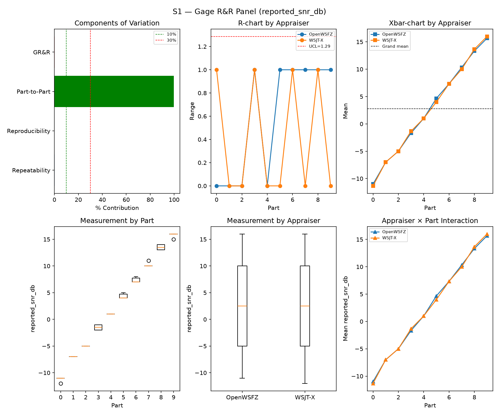
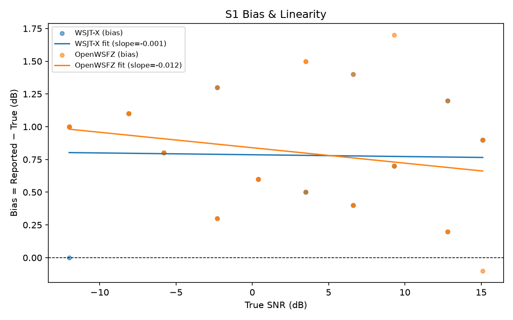
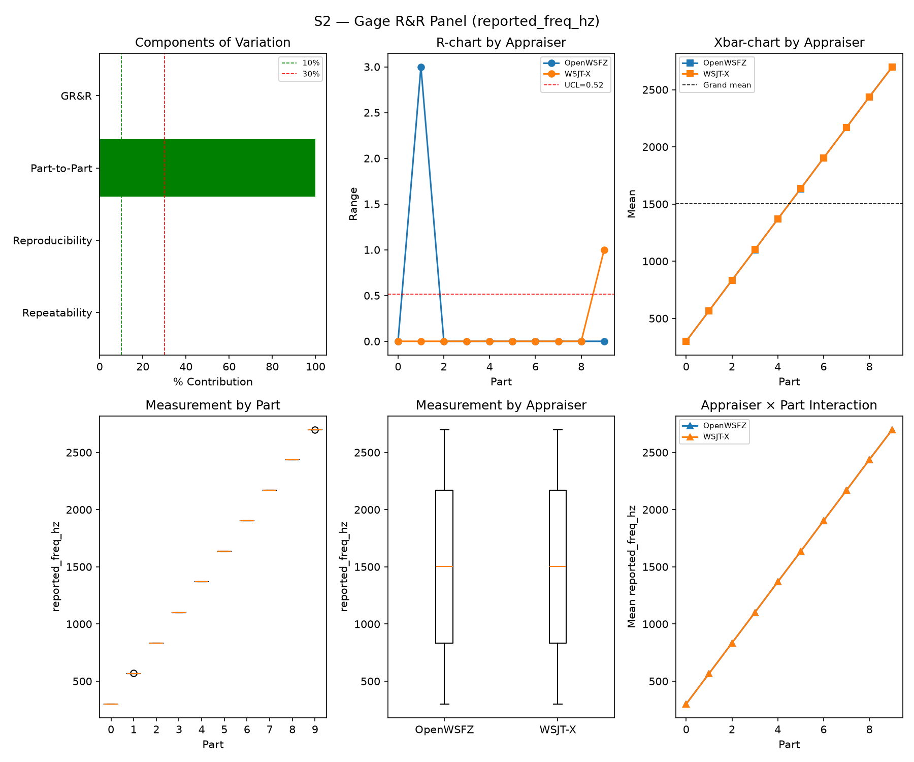
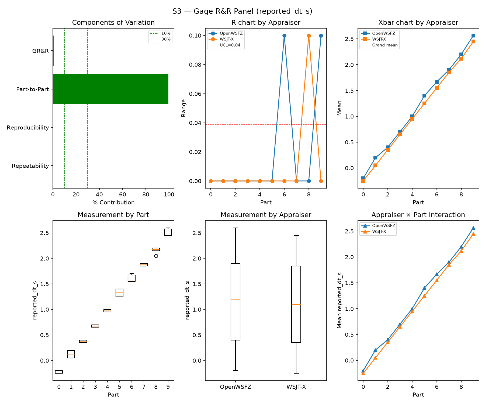
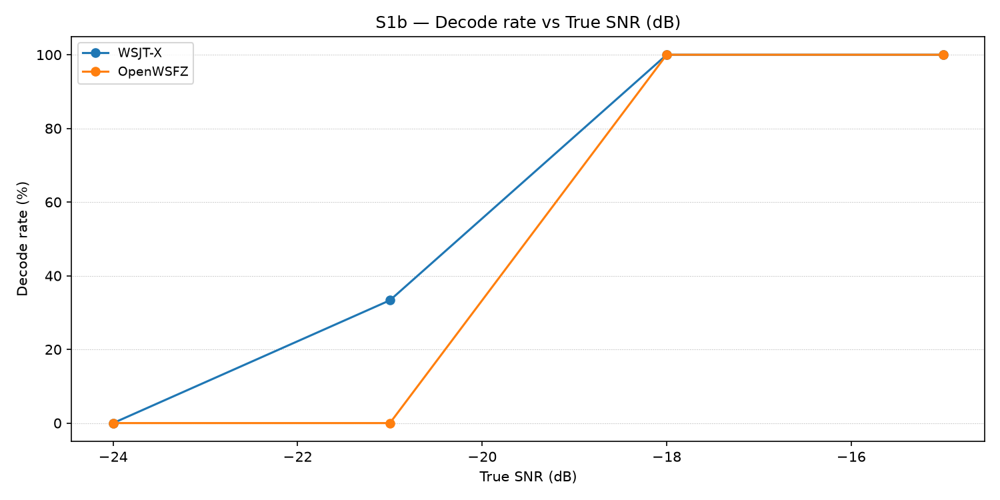
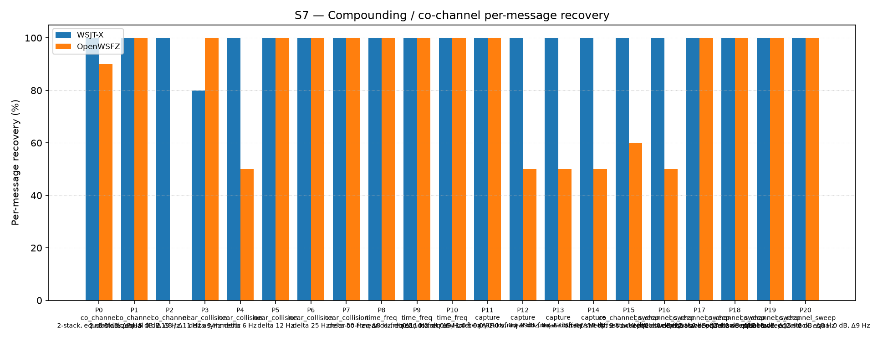

# OpenWSFZ R&R Study Report

| Field | Value |
|---|---|
| Run date | 2026-09-07 |
| OpenWSFZ SHA | `4cc1984c8082ce1f07d7569d96ce74d6f504e1c6` |
| WSJT-X version | WSJT-X 2.7.0 (inferred from binary date 2025-02-04) |

## Section 1 — Study hypothesis

**Purpose of this run.** Routine R&R battery (S1, S1b, S2, S3, S4, S5, S7, S8) against the
current local `main`-equivalent build (`4cc1984`, content-identical to `origin/main`'s squashed
`65d4fff` from PR #144). No new defect ID was under investigation going in — this was a
housekeeping sweep against the latest binary, requested by the Captain.

**What makes this run structurally different from every predecessor.** This is **the first live
S1–S8 battery to exercise the S5-GATE-SIZING Amendment 1 population (R&R-010, `STUDY-SPEC.md`
§16, implemented 2026-09-06, PR #144)** — Gate A (AWGN, parts 0/1, N=120, ratified 6% UB
ceiling) and Check B (narrowband, parts 2/3, N=60, FAIL iff ≥2 events) scored as two separate,
never-pooled verdicts instead of one. The board had flagged this as open: *"Next real S1–S8
sweep is the first to exercise Gate A/Check B live... Section 6 needs its footnote then."* This
is that sweep.

**Null hypotheses in scope.**
- H0(Gate A): OpenWSFZ's per-slot AWGN false-positive probability is ≤ 6% (95% UB, N=120).
- H0(Check B): the narrowband-hallucination event count on 60 covered slots is < 2.
- No hypothesis on S1/S2/S3/S4/S7/S8 was pre-registered for this run; those sections are
  reported for trend continuity only.

**What would constitute a meaningful result.** A Gate A FAIL is meaningful on its own terms —
it is a ratified, mechanical gate, not a descriptive statistic — but whether it represents a
*new* regression or a *persisting* one is a question for the historical series (Section 6), not
this run in isolation (HK-031).

## S1 — reported_snr_db

### Variance Components

| Component | σ² | %Contribution |
|---|---|---|
| Repeatability | 0.17 | 0.20% |
| Reproducibility | 0.00 | 0.00% |
| Part-to-Part | 81.66 | 99.80% |
| Total GR&R | 0.17 | 0.20% |
| Total | 81.83 | 100.00% |

### Study Metrics

| Metric | Value | Verdict |
|---|---|---|
| %Contribution (GR&R) | 0.20% | PASS |
| %Tolerance (GR&R) | 24.49% | — |
| %Study Var (GR&R) | 4.51% | — |
| ndc | 31 | PASS |

### Bias & Linearity (S1)

| Appraiser | Mean Bias (dB) | Slope | Intercept | R² | Verdict |
|---|---|---|---|---|---|
| WSJT-X | +0.78 | -0.001 | 0.786 | 0.001 | PASS |
| OpenWSFZ | +0.82 | -0.012 | 0.840 | 0.056 | PASS |

## S2 — reported_freq_hz

### Variance Components

| Component | σ² | %Contribution |
|---|---|---|
| Repeatability | 0.17 | 0.00% |
| Reproducibility | 0.36 | 0.00% |
| Part-to-Part | 652905.07 | 100.00% |
| Total GR&R | 0.53 | 0.00% |
| Total | 652905.61 | 100.00% |

### Study Metrics

| Metric | Value | Verdict |
|---|---|---|
| %Contribution (GR&R) | 0.00% | PASS |
| %Tolerance (GR&R) | 54.68% | — |
| %Study Var (GR&R) | 0.09% | — |
| ndc | 1562 | PASS |

## S3 — reported_dt_s

### Variance Components

| Component | σ² | %Contribution |
|---|---|---|
| Repeatability | 0.00 | 0.06% |
| Reproducibility | 0.00 | 0.53% |
| Part-to-Part | 0.82 | 99.41% |
| Total GR&R | 0.00 | 0.59% |
| Total | 0.83 | 100.00% |

### Study Metrics

| Metric | Value | Verdict |
|---|---|---|
| %Contribution (GR&R) | 0.59% | PASS |
| %Tolerance (GR&R) | 105.18% | — |
| %Study Var (GR&R) | 7.70% | — |
| ndc | 18 | PASS |

> **WSJT-X DT correction applied.** A +0.55 s offset was added to WSJT-X `reported_dt_s` before ANOVA to remove the ≈ −0.55 s convention difference between WSJT-X (DT relative to nominal FT8 TX start) and the harness (DT relative to UTC slot boundary). This correction removes the calibration artefact from SS_appraiser so %GR&R measures genuine app-to-app measurement disagreement. Raw reported values are preserved in the matched CSV. See scenario `wsjt_dt_correction_s` field and R&R-003 (GitHub #1).

## S1b — Low-SNR threshold study

_Decode rate (% of injected messages recovered) at SNRs excluded from the redesigned S1 ladder (−24 to −15 dB).  Companion to S1; separates 'does it decode at this SNR?' from 'how accurately does it measure SNR?'.  Informational — no AIAG threshold._

### Per-part decode rate

| Part | True SNR (dB) | WSJT-X decoded | WSJT-X rate | OpenWSFZ decoded | OpenWSFZ rate |
|---|---|---|---|---|---|
| P0 | -24.00 | 0/3 | 0.00% | 0/3 | 0.00% |
| P1 | -21.00 | 1/3 | 33.33% | 0/3 | 0.00% |
| P2 | -18.00 | 3/3 | 100.00% | 3/3 | 100.00% |
| P3 | -15.00 | 3/3 | 100.00% | 3/3 | 100.00% |

**Overall decode rate — WSJT-X: 58.33%  OpenWSFZ: 50.00%**

## Attribute Agreement Analysis (S4 positives + S5 negatives)

_κ is computed over a pooled population: S4 injected messages (truth = present) and S5 signal-free slots (truth = absent), so the truth vector has both classes. **κ verdicts below are advisory** — the §10 attribute gate is pending Captain ratification of this pooled method._

### Confusion vs truth

| Appraiser | TP | FN | FP | TN | Recovery | Specificity |
|---|---|---|---|---|---|---|
| WSJT-X | 62 | 46 | 0 | 180 | 57.41% | 100.00% |
| OpenWSFZ | 73 | 35 | 3 | 177 | 67.59% | 98.33% |

### Kappa (advisory)

| Pair | κ | 95% CI | Verdict (advisory) |
|---|---|---|---|
| OpenWSFZ_vs_truth | 0.701 | [0.62, 0.79] | MARGINAL |
| WSJT-X_vs_truth | 0.628 | [0.53, 0.72] | FAIL |
| between_appraisers | 0.810 | — | MARGINAL |

### Within-app repeatability (decision consistency across trials)

| Appraiser | Consistent groups |
|---|---|
| WSJT-X | 75.00% |
| OpenWSFZ | 85.00% |

### Kappa — decodable-SNR-restricted positives (informational, floor -12 dB)

_S4 positives below the decodable-SNR floor are excluded (S5 negatives unchanged); shown alongside the full-population figures above per STUDY-SPEC.md §9.3's second ratification condition. **Informational only — does not affect the §10 gate or the overall verdict.**

| Appraiser | TP | FN | FP | TN | Recovery | Specificity |
|---|---|---|---|---|---|---|
| WSJT-X | 54 | 27 | 0 | 180 | 66.67% | 100.00% |
| OpenWSFZ | 66 | 15 | 3 | 177 | 81.48% | 98.33% |

| Pair | κ | 95% CI | Verdict (informational) |
|---|---|---|---|
| OpenWSFZ_vs_truth | 0.832 | [0.75, 0.90] | MARGINAL |
| WSJT-X_vs_truth | 0.734 | [0.65, 0.82] | MARGINAL |
| between_appraisers | 0.820 | — | MARGINAL |

### False-positive rate (S5) — Gate A (AWGN, parts 0/1)

| Appraiser | FP events / slots | Event rate | 95% UB | Decode rate | Verdict |
|---|---|---|---|---|---|
| WSJT-X | 0 / 120 | 0.00% | 2.47% | 0.00% | PASS |
| OpenWSFZ | 3 / 120 | 2.50% | 6.33% | 2.50% | FAIL |

_Gate (STUDY-SPEC §10, ratified 2026-07-04, R&R-004; population re-affirmed S5-GATE-SIZING Amendment 1, 2026-09-06): the per-slot FP **event rate** on AWGN slots (parts 0/1) ONLY, gated on its one-sided 95% Clopper–Pearson **upper bound** (PASS iff 95% UB ≤ 6%). The UB is defined for all event counts (≈ 3 / N_slots at 0 events) and bounds the true per-slot FP probability at 95% confidence rather than the Poisson-noisy point estimate. Decode rate is reported for reference only. **INFO** means the gate is not evaluated at this N: below 49 slots, even zero observed events cannot clear the 6% ceiling, so no outcome at this sample size can produce a PASS or a meaningful FAIL — see a properly powered run (N ≥ 49) for the ratified §10 verdict. **Never pooled with Check B below** — see that table's own note._

### False-positive rate (S5) — Check B (narrowband, parts 2/3)

| Appraiser | FP events / slots | Verdict |
|---|---|---|
| WSJT-X | 0 / 60 | PASS |
| OpenWSFZ | 0 / 60 | PASS |

_Check (S5-GATE-SIZING Amendment 1, PO ruling Option 3, 2026-09-06 20:29 UTC): a coverage net for narrowband hallucination (steady carrier / birdies), scored on its OWN 60-slot denominator — FAIL iff events ≥ 2. Threshold derived in the spec's A1.2 from the measured all-history per-slot narrowband base rate (0.2347%, `s5_narrowband_exposure_verify.py`, ROW 0 cleared 2026-09-06), well under the ~1% re-derivation trigger. This is a raw event-count check, not a Clopper–Pearson UB gate, so there is no STATISTICAL small-N demotion analogous to `MIN_N_FOR_FP_GATE` — but **INFO** here means something distinct: zero narrowband slots were injected at all (Check B did not run this battery, e.g. a targeted `--parts 0,1` recheck). That is a coverage gap, never a PASS — asserting PASS with no slots run would reproduce the exact blindness this design exists to remove. **Never pooled with Gate A above into one S5 rate or one verdict line** — the same 180 slots scored as one gate detect a regression 21% of the time; scored as two, Gate A alone detects it 77% of the time._

## S7 — Compounding / co-channel overlap

_Per-message recovery when 2–3 signals occupy the same or near-same audio frequency / time slot (the pileup case S4 does not exercise). Informational — no AIAG threshold is defined for co-channel separation._

### Recovery by overlap family

| Overlap family | WSJT-X | OpenWSFZ |
|---|---|---|
| capture | 100.00% | 62.50% |
| co_channel | 100.00% | 54.29% |
| co_channel_sweep | 100.00% | 85.00% |
| near_collision | 96.00% | 90.00% |
| time_freq | 100.00% | 100.00% |
| **all** | **99.07%** | **79.07%** |

### Capture effect (co-channel, unequal SNR)

| Signal | WSJT-X | OpenWSFZ |
|---|---|---|
| strong | 100.00% | 100.00% |
| weak | 100.00% | 25.00% |

**Between-app per-signal agreement:** 78.14%

### Per-part detail

| Part | Family | Condition | WSJT-X | OpenWSFZ |
|---|---|---|---|---|
| P0 | co_channel | 2-stack, equal 0 dB, Δ7 Hz | 10/10 | 9/10 |
| P1 | co_channel | 2-stack, equal -5 dB, Δ13 Hz | 10/10 | 10/10 |
| P2 | co_channel | 3-stack, equal 0 dB, Δ8 / Δ11 Hz asymmetric | 15/15 | 0/15 |
| P3 | near_collision | delta 3 Hz | 8/10 | 10/10 |
| P4 | near_collision | delta 6 Hz | 10/10 | 5/10 |
| P5 | near_collision | delta 12 Hz | 10/10 | 10/10 |
| P6 | near_collision | delta 25 Hz | 10/10 | 10/10 |
| P7 | near_collision | delta 50 Hz | 10/10 | 10/10 |
| P8 | time_freq | near-co-freq Δ8 Hz, dt 0.0 / 0.5 s | 10/10 | 10/10 |
| P9 | time_freq | near-co-freq Δ11 Hz, dt 0.0 / 1.0 s | 10/10 | 10/10 |
| P10 | time_freq | near-co-freq Δ9 Hz, dt 0.0 / 2.0 s | 10/10 | 10/10 |
| P11 | capture | near-co-freq Δ14 Hz, 0 / -3 dB | 10/10 | 10/10 |
| P12 | capture | near-co-freq Δ9 Hz, 0 / -6 dB | 10/10 | 5/10 |
| P13 | capture | near-co-freq Δ7 Hz, 0 / -10 dB | 10/10 | 5/10 |
| P14 | capture | near-co-freq Δ11 Hz, +3 / -10 dB | 10/10 | 5/10 |
| P15 | co_channel_sweep | offset-sweep: 2-stack, equal 0 dB, Δ5 Hz | 10/10 | 6/10 |
| P16 | co_channel_sweep | offset-sweep: 2-stack, equal 0 dB, Δ7 Hz | 10/10 | 5/10 |
| P17 | co_channel_sweep | offset-sweep: 2-stack, equal 0 dB, Δ10 Hz | 10/10 | 10/10 |
| P18 | co_channel_sweep | offset-sweep: 2-stack, equal 0 dB, Δ15 Hz | 10/10 | 10/10 |
| P19 | co_channel_sweep | offset-sweep: 2-stack, equal 0 dB, Δ8 Hz | 10/10 | 10/10 |
| P20 | co_channel_sweep | offset-sweep: 2-stack, equal 0 dB, Δ9 Hz | 10/10 | 10/10 |

## S8 — Realistic Band Scene

_Holistic decode-rate benchmark: 12 simultaneous stations across 450–2550 Hz at realistic SNR spread (−15 to +3 dB), including a near-collision pair (E/F, 12 Hz apart) and a capture pair (G/H, co-frequency, 6 dB ratio). **Informational only — no PASS/FAIL gate.**_

### Overall decode rate

| Appraiser | Decoded | Injected | Rate |
|---|---|---|---|
| WSJT-X | 55 | 60 | 91.67% |
| OpenWSFZ | 55 | 60 | 91.67% |

**Between-appraiser delta (OpenWSFZ − WSJT-X): +0.0 pp**

### Per-station breakdown

| Stn | Freq (Hz) | SNR (dB) | WSJT-X decoded/total | OpenWSFZ decoded/total |
|---|---|---|---|---|
| A | 450 | -8.00 | 5/5 | 5/5 |
| B | 650 | -3.00 | 5/5 | 5/5 |
| C | 850 | -12.00 | 5/5 | 5/5 |
| D | 1050 | 0.00 | 5/5 | 5/5 |
| E | 1150 | -5.00 | 5/5 | 5/5 |
| F | 1162 | -8.00 | 5/5 | 0/5 |
| G | 1500 | 0.00 | 5/5 | 5/5 |
| H | 1500 | -6.00 | 0/5 | 5/5 |
| I | 1650 | -3.00 | 5/5 | 5/5 |
| J | 1900 | -15.00 | 5/5 | 5/5 |
| K | 2150 | -8.00 | 5/5 | 5/5 |
| L | 2550 | 3.00 | 5/5 | 5/5 |

## Summary

| Metric | Scope | Value | Verdict |
|---|---|---|---|
| %GR&R | S1 | 0.2% | PASS |
| ndc | S1 | 31 | PASS |
| %GR&R | S2 | 0.0% | PASS |
| ndc | S2 | 1562 | PASS |
| %GR&R | S3 | 0.6% | PASS |
| ndc | S3 | 18 | PASS |
| Kappa (advisory) | WSJT-X_vs_truth | 0.628 | FAIL |
| Kappa (advisory) | OpenWSFZ_vs_truth | 0.701 | MARGINAL |
| Kappa (advisory) | between_appraisers | 0.810 | MARGINAL |
| FP event rate (95% UB), Gate A | S5/WSJT-X | 0/120 slots (event 0.0%; 95% UB 2.47%; decode 0.0%) | PASS |
| FP event rate (95% UB), Gate A | S5/OpenWSFZ | 3/120 slots (event 2.5%; 95% UB 6.33%; decode 2.5%) | FAIL |
| FP events, Check B (narrowband) | S5/WSJT-X | 0/60 slots (FAIL iff >= 2) | PASS |
| FP events, Check B (narrowband) | S5/OpenWSFZ | 0/60 slots (FAIL iff >= 2) | PASS |
| SNR bias | S1/WSJT-X | +0.78 dB | PASS |
| SNR bias | S1/OpenWSFZ | +0.82 dB | PASS |

**Overall verdict: FAIL**

### Defect Notices

- ❌ FAIL — FP event rate Gate A (OpenWSFZ) = 3 events in 120 slots (event rate 2.5%, 95% UB 6.33%); gate requires 95% UB ≤ 6%

## Section 5 — Recommendations

**Gate A FAIL — the only merge-relevant finding this run.**

- **Defect classification:** OpenWSFZ AWGN false-positive rate, S5 parts 0/1 (existing thread —
  not new. See Section 6). All three flagged events are noise-floor CRC coincidences at −26,
  −26 and −27 dB true SNR (RUNBOOK.md §7.5's documented phenomenon), confirmed by direct
  inspection of `S5_matched.csv` scoped to Gate A's own `cycle_utc` window
  (2026-09-07T19:11:00Z–19:42:00Z) — not bleed-through from an adjacent scenario. All three fall
  in **part 1** (none in part 0). WSJT-X registered **zero** false positives across the same 120
  slots, as it has in every routine sweep to date — the control stays clean, so this is not a
  harness/routing artefact common to both appraisers.
- **Hypothesis:** unchanged from the standing `FP-PARITY`/`FP-REGRESSION` threads — no new
  mechanism is proposed here. This run's contribution is a properly-powered (N=120) data point
  under the R&R-010 design, not a diagnosis.
- **Next diagnostic step:** this is an Architect ruling, not a QA call (HK-015). Per HK-031, the
  Architect should read Section 6 below before ruling on whether this constitutes a fresh
  regression, a continuation of an already-open thread, or noise at this N. QA takes no gating
  action beyond reporting — no `src/` change is proposed from this run alone.
- **Not itself actionable:** S1b, S4/S5-pooled κ, and S7 P2 (OpenWSFZ 0/15, `co_channel` 3-stack)
  repeat prior, already-tracked observations (`NBR-A`, `FP-PARITY` P4b, S7 stability threads) and
  are not new findings of this run.

**Housekeeping note (not a defect):** `harness/matcher.py` attributes *any* unmatched decode
anywhere in the session's `ALL.TXT` to *every* scenario's own false-positive count (confirmed
directly — the S8-scenario warm-up decode and all 26 session-wide hallucinated tokens appear
identically in all eight `S*_matched.csv` files' raw FP lists). `harness/analyse.py`'s Gate
A/Check B computation correctly re-scopes by `cycle_utc` membership against each part's own
truth rows (this is the same fix R&R-010 already made for the part-index NaN defect), so the
**reported gate verdicts are unaffected** — this note is for whoever next reads a raw
`*_matched.csv` "FP" count directly and wonders why every scenario's count is inflated by the
same session-wide total.

## Section 6 — Extended historical trend

**S1/S2/S3 (GR&R, informational):** consistent with the full run history in `trend.csv` —
%GR&R and ndc remain comfortably PASS-range across every dated entry since the 2026-07-04 S1
redesign; no trend concern.

**S5 Gate A / Check B — read this against R&R-010's own instruction (`STUDY-SPEC.md` §16):
*"the S5 FP column now spans three denominator classes... normalise any cross-era rate
comparison per AWGN slot first — never read the column directly across a denominator change."***
Each row below is quoted from its own report's gate line (never inferred from date, per the
standing warning that the run report is the sole authority for which era it belongs to):

| Date | SHA | Design | OpenWSFZ Gate A | Verdict |
|---|---|---|---|---|
| 2026-08-27 | `22b749c` | R&R-009, N=60 | 0/60 (UB 4.87%) | PASS |
| 2026-08-29 | `872ba65` | R&R-009, N=60 | 1/60 (UB 7.66%) | FAIL |
| 2026-08-30 | `2e60949` | targeted, N=120 | 2/120 (UB 5.15%) | PASS |
| 2026-09-02 | `3b52608` | R&R-009, N=60 | 4/60 (UB 14.61%) | FAIL |
| 2026-09-03 | `35378b9` | R&R-009, N=60 | 2/60 (UB 10.12%) | FAIL |
| 2026-09-06 | `4c7d5ad` | targeted, N=60 (R&R-010 trigger) | 3/60 (no full report — targeted run) | FAIL |
| **2026-09-07** | **`4cc1984`** | **R&R-010, N=120 (first live Gate A)** | **3/120 (UB 6.33%)** | **FAIL** |

**Reading this series, not just this row:** Gate A (or its R&R-009-era predecessor scored on the
same AWGN population) has now FAILED in **four of the last five dated observations**, the one
PASS (2026-08-30) being a targeted N=120 run, not the routine battery. **This is the first
observation scored under R&R-010's own N=120 design, so it has no same-era predecessor to compare
against directly** — but it is not an isolated event either: the raw AWGN event count is
identical to the immediately preceding observation (3 events, 2026-09-06 targeted run, which was
itself R&R-010's own trigger for asking whether the increase is persistent). Per-AWGN-slot, the
point rate actually **halved** between those two most recent observations (3/60 = 5.0% →
3/120 = 2.5%) even though both FAIL the same 6% UB ceiling — the UB tightens with N, so a lower
point rate at higher N can still fail where a higher point rate at lower N also failed. **This is
descriptive, not a ruling:** whether the underlying AWGN FP rate is elevated, stable-but-gate-
sensitive, or noise at this N is exactly the question R&R-010 was designed to answer with a
properly-powered series, and this is only that series' first point. WSJT-X has registered zero
Gate A false positives in every observation above, with no exception.

**S7 (informational, no gate):** OpenWSFZ recovery this run (79.07%) sits within the range
already established by the S7 instrument-suspect jump investigation (`BOARD.md`,
2026-08-31 3-run verdict) — P2 (`co_channel`, 3-stack) remains 0/15, consistent with every
prior sweep; not a new finding.
