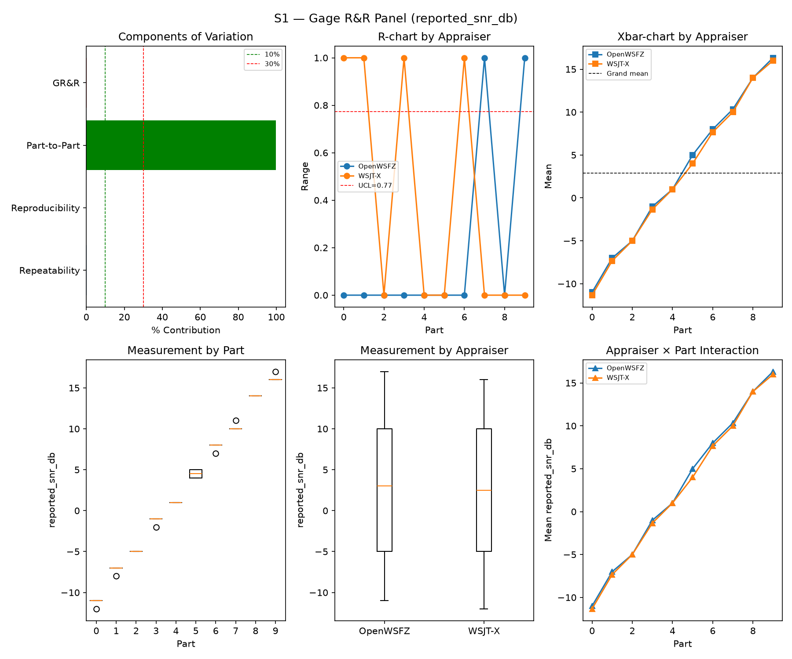
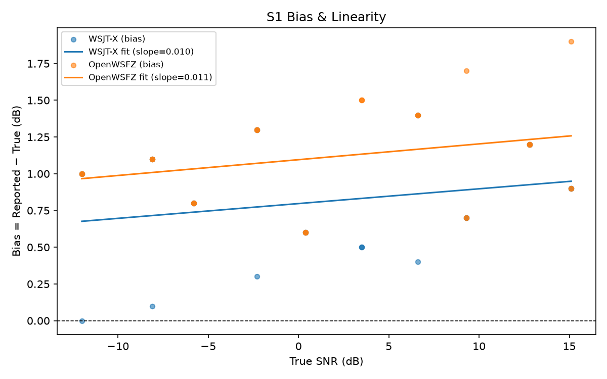
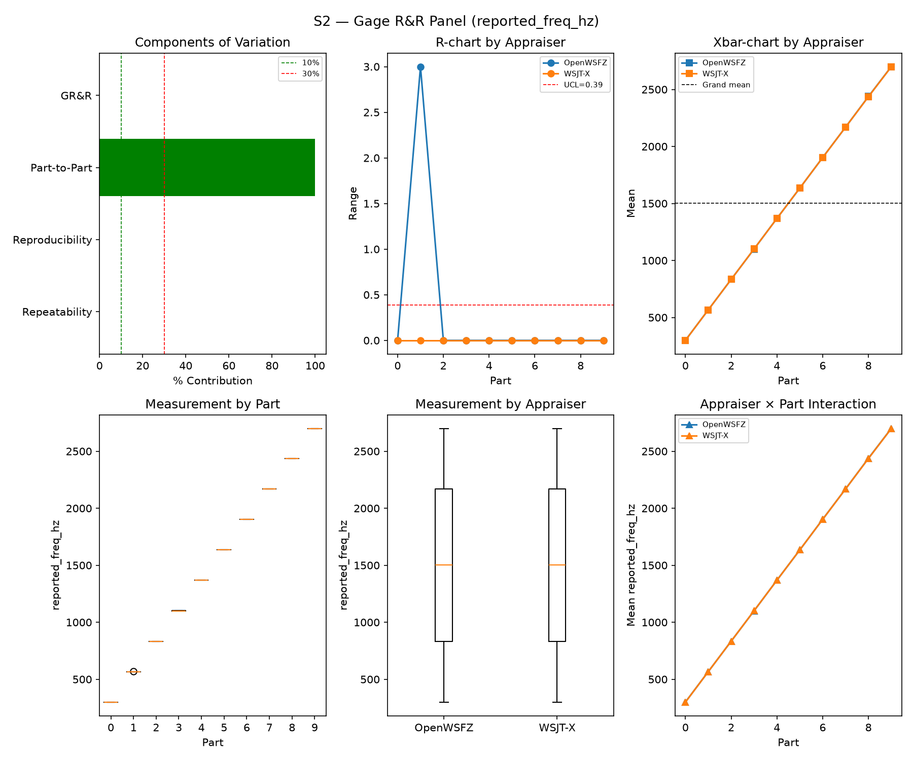
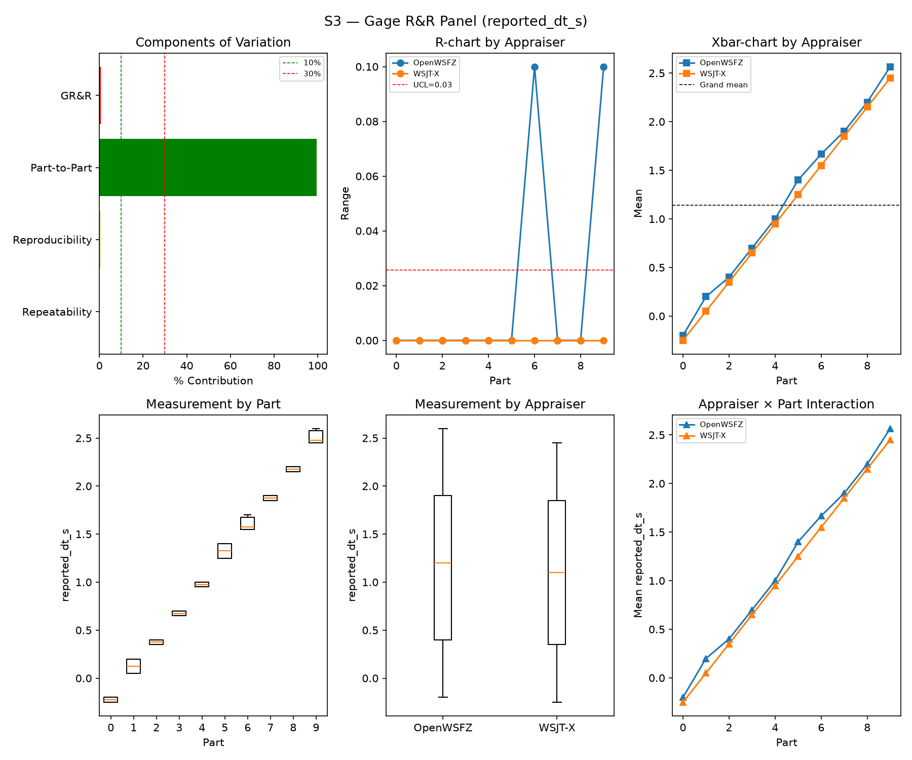
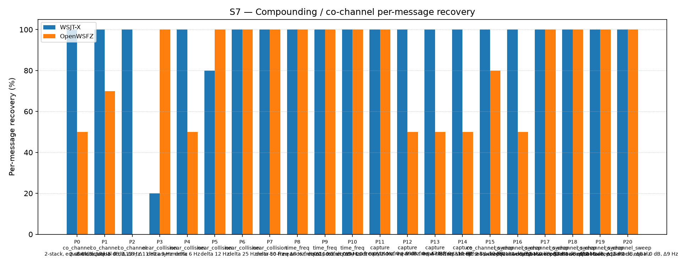
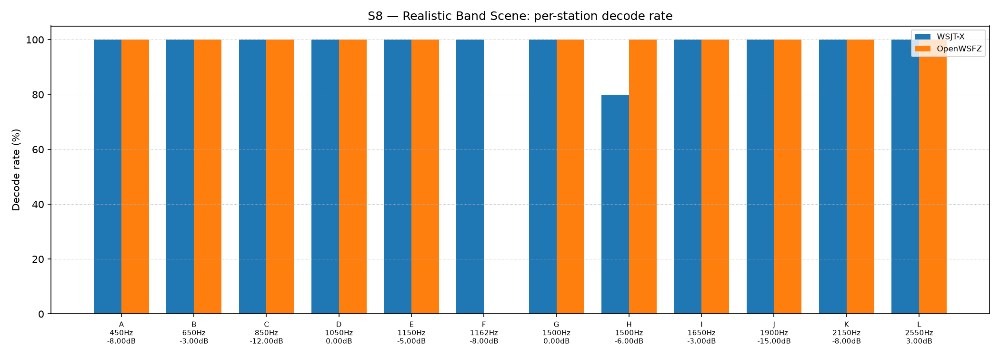

# OpenWSFZ R&R Study Report

| Field | Value |
|---|---|
| Run date | 2026-09-12 |
| OpenWSFZ SHA | `4584900d6d09d8c4a171e688c35e9825d58be3c9` |
| WSJT-X version | WSJT-X 2.7.0 (inferred from binary date 2025-02-04) |

## Section 1 — Study hypothesis

**Purpose of this run.** Routine S1–S8 R&R battery (`--scenarios S1,S1b,S2,S3,S4,S5,S7,S8`)
against `4584900d` (`qa/base`, matching `origin/main`), three commits ahead of the previous full
sweep (`fbf8c0b5`, 2026-09-12): PR #168 (merge of `dev/nhard40-default-migration` — the actual
`src/` code default change, `osdNhardMax` 60→40, plus the M2 migration logic), and two harness-only
commits (`dc325b51`, a `dotnet test` speed/scope fix; `40c23b7a`/`4584900d`, a stale-pin bump to
`AwgnFpReplayTests` immediately reverted same day). None of the three touch the native decoder or
its `.cs` call sites beyond the config-default value itself. This is the standing post-merge
regression net, run at the Captain's direction as part of a six-sweep routine batch — not a
re-litigation of the `NHARD40-DEFAULT` licensing decision, which was already settled by the
dedicated `NT`/`CC` legs (Architect-accepted, see `fbf8c0b5`'s own Section 1).

**What makes this run structurally different from `fbf8c0b5`.** `fbf8c0b5` ran at the *effective*
value `osdNhardMax=40` via a **persisted operator config** written by an unmerged Developer build
hours earlier (that report's Section 1, HK-022-corrected). This is the **first full S1–S8 sweep
run against a build where `osdNhardMax: 40` is the compiled `src/` default** — the config on disk
still carries the same persisted `40`/`nhard40MigrationApplied: true` pair, so nothing about the
config file changed between the two runs; only the binary's own default did. That makes the two
runs a natural pair for asking whether the code-default path and the config-load path exercise the
decoder identically.

**Null hypotheses in scope.**
- H0(regression net): none of S1/S2/S3/S4/S7/S8's headline metrics move outside the historical
  PASS band established in Section 6, attributable to this HEAD.
- H0(migration-code-vs-config equivalence): since `fbf8c0b5` and this sweep both run the decoder
  at the same effective `nhard=40`, differing only in whether that value arrived via a persisted
  config or a compiled default, no metric should differ between the two sweeps beyond ordinary
  run-to-run noise. A difference here would mean the code-default path exercises the decoder
  differently than the config-load path did — a real defect, not a NHARD-value effect (that
  question is already closed by the `NT`/`CC` legs).
- H0(Gate A-W): OpenWSFZ's per-slot AWGN FP rate on the current ≥480-slot trailing window stays
  ≤6% (95% UB).
- H0(Gate A-Δ): this sweep's FP rate is not a step-change vs. the rest of that window (Fisher
  one-sided, FAIL iff p ≤ 0.05).

**What would constitute a meaningful result.** A Gate A-W/Gate A-Δ FAIL would be immediately
actionable (HK-015: Architect rules from here). Short of that, the informative case would be an
**OpenWSFZ-only** movement in a scenario sensitive to the OSD hard-decision path (S1b's low-SNR
ladder, or S7's near-threshold/collision families) that does **not** also appear on the reference
decoder — a same-run movement on WSJT-X instead implicates the harness/instrument (S7 is already
flagged instrument-suspect by standing note, 2026-08-31), not the code-default path under test.

## S1 — reported_snr_db

### Variance Components

| Component | σ² | %Contribution |
|---|---|---|
| Repeatability | 0.10 | 0.12% |
| Reproducibility | 0.05 | 0.06% |
| Part-to-Part | 84.50 | 99.82% |
| Total GR&R | 0.15 | 0.18% |
| Total | 84.65 | 100.00% |

### Study Metrics

| Metric | Value | Verdict |
|---|---|---|
| %Contribution (GR&R) | 0.18% | PASS |
| %Tolerance (GR&R) | 23.24% | — |
| %Study Var (GR&R) | 4.21% | — |
| ndc | 33 | PASS |

### Bias & Linearity (S1)

| Appraiser | Mean Bias (dB) | Slope | Intercept | R² | Verdict |
|---|---|---|---|---|---|
| WSJT-X | +0.82 | 0.010 | 0.797 | 0.057 | PASS |
| OpenWSFZ | +1.12 | 0.011 | 1.096 | 0.077 | PASS |

## S2 — reported_freq_hz

### Variance Components

| Component | σ² | %Contribution |
|---|---|---|
| Repeatability | 0.15 | 0.00% |
| Reproducibility | 0.45 | 0.00% |
| Part-to-Part | 652949.78 | 100.00% |
| Total GR&R | 0.60 | 0.00% |
| Total | 652950.38 | 100.00% |

### Study Metrics

| Metric | Value | Verdict |
|---|---|---|
| %Contribution (GR&R) | 0.00% | PASS |
| %Tolerance (GR&R) | 58.09% | — |
| %Study Var (GR&R) | 0.10% | — |
| ndc | 1470 | PASS |

## S3 — reported_dt_s

### Variance Components

| Component | σ² | %Contribution |
|---|---|---|
| Repeatability | 0.00 | 0.04% |
| Reproducibility | 0.00 | 0.51% |
| Part-to-Part | 0.83 | 99.45% |
| Total GR&R | 0.00 | 0.55% |
| Total | 0.83 | 100.00% |

### Study Metrics

| Metric | Value | Verdict |
|---|---|---|
| %Contribution (GR&R) | 0.55% | PASS |
| %Tolerance (GR&R) | 101.55% | — |
| %Study Var (GR&R) | 7.42% | — |
| ndc | 18 | PASS |

> **WSJT-X DT correction applied.** A +0.55 s offset was added to WSJT-X `reported_dt_s` before ANOVA to remove the ≈ −0.55 s convention difference between WSJT-X (DT relative to nominal FT8 TX start) and the harness (DT relative to UTC slot boundary). This correction removes the calibration artefact from SS_appraiser so %GR&R measures genuine app-to-app measurement disagreement. Raw reported values are preserved in the matched CSV. See scenario `wsjt_dt_correction_s` field and R&R-003 (GitHub #1).

## S1b — Low-SNR threshold study

_Decode rate (% of injected messages recovered) at SNRs excluded from the redesigned S1 ladder (−24 to −15 dB).  Companion to S1; separates 'does it decode at this SNR?' from 'how accurately does it measure SNR?'.  Informational — no AIAG threshold._

### Per-part decode rate

| Part | True SNR (dB) | WSJT-X decoded | WSJT-X rate | OpenWSFZ decoded | OpenWSFZ rate |
|---|---|---|---|---|---|
| P0 | -24.00 | 0/3 | 0.00% | 0/3 | 0.00% |
| P1 | -21.00 | 1/3 | 33.33% | 0/3 | 0.00% |
| P2 | -18.00 | 3/3 | 100.00% | 3/3 | 100.00% |
| P3 | -15.00 | 3/3 | 100.00% | 3/3 | 100.00% |

**Overall decode rate — WSJT-X: 58.33%  OpenWSFZ: 50.00%**

## Attribute Agreement Analysis (S4 positives + S5 negatives)

_κ is computed over a pooled population: S4 injected messages (truth = present) and S5 signal-free slots (truth = absent), so the truth vector has both classes. **κ verdicts below are advisory** — the §10 attribute gate is pending Captain ratification of this pooled method._

### Confusion vs truth

| Appraiser | TP | FN | FP | TN | Recovery | Specificity |
|---|---|---|---|---|---|---|
| WSJT-X | 101 | 7 | 0 | 180 | 93.52% | 100.00% |
| OpenWSFZ | 96 | 12 | 0 | 180 | 88.89% | 100.00% |

### Kappa (advisory)

| Pair | κ | 95% CI | Verdict (advisory) |
|---|---|---|---|
| OpenWSFZ_vs_truth | 0.909 | [0.86, 0.96] | PASS |
| WSJT-X_vs_truth | 0.947 | [0.91, 0.98] | PASS |
| between_appraisers | 0.946 | — | PASS |

### Within-app repeatability (decision consistency across trials)

| Appraiser | Consistent groups |
|---|---|
| WSJT-X | 97.50% |
| OpenWSFZ | 100.00% |

### Kappa — decodable-SNR-restricted positives (informational, floor -12 dB)

_S4 positives below the decodable-SNR floor are excluded (S5 negatives unchanged); shown alongside the full-population figures above per STUDY-SPEC.md §9.3's second ratification condition. **Informational only — does not affect the §10 gate or the overall verdict.**

| Appraiser | TP | FN | FP | TN | Recovery | Specificity |
|---|---|---|---|---|---|---|
| WSJT-X | 80 | 1 | 0 | 180 | 98.77% | 100.00% |
| OpenWSFZ | 81 | 0 | 0 | 180 | 100.00% | 100.00% |

| Pair | κ | 95% CI | Verdict (informational) |
|---|---|---|---|
| OpenWSFZ_vs_truth | 1.000 | [1.00, 1.00] | PASS |
| WSJT-X_vs_truth | 0.991 | [0.97, 1.00] | PASS |
| between_appraisers | 0.991 | — | PASS |

### False-positive rate (S5) — Gate A (AWGN, parts 0/1)

| Appraiser | FP events / slots | Event rate | 95% UB | Decode rate | Verdict |
|---|---|---|---|---|---|
| WSJT-X | 0 / 120 | 0.00% | 2.47% | 0.00% | INFO |
| OpenWSFZ | 0 / 120 | 0.00% | 2.47% | 0.00% | INFO |

_Per-sweep reading (STUDY-SPEC §10, ratified 2026-07-04, R&R-004; population re-affirmed S5-GATE-SIZING Amendment 1, 2026-09-06) of the per-slot FP **event rate** on AWGN slots (parts 0/1) ONLY, one-sided 95% Clopper–Pearson **upper bound** shown for reference. Decode rate is reported for reference only. **SUPERSEDED as a gate by R&R-011 (2026-09-08): always INFO.** At N=120 this reading cannot separate 'unchanged' (P(FAIL)=0.739 at the established 3.182% rate) from 'twice as bad' (P(FAIL)=0.984) — see the ratified compliance verdict in **Gate A-W** below, which reads this same quantity on a trailing 480-slot window instead. **Never pooled with Check B below, nor with Gate A-W/Gate A-Δ** — see those tables' own notes._

### False-positive rate (S5) — Gate A-W / Gate A-Δ (trailing window, R&R-011)

| Gate | Value | Verdict |
|---|---|---|
| **Gate A-W** (compliance) | 8/480 = 1.667%, 95% UB 2.987% (PASS iff ≤ 6%) | **PASS** |
| **Gate A-Δ** (change) | 0/120 (newest) vs 8/360 (rest of window), Fisher(greater) p=1.0000 (FAIL iff ≤ 0.05) | **PASS** |

_Gate A-W (R&R-011, PO ruling Option A, 2026-09-08) — the ratified 6% UB (STUDY-SPEC §10, unchanged, not re-ratified) read on a trailing **at least 480**-AWGN-slot window (unit is the slot, not the sweep; the fill loop admits whole runs, so actual N can overshoot up to the largest single run's slot count — reported above as 480, never quoted as a bare "480". Amendment 1, §3: overshoot only adds power, never loosens the ceiling, since P(UB₉₅≤C\|p=C)≤0.05 holds at every N). Gate A-Δ — newest sweep vs the rest of that same window, one-sided Fisher at 0.05. **Two separate rows, never pooled**: ROW 1 (Gate A-W FAIL) and ROW 2 (Gate A-Δ FAIL) can both fire independently. **Honest costs**: the window lags — a regression introduced this sweep is diluted 1:4 and takes up to four sweeps to reach full weight; Gate A-Δ is blind below ~2× (power 0.40 at 2×, 0.82 at 3×). **A PASS may not be read as "nothing moved".**

_Leave-one-sweep-out (spec Sec.4.7): all 5 single-sweep deletions leave Gate A-W's verdict unchanged — **not FRAGILE**._

### False-positive rate (S5) — Check B (narrowband, parts 2/3)

| Appraiser | FP events / slots | Verdict |
|---|---|---|
| WSJT-X | 0 / 60 | PASS |
| OpenWSFZ | 0 / 60 | PASS |

_Check (S5-GATE-SIZING Amendment 1, PO ruling Option 3, 2026-09-06 20:29 UTC): a coverage net for narrowband hallucination (steady carrier / birdies), scored on its OWN 60-slot denominator — FAIL iff events ≥ 2. Threshold derived in the spec's A1.2 from the measured all-history per-slot narrowband base rate (0.2347%, `s5_narrowband_exposure_verify.py`, ROW 0 cleared 2026-09-06), well under the ~1% re-derivation trigger. This is a raw event-count check, not a Clopper–Pearson UB gate, so there is no STATISTICAL small-N demotion analogous to `MIN_N_FOR_FP_GATE` — but **INFO** here means something distinct: zero narrowband slots were injected at all (Check B did not run this battery, e.g. a targeted `--parts 0,1` recheck). That is a coverage gap, never a PASS — asserting PASS with no slots run would reproduce the exact blindness this design exists to remove. **Never pooled with Gate A above into one S5 rate or one verdict line** — the same 180 slots FAIL under no change 21% of the time scored as one gate; scored as two, Gate A alone FAILs under no change 77% of the time (its own false-alarm rate at N=120, corrected 2026-09-08 — see R&R-011; not a detection rate)._

## S7 — Compounding / co-channel overlap

_Per-message recovery when 2–3 signals occupy the same or near-same audio frequency / time slot (the pileup case S4 does not exercise). Informational — no AIAG threshold is defined for co-channel separation._

### Recovery by overlap family

| Overlap family | WSJT-X | OpenWSFZ |
|---|---|---|
| capture | 100.00% | 62.50% |
| co_channel | 100.00% | 34.29% |
| co_channel_sweep | 100.00% | 88.33% |
| near_collision | 80.00% | 90.00% |
| time_freq | 100.00% | 100.00% |
| **all** | **95.35%** | **76.74%** |

### Capture effect (co-channel, unequal SNR)

| Signal | WSJT-X | OpenWSFZ |
|---|---|---|
| strong | 100.00% | 100.00% |
| weak | 100.00% | 25.00% |

**Between-app per-signal agreement:** 72.09%

### Per-part detail

| Part | Family | Condition | WSJT-X | OpenWSFZ |
|---|---|---|---|---|
| P0 | co_channel | 2-stack, equal 0 dB, Δ7 Hz | 10/10 | 5/10 |
| P1 | co_channel | 2-stack, equal -5 dB, Δ13 Hz | 10/10 | 7/10 |
| P2 | co_channel | 3-stack, equal 0 dB, Δ8 / Δ11 Hz asymmetric | 15/15 | 0/15 |
| P3 | near_collision | delta 3 Hz | 2/10 | 10/10 |
| P4 | near_collision | delta 6 Hz | 10/10 | 5/10 |
| P5 | near_collision | delta 12 Hz | 8/10 | 10/10 |
| P6 | near_collision | delta 25 Hz | 10/10 | 10/10 |
| P7 | near_collision | delta 50 Hz | 10/10 | 10/10 |
| P8 | time_freq | near-co-freq Δ8 Hz, dt 0.0 / 0.5 s | 10/10 | 10/10 |
| P9 | time_freq | near-co-freq Δ11 Hz, dt 0.0 / 1.0 s | 10/10 | 10/10 |
| P10 | time_freq | near-co-freq Δ9 Hz, dt 0.0 / 2.0 s | 10/10 | 10/10 |
| P11 | capture | near-co-freq Δ14 Hz, 0 / -3 dB | 10/10 | 10/10 |
| P12 | capture | near-co-freq Δ9 Hz, 0 / -6 dB | 10/10 | 5/10 |
| P13 | capture | near-co-freq Δ7 Hz, 0 / -10 dB | 10/10 | 5/10 |
| P14 | capture | near-co-freq Δ11 Hz, +3 / -10 dB | 10/10 | 5/10 |
| P15 | co_channel_sweep | offset-sweep: 2-stack, equal 0 dB, Δ5 Hz | 10/10 | 8/10 |
| P16 | co_channel_sweep | offset-sweep: 2-stack, equal 0 dB, Δ7 Hz | 10/10 | 5/10 |
| P17 | co_channel_sweep | offset-sweep: 2-stack, equal 0 dB, Δ10 Hz | 10/10 | 10/10 |
| P18 | co_channel_sweep | offset-sweep: 2-stack, equal 0 dB, Δ15 Hz | 10/10 | 10/10 |
| P19 | co_channel_sweep | offset-sweep: 2-stack, equal 0 dB, Δ8 Hz | 10/10 | 10/10 |
| P20 | co_channel_sweep | offset-sweep: 2-stack, equal 0 dB, Δ9 Hz | 10/10 | 10/10 |

## S8 — Realistic Band Scene

_Holistic decode-rate benchmark: 12 simultaneous stations across 450–2550 Hz at realistic SNR spread (−15 to +3 dB), including a near-collision pair (E/F, 12 Hz apart) and a capture pair (G/H, co-frequency, 6 dB ratio). **Informational only — no PASS/FAIL gate.**_

### Overall decode rate

| Appraiser | Decoded | Injected | Rate |
|---|---|---|---|
| WSJT-X | 59 | 60 | 98.33% |
| OpenWSFZ | 55 | 60 | 91.67% |

**Between-appraiser delta (OpenWSFZ − WSJT-X): -6.7 pp**

### Per-station breakdown

| Stn | Freq (Hz) | SNR (dB) | WSJT-X decoded/total | OpenWSFZ decoded/total |
|---|---|---|---|---|
| A | 450 | -8.00 | 5/5 | 5/5 |
| B | 650 | -3.00 | 5/5 | 5/5 |
| C | 850 | -12.00 | 5/5 | 5/5 |
| D | 1050 | 0.00 | 5/5 | 5/5 |
| E | 1150 | -5.00 | 5/5 | 5/5 |
| F | 1162 | -8.00 | 5/5 | 0/5 |
| G | 1500 | 0.00 | 5/5 | 5/5 |
| H | 1500 | -6.00 | 4/5 | 5/5 |
| I | 1650 | -3.00 | 5/5 | 5/5 |
| J | 1900 | -15.00 | 5/5 | 5/5 |
| K | 2150 | -8.00 | 5/5 | 5/5 |
| L | 2550 | 3.00 | 5/5 | 5/5 |

## Unexplained decodes (informational — no gate)

_Every appraiser decode whose message text + frequency matches no injected truth row in its own cycle, across the **whole battery** — not just S5's signal-free slots (see False-positive rate above). Uses the harness's own match predicates (exact whitespace-normalised text AND ±4 Hz), not a frequency-blind text check. **Not a gate — no threshold is pre-registered (HK-021) for this metric.** Δf is the distance from the decode's reported frequency to the nearest frequency-bearing truth row in the same cycle; '—' means every truth row sharing that cycle was signal-free (e.g. a pure S5 slot). Counts and distances only, per NFR-021 — never message text or callsigns; see Section 6 for the historical series._

| Appraiser | Scenario | Count | Min Δf (Hz) | Median Δf (Hz) |
|---|---|---|---|---|
| WSJT-X | S4 | 1 | 821.0 | 821.0 |
| **WSJT-X** | **all** | **1** | | |
| OpenWSFZ | S1 | 1 | 16.0 | 16.0 |
| OpenWSFZ | S2 | 1 | 526.0 | 526.0 |
| OpenWSFZ | S7 | 1 | 1.0 | 1.0 |
| **OpenWSFZ** | **all** | **3** | | |

## Summary

| Metric | Scope | Value | Verdict |
|---|---|---|---|
| %GR&R | S1 | 0.2% | PASS |
| ndc | S1 | 33 | PASS |
| %GR&R | S2 | 0.0% | PASS |
| ndc | S2 | 1470 | PASS |
| %GR&R | S3 | 0.6% | PASS |
| ndc | S3 | 18 | PASS |
| Kappa (advisory) | WSJT-X_vs_truth | 0.947 | PASS |
| Kappa (advisory) | OpenWSFZ_vs_truth | 0.909 | PASS |
| Kappa (advisory) | between_appraisers | 0.946 | PASS |
| FP event rate (95% UB), Gate A-W | S5/OpenWSFZ | 8/480 slots (event 1.667%; 95% UB 2.987%) | PASS |
| FP event rate change, Gate A-Δ | S5/OpenWSFZ | 0/120 vs 8/360 (Fisher p=1.0000) | PASS |
| FP events, Check B (narrowband) | S5/WSJT-X | 0/60 slots (FAIL iff >= 2) | PASS |
| FP events, Check B (narrowband) | S5/OpenWSFZ | 0/60 slots (FAIL iff >= 2) | PASS |
| SNR bias | S1/WSJT-X | +0.82 dB | PASS |
| SNR bias | S1/OpenWSFZ | +1.12 dB | PASS |

**Overall verdict: PASS**

### Excluded From Gate (Informational)

- ℹ️ FP event rate (S5/WSJT-X) not gated at N=120: 0/120 slots (event 0.0%; 95% UB 2.47%; decode 0.0%) — per-sweep Gate A was superseded by R&R-011 (2026-09-08): at N=120 it cannot separate 'unchanged' from 'twice as bad'. See Gate A-W below for the ratified compliance verdict.
- ℹ️ FP event rate (S5/OpenWSFZ) not gated at N=120: 0/120 slots (event 0.0%; 95% UB 2.47%; decode 0.0%) — per-sweep Gate A was superseded by R&R-011 (2026-09-08): at N=120 it cannot separate 'unchanged' from 'twice as bad'. See Gate A-W below for the ratified compliance verdict.

## Section 5 — Recommendations

**No gate failures. No further investigation required as a merge-blocking matter.**

- ✅ **Gate A-W** PASS (8/480 = 1.667%, 95% UB 2.987% ≤ 6%) and **Gate A-Δ** PASS (0/120 this
  sweep vs 8/360 rest-of-window, Fisher p = 1.0000). Unlike `fbf8c0b5`'s reading, this run's Gate
  A-W is **not FRAGILE** — the report's own leave-one-sweep-out check confirms all five
  single-sweep deletions leave the verdict unchanged.
- ✅ **H0(migration-code-vs-config equivalence) holds — no signal attributable to `osdNhardMax`
  moving from a persisted-config value to a compiled `src/` default.** Direct comparison against
  `fbf8c0b5` (same effective nhard=40, different provenance): κ WSJT-X_vs_truth **0.947** (both
  runs, identical to 3dp), κ OpenWSFZ_vs_truth **0.909** (both runs, identical to 3dp), S1 %GR&R
  0.37%→0.18% and S3 %GR&R 0.35%→0.55% (both within the established run-to-run PASS band, Section
  6), S2 %GR&R 0.00% both. **S1b's most nhard-sensitive cell is unchanged**: OpenWSFZ again reads
  0/3 at P1 (−21 dB) — the same reading recorded on every routine sweep on record back to
  `3b52608` (now six consecutive sweeps: `3b52608`, `35378b9`, `4c7d5ad`, `4cc1984`, `fbf8c0b5`,
  and this run). The dedicated `NT`/`CC` legs remain the authority on the licensing question itself
  (Section 1); this sweep only confirms the code-default path produces no collateral movement
  in the general-purpose battery, reinforcing the same finding `fbf8c0b5` already reported for the
  persisted-config path.
- ℹ️ **S7 P2 (3-stack co-channel, equal 0 dB) reproduces the exact instrument-suspect pattern
  flagged on 2026-08-31, now with the polarity reversed.** `fbf8c0b5` read WSJT-X 0/15 on this
  part; this run reads WSJT-X **15/15** — a full flip on the *reference* decoder against
  nominally identical synthetic input, while **OpenWSFZ reads 0/15 in both runs**, unmoved. A
  same-part swing of this size on the reference appraiser, with the code under test holding
  steady, points at harness/instrument timing rather than either decoder — consistent with, not a
  new instance beyond, the standing 2026-08-31 note. S7 carries no AIAG threshold; informational
  only, no action proposed. Recorded here for the Section 6 series.
- ℹ️ **S7 "all" and S8 continue to move within their established envelopes, in the same
  opposite-direction pattern already noted between `4cc1984`→`fbf8c0b5`.** WSJT-X S7 87.44%
  (`fbf8c0b5`) → 95.35% (this run); OpenWSFZ S7 82.79% → 76.74%. S8: WSJT-X 93.33% → 98.33%
  (OpenWSFZ unchanged at 91.67%). Both within the historical range for their respective N.
- ℹ️ **S8 station F (OpenWSFZ 0/5) continues the already-tracked pattern** — 0/5 on OpenWSFZ in
  every sweep in Section 6's per-station-detail era, including this one. Not a new finding, not
  attributable to this merge.
- ℹ️ **Unexplained-decodes counts stay in the low single digits** (WSJT-X 1, OpenWSFZ 3; see table
  above) — informational only, no threshold pre-registered (HK-021), consistent with the
  noise-floor-CRC-coincidence phenomenon documented in RUNBOOK.md §7.5.

## Section 6 — Historical trend: every full S1–S8 sweep to date

All twenty runs that exercised the complete controlled battery (S1/S2/S3/S7 at minimum), oldest
first. `%GR&R` is each stage's own Summary-table figure (AIAG %Contribution, threshold ≤ 10% PASS). S5
FP is the value the sweep's own report used to gate PASS/FAIL through `4cc1984` (95% UB where
computed, else the plain event/decode rate for older entries — see the caveat below); from
`4cc1984` onward the ratified gate is Gate A-W/Gate A-Δ, not this per-sweep figure (footnote 7). S7/S8 are the
"all"/overall decode-recovery percentages. **S4/κ is not a column in this table but is affected by
a defect found and fixed 2026-09-12 across every sweep from `3bd4cd0` onward — see footnote ⁸.**
**Final column** (added 2026-09-12, Captain-requested): OpenWSFZ's pooled S7+S8 matched-decode
count as a percentage of WSJT-X's own matched-decode count over the same two stages — i.e. WSJT-X's
count used as the reference/"oracle" denominator (the Captain's framing; not a claim that WSJT-X is
ground truth). False positives are excluded by construction, not by a separate filter: both S7
"recovery" and S8 "decode rate" are already `matched/injected` counts computed after dropping
`false_positive == True` rows (`harness/analyse.py` `_analyse_compounding`/`_analyse_band_scene`), so
this is a genuine TP-vs-TP comparison. See footnote ¹⁰ for the derivation (including the two rows with
no S8) and its verification.

| Date | SHA | S1 %GR&R | S2 %GR&R | S3 %GR&R | S5 FP (WSJT-X / OpenWSFZ) | S7 recovery (WSJT-X / OpenWSFZ) | S8 decode rate (WSJT-X / OpenWSFZ) | OpenWSFZ, % of WSJT-X (S7+S8 pooled, excl. FP)¹⁰ |
|---|---|---|---|---|---|---|---|---|
| 2026-06-06 | `4c34ef6` | 32.0% **FAIL** | 0.0% | 3.8% | 0.0% / 0.0% | 78.5% / 47.3% | — | 60.27%¹¹ |
| 2026-06-06 | `6bab388` | 6.5% | 0.0% | 3.9% | 0.0% / 0.0% | 77.4% / 46.2% | — | 59.72%¹¹ |
| 2026-06-07 | `4b3a4ca` | 1.4% | 0.0% | 3.4% | 0.0% / 0.0% | 76.3% / 54.8% | 95.0% / 86.7% | 80.47% |
| 2026-06-14 | `815b652` | 0.3% | 0.0% | 3.0% | 0.0% / 0.0% | 77.4% / 50.5% | 95.0% / 83.3% | 75.19% |
| 2026-06-20 | `6e821fa` | 0.4% | 0.0% | 3.0% | 0.0% / **91.7% FAIL**¹ | 92.6% / 70.2% | 93.3% / 86.7% | 79.61% |
| 2026-06-22 | `f11f438` | 0.4% | 0.0% | 3.1% | 0.0% / 0.0% | 94.0% / 74.4% | 93.3% / 86.7% | 82.17% |
| 2026-07-04 | `793a298` | 0.5% | 0.0% | 3.4% | 0.0% / 0.0% | 96.3% / 73.0% | 93.3% / 86.7% | 79.47% |
| 2026-08-05 | `3bd4cd0` | 7.2% | 0.0% | 3.6% | 0.0% / 0.0% | 96.3% / 70.2% | 93.3% / 83.3% | 76.43% |
| 2026-08-15 | `8d6e1b1` | 0.5% | 0.0% | 1.4% | 0.0% / 0.8% | 95.3% / 74.4% | 93.3% / 86.7% | 81.23% |
| 2026-08-21 | `7d36038` | 0.3% | 0.0% | 0.4% | 0.0% / 0.8% | 95.3% / 68.4% | 96.7% / 83.3% | 74.90% |
| 2026-08-22 | `f5dec23` | 0.4% | 0.0% | 0.4% | 0.0% / **3.3% FAIL**² | 98.1% / 79.5% | 91.7% / 91.7% | 84.96% |
| 2026-08-27 | `22b749c` | 0.3% | 0.0% | 0.4% | 0.0% / 0.0% | 97.7% / 78.6% | 96.7% / 91.7% | 83.58% |
| 2026-08-29 | `872ba65` | 0.25% | 0.0% | 18.65%³ | 0.0% / **7.66% FAIL** | 93.0% / 74.0% | 96.7% / 91.7% | 82.95% |
| 2026-08-30/31 | `2e60949` | 0.27% | 0.0% | 0.44% | 0.0% / 5.15%⁴ | 98.1% / 82.8%⁵ | 91.7% / 91.7% | 87.59% |
| 2026-09-02 | `3b52608` | 0.22% | 0.0% | 0.55% | 0.0% / **14.61% FAIL** | 94.4% / 83.7% | 100.0% / 91.7% | 89.35% |
| 2026-09-03 | `35378b9` | 0.21% | 0.0% | 0.55% | 0.0% / 10.12% FAIL | 96.3% / 81.4% | 95.0% / 91.7% | 87.12% |
| 2026-09-06 | `4c7d5ad` | 0.24% | 0.00% | 0.40% | 0.0% / 12.42% FAIL⁹ | 98.14% / 79.07% | 100.00% / 88.33% | 82.29% |
| 2026-09-07 | `4cc1984` | 0.20% | 0.0% | 0.59% | 0.0% / 6.33% FAIL⁶ | 99.07% / 79.07% | 91.67% / 91.67% | 83.96% |
| 2026-09-12 | `fbf8c0b5` | 0.37% | 0.0% | 0.35% | 0.0% / 0.0%⁷ | 87.44% / 82.79% | 93.33% / 91.67% | 95.49% |
| **2026-09-12/13** | **`4584900d`** | **0.18%** | **0.0%** | **0.55%** | **0.0% / 0.0%⁷** | **95.35% / 76.74%** | **98.33% / 91.67%** | **83.33%** |

¹ Plain decode-rate era (pre R&R-004 ratified UB gate); not the same metric as later rows, fixed
under D-009. Not comparable to the UB figures below it.

² Second-ever ratified-gate FAIL, N=120 (pre R&R-009 default restriction).

³ Not comparable to the S1–S3 series above it — confounded by a harness playback-timing defect
discovered in that same run (`872ba65`'s Section 5, Finding 1), not a decoder result.

⁴ N=120 (`resume_study.py` artefact — R&R-009's N=60 restriction not applied on resume, Section 1
item 3 of that report), not the routine N=60 battery. PASS at this N; not directly comparable to the
N=60 rows around it.

⁵ S7 figure is from a 2026-08-31 targeted re-run (`results/2026-08-31-2e60949/`), same SHA — the
original 2026-08-30 attempt collapsed mid-scenario to an audio-chain fault (that report's Section 5,
Finding 1), fixed, and re-run clean.

⁶ **First run scored under R&R-010's Gate A / Check B split** (`STUDY-SPEC.md` §16, implemented
2026-09-06). The figure shown is **Gate A** (AWGN, parts 0/1, N=120 — the same population this
column's UB has always described). **Check B** (narrowband, parts 2/3, N=60) is scored separately
and is NOT this column: 0/60, PASS, never pooled with Gate A per the ruling. One run is not in this
table because it did not exercise the full controlled battery: `a3738fc` (2026-07-04, a targeted
N=300 S5-only confirmatory run, 8/300, PASS). **CORRECTED 2026-09-12, same day (HK-022,
Architect-caught, Captain-directed) — struck in place, not appended:** this footnote previously
also excluded `4c7d5ad` (2026-09-06) here, calling it "a targeted S5-only run under the new split."
That was wrong: `4c7d5ad`'s own `truth.csv` covers S1/S1b/S2/S3/S4/S5/S7/S8, its own report has full
S1-S8 sections plus Sections 1/5/6, and PR #145 is titled "full S1-S8 sweep, 2026-09-06" — it IS a
full battery and belongs in the table above (see footnote ⁹).

⁹ **`4c7d5ad` (2026-09-06) added 2026-09-12, same day, HK-022** — wrongly excluded from this table
by footnote ⁶'s original text (see the correction there). It ran under the OLD single-gate S5
architecture (STUDY-SPEC §10, ratified 2026-07-04, R&R-004; N=60 per R&R-009), **before** the
Gate A / Check B split — its own S5 FP reading (3/60 events, 5.00% event rate, 95% UB 12.42%,
FAIL) is what triggered R&R-010's split later the same day (2026-09-06 20:29 UTC). The table's
figure (12.42%) is that run's own 95% UB, matching the convention already used for its immediate
neighbour `35378b9` in this table. Not comparable cell-for-cell to the post-split rows below it
(N=120 Gate A vs this run's N=60 single gate) — read as directional, per this table's own caveat.

⁷ **First run under R&R-011** (2026-09-08): per-sweep Gate A is no longer the ratified gate — it
was superseded by Gate A-W/Gate A-Δ, read on a trailing ≥480-AWGN-slot window rather than this
sweep alone (see each such run's own Gate A-W/Gate A-Δ tables above). The per-sweep figure shown here
(0/120, both appraisers) is retained for series continuity only, not as a gate reading. **Ratified
verdict, `fbf8c0b5`:** Gate A-W PASS (14/480 = 2.917%, 95% UB 4.522% ≤ 6%), Gate A-Δ PASS (0/120 vs
14/360, Fisher p = 1.0000) — both **FRAGILE** per leave-one-out. **Ratified verdict, `4584900d`
(this run):** Gate A-W PASS (8/480 = 1.667%, 95% UB 2.987% ≤ 6%), Gate A-Δ PASS (0/120 vs 8/360,
Fisher p = 1.0000) — **not FRAGILE** per leave-one-out (Section 5). **A PASS may not be read as
"nothing moved".**

⁸ **S4/κ duplicate-row attribution defect, found and fixed 2026-09-12** (the `fbf8c0b5` report's own
Attribute Agreement section carries the full root-cause and fix, HK-022-struck in place). S4 P3/P4
re-inject the same 10-message list 2–3× per cycle; `_attribute_agreement` let the LAST duplicate CSV
row decide a unit's call instead of `any(matched)` across its rows, so genuinely-decoded messages
could score as false negatives. Confirmed by direct recomputation against the matched CSVs still on
disk (not available for every historical sweep) for every run that used the P3/P4 duplicate-message
design: `3bd4cd0` (2026-08-05, OpenWSFZ κ 0.651 FAIL → 0.894), `4c7d5ad` (2026-09-06, 0.560 FAIL →
0.812), `4cc1984` (2026-09-07, 0.701 MARGINAL → 0.887), and `fbf8c0b5` (0.706 MARGINAL → 0.909;
WSJT-X 0.680 FAIL → 0.947). The permanent fix (PR #166, `08552dd7`) is present in this run's own
code path (`4584900d` is downstream of that merge), so this run's own κ readings (0.947/0.909
above) are already correct at source — no retroactive correction needed for this row. The four
sweeps before `3bd4cd0` (`4c34ef6`, `6bab388`, `4b3a4ca`, `815b652`) predate the P3/P4 duplicate
design and are unaffected. Per HK-022, the three older committed reports (`3bd4cd0`, `4c7d5ad`,
`4cc1984`) are left as-recorded rather than silently rewritten. Whether the corrected κ changes the
§10 attribute gate's pending ratification is the Captain's call.

¹⁰ **New column, added 2026-09-12, Captain-requested.** Value = pooled(OpenWSFZ S7+S8
matched decodes) ÷ pooled(WSJT-X S7+S8 matched decodes) × 100. For `4584900d` (this run): S7
matched 165/215 (OpenWSFZ) vs 205/215 (WSJT-X); S8 matched 55/60 (OpenWSFZ) vs 59/60 (WSJT-X);
pooled 220/264 = 83.33% — computed directly from this run's own `S7_matched.csv`/`S8_matched.csv`
counts, not derived. For the eleven historical rows whose raw matched CSVs are not present in the
QA worktree (`6e821fa` through `35378b9`), the value was derived from each run's own published S8
integers plus S7's fixed per-era N (93 through `815b652`, 215 from `6e821fa` onward) — see
`fbf8c0b5`'s own footnote ¹⁰ for the full derivation history and its independent confirmation
against the raw CSVs (found in the Architect worktree root). `2e60949`'s S7 half uses its own
2026-08-31 targeted re-run report (footnote 5). **This is an INFO reading only — no threshold, no
gate, no HK-021 pre-registration.**

¹¹ `4c34ef6` and `6bab388` (2026-06-06) predate S8's introduction to the battery — this scenario
version had no S8 section at all (see the "—" in that column). Their ¹⁰ figure is S7-only, pooling
nothing; not comparable cell-for-cell to every row below it, which pools S7+S8.

**Reading it:** twenty full sweeps now. This run (`4584900d`) is the first against a build where
`osdNhardMax: 40` is a compiled `src/` default rather than a persisted config value, and — per
H0(migration-code-vs-config equivalence) in Section 1 — shows no metric movement attributable to
that transition beyond ordinary run-to-run noise: κ vs truth identical to 3dp against `fbf8c0b5`
for both appraisers, S1b's most nhard-sensitive cell (OpenWSFZ P1, −21 dB) unchanged at 0/3, and
S1/S2/S3 GR&R comfortably inside their established PASS bands. Gate A-W (1.667%, 95% UB 2.987%)
and Gate A-Δ (Fisher p=1.0000) both PASS and, unlike `fbf8c0b5`'s reading, are **not FRAGILE** this
time. S7's P2 part flips WSJT-X from 0/15 (`fbf8c0b5`) to 15/15 (this run) while OpenWSFZ holds
steady at 0/15 in both — reinforcing, not newly establishing, the standing 2026-08-31
instrument-suspect flag on S7 (Section 5). The oracle-ratio column reads 83.33% this run, back
inside the recent 82–90% envelope after `fbf8c0b5`'s series-high 95.49% (itself flagged there as
driven by a low WSJT-X reading, not an OpenWSFZ improvement) — read this row as a reversion toward
the envelope, not as an OpenWSFZ regression, since OpenWSFZ's own S7 (76.74%) and S8 (91.67%)
readings both sit inside their own recent ranges.

*Caveat, kept brief (carried forward unchanged, R&R-011 appended): S1/S3 were redesigned 2026-06-06
(R&R-005/R&R-003); the S5 metric moved from plain decode-rate to a gated Clopper–Pearson event rate
2026-07-04/08-05 (R&R-004); S5's default N dropped from 120 to 60 slots starting 2026-08-27
(R&R-009, AWGN parts only); S5 split into Gate A (N=120, restored) / Check B (N=60, new) 2026-09-06
(R&R-010); S5's ratified gate moved from per-sweep Gate A to a trailing-window design (Gate A-W /
Gate A-Δ) 2026-09-08 (R&R-011). Early-vs-late numbers are as-reported; treat cross-redesign
comparisons as directional, not strictly statistical.*
