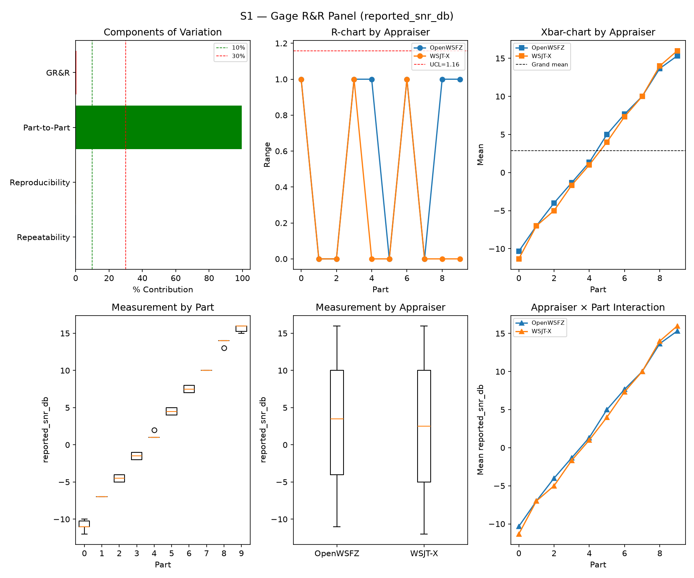
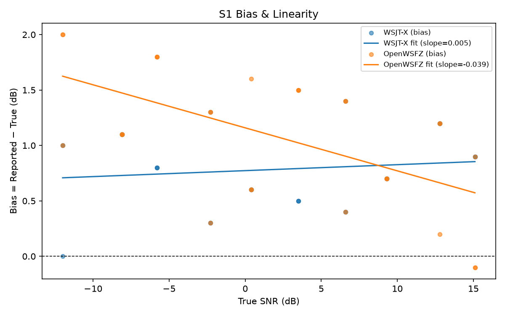
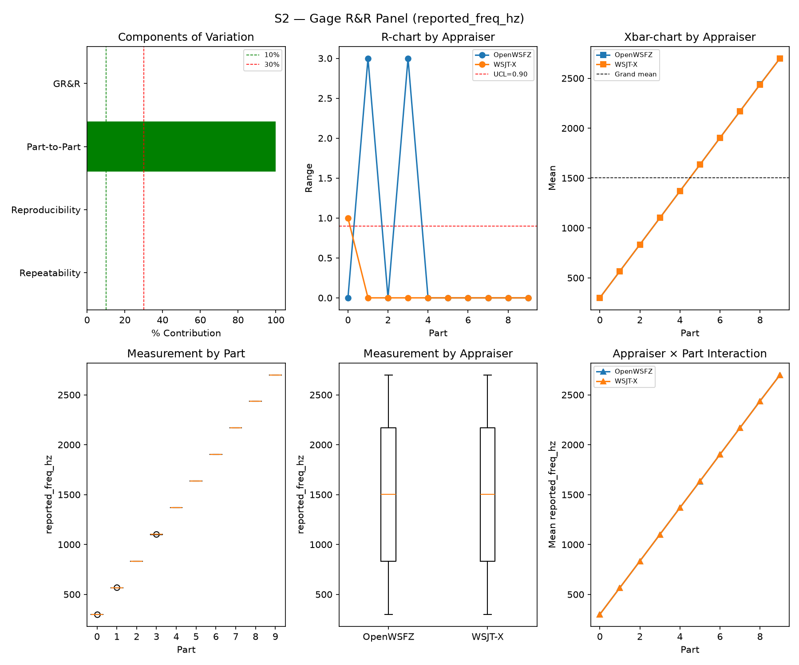
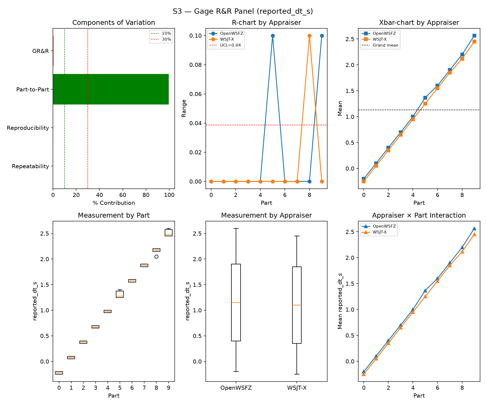
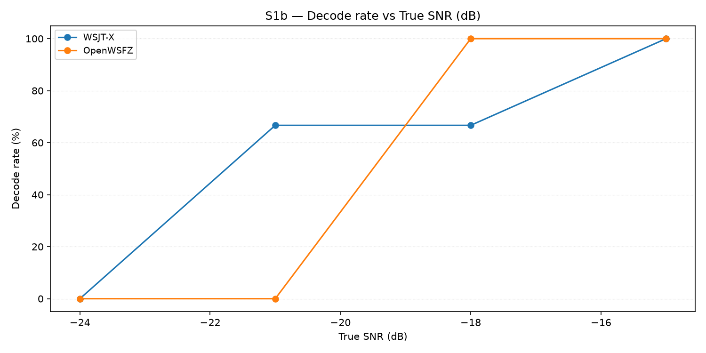
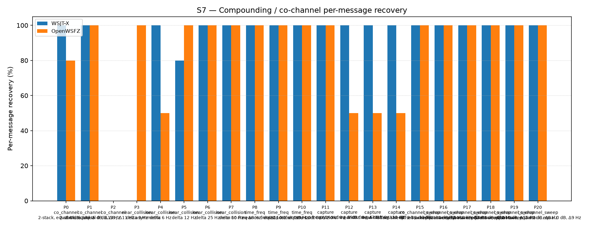
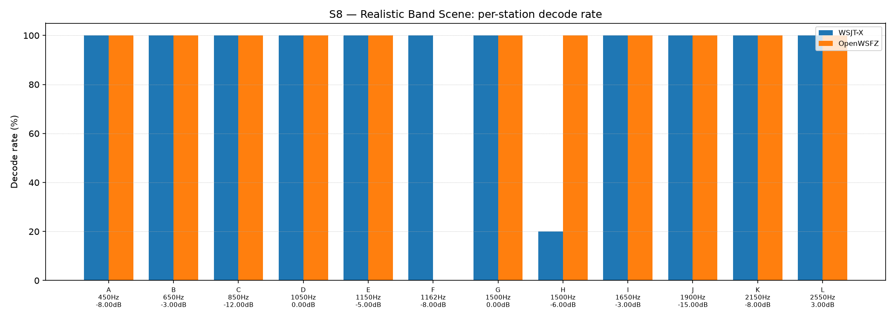

# OpenWSFZ R&R Study Report

| Field | Value |
|---|---|
| Run date | 2026-09-12 |
| OpenWSFZ SHA | `fbf8c0b5d629e97e56970c31a848aba6e3c3c8fc` |
| WSJT-X version | WSJT-X 2.7.0 (inferred from binary date 2025-02-04) |

## Section 1 — Study hypothesis

**Purpose of this run.** Routine S1–S8 R&R battery (`--scenarios S1,S1b,S2,S3,S4,S5,S7,S8`)
against `fbf8c0b5` (`origin/main`), the merge of PR #161 (`NHARD40-DEFAULT`: `osdNhardMax`
default 60→40, PO-ratified `BAR_S = 0.05`, 2026-09-12), PR #162 (the M2 migration fix — the
`Nhard40MigrationApplied` marker made server-owned) and PR #163 (the NFR-021 clobber-guard
dev-task). This is the **standard post-merge regression net**, not a re-litigation of the
`NHARD40-DEFAULT` licensing decision itself — that question was already answered earlier the
same day by the dedicated near-threshold (`NT`) and co-channel (`CC`) legs, separately
Architect-accepted (`NT-S1` 09:56Z, `CC-S1` 10:29Z, branch `nhard40-default-nt-result`). This
run's job is to confirm the merged change did not disturb the broader S1–S8 series that every
other change is checked against.

**What makes this run structurally different from every predecessor.** Two firsts: (1) the
first full S1–S8 sweep run against a build whose **persisted config** carries `osdNhardMax: 40`
(via the M2 migration, applied fresh — not merely a code default; the standing board note that
"every `config.json` persists `osdNhardMax: 60`" does not apply to this run's config); (2) the
first full sweep since **R&R-011** (2026-09-08) superseded the per-sweep S5 Gate A reading as
the ratified gate — Gate A-W/Gate A-Δ (a trailing-window design) now carry that role, and the
per-sweep reading is INFO only (see the S5 section below and Section 6 footnote 7).

**Null hypotheses in scope.**
- H0(regression net): none of S1/S2/S3/S4/S7/S8's headline metrics move outside the historical
  PASS band established in Section 6, in a way attributable to the 60→40 default change.
- H0(Gate A-W): OpenWSFZ's per-slot AWGN FP rate on the current ≥480-slot trailing window stays
  ≤6% (95% UB).
- H0(Gate A-Δ): this sweep's FP rate is not a step-change vs. the rest of that window (Fisher
  one-sided, FAIL iff p ≤ 0.05).

**What would constitute a meaningful result.** A Gate A-W/Gate A-Δ FAIL would be immediately
actionable (HK-015: Architect rules from here). Short of that, the informative case would be an
**OpenWSFZ-only** movement in a scenario sensitive to the OSD hard-decision path (S1b's low-SNR
ladder, or S7's near-threshold/collision families) that does **not** also appear on the
reference decoder — a same-run movement on WSJT-X instead implicates the harness/instrument (S7
is already flagged instrument-suspect by standing note, 2026-08-31), not the code change under
test.

## S1 — reported_snr_db

### Variance Components

| Component | σ² | %Contribution |
|---|---|---|
| Repeatability | 0.15 | 0.19% |
| Reproducibility | 0.14 | 0.18% |
| Part-to-Part | 79.96 | 99.63% |
| Total GR&R | 0.29 | 0.37% |
| Total | 80.25 | 100.00% |

### Study Metrics

| Metric | Value | Verdict |
|---|---|---|
| %Contribution (GR&R) | 0.37% | PASS |
| %Tolerance (GR&R) | 32.56% | — |
| %Study Var (GR&R) | 6.06% | — |
| ndc | 23 | PASS |

### Bias & Linearity (S1)

| Appraiser | Mean Bias (dB) | Slope | Intercept | R² | Verdict |
|---|---|---|---|---|---|
| WSJT-X | +0.78 | 0.005 | 0.773 | 0.019 | PASS |
| OpenWSFZ | +1.08 | -0.039 | 1.159 | 0.339 | PASS |

## S2 — reported_freq_hz

### Variance Components

| Component | σ² | %Contribution |
|---|---|---|
| Repeatability | 0.32 | 0.00% |
| Reproducibility | 0.25 | 0.00% |
| Part-to-Part | 652949.50 | 100.00% |
| Total GR&R | 0.57 | 0.00% |
| Total | 652950.07 | 100.00% |

### Study Metrics

| Metric | Value | Verdict |
|---|---|---|
| %Contribution (GR&R) | 0.00% | PASS |
| %Tolerance (GR&R) | 56.46% | — |
| %Study Var (GR&R) | 0.09% | — |
| ndc | 1513 | PASS |

## S3 — reported_dt_s

### Variance Components

| Component | σ² | %Contribution |
|---|---|---|
| Repeatability | 0.00 | 0.06% |
| Reproducibility | 0.00 | 0.29% |
| Part-to-Part | 0.83 | 99.65% |
| Total GR&R | 0.00 | 0.35% |
| Total | 0.84 | 100.00% |

### Study Metrics

| Metric | Value | Verdict |
|---|---|---|
| %Contribution (GR&R) | 0.35% | PASS |
| %Tolerance (GR&R) | 81.01% | — |
| %Study Var (GR&R) | 5.91% | — |
| ndc | 23 | PASS |

> **WSJT-X DT correction applied.** A +0.55 s offset was added to WSJT-X `reported_dt_s` before ANOVA to remove the ≈ −0.55 s convention difference between WSJT-X (DT relative to nominal FT8 TX start) and the harness (DT relative to UTC slot boundary). This correction removes the calibration artefact from SS_appraiser so %GR&R measures genuine app-to-app measurement disagreement. Raw reported values are preserved in the matched CSV. See scenario `wsjt_dt_correction_s` field and R&R-003 (GitHub #1).

## S1b — Low-SNR threshold study

_Decode rate (% of injected messages recovered) at SNRs excluded from the redesigned S1 ladder (−24 to −15 dB).  Companion to S1; separates 'does it decode at this SNR?' from 'how accurately does it measure SNR?'.  Informational — no AIAG threshold._

### Per-part decode rate

| Part | True SNR (dB) | WSJT-X decoded | WSJT-X rate | OpenWSFZ decoded | OpenWSFZ rate |
|---|---|---|---|---|---|
| P0 | -24.00 | 0/3 | 0.00% | 0/3 | 0.00% |
| P1 | -21.00 | 2/3 | 66.67% | 0/3 | 0.00% |
| P2 | -18.00 | 2/3 | 66.67% | 3/3 | 100.00% |
| P3 | -15.00 | 3/3 | 100.00% | 3/3 | 100.00% |

**Overall decode rate — WSJT-X: 58.33%  OpenWSFZ: 50.00%**

## Attribute Agreement Analysis (S4 positives + S5 negatives)

_κ is computed over a pooled population: S4 injected messages (truth = present) and S5 signal-free slots (truth = absent), so the truth vector has both classes. **κ verdicts below are advisory** — the §10 attribute gate is pending Captain ratification of this pooled method._

### Confusion vs truth

**CORRECTED 2026-09-12 (post-merge, same-day)** — see the Section 6 correction note at the foot
of this report. The figures below (WSJT-X TP=68/FN=40, OpenWSFZ TP=71/FN=37) were an
`_attribute_agreement` defect: S4 P3/P4 re-inject the same 10-message list 2–3× per cycle, and
the analyser's dict-keyed unit table let the LAST duplicate CSV row win, so a message decoded by
an earlier duplicate scored as a miss whenever a later, unmatched duplicate row overwrote it.
Fixed same-day (harness-only, zero `src/`/`native/` diff) to call a unit `any(matched)` across its
rows — struck and replaced in place per HK-022, not appended as a footnote.

| Appraiser | TP | FN | FP | TN | Recovery | Specificity |
|---|---|---|---|---|---|---|
| WSJT-X | 101 | 7 | 0 | 180 | 93.52% | 100.00% |
| OpenWSFZ | 96 | 12 | 0 | 180 | 88.89% | 100.00% |

### Kappa (advisory)

| Pair | κ | 95% CI | Verdict (advisory) |
|---|---|---|---|
| OpenWSFZ_vs_truth | 0.909 | [0.86, 0.96] | PASS |
| WSJT-X_vs_truth | 0.947 | [0.91, 0.98] | PASS |
| between_appraisers | 0.961 | — | PASS |

### Within-app repeatability (decision consistency across trials)

| Appraiser | Consistent groups |
|---|---|
| WSJT-X | 97.50% |
| OpenWSFZ | 100.00% |

### Kappa — decodable-SNR-restricted positives (informational, floor -12 dB)

_S4 positives below the decodable-SNR floor are excluded (S5 negatives unchanged); shown alongside the full-population figures above per STUDY-SPEC.md §9.3's second ratification condition. **Informational only — does not affect the §10 gate or the overall verdict.**

**CORRECTED 2026-09-12** — same `_attribute_agreement` defect and fix as the full-population
table above; struck and replaced in place per HK-022.

| Appraiser | TP | FN | FP | TN | Recovery | Specificity |
|---|---|---|---|---|---|---|
| WSJT-X | 81 | 0 | 0 | 180 | 100.00% | 100.00% |
| OpenWSFZ | 81 | 0 | 0 | 180 | 100.00% | 100.00% |

| Pair | κ | 95% CI | Verdict (informational) |
|---|---|---|---|
| OpenWSFZ_vs_truth | 1.000 | [1.00, 1.00] | PASS |
| WSJT-X_vs_truth | 1.000 | [1.00, 1.00] | PASS |
| between_appraisers | 1.000 | — | PASS |

### False-positive rate (S5) — Gate A (AWGN, parts 0/1)

| Appraiser | FP events / slots | Event rate | 95% UB | Decode rate | Verdict |
|---|---|---|---|---|---|
| WSJT-X | 0 / 120 | 0.00% | 2.47% | 0.00% | INFO |
| OpenWSFZ | 0 / 120 | 0.00% | 2.47% | 0.00% | INFO |

_Per-sweep reading (STUDY-SPEC §10, ratified 2026-07-04, R&R-004; population re-affirmed S5-GATE-SIZING Amendment 1, 2026-09-06) of the per-slot FP **event rate** on AWGN slots (parts 0/1) ONLY, one-sided 95% Clopper–Pearson **upper bound** shown for reference. Decode rate is reported for reference only. **SUPERSEDED as a gate by R&R-011 (2026-09-08): always INFO.** At N=120 this reading cannot separate 'unchanged' (P(FAIL)=0.739 at the established 3.182% rate) from 'twice as bad' (P(FAIL)=0.984) — see the ratified compliance verdict in **Gate A-W** below, which reads this same quantity on a trailing 480-slot window instead. **Never pooled with Check B below, nor with Gate A-W/Gate A-Δ** — see those tables' own notes._

### False-positive rate (S5) — Gate A-W / Gate A-Δ (trailing window, R&R-011)

| Gate | Value | Verdict |
|---|---|---|
| **Gate A-W** (compliance) | 14/480 = 2.917%, 95% UB 4.522% (PASS iff ≤ 6%) | **PASS** |
| **Gate A-Δ** (change) | 0/120 (newest) vs 14/360 (rest of window), Fisher(greater) p=1.0000 (FAIL iff ≤ 0.05) | **PASS** |

_Gate A-W (R&R-011, PO ruling Option A, 2026-09-08) — the ratified 6% UB (STUDY-SPEC §10, unchanged, not re-ratified) read on a trailing **at least 480**-AWGN-slot window (unit is the slot, not the sweep; the fill loop admits whole runs, so actual N can overshoot up to the largest single run's slot count — reported above as 480, never quoted as a bare "480". Amendment 1, §3: overshoot only adds power, never loosens the ceiling, since P(UB₉₅≤C\|p=C)≤0.05 holds at every N). Gate A-Δ — newest sweep vs the rest of that same window, one-sided Fisher at 0.05. **Two separate rows, never pooled**: ROW 1 (Gate A-W FAIL) and ROW 2 (Gate A-Δ FAIL) can both fire independently. **Honest costs**: the window lags — a regression introduced this sweep is diluted 1:4 and takes up to four sweeps to reach full weight; Gate A-Δ is blind below ~2× (power 0.40 at 2×, 0.82 at 3×). **A PASS may not be read as "nothing moved".**

_Leave-one-sweep-out (spec Sec.4.7): **FRAGILE** — removing at least one contributing sweep flips Gate A-W's verdict; this bounds the up-to-seven-build cross-build confound, do not read the verdict as evidence about any single build._

### False-positive rate (S5) — Check B (narrowband, parts 2/3)

| Appraiser | FP events / slots | Verdict |
|---|---|---|
| WSJT-X | 0 / 60 | PASS |
| OpenWSFZ | 0 / 60 | PASS |

_Check (S5-GATE-SIZING Amendment 1, PO ruling Option 3, 2026-09-06 20:29 UTC): a coverage net for narrowband hallucination (steady carrier / birdies), scored on its OWN 60-slot denominator — FAIL iff events ≥ 2. Threshold derived in the spec's A1.2 from the measured all-history per-slot narrowband base rate (0.2347%, `s5_narrowband_exposure_verify.py`, ROW 0 cleared 2026-09-06), well under the ~1% re-derivation trigger. This is a raw event-count check, not a Clopper–Pearson UB gate, so there is no STATISTICAL small-N demotion analogous to `MIN_N_FOR_FP_GATE` — but **INFO** here means something distinct: zero narrowband slots were injected at all (Check B did not run this battery, e.g. a targeted `--parts 0,1` recheck). That is a coverage gap, never a PASS — asserting PASS with no slots run would reproduce the exact blindness this design exists to remove. **Never pooled with Gate A above into one S5 rate or one verdict line** — the same 180 slots FAIL under no change 21% of the time scored as one gate; scored as two, Gate A alone FAILs under no change 77% of the time (its own false-alarm rate at N=120, corrected 2026-09-08 — see R&R-011; not a detection rate)._

## S7 — Compounding / co-channel overlap

_Per-message recovery when 2–3 signals occupy the same or near-same audio frequency / time slot (the pileup case S4 does not exercise). Informational — no AIAG threshold is defined for co-channel separation._

### Recovery by overlap family

| Overlap family | WSJT-X | OpenWSFZ |
|---|---|---|
| capture | 100.00% | 62.50% |
| co_channel | 57.14% | 51.43% |
| co_channel_sweep | 100.00% | 100.00% |
| near_collision | 76.00% | 90.00% |
| time_freq | 100.00% | 100.00% |
| **all** | **87.44%** | **82.79%** |

### Capture effect (co-channel, unequal SNR)

| Signal | WSJT-X | OpenWSFZ |
|---|---|---|
| strong | 100.00% | 100.00% |
| weak | 100.00% | 25.00% |

**Between-app per-signal agreement:** 84.19%

### Per-part detail

| Part | Family | Condition | WSJT-X | OpenWSFZ |
|---|---|---|---|---|
| P0 | co_channel | 2-stack, equal 0 dB, Δ7 Hz | 10/10 | 8/10 |
| P1 | co_channel | 2-stack, equal -5 dB, Δ13 Hz | 10/10 | 10/10 |
| P2 | co_channel | 3-stack, equal 0 dB, Δ8 / Δ11 Hz asymmetric | 0/15 | 0/15 |
| P3 | near_collision | delta 3 Hz | 0/10 | 10/10 |
| P4 | near_collision | delta 6 Hz | 10/10 | 5/10 |
| P5 | near_collision | delta 12 Hz | 8/10 | 10/10 |
| P6 | near_collision | delta 25 Hz | 10/10 | 10/10 |
| P7 | near_collision | delta 50 Hz | 10/10 | 10/10 |
| P8 | time_freq | near-co-freq Δ8 Hz, dt 0.0 / 0.5 s | 10/10 | 10/10 |
| P9 | time_freq | near-co-freq Δ11 Hz, dt 0.0 / 1.0 s | 10/10 | 10/10 |
| P10 | time_freq | near-co-freq Δ9 Hz, dt 0.0 / 2.0 s | 10/10 | 10/10 |
| P11 | capture | near-co-freq Δ14 Hz, 0 / -3 dB | 10/10 | 10/10 |
| P12 | capture | near-co-freq Δ9 Hz, 0 / -6 dB | 10/10 | 5/10 |
| P13 | capture | near-co-freq Δ7 Hz, 0 / -10 dB | 10/10 | 5/10 |
| P14 | capture | near-co-freq Δ11 Hz, +3 / -10 dB | 10/10 | 5/10 |
| P15 | co_channel_sweep | offset-sweep: 2-stack, equal 0 dB, Δ5 Hz | 10/10 | 10/10 |
| P16 | co_channel_sweep | offset-sweep: 2-stack, equal 0 dB, Δ7 Hz | 10/10 | 10/10 |
| P17 | co_channel_sweep | offset-sweep: 2-stack, equal 0 dB, Δ10 Hz | 10/10 | 10/10 |
| P18 | co_channel_sweep | offset-sweep: 2-stack, equal 0 dB, Δ15 Hz | 10/10 | 10/10 |
| P19 | co_channel_sweep | offset-sweep: 2-stack, equal 0 dB, Δ8 Hz | 10/10 | 10/10 |
| P20 | co_channel_sweep | offset-sweep: 2-stack, equal 0 dB, Δ9 Hz | 10/10 | 10/10 |

## S8 — Realistic Band Scene

_Holistic decode-rate benchmark: 12 simultaneous stations across 450–2550 Hz at realistic SNR spread (−15 to +3 dB), including a near-collision pair (E/F, 12 Hz apart) and a capture pair (G/H, co-frequency, 6 dB ratio). **Informational only — no PASS/FAIL gate.**_

### Overall decode rate

| Appraiser | Decoded | Injected | Rate |
|---|---|---|---|
| WSJT-X | 56 | 60 | 93.33% |
| OpenWSFZ | 55 | 60 | 91.67% |

**Between-appraiser delta (OpenWSFZ − WSJT-X): -1.7 pp**

### Per-station breakdown

| Stn | Freq (Hz) | SNR (dB) | WSJT-X decoded/total | OpenWSFZ decoded/total |
|---|---|---|---|---|
| A | 450 | -8.00 | 5/5 | 5/5 |
| B | 650 | -3.00 | 5/5 | 5/5 |
| C | 850 | -12.00 | 5/5 | 5/5 |
| D | 1050 | 0.00 | 5/5 | 5/5 |
| E | 1150 | -5.00 | 5/5 | 5/5 |
| F | 1162 | -8.00 | 5/5 | 0/5 |
| G | 1500 | 0.00 | 5/5 | 5/5 |
| H | 1500 | -6.00 | 1/5 | 5/5 |
| I | 1650 | -3.00 | 5/5 | 5/5 |
| J | 1900 | -15.00 | 5/5 | 5/5 |
| K | 2150 | -8.00 | 5/5 | 5/5 |
| L | 2550 | 3.00 | 5/5 | 5/5 |

## Summary

| Metric | Scope | Value | Verdict |
|---|---|---|---|
| %GR&R | S1 | 0.4% | PASS |
| ndc | S1 | 23 | PASS |
| %GR&R | S2 | 0.0% | PASS |
| ndc | S2 | 1513 | PASS |
| %GR&R | S3 | 0.3% | PASS |
| ndc | S3 | 23 | PASS |
| Kappa (advisory) | WSJT-X_vs_truth | 0.947 | PASS |
| Kappa (advisory) | OpenWSFZ_vs_truth | 0.909 | PASS |
| Kappa (advisory) | between_appraisers | 0.961 | PASS |
| FP event rate (95% UB), Gate A-W | S5/OpenWSFZ | 14/480 slots (event 2.917%; 95% UB 4.522%) [FRAGILE] | PASS |
| FP event rate change, Gate A-Δ | S5/OpenWSFZ | 0/120 vs 14/360 (Fisher p=1.0000) [FRAGILE] | PASS |
| FP events, Check B (narrowband) | S5/WSJT-X | 0/60 slots (FAIL iff >= 2) | PASS |
| FP events, Check B (narrowband) | S5/OpenWSFZ | 0/60 slots (FAIL iff >= 2) | PASS |
| SNR bias | S1/WSJT-X | +0.78 dB | PASS |
| SNR bias | S1/OpenWSFZ | +1.08 dB | PASS |

**Overall verdict: PASS**

### Excluded From Gate (Informational)

- ℹ️ FP event rate (S5/WSJT-X) not gated at N=120: 0/120 slots (event 0.0%; 95% UB 2.47%; decode 0.0%) — per-sweep Gate A was superseded by R&R-011 (2026-09-08): at N=120 it cannot separate 'unchanged' from 'twice as bad'. See Gate A-W below for the ratified compliance verdict.
- ℹ️ FP event rate (S5/OpenWSFZ) not gated at N=120: 0/120 slots (event 0.0%; 95% UB 2.47%; decode 0.0%) — per-sweep Gate A was superseded by R&R-011 (2026-09-08): at N=120 it cannot separate 'unchanged' from 'twice as bad'. See Gate A-W below for the ratified compliance verdict.

## Section 5 — Recommendations

**No gate failures. No further investigation required as a merge-blocking matter.**

- ✅ **Gate A-W** PASS (14/480 = 2.917%, 95% UB 4.522% ≤ 6%) and **Gate A-Δ** PASS (0/120 this
  sweep vs 14/360 rest-of-window, Fisher p = 1.0000). Per the report's own leave-one-out check
  this reading is **FRAGILE** (removing at least one contributing sweep flips the verdict) — a
  pre-existing R&R-011 caveat, not a new finding of this run. Read as "the window did not fire
  this time," not as "nothing can move it."
- ✅ **`NHARD40-DEFAULT` shows no OpenWSFZ-only signal in this general-purpose sweep.** The cell
  where this would show most directly, S1b's low-SNR ladder, is **unchanged**: OpenWSFZ has read
  0/3 at P1 (−21 dB) in every routine sweep on record (`3b52608`, `35378b9`, `4c7d5ad`,
  `4cc1984`, and now `fbf8c0b5`) — the 60→40 default moved this cell in neither direction. The
  dedicated `NT`/`CC` legs remain the authority on the licensing question (Section 1); this
  sweep only confirms no collateral movement in the general-purpose battery.
- ℹ️ **S7 "all" family moved on both appraisers, in opposite directions**, vs. the immediately
  preceding `4cc1984` sweep (WSJT-X 99.07%→87.44%, OpenWSFZ 79.07%→82.79%) — driven mainly by P2
  (3-stack co-channel, 0 dB): WSJT-X read 0/15 this run vs. 15/15 on `4cc1984`, while OpenWSFZ
  read 0/15 both times. **A same-run move on the reference decoder is instrument-suspect by
  standing note (2026-08-31 S7 finding), not a code regression** — S7 carries no AIAG threshold
  and is informational only. Recorded here for the Section 6 series; no action proposed.
- ℹ️ **S8 station F (OpenWSFZ 0/5) repeats the already-tracked pattern** noted since HK-001
  (station F has read 0/5 across every sweep in this table with a per-station breakdown,
  including the pre-`NHARD40-DEFAULT` `4cc1984` sweep) — not a new finding, not attributable to
  this merge. Station H's WSJT-X reading (1/5 this run) sits inside its own established
  noisy-cell pattern (0/5 or 1/5 across recent sweeps).
- 🛑 **CORRECTED 2026-09-12 (struck, not appended — HK-022): the previously-reported "Kappa
  `WSJT-X_vs_truth` FAIL (0.680)... standing, unresolved... every sweep in Section 6's era shows
  the same qualitative pattern" was an artefact, not a finding.** Root cause: `_attribute_agreement`
  keyed S4 units on `(part, trial, cycle, message_text)` and let the LAST duplicate CSV row win
  when S4 P3/P4 re-inject the same message list 2–3× per cycle — a genuinely-decoded message
  scored as a miss whenever a later, unmatched duplicate overwrote it. Fixed same-day
  (harness-only, zero `src/`/`native/` diff; regression test added). Corrected this run: κ
  WSJT-X_vs_truth **0.947 PASS**, OpenWSFZ_vs_truth **0.909 PASS**, between_appraisers **0.961
  PASS** (see corrected tables above). The defect is confirmed present, by direct recomputation
  against the matched CSVs still on disk, in every sweep since R&R-007 introduced the P3/P4
  duplicate-message design: `3bd4cd0` (2026-08-05, OpenWSFZ 0.651 FAIL → 0.894), `4c7d5ad`
  (2026-09-06, 0.560 FAIL → 0.812), `4cc1984` (2026-09-07, 0.701 MARGINAL → 0.887). Those three
  older committed reports are left as-recorded per HK-022 (correcting the record where the reader
  will look for THIS run, not silently rewriting history elsewhere) — see the Section 6 footnote
  naming them. The §10 attribute gate remains pending Captain ratification of the pooled S4/S5
  method regardless of this correction; whether the corrected κ changes that ratification's
  substance is the Captain's call, not ours.

## Section 6 — Historical trend: every full S1–S8 sweep to date

All eighteen runs that exercised the complete controlled battery (S1/S2/S3/S7 at minimum), oldest
first. `%GR&R` is each stage's own Summary-table figure (AIAG %Contribution, threshold ≤ 10% PASS). S5
FP is the value the sweep's own report used to gate PASS/FAIL through `4cc1984` (95% UB where
computed, else the plain event/decode rate for older entries — see the caveat below); from this run
onward the ratified gate is Gate A-W/Gate A-Δ, not this per-sweep figure (footnote 7). S7/S8 are the
"all"/overall decode-recovery percentages. **S4/κ is not a column in this table but is affected by
a defect found and fixed 2026-09-12 across every sweep from `3bd4cd0` onward — see footnote ⁸.**

| Date | SHA | S1 %GR&R | S2 %GR&R | S3 %GR&R | S5 FP (WSJT-X / OpenWSFZ) | S7 recovery (WSJT-X / OpenWSFZ) | S8 decode rate (WSJT-X / OpenWSFZ) |
|---|---|---|---|---|---|---|---|
| 2026-06-06 | `4c34ef6` | 32.0% **FAIL** | 0.0% | 3.8% | 0.0% / 0.0% | 78.5% / 47.3% | — |
| 2026-06-06 | `6bab388` | 6.5% | 0.0% | 3.9% | 0.0% / 0.0% | 77.4% / 46.2% | — |
| 2026-06-07 | `4b3a4ca` | 1.4% | 0.0% | 3.4% | 0.0% / 0.0% | 76.3% / 54.8% | 95.0% / 86.7% |
| 2026-06-14 | `815b652` | 0.3% | 0.0% | 3.0% | 0.0% / 0.0% | 77.4% / 50.5% | 95.0% / 83.3% |
| 2026-06-20 | `6e821fa` | 0.4% | 0.0% | 3.0% | 0.0% / **91.7% FAIL**¹ | 92.6% / 70.2% | 93.3% / 86.7% |
| 2026-06-22 | `f11f438` | 0.4% | 0.0% | 3.1% | 0.0% / 0.0% | 93.9% / 74.4% | 93.3% / 86.7% |
| 2026-07-04 | `793a298` | 0.5% | 0.0% | 3.4% | 0.0% / 0.0% | 96.3% / 73.0% | 93.3% / 86.7% |
| 2026-08-05 | `3bd4cd0` | 7.2% | 0.0% | 3.6% | 0.0% / 0.0% | 96.3% / 70.2% | 93.3% / 83.3% |
| 2026-08-15 | `8d6e1b1` | 0.5% | 0.0% | 1.4% | 0.0% / 0.8% | 95.3% / 74.4% | 93.3% / 86.7% |
| 2026-08-21 | `7d36038` | 0.3% | 0.0% | 0.4% | 0.0% / 0.8% | 95.3% / 68.4% | 96.7% / 83.3% |
| 2026-08-22 | `f5dec23` | 0.4% | 0.0% | 0.4% | 0.0% / **3.3% FAIL**² | 98.1% / 79.5% | 91.7% / 91.7% |
| 2026-08-27 | `22b749c` | 0.3% | 0.0% | 0.4% | 0.0% / 0.0% | 97.7% / 78.6% | 96.7% / 91.7% |
| 2026-08-29 | `872ba65` | 0.25% | 0.0% | 18.65%³ | 0.0% / **7.66% FAIL** | 93.0% / 74.0% | 96.7% / 91.7% |
| 2026-08-30/31 | `2e60949` | 0.27% | 0.0% | 0.44% | 0.0% / 5.15%⁴ | 98.1% / 82.8%⁵ | 91.7% / 91.7% |
| 2026-09-02 | `3b52608` | 0.22% | 0.0% | 0.55% | 0.0% / **14.61% FAIL** | 94.4% / 83.7% | 100.0% / 91.7% |
| 2026-09-03 | `35378b9` | 0.21% | 0.0% | 0.55% | 0.0% / 10.12% FAIL | 96.3% / 81.4% | 95.0% / 91.7% |
| 2026-09-07 | `4cc1984` | 0.20% | 0.0% | 0.59% | 0.0% / 6.33% FAIL⁶ | 99.07% / 79.07% | 91.67% / 91.67% |
| **2026-09-12** | **`fbf8c0b5`** | **0.37%** | **0.0%** | **0.35%** | **0.0% / 0.0%⁷** | **87.44% / 82.79%** | **93.33% / 91.67%** |

¹ Plain decode-rate era (pre R&R-004 ratified UB gate); not the same metric as later rows, fixed
under D-009. Not comparable to the UB figures below it.

² Second-ever ratified-gate FAIL, N=120 (pre R&R-009 default restriction).

³ Not comparable to the S1–S3 series above it — confounded by a harness playback-timing defect
discovered in that same run (`872ba65`'s Section 5, Finding 1), not a decoder result.

⁴ N=120 (`resume_study.py` artefact — R&R-009's N=60 restriction not applied on resume, Section 1
item 3 of that report), not the routine N=60 battery. PASS at this N; not directly comparable to the
N=60 rows around it.

⁵ S7 figure is from a 2026-08-31 targeted re-run (`results/2026-08-31-2e60949/`), same SHA — the
original 2026-08-30 attempt collapsed mid-scenario to an audio-chain fault (that report's Section 5,
Finding 1), fixed, and re-run clean.

⁶ **First run scored under R&R-010's Gate A / Check B split** (`STUDY-SPEC.md` §16, implemented
2026-09-06). The figure shown is **Gate A** (AWGN, parts 0/1, N=120 — the same population this
column's UB has always described). **Check B** (narrowband, parts 2/3, N=60) is scored separately
and is NOT this column: 0/60, PASS, never pooled with Gate A per the ruling. Two runs are not in
this table because they did not exercise the full controlled battery: `a3738fc` (2026-07-04, a
targeted N=300 S5-only confirmatory run, 8/300, PASS) and `4c7d5ad` (2026-09-06, a targeted S5-only
run under the new split, 3/60, FAIL — the run that triggered this design).

⁷ **First run under R&R-011** (2026-09-08): per-sweep Gate A is no longer the ratified gate — it
was superseded by Gate A-W/Gate A-Δ, read on a trailing ≥480-AWGN-slot window rather than this
sweep alone (see this run's own Gate A-W/Gate A-Δ tables above). The per-sweep figure shown here
(0/120, both appraisers) is retained for series continuity only, not as a gate reading. **Ratified
verdict this run:** Gate A-W PASS (14/480 = 2.917%, 95% UB 4.522% ≤ 6%), Gate A-Δ PASS (0/120 vs
14/360, Fisher p = 1.0000) — both **FRAGILE** per leave-one-out (a pre-existing R&R-011 caveat, see
Section 5).

⁸ **S4/κ duplicate-row attribution defect, found and fixed 2026-09-12** (this run's own Attribute
Agreement section above carries the full root-cause and fix, HK-022-struck in place, not merely
noted here). S4 P3/P4 re-inject the same 10-message list 2–3× per cycle; `_attribute_agreement`
let the LAST duplicate CSV row decide a unit's call instead of `any(matched)` across its rows,
so genuinely-decoded messages could score as false negatives. Confirmed by direct recomputation
against the matched CSVs still on disk (not available for every historical sweep) for every run
that used the P3/P4 duplicate-message design: `3bd4cd0` (2026-08-05, OpenWSFZ κ 0.651 FAIL →
0.894), `4c7d5ad` (2026-09-06, 0.560 FAIL → 0.812), `4cc1984` (2026-09-07, 0.701 MARGINAL →
0.887), and this run (`fbf8c0b5`, 0.706 MARGINAL → 0.909; WSJT-X 0.680 FAIL → 0.947). The four
sweeps before `3bd4cd0` (`4c34ef6`, `6bab388`, `4b3a4ca`, `815b652`) predate the P3/P4 duplicate
design and are unaffected (recomputation confirms identical figures either way). Per HK-022,
those three older committed reports (`3bd4cd0`, `4c7d5ad`, `4cc1984`) are left as-recorded rather
than silently rewritten — this footnote is the correction pointer a reader of this series will
find. Whether the corrected κ changes the §10 attribute gate's pending ratification is the
Captain's call.

**Reading it:** eighteen full sweeps now. This is the **second AWGN-clean OpenWSFZ reading (0/120)**
in the post-R&R-009 (N=60-restricted) era — the other being the inaugural `22b749c` sweep
(2026-08-27); every sweep in between (`872ba65` through `4cc1984`) registered at least one AWGN FP
event on OpenWSFZ's side, none on WSJT-X's in any sweep to date. This sweep's zero-event reading
feeds the R&R-011 trailing window unchanged in composition (still 14/480) — Gate A-W and Gate A-Δ
both PASS, though the window remains FRAGILE per leave-one-out (unchanged caveat, not new). S1/S2/S3
GR&R figures sit comfortably inside their established PASS bands (S1's 0.37% is toward the upper
end of the recent 0.20–0.34% run-to-run range but nowhere near the ≤10% AIAG threshold). S7/S8
decode-recovery figures move within the historical envelope — see Section 5 for the S7
instrument-suspect flag on this run's P2 movement. **No signal attributable to the
`NHARD40-DEFAULT` 60→40 change was found in this general-purpose battery** — the dedicated `NT`/`CC`
legs remain the authority on that question (Section 1).

*Caveat, kept brief (carried forward unchanged, R&R-011 appended): S1/S3 were redesigned 2026-06-06
(R&R-005/R&R-003); the S5 metric moved from plain decode-rate to a gated Clopper–Pearson event rate
2026-07-04/08-05 (R&R-004); S5's default N dropped from 120 to 60 slots starting 2026-08-27
(R&R-009, AWGN parts only); S5 split into Gate A (N=120, restored) / Check B (N=60, new) 2026-09-06
(R&R-010); S5's ratified gate moved from per-sweep Gate A to a trailing-window design (Gate A-W /
Gate A-Δ) 2026-09-08 (R&R-011). Early-vs-late numbers are as-reported; treat cross-redesign
comparisons as directional, not strictly statistical.*
