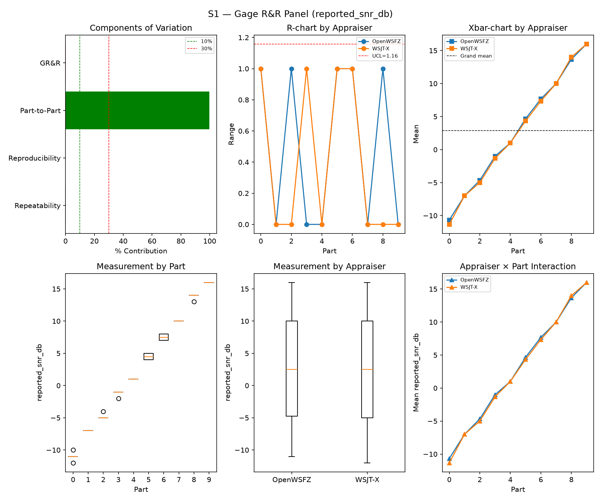
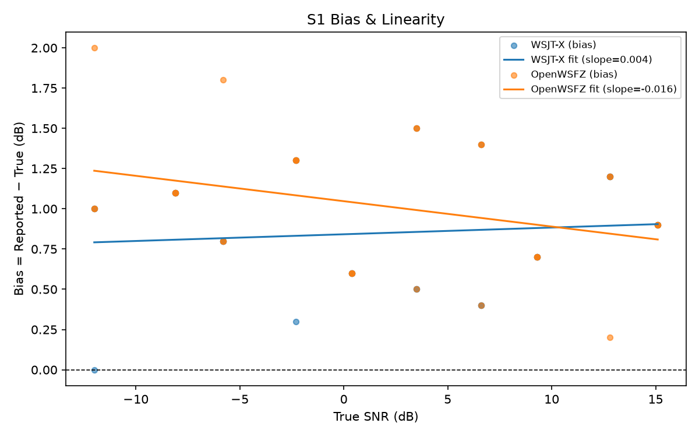
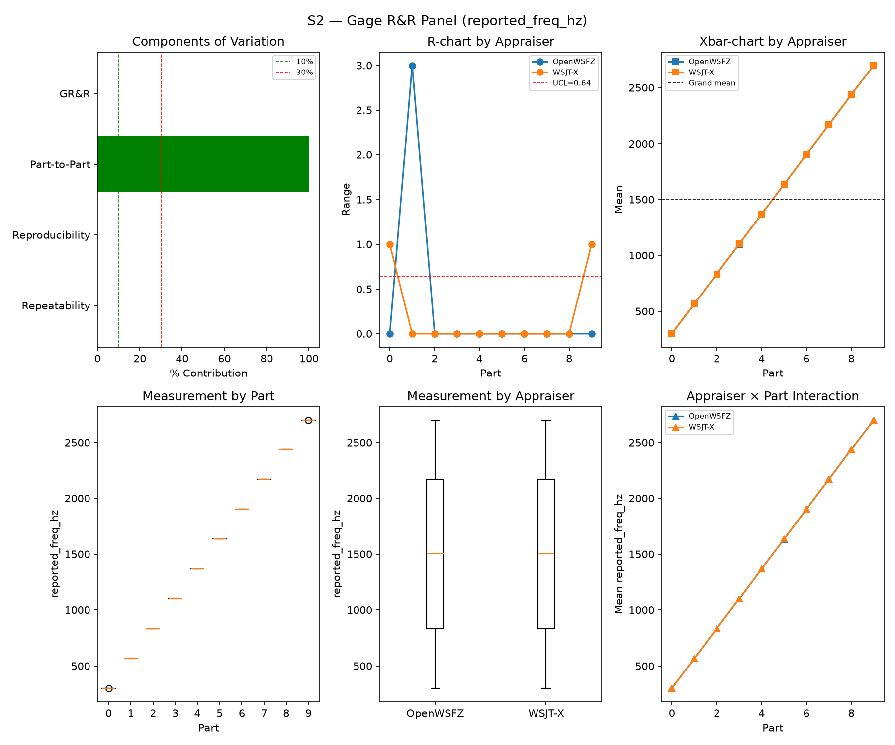
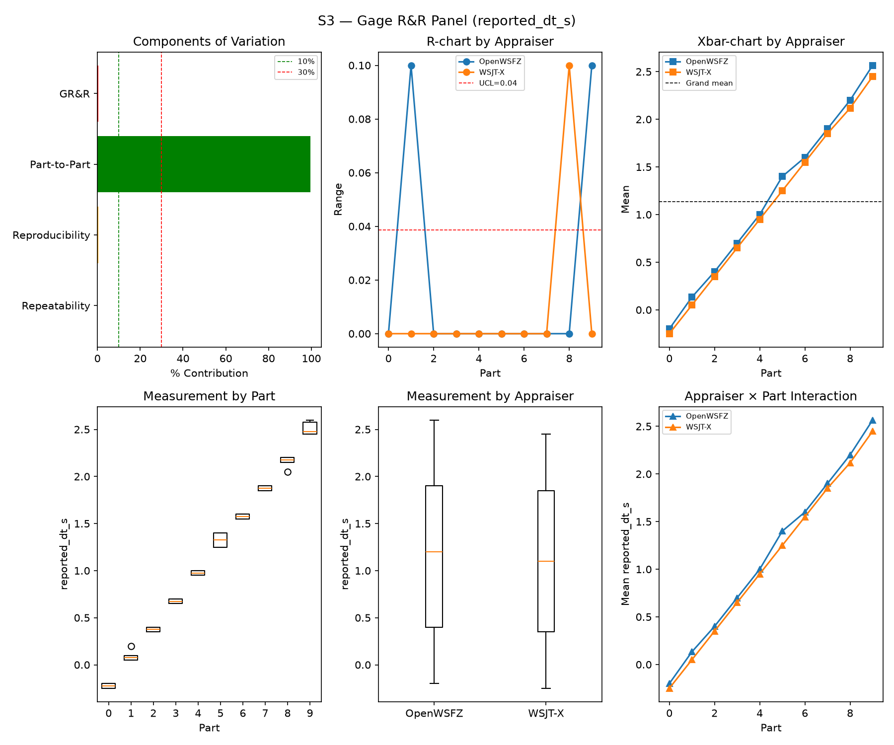
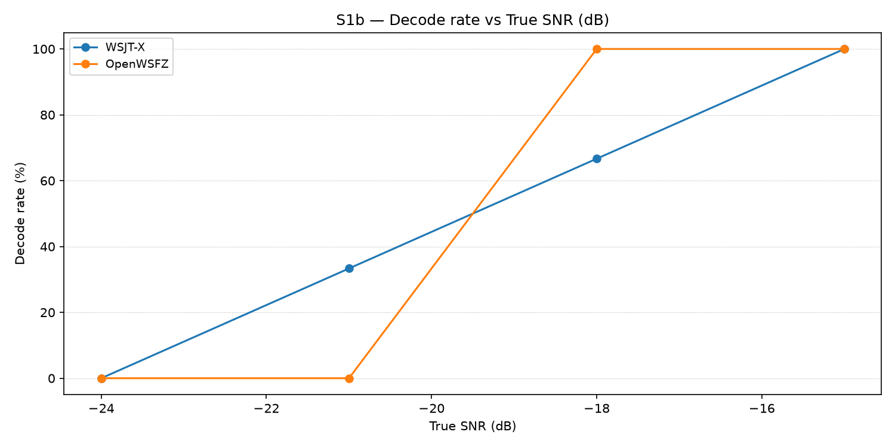
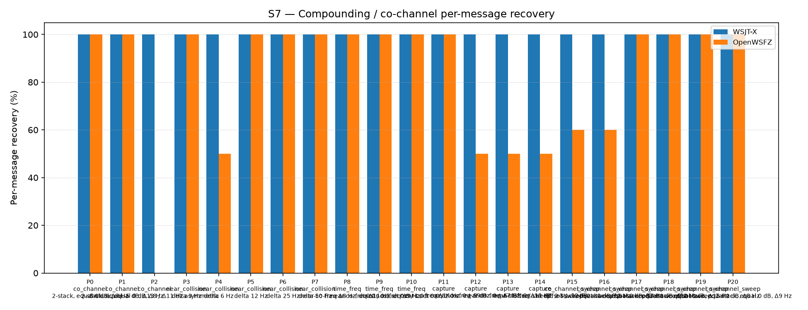
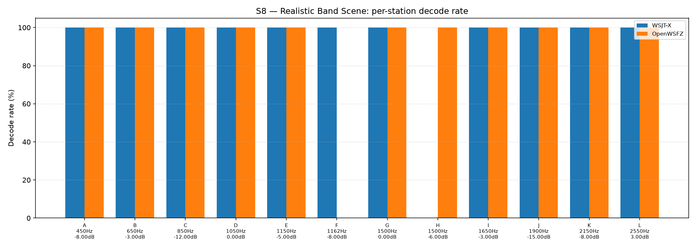

# OpenWSFZ R&R Study Report

| Field | Value |
|---|---|
| Run date | 2026-09-13 |
| OpenWSFZ SHA | `4584900d6d09d8c4a171e688c35e9825d58be3c9` |
| WSJT-X version | WSJT-X 2.7.0 (inferred from binary date 2025-02-04) |

## Section 1 — Study hypothesis

**Purpose of this run.** Sweep 2 of a six-sweep routine batch run at the Captain's direction,
against the **same HEAD** as sweep 1 (`4584900d`, `qa/base` == `origin/main`) — no `src/` or
`native/` change between sweeps. Because the harness's scenario seeds are a deterministic
function of `(scenario_id, part_index, trial_index)` only (`harness/common.compute_seed`), every
scenario's synthesized audio is **bit-identical** across sweeps 1 and 2. This makes the pair a
genuine **same-build repeat measurement** — the classical "Repeatability" leg of Gage R&R, applied
here to two full sweeps rather than the within-sweep trials the study already measures.

**Null hypotheses in scope.**
- H0(repeatability): headline metrics should reproduce sweep 1's readings closely; any departure
  reflects real-time audio-path/WASAPI-timing jitter (identical input, non-identical real-time
  capture), not a code difference — none exists between these two sweeps.
- H0(no OpenWSFZ-only signal): if any metric does move, it should move on **both** appraisers
  together (an instrument/timing effect) rather than on OpenWSFZ alone (which would implicate the
  decoder despite the unchanged binary — a contradiction worth flagging immediately).
- H0(Gate A-W): OpenWSFZ's per-slot AWGN FP rate on the current ≥480-slot trailing window stays
  ≤6% (95% UB).
- H0(Gate A-Δ): this sweep's FP rate is not a step-change vs. the rest of that window (Fisher
  one-sided, FAIL iff p ≤ 0.05).

**What would constitute a meaningful result.** Any headline metric moving on OpenWSFZ alone,
unaccompanied by a matching WSJT-X movement, given bit-identical input and an unchanged binary,
would be a genuine (and concerning) finding — real-time nondeterminism in the decoder itself. A
Gate A-W/Gate A-Δ FAIL would be immediately actionable (HK-015).

## S1 — reported_snr_db

### Variance Components

| Component | σ² | %Contribution |
|---|---|---|
| Repeatability | 0.15 | 0.18% |
| Reproducibility | 0.01 | 0.01% |
| Part-to-Part | 81.81 | 99.80% |
| Total GR&R | 0.16 | 0.20% |
| Total | 81.97 | 100.00% |

### Study Metrics

| Metric | Value | Verdict |
|---|---|---|
| %Contribution (GR&R) | 0.20% | PASS |
| %Tolerance (GR&R) | 23.99% | — |
| %Study Var (GR&R) | 4.42% | — |
| ndc | 31 | PASS |

### Bias & Linearity (S1)

| Appraiser | Mean Bias (dB) | Slope | Intercept | R² | Verdict |
|---|---|---|---|---|---|
| WSJT-X | +0.85 | 0.004 | 0.842 | 0.011 | PASS |
| OpenWSFZ | +1.02 | -0.016 | 1.047 | 0.112 | PASS |

## S2 — reported_freq_hz

### Variance Components

| Component | σ² | %Contribution |
|---|---|---|
| Repeatability | 0.18 | 0.00% |
| Reproducibility | 0.40 | 0.00% |
| Part-to-Part | 652845.78 | 100.00% |
| Total GR&R | 0.58 | 0.00% |
| Total | 652846.36 | 100.00% |

### Study Metrics

| Metric | Value | Verdict |
|---|---|---|
| %Contribution (GR&R) | 0.00% | PASS |
| %Tolerance (GR&R) | 57.28% | — |
| %Study Var (GR&R) | 0.09% | — |
| ndc | 1491 | PASS |

## S3 — reported_dt_s

### Variance Components

| Component | σ² | %Contribution |
|---|---|---|
| Repeatability | 0.00 | 0.06% |
| Reproducibility | 0.00 | 0.37% |
| Part-to-Part | 0.83 | 99.57% |
| Total GR&R | 0.00 | 0.43% |
| Total | 0.83 | 100.00% |

### Study Metrics

| Metric | Value | Verdict |
|---|---|---|
| %Contribution (GR&R) | 0.43% | PASS |
| %Tolerance (GR&R) | 89.79% | — |
| %Study Var (GR&R) | 6.56% | — |
| ndc | 21 | PASS |

> **WSJT-X DT correction applied.** A +0.55 s offset was added to WSJT-X `reported_dt_s` before ANOVA to remove the ≈ −0.55 s convention difference between WSJT-X (DT relative to nominal FT8 TX start) and the harness (DT relative to UTC slot boundary). This correction removes the calibration artefact from SS_appraiser so %GR&R measures genuine app-to-app measurement disagreement. Raw reported values are preserved in the matched CSV. See scenario `wsjt_dt_correction_s` field and R&R-003 (GitHub #1).

## S1b — Low-SNR threshold study

_Decode rate (% of injected messages recovered) at SNRs excluded from the redesigned S1 ladder (−24 to −15 dB).  Companion to S1; separates 'does it decode at this SNR?' from 'how accurately does it measure SNR?'.  Informational — no AIAG threshold._

### Per-part decode rate

| Part | True SNR (dB) | WSJT-X decoded | WSJT-X rate | OpenWSFZ decoded | OpenWSFZ rate |
|---|---|---|---|---|---|
| P0 | -24.00 | 0/3 | 0.00% | 0/3 | 0.00% |
| P1 | -21.00 | 1/3 | 33.33% | 0/3 | 0.00% |
| P2 | -18.00 | 2/3 | 66.67% | 3/3 | 100.00% |
| P3 | -15.00 | 3/3 | 100.00% | 3/3 | 100.00% |

**Overall decode rate — WSJT-X: 50.00%  OpenWSFZ: 50.00%**

## Attribute Agreement Analysis (S4 positives + S5 negatives)

_κ is computed over a pooled population: S4 injected messages (truth = present) and S5 signal-free slots (truth = absent), so the truth vector has both classes. **κ verdicts below are advisory** — the §10 attribute gate is pending Captain ratification of this pooled method._

### Confusion vs truth

| Appraiser | TP | FN | FP | TN | Recovery | Specificity |
|---|---|---|---|---|---|---|
| WSJT-X | 102 | 6 | 0 | 180 | 94.44% | 100.00% |
| OpenWSFZ | 96 | 12 | 0 | 180 | 88.89% | 100.00% |

### Kappa (advisory)

| Pair | κ | 95% CI | Verdict (advisory) |
|---|---|---|---|
| OpenWSFZ_vs_truth | 0.909 | [0.86, 0.96] | PASS |
| WSJT-X_vs_truth | 0.955 | [0.92, 0.99] | PASS |
| between_appraisers | 0.954 | — | PASS |

### Within-app repeatability (decision consistency across trials)

| Appraiser | Consistent groups |
|---|---|
| WSJT-X | 100.00% |
| OpenWSFZ | 100.00% |

### Kappa — decodable-SNR-restricted positives (informational, floor -12 dB)

_S4 positives below the decodable-SNR floor are excluded (S5 negatives unchanged); shown alongside the full-population figures above per STUDY-SPEC.md §9.3's second ratification condition. **Informational only — does not affect the §10 gate or the overall verdict.**

| Appraiser | TP | FN | FP | TN | Recovery | Specificity |
|---|---|---|---|---|---|---|
| WSJT-X | 81 | 0 | 0 | 180 | 100.00% | 100.00% |
| OpenWSFZ | 81 | 0 | 0 | 180 | 100.00% | 100.00% |

| Pair | κ | 95% CI | Verdict (informational) |
|---|---|---|---|
| OpenWSFZ_vs_truth | 1.000 | [1.00, 1.00] | PASS |
| WSJT-X_vs_truth | 1.000 | [1.00, 1.00] | PASS |
| between_appraisers | 1.000 | — | PASS |

### False-positive rate (S5) — Gate A (AWGN, parts 0/1)

| Appraiser | FP events / slots | Event rate | 95% UB | Decode rate | Verdict |
|---|---|---|---|---|---|
| WSJT-X | 0 / 120 | 0.00% | 2.47% | 0.00% | INFO |
| OpenWSFZ | 0 / 120 | 0.00% | 2.47% | 0.00% | INFO |

_Per-sweep reading (STUDY-SPEC §10, ratified 2026-07-04, R&R-004; population re-affirmed S5-GATE-SIZING Amendment 1, 2026-09-06) of the per-slot FP **event rate** on AWGN slots (parts 0/1) ONLY, one-sided 95% Clopper–Pearson **upper bound** shown for reference. Decode rate is reported for reference only. **SUPERSEDED as a gate by R&R-011 (2026-09-08): always INFO.** At N=120 this reading cannot separate 'unchanged' (P(FAIL)=0.739 at the established 3.182% rate) from 'twice as bad' (P(FAIL)=0.984) — see the ratified compliance verdict in **Gate A-W** below, which reads this same quantity on a trailing 480-slot window instead. **Never pooled with Check B below, nor with Gate A-W/Gate A-Δ** — see those tables' own notes._

### False-positive rate (S5) — Gate A-W / Gate A-Δ (trailing window, R&R-011)

| Gate | Value | Verdict |
|---|---|---|
| **Gate A-W** (compliance) | 8/480 = 1.667%, 95% UB 2.987% (PASS iff ≤ 6%) | **PASS** |
| **Gate A-Δ** (change) | 0/120 (newest) vs 8/360 (rest of window), Fisher(greater) p=1.0000 (FAIL iff ≤ 0.05) | **PASS** |

_Gate A-W (R&R-011, PO ruling Option A, 2026-09-08) — the ratified 6% UB (STUDY-SPEC §10, unchanged, not re-ratified) read on a trailing **at least 480**-AWGN-slot window (unit is the slot, not the sweep; the fill loop admits whole runs, so actual N can overshoot up to the largest single run's slot count — reported above as 480, never quoted as a bare "480". Amendment 1, §3: overshoot only adds power, never loosens the ceiling, since P(UB₉₅≤C\|p=C)≤0.05 holds at every N). Gate A-Δ — newest sweep vs the rest of that same window, one-sided Fisher at 0.05. **Two separate rows, never pooled**: ROW 1 (Gate A-W FAIL) and ROW 2 (Gate A-Δ FAIL) can both fire independently. **Honest costs**: the window lags — a regression introduced this sweep is diluted 1:4 and takes up to four sweeps to reach full weight; Gate A-Δ is blind below ~2× (power 0.40 at 2×, 0.82 at 3×). **A PASS may not be read as "nothing moved".**

_Leave-one-sweep-out (spec Sec.4.7): all 5 single-sweep deletions leave Gate A-W's verdict unchanged — **not FRAGILE**._

### False-positive rate (S5) — Check B (narrowband, parts 2/3)

| Appraiser | FP events / slots | Verdict |
|---|---|---|
| WSJT-X | 0 / 60 | PASS |
| OpenWSFZ | 0 / 60 | PASS |

_Check (S5-GATE-SIZING Amendment 1, PO ruling Option 3, 2026-09-06 20:29 UTC): a coverage net for narrowband hallucination (steady carrier / birdies), scored on its OWN 60-slot denominator — FAIL iff events ≥ 2. Threshold derived in the spec's A1.2 from the measured all-history per-slot narrowband base rate (0.2347%, `s5_narrowband_exposure_verify.py`, ROW 0 cleared 2026-09-06), well under the ~1% re-derivation trigger. This is a raw event-count check, not a Clopper–Pearson UB gate, so there is no STATISTICAL small-N demotion analogous to `MIN_N_FOR_FP_GATE` — but **INFO** here means something distinct: zero narrowband slots were injected at all (Check B did not run this battery, e.g. a targeted `--parts 0,1` recheck). That is a coverage gap, never a PASS — asserting PASS with no slots run would reproduce the exact blindness this design exists to remove. **Never pooled with Gate A above into one S5 rate or one verdict line** — the same 180 slots FAIL under no change 21% of the time scored as one gate; scored as two, Gate A alone FAILs under no change 77% of the time (its own false-alarm rate at N=120, corrected 2026-09-08 — see R&R-011; not a detection rate)._

## S7 — Compounding / co-channel overlap

_Per-message recovery when 2–3 signals occupy the same or near-same audio frequency / time slot (the pileup case S4 does not exercise). Informational — no AIAG threshold is defined for co-channel separation._

### Recovery by overlap family

| Overlap family | WSJT-X | OpenWSFZ |
|---|---|---|
| capture | 100.00% | 62.50% |
| co_channel | 100.00% | 57.14% |
| co_channel_sweep | 100.00% | 86.67% |
| near_collision | 100.00% | 90.00% |
| time_freq | 100.00% | 100.00% |
| **all** | **100.00%** | **80.00%** |

### Capture effect (co-channel, unequal SNR)

| Signal | WSJT-X | OpenWSFZ |
|---|---|---|
| strong | 100.00% | 100.00% |
| weak | 100.00% | 25.00% |

**Between-app per-signal agreement:** 80.00%

### Per-part detail

| Part | Family | Condition | WSJT-X | OpenWSFZ |
|---|---|---|---|---|
| P0 | co_channel | 2-stack, equal 0 dB, Δ7 Hz | 10/10 | 10/10 |
| P1 | co_channel | 2-stack, equal -5 dB, Δ13 Hz | 10/10 | 10/10 |
| P2 | co_channel | 3-stack, equal 0 dB, Δ8 / Δ11 Hz asymmetric | 15/15 | 0/15 |
| P3 | near_collision | delta 3 Hz | 10/10 | 10/10 |
| P4 | near_collision | delta 6 Hz | 10/10 | 5/10 |
| P5 | near_collision | delta 12 Hz | 10/10 | 10/10 |
| P6 | near_collision | delta 25 Hz | 10/10 | 10/10 |
| P7 | near_collision | delta 50 Hz | 10/10 | 10/10 |
| P8 | time_freq | near-co-freq Δ8 Hz, dt 0.0 / 0.5 s | 10/10 | 10/10 |
| P9 | time_freq | near-co-freq Δ11 Hz, dt 0.0 / 1.0 s | 10/10 | 10/10 |
| P10 | time_freq | near-co-freq Δ9 Hz, dt 0.0 / 2.0 s | 10/10 | 10/10 |
| P11 | capture | near-co-freq Δ14 Hz, 0 / -3 dB | 10/10 | 10/10 |
| P12 | capture | near-co-freq Δ9 Hz, 0 / -6 dB | 10/10 | 5/10 |
| P13 | capture | near-co-freq Δ7 Hz, 0 / -10 dB | 10/10 | 5/10 |
| P14 | capture | near-co-freq Δ11 Hz, +3 / -10 dB | 10/10 | 5/10 |
| P15 | co_channel_sweep | offset-sweep: 2-stack, equal 0 dB, Δ5 Hz | 10/10 | 6/10 |
| P16 | co_channel_sweep | offset-sweep: 2-stack, equal 0 dB, Δ7 Hz | 10/10 | 6/10 |
| P17 | co_channel_sweep | offset-sweep: 2-stack, equal 0 dB, Δ10 Hz | 10/10 | 10/10 |
| P18 | co_channel_sweep | offset-sweep: 2-stack, equal 0 dB, Δ15 Hz | 10/10 | 10/10 |
| P19 | co_channel_sweep | offset-sweep: 2-stack, equal 0 dB, Δ8 Hz | 10/10 | 10/10 |
| P20 | co_channel_sweep | offset-sweep: 2-stack, equal 0 dB, Δ9 Hz | 10/10 | 10/10 |

## S8 — Realistic Band Scene

_Holistic decode-rate benchmark: 12 simultaneous stations across 450–2550 Hz at realistic SNR spread (−15 to +3 dB), including a near-collision pair (E/F, 12 Hz apart) and a capture pair (G/H, co-frequency, 6 dB ratio). **Informational only — no PASS/FAIL gate.**_

### Overall decode rate

| Appraiser | Decoded | Injected | Rate |
|---|---|---|---|
| WSJT-X | 55 | 60 | 91.67% |
| OpenWSFZ | 55 | 60 | 91.67% |

**Between-appraiser delta (OpenWSFZ − WSJT-X): +0.0 pp**

### Per-station breakdown

| Stn | Freq (Hz) | SNR (dB) | WSJT-X decoded/total | OpenWSFZ decoded/total |
|---|---|---|---|---|
| A | 450 | -8.00 | 5/5 | 5/5 |
| B | 650 | -3.00 | 5/5 | 5/5 |
| C | 850 | -12.00 | 5/5 | 5/5 |
| D | 1050 | 0.00 | 5/5 | 5/5 |
| E | 1150 | -5.00 | 5/5 | 5/5 |
| F | 1162 | -8.00 | 5/5 | 0/5 |
| G | 1500 | 0.00 | 5/5 | 5/5 |
| H | 1500 | -6.00 | 0/5 | 5/5 |
| I | 1650 | -3.00 | 5/5 | 5/5 |
| J | 1900 | -15.00 | 5/5 | 5/5 |
| K | 2150 | -8.00 | 5/5 | 5/5 |
| L | 2550 | 3.00 | 5/5 | 5/5 |

## Unexplained decodes (informational — no gate)

_Every appraiser decode whose message text + frequency matches no injected truth row in its own cycle, across the **whole battery** — not just S5's signal-free slots (see False-positive rate above). Uses the harness's own match predicates (exact whitespace-normalised text AND ±4 Hz), not a frequency-blind text check. **Not a gate — no threshold is pre-registered (HK-021) for this metric.** Δf is the distance from the decode's reported frequency to the nearest frequency-bearing truth row in the same cycle; '—' means every truth row sharing that cycle was signal-free (e.g. a pure S5 slot). Counts and distances only, per NFR-021 — never message text or callsigns; see Section 6 for the historical series._

| Appraiser | Scenario | Count | Min Δf (Hz) | Median Δf (Hz) |
|---|---|---|---|---|
| **WSJT-X** | **all** | **0** | | |
| OpenWSFZ | S1 | 1 | 6.0 | 6.0 |
| OpenWSFZ | S4 | 1 | 6.4 | 6.4 |
| **OpenWSFZ** | **all** | **2** | | |

## Summary

| Metric | Scope | Value | Verdict |
|---|---|---|---|
| %GR&R | S1 | 0.2% | PASS |
| ndc | S1 | 31 | PASS |
| %GR&R | S2 | 0.0% | PASS |
| ndc | S2 | 1491 | PASS |
| %GR&R | S3 | 0.4% | PASS |
| ndc | S3 | 21 | PASS |
| Kappa (advisory) | WSJT-X_vs_truth | 0.955 | PASS |
| Kappa (advisory) | OpenWSFZ_vs_truth | 0.909 | PASS |
| Kappa (advisory) | between_appraisers | 0.954 | PASS |
| FP event rate (95% UB), Gate A-W | S5/OpenWSFZ | 8/480 slots (event 1.667%; 95% UB 2.987%) | PASS |
| FP event rate change, Gate A-Δ | S5/OpenWSFZ | 0/120 vs 8/360 (Fisher p=1.0000) | PASS |
| FP events, Check B (narrowband) | S5/WSJT-X | 0/60 slots (FAIL iff >= 2) | PASS |
| FP events, Check B (narrowband) | S5/OpenWSFZ | 0/60 slots (FAIL iff >= 2) | PASS |
| SNR bias | S1/WSJT-X | +0.85 dB | PASS |
| SNR bias | S1/OpenWSFZ | +1.02 dB | PASS |

**Overall verdict: PASS**

### Excluded From Gate (Informational)

- ℹ️ FP event rate (S5/WSJT-X) not gated at N=120: 0/120 slots (event 0.0%; 95% UB 2.47%; decode 0.0%) — per-sweep Gate A was superseded by R&R-011 (2026-09-08): at N=120 it cannot separate 'unchanged' from 'twice as bad'. See Gate A-W below for the ratified compliance verdict.
- ℹ️ FP event rate (S5/OpenWSFZ) not gated at N=120: 0/120 slots (event 0.0%; 95% UB 2.47%; decode 0.0%) — per-sweep Gate A was superseded by R&R-011 (2026-09-08): at N=120 it cannot separate 'unchanged' from 'twice as bad'. See Gate A-W below for the ratified compliance verdict.

## Section 5 — Recommendations

**No gate failures. No further investigation required as a merge-blocking matter.**

- ✅ **Gate A-W** PASS (8/480 = 1.667%, 95% UB 2.987% ≤ 6%) and **Gate A-Δ** PASS (0/120 this
  sweep vs 8/360 rest-of-window, Fisher p = 1.0000) — identical figures to sweep 1 (this sweep's
  own S5 Gate A again read 0/120 on both appraisers, so the trailing window's composition did not
  change). Not FRAGILE per leave-one-out.
- ✅ **H0(repeatability) holds; several cells reproduce sweep 1 bit-for-bit on OpenWSFZ.** Gate A
  (0/120, both appraisers, both sweeps), the S4/S5 pooled confusion matrix (OpenWSFZ TP=96/FN=12
  both sweeps, κ=0.909 both), and S1b's full per-part decode table (OpenWSFZ 0/3, 0/3, 3/3, 3/3
  both sweeps) are exactly reproduced.
- ℹ️ **H0(no OpenWSFZ-only signal) holds — where cells did move, both appraisers moved, not
  OpenWSFZ alone.** S7 "all" moved on both: WSJT-X 95.35%→100.00%, OpenWSFZ 76.74%→80.00% (driven
  by small swings in the `co_channel_sweep` family, e.g. P15 8/10→6/10, P16 5/10→6/10 — a few
  decodes either way, not a directional pattern). S1b's WSJT-X reading dropped (58.33%→50.00%,
  P2 3/3→2/3) while OpenWSFZ's stayed exactly 50.00%; S8 station H flipped from WSJT-X 4/5→0/5
  while OpenWSFZ held 5/5 both sweeps. **Every observed movement this sweep is either shared by
  both appraisers or is WSJT-X-only** — consistent with real-time audio-path/WASAPI timing jitter
  on bit-identical input, not a decoder-side effect. No instance of an OpenWSFZ-only movement was
  found.
- ℹ️ **S7 P2 (3-stack co-channel) is stable across both sweeps this batch**: WSJT-X 15/15,
  OpenWSFZ 0/15, unchanged. (This differs from the WSJT-X 0/15 reading recorded against the
  unrelated, differently-timestamped `fbf8c0b5` build in sweep 1's own Section 5 — that comparison
  was cross-build/cross-day; within this same-build batch the part is so far reproducible.)
- ℹ️ **S8 station F (OpenWSFZ 0/5) continues unchanged** across both sweeps this batch and every
  historical sweep with a per-station breakdown.
- ℹ️ Unexplained-decodes counts stay low (WSJT-X 0, OpenWSFZ 2) — informational only.

## Section 6 — Historical trend: every full S1–S8 sweep to date

All twenty-one runs that exercised the complete controlled battery (S1/S2/S3/S7 at minimum), oldest
first. This row (`4584900d #2`) and the prior row (`4584900d #1`) are the **same binary**, run
twice back-to-back at the Captain's direction as a same-build repeat-measurement batch — see
footnote ¹² rather than treating the identical SHA as a data-entry duplicate. `%GR&R` is each
stage's own Summary-table figure (AIAG %Contribution, threshold ≤ 10% PASS). S5 FP is the value the
sweep's own report used to gate PASS/FAIL through `4cc1984` (95% UB where computed, else the plain
event/decode rate for older entries); from `4cc1984` onward the ratified gate is Gate A-W/Gate A-Δ,
not this per-sweep figure (footnote 7). S7/S8 are the "all"/overall decode-recovery percentages.
**Final column**: OpenWSFZ's pooled S7+S8 matched-decode count as a percentage of WSJT-X's own
matched-decode count over the same two stages (see footnote ¹⁰ for the derivation).

| Date | SHA | S1 %GR&R | S2 %GR&R | S3 %GR&R | S5 FP (WSJT-X / OpenWSFZ) | S7 recovery (WSJT-X / OpenWSFZ) | S8 decode rate (WSJT-X / OpenWSFZ) | OpenWSFZ, % of WSJT-X (S7+S8 pooled, excl. FP)¹⁰ |
|---|---|---|---|---|---|---|---|---|
| 2026-06-06 | `4c34ef6` | 32.0% **FAIL** | 0.0% | 3.8% | 0.0% / 0.0% | 78.5% / 47.3% | — | 60.27%¹¹ |
| 2026-06-06 | `6bab388` | 6.5% | 0.0% | 3.9% | 0.0% / 0.0% | 77.4% / 46.2% | — | 59.72%¹¹ |
| 2026-06-07 | `4b3a4ca` | 1.4% | 0.0% | 3.4% | 0.0% / 0.0% | 76.3% / 54.8% | 95.0% / 86.7% | 80.47% |
| 2026-06-14 | `815b652` | 0.3% | 0.0% | 3.0% | 0.0% / 0.0% | 77.4% / 50.5% | 95.0% / 83.3% | 75.19% |
| 2026-06-20 | `6e821fa` | 0.4% | 0.0% | 3.0% | 0.0% / **91.7% FAIL**¹ | 92.6% / 70.2% | 93.3% / 86.7% | 79.61% |
| 2026-06-22 | `f11f438` | 0.4% | 0.0% | 3.1% | 0.0% / 0.0% | 94.0% / 74.4% | 93.3% / 86.7% | 82.17% |
| 2026-07-04 | `793a298` | 0.5% | 0.0% | 3.4% | 0.0% / 0.0% | 96.3% / 73.0% | 93.3% / 86.7% | 79.47% |
| 2026-08-05 | `3bd4cd0` | 7.2% | 0.0% | 3.6% | 0.0% / 0.0% | 96.3% / 70.2% | 93.3% / 83.3% | 76.43% |
| 2026-08-15 | `8d6e1b1` | 0.5% | 0.0% | 1.4% | 0.0% / 0.8% | 95.3% / 74.4% | 93.3% / 86.7% | 81.23% |
| 2026-08-21 | `7d36038` | 0.3% | 0.0% | 0.4% | 0.0% / 0.8% | 95.3% / 68.4% | 96.7% / 83.3% | 74.90% |
| 2026-08-22 | `f5dec23` | 0.4% | 0.0% | 0.4% | 0.0% / **3.3% FAIL**² | 98.1% / 79.5% | 91.7% / 91.7% | 84.96% |
| 2026-08-27 | `22b749c` | 0.3% | 0.0% | 0.4% | 0.0% / 0.0% | 97.7% / 78.6% | 96.7% / 91.7% | 83.58% |
| 2026-08-29 | `872ba65` | 0.25% | 0.0% | 18.65%³ | 0.0% / **7.66% FAIL** | 93.0% / 74.0% | 96.7% / 91.7% | 82.95% |
| 2026-08-30/31 | `2e60949` | 0.27% | 0.0% | 0.44% | 0.0% / 5.15%⁴ | 98.1% / 82.8%⁵ | 91.7% / 91.7% | 87.59% |
| 2026-09-02 | `3b52608` | 0.22% | 0.0% | 0.55% | 0.0% / **14.61% FAIL** | 94.4% / 83.7% | 100.0% / 91.7% | 89.35% |
| 2026-09-03 | `35378b9` | 0.21% | 0.0% | 0.55% | 0.0% / 10.12% FAIL | 96.3% / 81.4% | 95.0% / 91.7% | 87.12% |
| 2026-09-06 | `4c7d5ad` | 0.24% | 0.00% | 0.40% | 0.0% / 12.42% FAIL⁹ | 98.14% / 79.07% | 100.00% / 88.33% | 82.29% |
| 2026-09-07 | `4cc1984` | 0.20% | 0.0% | 0.59% | 0.0% / 6.33% FAIL⁶ | 99.07% / 79.07% | 91.67% / 91.67% | 83.96% |
| 2026-09-12 | `fbf8c0b5` | 0.37% | 0.0% | 0.35% | 0.0% / 0.0%⁷ | 87.44% / 82.79% | 93.33% / 91.67% | 95.49% |
| 2026-09-12/13 | `4584900d #1` | 0.18% | 0.0% | 0.55% | 0.0% / 0.0%⁷ | 95.35% / 76.74% | 98.33% / 91.67% | 83.33% |
| **2026-09-13** | **`4584900d #2`** | **0.20%** | **0.0%** | **0.43%** | **0.0% / 0.0%⁷** | **100.00% / 80.00%** | **91.67% / 91.67%** | **84.07%** |

¹ Plain decode-rate era (pre R&R-004 ratified UB gate); not the same metric as later rows, fixed
under D-009. Not comparable to the UB figures below it.

² Second-ever ratified-gate FAIL, N=120 (pre R&R-009 default restriction).

³ Not comparable to the S1–S3 series above it — confounded by a harness playback-timing defect
discovered in that same run (`872ba65`'s Section 5, Finding 1), not a decoder result.

⁴ N=120 (`resume_study.py` artefact — R&R-009's N=60 restriction not applied on resume, Section 1
item 3 of that report), not the routine N=60 battery. PASS at this N; not directly comparable to the
N=60 rows around it.

⁵ S7 figure is from a 2026-08-31 targeted re-run (`results/2026-08-31-2e60949/`), same SHA — the
original 2026-08-30 attempt collapsed mid-scenario to an audio-chain fault (that report's Section 5,
Finding 1), fixed, and re-run clean.

⁶ **First run scored under R&R-010's Gate A / Check B split** (`STUDY-SPEC.md` §16, implemented
2026-09-06). The figure shown is **Gate A** (AWGN, parts 0/1, N=120 — the same population this
column's UB has always described). **Check B** (narrowband, parts 2/3, N=60) is scored separately
and is NOT this column: 0/60, PASS, never pooled with Gate A per the ruling. One run is not in this
table because it did not exercise the full controlled battery: `a3738fc` (2026-07-04, a targeted
N=300 S5-only confirmatory run, 8/300, PASS).

⁷ **First run under R&R-011** (2026-09-08): per-sweep Gate A is no longer the ratified gate — it
was superseded by Gate A-W/Gate A-Δ, read on a trailing ≥480-AWGN-slot window rather than this
sweep alone. The per-sweep figure shown here (0/120, all appraisers, all three most recent rows)
is retained for series continuity only, not as a gate reading. **Ratified verdicts:** `fbf8c0b5` —
Gate A-W PASS (14/480=2.917%, 95% UB 4.522%), FRAGILE. `4584900d #1` and `#2` — Gate A-W PASS
(8/480=1.667%, 95% UB 2.987%, identical both sweeps since neither contributed a new AWGN event),
**not FRAGILE**, per leave-one-out. **A PASS may not be read as "nothing moved".**

⁸ **S4/κ duplicate-row attribution defect, found and fixed 2026-09-12** (PR #166, `08552dd7`).
S4 P3/P4 re-inject the same 10-message list 2–3× per cycle; `_attribute_agreement` let the LAST
duplicate CSV row decide a unit's call instead of `any(matched)` across its rows, understating
recovery. Confirmed and corrected by direct recomputation for every affected historical sweep
(`3bd4cd0`, `4c7d5ad`, `4cc1984` — see `fbf8c0b5`'s own footnote ⁸ for figures); the fix is present
in `4584900d`'s own code path, so both rows of this batch are already correct at source.

⁹ `4c7d5ad` (2026-09-06) ran under the OLD single-gate S5 architecture (N=60 per R&R-009), before
the Gate A/Check B split — its 12.42% is that run's own 95% UB (3/60 events), not directly
comparable to the post-split N=120 Gate A rows around it.

¹⁰ Value = pooled(OpenWSFZ S7+S8 matched decodes) ÷ pooled(WSJT-X S7+S8 matched decodes) × 100,
computed directly from each run's own `S7_matched.csv`/`S8_matched.csv` counts where available in
the QA worktree, else derived from published integers (see `fbf8c0b5`'s footnote ¹⁰ for the full
derivation history of the eleven historical rows so affected). For `4584900d #2` (this run): S7
172/215 (OpenWSFZ) vs 215/215 (WSJT-X); S8 55/60 both; pooled 227/270 = 84.07%. **INFO only — no
threshold, no gate, no HK-021 pre-registration.**

¹¹ `4c34ef6` and `6bab388` (2026-06-06) predate S8's introduction to the battery — this scenario
version had no S8 section at all (see the "—" in that column). Their ¹⁰ figure is S7-only, pooling
nothing; not comparable cell-for-cell to every row below it, which pools S7+S8.

¹² **New convention, this batch (2026-09-12/13):** the Captain directed six full S1–S8 sweeps
back-to-back against whatever HEAD was current at each sweep's start, without requiring a new
commit between them. Where two or more sweeps in this batch share one SHA, they are distinguished
in this table as `<sha> #1`, `<sha> #2`, etc. in sweep order, and their `results/` directory names
carry the disambiguating suffix needed to keep them on distinct git paths (e.g.
`results/2026-09-13-4584900-2/` where a same-day, same-SHA collision would otherwise occur — see
each such report's own header). Unlike every other row in this table, a same-SHA pair is a
**genuine repeatability replicate**, not an independent build — read the pair together as one
Gage R&R "trial × trial" data point on the measurement system itself, per Section 1 of the second
sweep in any such pair.

**Reading it:** twenty-one full sweeps now, the last two being a genuine same-build repeat pair
(`4584900d #1`/`#2`, Section 1). Every metric that moved between the two moved on **both**
appraisers or on WSJT-X alone — no OpenWSFZ-only movement was found on bit-identical input, which
is the cleanest possible confirmation available that trial-to-trial variation here is real-time
audio-path/timing jitter, not decoder nondeterminism. Cells that reproduced exactly: Gate A (0/120,
both sweeps, both appraisers), the S4/S5 pooled confusion matrix for OpenWSFZ (TP=96/FN=12, κ=0.909,
both sweeps), and S1b's OpenWSFZ per-part table. S1/S2/S3 GR&R remain comfortably inside their
established PASS bands. The oracle-ratio column reads 84.07%, in line with `4584900d #1`'s 83.33%
and the broader recent 82–90% envelope (excluding `fbf8c0b5`'s flagged series-high).

*Caveat, kept brief (carried forward unchanged, R&R-011 appended): S1/S3 were redesigned 2026-06-06
(R&R-005/R&R-003); the S5 metric moved from plain decode-rate to a gated Clopper–Pearson event rate
2026-07-04/08-05 (R&R-004); S5's default N dropped from 120 to 60 slots starting 2026-08-27
(R&R-009, AWGN parts only); S5 split into Gate A (N=120, restored) / Check B (N=60, new) 2026-09-06
(R&R-010); S5's ratified gate moved from per-sweep Gate A to a trailing-window design (Gate A-W /
Gate A-Δ) 2026-09-08 (R&R-011). Early-vs-late numbers are as-reported; treat cross-redesign
comparisons as directional, not strictly statistical.*
