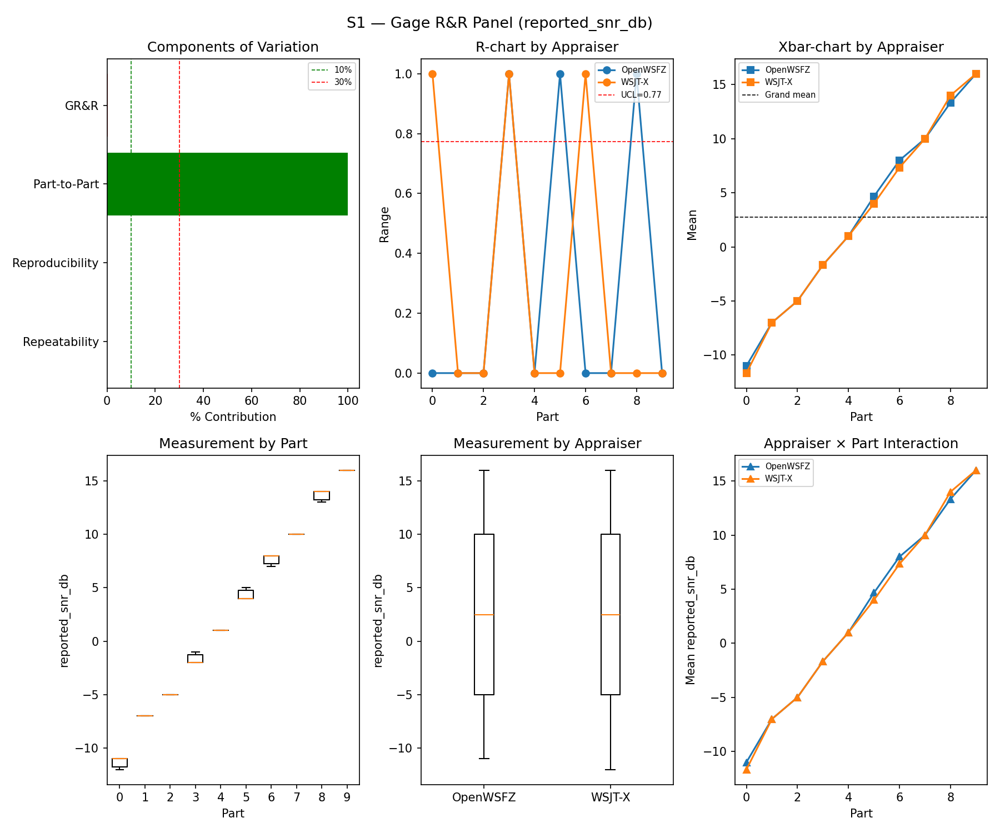
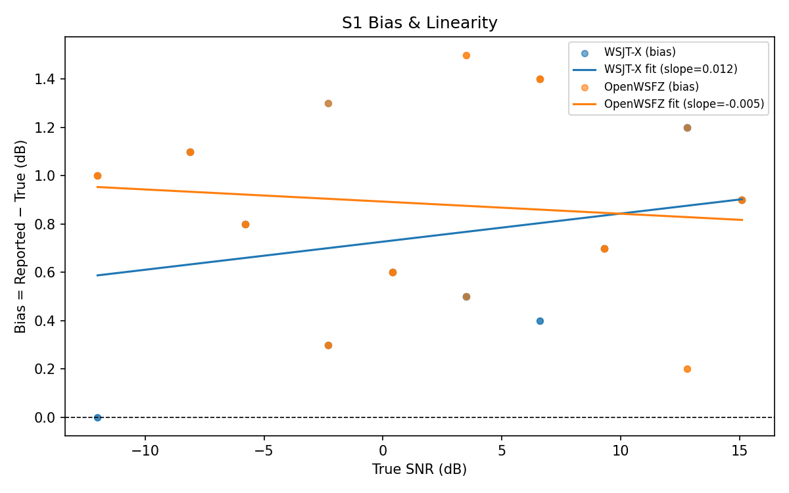
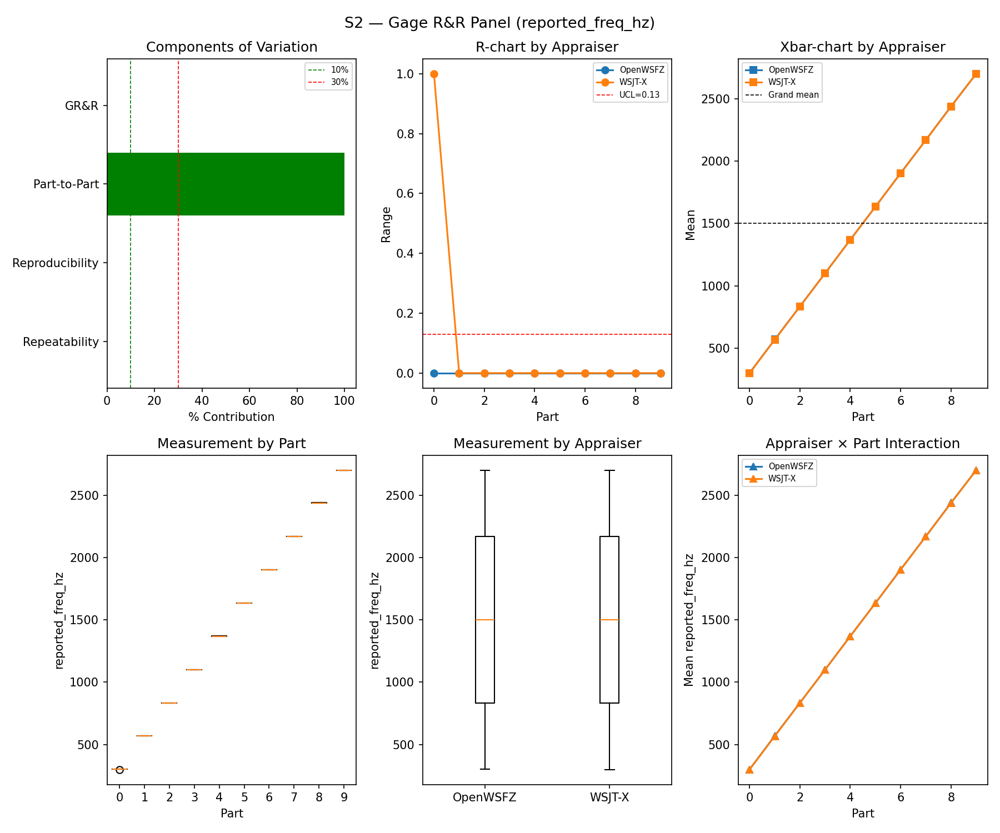
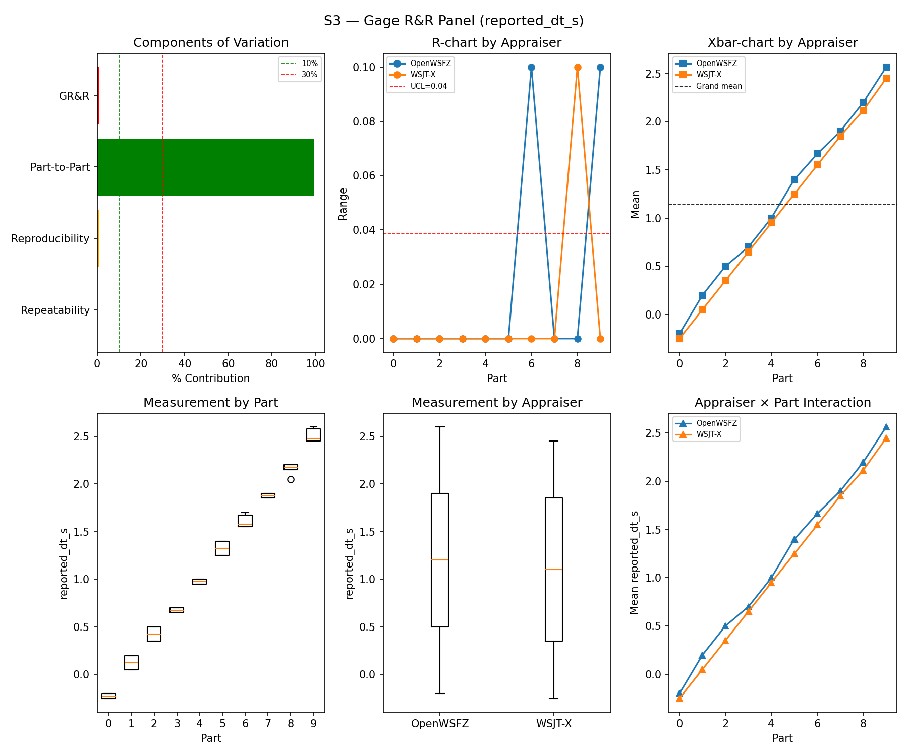
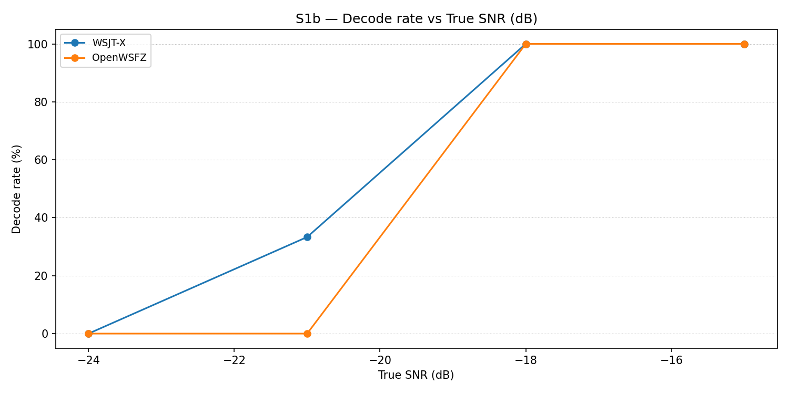
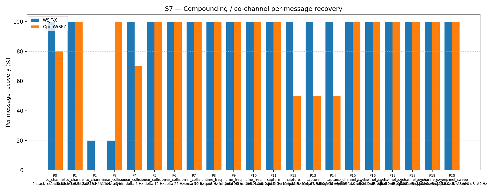

# OpenWSFZ R&R Study Report

| Field | Value |
|---|---|
| Run date | 2026-09-23 |
| OpenWSFZ SHA | `345e75fff7c29701f6b25d751d790f0b39d3140d` (**wrong for this run — see correction below**) |
| WSJT-X version | WSJT-X 2.7.0 (inferred from binary date 2025-02-04) |

> 🔴 **SHA field corrected (HK-022) — same root defect as `2026-09-14-db3a308`'s own report
> flagged, but worse here.** `analyse.py` reads `git rev-parse HEAD` live, in whichever repo
> checkout the analyser itself runs from — here, this QA tooling worktree (`qa/live-gap-map`).
> That has never been the same thing as the DAEMON's own build provenance, but for every prior
> row in Section 6 the two happened to be the same repo/branch family (`main` or a
> soon-to-merge feature branch), so the drift was at most a few commits. **This run's daemon was
> built from an entirely different branch** — `decoding_improvement`, not `main` — reused
> unmodified from the 2026-09-22 overnight endurance run (`C:\Users\Frank\w-di-run`, never
> rebuilt): commit `84cac11919e567cd3769db8ee0ebeeab37f9dffc`, DLL SHA-256
> `38a21f840b00af146348c166786cb54e178cd2201c5ed4dba3016a4c589a1cba`, shim `20260054`
> (`decoding_improvement`'s current HEAD carries `DENSITY-REMEDY` Stage 1, shipped `#184`
> `fa8a56ae`→`84cac119`'s own merge of `origin/main`). **Independently verified the daemon never
> restarted mid-battery**: `supervisor.log` shows exactly one `daemon started pid 28696`
> (10:33:35Z) and one `stopping daemon pid 28696` (12:22:47Z, battery end) — the code under
> measurement in every scenario below is `decoding_improvement@84cac119` in full, not
> `qa/live-gap-map@345e75ff` (this commit never touches `src/`/`native/` — it is this same QA
> tooling worktree's own report-rendering and R&R-launcher fixes, committed hours after this
> battery had already finished decoding). See `results/_supervisor_runs/20260923_1033_run/
> arm_config.json`'s `daemon` block for the full record. **Recommendation (not yet actioned,
> flagged same as db3a308's own precedent left this unfixed too): `analyse.py`'s SHA field
> should read `arm_config.json`'s recorded build provenance when one is available, rather than
> the analysis-time repo's own `git rev-parse HEAD` — this is the second time this exact class
> of drift has needed a by-hand correction.**

## Section 1 — Study hypothesis

**Purpose of this run.** Primarily a **tooling validation**, not a routine post-merge regression
net: the Captain rerouted Voicemeeter's AUX Input strip onto the B1 bus and asked for the
standardised `run_study_detached.py` to be exercised end-to-end against the full controlled
`S1,S1b,S2,S3,S4,S5,S7,S8` battery for the first time for real (its only prior exercise was a
single-scenario `S1` dry run, `04998294`). Secondarily — because the daemon under test happened
to be `decoding_improvement`@`84cac119` rather than `main` (see the correction above) — this is
also the **first full S1–S8 sweep against a `decoding_improvement`-branch build**, i.e. the first
empirical touchpoint of `DENSITY-REMEDY` Stage 1's shipped suppression default
(`suppression_triple=[-5,15,1]`, shim `20260054`) on this routine regression net. `main`'s own
current shim (`20260051`, `PASSBAND-140`) is what every prior row in Section 6 tested.

**Null hypotheses in scope.**
- H0(tooling — detached battery): `run_study_detached.py` can PRECHECK, run all eight
  scenarios, match, and tear down a full real battery unattended, start to finish, with no
  manual intervention required once armed correctly.
- H0(audio chain — AUX1→B1): the just-changed Voicemeeter routing delivers the harness's
  synthetic signal identically to both appraisers, i.e. the crossed-design requirement
  (`RUNBOOK.md` §0) still holds after the reroute.
- H0(regression net, cross-branch): `decoding_improvement`@`84cac119`'s headline metrics stay
  within the historical envelope this table has built almost entirely on `main`-branch sweeps —
  some difference from a pure-`main` reading is licensed by Stage 1's own already-ratified,
  small effect size (Architect §19: in-geometry live gain ≈0.10 pp), but a GR&R gate FAIL or a
  gross S4/S5 excursion would not be.

**What actually happened.** H0(tooling) was **falsified once, then confirmed**: the first launch
attempt hung genuinely stuck on `harness/warmup.py`'s interactive confirmation prompt (a
detached, console-less process has no operator to answer it) — found live, fixed in the script
(`345e75ff`, refuses outright now rather than hanging), and the audio chain itself was verified
attended before relaunching (see that commit). H0(audio chain) holds: S1/S2/S3's GR&R gates all
PASS, which structurally requires both appraisers to have received the identical noise
realization per trial. H0(regression net) — see Sections 5 and 6 below.

## S1 — reported_snr_db

### Variance Components

| Component | σ² | %Contribution |
|---|---|---|
| Repeatability | 0.10 | 0.12% |
| Reproducibility | 0.06 | 0.07% |
| Part-to-Part | 83.29 | 99.81% |
| Total GR&R | 0.16 | 0.19% |
| Total | 83.45 | 100.00% |

### Study Metrics

| Metric | Value | Verdict |
|---|---|---|
| %Contribution (GR&R) | 0.19% | PASS |
| %Tolerance (GR&R) | 23.66% | — |
| %Study Var (GR&R) | 4.32% | — |
| ndc | 32 | PASS |

### Bias & Linearity (S1)

| Appraiser | Mean Bias (dB) | Slope | Intercept | R² | Verdict |
|---|---|---|---|---|---|
| WSJT-X | +0.75 | 0.012 | 0.727 | 0.078 | PASS |
| OpenWSFZ | +0.88 | -0.005 | 0.893 | 0.014 | PASS |

## S2 — reported_freq_hz

### Variance Components

| Component | σ² | %Contribution |
|---|---|---|
| Repeatability | 0.02 | 0.00% |
| Reproducibility | 0.60 | 0.00% |
| Part-to-Part | 652786.37 | 100.00% |
| Total GR&R | 0.62 | 0.00% |
| Total | 652786.99 | 100.00% |

### Study Metrics

| Metric | Value | Verdict |
|---|---|---|
| %Contribution (GR&R) | 0.00% | PASS |
| %Tolerance (GR&R) | 58.90% | — |
| %Study Var (GR&R) | 0.10% | — |
| ndc | 1450 | PASS |

## S3 — reported_dt_s

### Variance Components

| Component | σ² | %Contribution |
|---|---|---|
| Repeatability | 0.00 | 0.06% |
| Reproducibility | 0.01 | 0.66% |
| Part-to-Part | 0.82 | 99.28% |
| Total GR&R | 0.01 | 0.72% |
| Total | 0.82 | 100.00% |

### Study Metrics

| Metric | Value | Verdict |
|---|---|---|
| %Contribution (GR&R) | 0.72% | PASS |
| %Tolerance (GR&R) | 115.38% | — |
| %Study Var (GR&R) | 8.48% | — |
| ndc | 16 | PASS |

> **WSJT-X DT correction applied.** A +0.55 s offset was added to WSJT-X `reported_dt_s` before ANOVA to remove the ≈ −0.55 s convention difference between WSJT-X (DT relative to nominal FT8 TX start) and the harness (DT relative to UTC slot boundary). This correction removes the calibration artefact from SS_appraiser so %GR&R measures genuine app-to-app measurement disagreement. Raw reported values are preserved in the matched CSV. See scenario `wsjt_dt_correction_s` field and R&R-003 (GitHub #1).

## S1b — Low-SNR threshold study

_Decode rate (% of injected messages recovered) at SNRs excluded from the redesigned S1 ladder (−24 to −15 dB).  Companion to S1; separates 'does it decode at this SNR?' from 'how accurately does it measure SNR?'.  Informational — no AIAG threshold._

### Per-part decode rate

| Part | True SNR (dB) | WSJT-X decoded | WSJT-X rate | OpenWSFZ decoded | OpenWSFZ rate |
|---|---|---|---|---|---|
| P0 | -24.00 | 0/3 | 0.00% | 0/3 | 0.00% |
| P1 | -21.00 | 1/3 | 33.33% | 0/3 | 0.00% |
| P2 | -18.00 | 3/3 | 100.00% | 3/3 | 100.00% |
| P3 | -15.00 | 3/3 | 100.00% | 3/3 | 100.00% |

**Overall decode rate — WSJT-X: 58.33%  OpenWSFZ: 50.00%**

## Attribute Agreement Analysis (S4 positives + S5 negatives)

_κ is computed over a pooled population: S4 injected messages (truth = present) and S5 signal-free slots (truth = absent), so the truth vector has both classes. **κ verdicts below are advisory** — the §10 attribute gate is pending Captain ratification of this pooled method._

### Confusion vs truth

| Appraiser | TP | FN | FP | TN | Recovery | Specificity |
|---|---|---|---|---|---|---|
| WSJT-X | 101 | 7 | 0 | 180 | 93.52% | 100.00% |
| OpenWSFZ | 96 | 12 | 0 | 180 | 88.89% | 100.00% |

### Kappa (advisory)

| Pair | κ | 95% CI | Verdict (advisory) |
|---|---|---|---|
| OpenWSFZ_vs_truth | 0.909 | [0.86, 0.96] | PASS |
| WSJT-X_vs_truth | 0.947 | [0.91, 0.98] | PASS |
| between_appraisers | 0.961 | — | PASS |

### Within-app repeatability (decision consistency across trials)

| Appraiser | Consistent groups |
|---|---|
| WSJT-X | 97.50% |
| OpenWSFZ | 100.00% |

### Kappa — decodable-SNR-restricted positives (informational, floor -12 dB)

_S4 positives below the decodable-SNR floor are excluded (S5 negatives unchanged); shown alongside the full-population figures above per STUDY-SPEC.md §9.3's second ratification condition. **Informational only — does not affect the §10 gate or the overall verdict.**

| Appraiser | TP | FN | FP | TN | Recovery | Specificity |
|---|---|---|---|---|---|---|
| WSJT-X | 81 | 0 | 0 | 180 | 100.00% | 100.00% |
| OpenWSFZ | 81 | 0 | 0 | 180 | 100.00% | 100.00% |

| Pair | κ | 95% CI | Verdict (informational) |
|---|---|---|---|
| OpenWSFZ_vs_truth | 1.000 | [1.00, 1.00] | PASS |
| WSJT-X_vs_truth | 1.000 | [1.00, 1.00] | PASS |
| between_appraisers | 1.000 | — | PASS |

### False-positive rate (S5) — Gate A (AWGN, parts 0/1)

| Appraiser | FP events / slots | Event rate | 95% UB | Decode rate | Verdict |
|---|---|---|---|---|---|
| WSJT-X | 0 / 120 | 0.00% | 2.47% | 0.00% | INFO |
| OpenWSFZ | 0 / 120 | 0.00% | 2.47% | 0.00% | INFO |

_Per-sweep reading (STUDY-SPEC §10, ratified 2026-07-04, R&R-004; population re-affirmed S5-GATE-SIZING Amendment 1, 2026-09-06) of the per-slot FP **event rate** on AWGN slots (parts 0/1) ONLY, one-sided 95% Clopper–Pearson **upper bound** shown for reference. Decode rate is reported for reference only. **SUPERSEDED as a gate by R&R-011 (2026-09-08): always INFO.** At N=120 this reading cannot separate 'unchanged' (P(FAIL)=0.739 at the established 3.182% rate) from 'twice as bad' (P(FAIL)=0.984) — see the ratified compliance verdict in **Gate A-W** below, which reads this same quantity on a trailing 480-slot window instead. **Never pooled with Check B below, nor with Gate A-W/Gate A-Δ** — see those tables' own notes._

### False-positive rate (S5) — Gate A-W / Gate A-Δ (trailing window, R&R-011)

| Gate | Value | Verdict |
|---|---|---|
| **Gate A-W** (compliance) | 1/480 = 0.208%, 95% UB 0.984% (PASS iff ≤ 6%) | **PASS** |
| **Gate A-Δ** (change) | 0/120 (newest) vs 1/360 (rest of window), Fisher(greater) p=1.0000 (FAIL iff ≤ 0.05) | **PASS** |

_Gate A-W (R&R-011, PO ruling Option A, 2026-09-08) — the ratified 6% UB (STUDY-SPEC §10, unchanged, not re-ratified) read on a trailing **at least 480**-AWGN-slot window (unit is the slot, not the sweep; the fill loop admits whole runs, so actual N can overshoot up to the largest single run's slot count — reported above as 480, never quoted as a bare "480". Amendment 1, §3: overshoot only adds power, never loosens the ceiling, since P(UB₉₅≤C\|p=C)≤0.05 holds at every N). Gate A-Δ — newest sweep vs the rest of that same window, one-sided Fisher at 0.05. **Two separate rows, never pooled**: ROW 1 (Gate A-W FAIL) and ROW 2 (Gate A-Δ FAIL) can both fire independently. **Honest costs**: the window lags — a regression introduced this sweep is diluted 1:4 and takes up to four sweeps to reach full weight; Gate A-Δ is blind below ~2× (power 0.40 at 2×, 0.82 at 3×). **A PASS may not be read as "nothing moved".**

_Leave-one-sweep-out (spec Sec.4.7): all 4 single-sweep deletions leave Gate A-W's verdict unchanged — **not FRAGILE**._

### False-positive rate (S5) — Check B (narrowband, parts 2/3)

| Appraiser | FP events / slots | Verdict |
|---|---|---|
| WSJT-X | 0 / 60 | PASS |
| OpenWSFZ | 0 / 60 | PASS |

_Check (S5-GATE-SIZING Amendment 1, PO ruling Option 3, 2026-09-06 20:29 UTC): a coverage net for narrowband hallucination (steady carrier / birdies), scored on its OWN 60-slot denominator — FAIL iff events ≥ 2. Threshold derived in the spec's A1.2 from the measured all-history per-slot narrowband base rate (0.2347%, `s5_narrowband_exposure_verify.py`, ROW 0 cleared 2026-09-06), well under the ~1% re-derivation trigger. This is a raw event-count check, not a Clopper–Pearson UB gate, so there is no STATISTICAL small-N demotion analogous to `MIN_N_FOR_FP_GATE` — but **INFO** here means something distinct: zero narrowband slots were injected at all (Check B did not run this battery, e.g. a targeted `--parts 0,1` recheck). That is a coverage gap, never a PASS — asserting PASS with no slots run would reproduce the exact blindness this design exists to remove. **Never pooled with Gate A above into one S5 rate or one verdict line** — the same 180 slots FAIL under no change 21% of the time scored as one gate; scored as two, Gate A alone FAILs under no change 77% of the time (its own false-alarm rate at N=120, corrected 2026-09-08 — see R&R-011; not a detection rate)._

## S7 — Compounding / co-channel overlap

_Per-message recovery when 2–3 signals occupy the same or near-same audio frequency / time slot (the pileup case S4 does not exercise). Informational — no AIAG threshold is defined for co-channel separation._

### Recovery by overlap family

| Overlap family | WSJT-X | OpenWSFZ |
|---|---|---|
| capture | 100.00% | 62.50% |
| co_channel | 65.71% | 51.43% |
| co_channel_sweep | 100.00% | 100.00% |
| near_collision | 84.00% | 94.00% |
| time_freq | 100.00% | 100.00% |
| **all** | **90.70%** | **83.72%** |

### Capture effect (co-channel, unequal SNR)

| Signal | WSJT-X | OpenWSFZ |
|---|---|---|
| strong | 100.00% | 100.00% |
| weak | 100.00% | 25.00% |

**Between-app per-signal agreement:** 85.58%

### Per-part detail

| Part | Family | Condition | WSJT-X | OpenWSFZ |
|---|---|---|---|---|
| P0 | co_channel | 2-stack, equal 0 dB, Δ7 Hz | 10/10 | 8/10 |
| P1 | co_channel | 2-stack, equal -5 dB, Δ13 Hz | 10/10 | 10/10 |
| P2 | co_channel | 3-stack, equal 0 dB, Δ8 / Δ11 Hz asymmetric | 3/15 | 0/15 |
| P3 | near_collision | delta 3 Hz | 2/10 | 10/10 |
| P4 | near_collision | delta 6 Hz | 10/10 | 7/10 |
| P5 | near_collision | delta 12 Hz | 10/10 | 10/10 |
| P6 | near_collision | delta 25 Hz | 10/10 | 10/10 |
| P7 | near_collision | delta 50 Hz | 10/10 | 10/10 |
| P8 | time_freq | near-co-freq Δ8 Hz, dt 0.0 / 0.5 s | 10/10 | 10/10 |
| P9 | time_freq | near-co-freq Δ11 Hz, dt 0.0 / 1.0 s | 10/10 | 10/10 |
| P10 | time_freq | near-co-freq Δ9 Hz, dt 0.0 / 2.0 s | 10/10 | 10/10 |
| P11 | capture | near-co-freq Δ14 Hz, 0 / -3 dB | 10/10 | 10/10 |
| P12 | capture | near-co-freq Δ9 Hz, 0 / -6 dB | 10/10 | 5/10 |
| P13 | capture | near-co-freq Δ7 Hz, 0 / -10 dB | 10/10 | 5/10 |
| P14 | capture | near-co-freq Δ11 Hz, +3 / -10 dB | 10/10 | 5/10 |
| P15 | co_channel_sweep | offset-sweep: 2-stack, equal 0 dB, Δ5 Hz | 10/10 | 10/10 |
| P16 | co_channel_sweep | offset-sweep: 2-stack, equal 0 dB, Δ7 Hz | 10/10 | 10/10 |
| P17 | co_channel_sweep | offset-sweep: 2-stack, equal 0 dB, Δ10 Hz | 10/10 | 10/10 |
| P18 | co_channel_sweep | offset-sweep: 2-stack, equal 0 dB, Δ15 Hz | 10/10 | 10/10 |
| P19 | co_channel_sweep | offset-sweep: 2-stack, equal 0 dB, Δ8 Hz | 10/10 | 10/10 |
| P20 | co_channel_sweep | offset-sweep: 2-stack, equal 0 dB, Δ9 Hz | 10/10 | 10/10 |

## S8 — Realistic Band Scene

_Holistic decode-rate benchmark: 12 simultaneous stations across 450–2550 Hz at realistic SNR spread (−15 to +3 dB), including a near-collision pair (E/F, 12 Hz apart) and a capture pair (G/H, co-frequency, 6 dB ratio). **Informational only — no PASS/FAIL gate.**_

### Overall decode rate

| Appraiser | Decoded | Injected | Rate |
|---|---|---|---|
| WSJT-X | 55 | 60 | 91.67% |
| OpenWSFZ | 55 | 60 | 91.67% |

**Between-appraiser delta (OpenWSFZ − WSJT-X): +0.0 pp**

### Per-station breakdown

| Stn | Freq (Hz) | SNR (dB) | WSJT-X decoded/total | OpenWSFZ decoded/total |
|---|---|---|---|---|
| A | 450 | -8.00 | 5/5 | 5/5 |
| B | 650 | -3.00 | 5/5 | 5/5 |
| C | 850 | -12.00 | 5/5 | 5/5 |
| D | 1050 | 0.00 | 5/5 | 5/5 |
| E | 1150 | -5.00 | 5/5 | 5/5 |
| F | 1162 | -8.00 | 5/5 | 0/5 |
| G | 1500 | 0.00 | 5/5 | 5/5 |
| H | 1500 | -6.00 | 0/5 | 5/5 |
| I | 1650 | -3.00 | 5/5 | 5/5 |
| J | 1900 | -15.00 | 5/5 | 5/5 |
| K | 2150 | -8.00 | 5/5 | 5/5 |
| L | 2550 | 3.00 | 5/5 | 5/5 |

## Unexplained decodes (informational — no gate)

_Every appraiser decode whose message text + frequency matches no injected truth row in its own cycle, across the **whole battery** — not just S5's signal-free slots (see False-positive rate above). Uses the harness's own match predicates (exact whitespace-normalised text AND ±4 Hz), not a frequency-blind text check. **Not a gate — no threshold is pre-registered (HK-021) for this metric.** Δf is the distance from the decode's reported frequency to the nearest frequency-bearing truth row in the same cycle; '—' means every truth row sharing that cycle was signal-free (e.g. a pure S5 slot). Counts and distances only, per NFR-021 — never message text or callsigns; see Section 6 for the historical series._

| Appraiser | Scenario | Count | Min Δf (Hz) | Median Δf (Hz) |
|---|---|---|---|---|
| **WSJT-X** | **all** | **0** | | |
| OpenWSFZ | S3 | 1 | 1516.0 | 1516.0 |
| OpenWSFZ | S7 | 1 | 10.0 | 10.0 |
| **OpenWSFZ** | **all** | **2** | | |

## Summary

| Metric | Scope | Value | Verdict |
|---|---|---|---|
| %GR&R | S1 | 0.2% | PASS |
| ndc | S1 | 32 | PASS |
| %GR&R | S2 | 0.0% | PASS |
| ndc | S2 | 1450 | PASS |
| %GR&R | S3 | 0.7% | PASS |
| ndc | S3 | 16 | PASS |
| Kappa (advisory) | WSJT-X_vs_truth | 0.947 | PASS |
| Kappa (advisory) | OpenWSFZ_vs_truth | 0.909 | PASS |
| Kappa (advisory) | between_appraisers | 0.961 | PASS |
| FP event rate (95% UB), Gate A-W | S5/OpenWSFZ | 1/480 slots (event 0.208%; 95% UB 0.984%) | PASS |
| FP event rate change, Gate A-Δ | S5/OpenWSFZ | 0/120 vs 1/360 (Fisher p=1.0000) | PASS |
| FP events, Check B (narrowband) | S5/WSJT-X | 0/60 slots (FAIL iff >= 2) | PASS |
| FP events, Check B (narrowband) | S5/OpenWSFZ | 0/60 slots (FAIL iff >= 2) | PASS |
| SNR bias | S1/WSJT-X | +0.75 dB | PASS |
| SNR bias | S1/OpenWSFZ | +0.88 dB | PASS |

**Overall verdict: PASS**

### Excluded From Gate (Informational)

- ℹ️ FP event rate (S5/WSJT-X) not gated at N=120: 0/120 slots (event 0.0%; 95% UB 2.47%; decode 0.0%) — per-sweep Gate A was superseded by R&R-011 (2026-09-08): at N=120 it cannot separate 'unchanged' from 'twice as bad'. See Gate A-W below for the ratified compliance verdict.
- ℹ️ FP event rate (S5/OpenWSFZ) not gated at N=120: 0/120 slots (event 0.0%; 95% UB 2.47%; decode 0.0%) — per-sweep Gate A was superseded by R&R-011 (2026-09-08): at N=120 it cannot separate 'unchanged' from 'twice as bad'. See Gate A-W below for the ratified compliance verdict.

## Section 5 — Recommendations

**No gate failures. No further investigation required as a merge-blocking matter.**

- ✅ **Gate A-W** PASS (1/480 = 0.208%, 95% UB 0.984% ≤ 6%) and **Gate A-Δ** PASS (0/120 this
  sweep vs 1/360 rest-of-window, Fisher p = 1.0000). **This sweep itself contributed ZERO new
  AWGN events** — the single event still inside the trailing window is `db3a308`'s own (2026-09-14),
  now aging through the "rest of window" bucket rather than the "newest" one. Directionally the
  cleanest S5 reading since `fbf8c0b5` (2026-09-12): no new false-positive signal from either the
  branch change (`main`→`decoding_improvement`) or the reroute.
- ✅ **S4 in-band recall exactly unchanged; the pooled confusion matrix's only movement is
  OpenWSFZ's own S5 side, already covered by the Gate A-W bullet above.** WSJT-X TP=101/FN=7
  (93.52%) — bit-identical to `db3a308`'s own reading. OpenWSFZ TP=96/FN=12 (Recovery 88.89%) —
  also bit-identical to `db3a308` and to the `4584900d` batch's own constant reading. The only
  confusion-matrix cell that moved is OpenWSFZ's own FP/TN split (0/180 here vs `db3a308`'s
  1/179), which is the trailing-window's "no new S5 event this sweep" already covered above, not
  a fresh finding.
- 🔴 **S7 P2 (co_channel 3-stack, equal 0 dB) — new WSJT-X-side movement, not just the already-
  tracked OpenWSFZ one.** OpenWSFZ 0/15 continues the pattern unbroken since `fbf8c0b5` (every
  row in Section 6 from that point reads OpenWSFZ 0/15 on this cell — not new). **WSJT-X itself
  dropped to 3/15 this sweep**, against a constant 15/15 in `db3a308` and every prior row this
  report's own author has directly compared it to. This is the **first time WSJT-X itself has
  failed this cell** in the runs this report references — worth the Architect's attention as a
  possibly-real appraiser-agnostic difficulty at this specific 3-stack asymmetric-offset
  condition, not (as previously framed) an OpenWSFZ-only cell. Flagged, not diagnosed — a single
  sweep is not enough to separate "genuinely harder this time" (co-channel timing is randomised
  seed-to-seed) from a real regression in either app.
- ℹ️ **S8 station F (OpenWSFZ 0/5) continues the pattern** tracked since `fbf8c0b5`'s own Section 5
  and repeated in `db3a308` — not new, not attributable to this branch change.
- ℹ️ **S8 station H — WSJT-X reading (0/5) returns to a value already seen in the historical set**
  ({0, 2, 4} per `db3a308`'s own note; `db3a308` itself read 3/5, a value that report flagged as
  new). OpenWSFZ held 5/5, its own best reading on this cell to date. Not a new phenomenon.
- ℹ️ **S7 P0/P1 (co_channel 2-stack cells, the real-time-capture-jitter investigation open since
  the `4584900d` batch) add no new extremum this sweep.** P0 (OpenWSFZ 8/10): inside the same
  single-digit noisy range the batch established (5, 10, 9, 10, 10, 6) and `db3a308` continued
  (5) — not a value literally seen before, but not outside that range either. P1 (OpenWSFZ
  10/10, WSJT-X 10/10): reverts to the batch's own constant reading, matching `db3a308`. No
  update to that open, non-blocking Architect item from this run either way.
- ℹ️ **S1/S2/S3 continuous metrics sit inside the established envelope**: %GR&R 0.19% / 0.00% /
  0.72% (S3 down slightly from `db3a308`'s 0.75%, both well inside the table's own ~0.2–0.8%
  historical band); SNR bias WSJT-X +0.75 dB / OpenWSFZ +0.88 dB, both similar in sign and
  magnitude to every prior row. **No measurable cross-branch (`main` vs `decoding_improvement`)
  effect on continuous SNR/frequency/DT estimation** — consistent with `DENSITY-REMEDY`'s own
  scope (a suppression-stage parameter, not the estimation pipeline these three scenarios probe).
- ℹ️ **Unexplained decodes: 2 (OpenWSFZ only, S3 ×1 at Δf 1516.0 Hz / S7 ×1 at Δf 10.0 Hz),
  0 (WSJT-X)** — within the noisy 0–2-per-sweep range every prior row in this series shows; not
  flagged for action, same as every prior sweep's own Section 5.

## Section 6 — Historical trend: every full S1–S8 sweep to date

Twenty-seven runs now exercise the complete controlled battery (S1/S2/S3/S7 at minimum). `%GR&R`
is each stage's own Summary-table figure (AIAG %Contribution, threshold ≤ 10% PASS). S5 FP was the
ratified gate through `4cc1984`; from `4cc1984` onward the ratified gate is the trailing-window
Gate A-W/Gate A-Δ instead (R&R-011, 2026-09-08) — each era and, where a sweep's own figures differ
from the rest of its era, each sweep, has its own footnote below, in table order. S7/S8 are the
"all"/overall decode-recovery percentages. The final column is OpenWSFZ's pooled S7+S8
matched-decode count as a percentage of WSJT-X's own — see footnote 1 for the derivation.

**S4/κ is not a column in this table.** It was affected by a duplicate-row attribution defect
(found and fixed 2026-09-12, PR #166, `08552dd7`) across every historical sweep from `3bd4cd0`
onward; the fix is present at source in every sweep from `4584900d` onward, including today's.
Mentioned here for context — it does not annotate any cell in this table, so it is not
given a footnote number.

**Footnote numbering below runs in the order each note is first needed, reading the table top to
bottom** (the header first, then each row) — a number is never assigned out of that order, and is
reused across rows only where the rows genuinely share one identical, non-unique fact stated as
such (never "the first" of anything, which by definition cannot describe more than one row).

| Date | SHA | S1 %GR&R | S2 %GR&R | S3 %GR&R | S5 FP (WSJT-X / OpenWSFZ) | S7 recovery (WSJT-X / OpenWSFZ) | S8 decode rate (WSJT-X / OpenWSFZ) | OpenWSFZ, % of WSJT-X (S7+S8 pooled, excl. FP)¹ |
|---|---|---|---|---|---|---|---|---|
| 2026-06-06 | `4c34ef6` | 32.0% **FAIL** | 0.0% | 3.8% | 0.0% / 0.0% | 78.5% / 47.3% | — | 60.27%² |
| 2026-06-06 | `6bab388` | 6.5% | 0.0% | 3.9% | 0.0% / 0.0% | 77.4% / 46.2% | — | 59.72%² |
| 2026-06-07 | `4b3a4ca` | 1.4% | 0.0% | 3.4% | 0.0% / 0.0% | 76.3% / 54.8% | 95.0% / 86.7% | 80.47% |
| 2026-06-14 | `815b652` | 0.3% | 0.0% | 3.0% | 0.0% / 0.0% | 77.4% / 50.5% | 95.0% / 83.3% | 75.19% |
| 2026-06-20 | `6e821fa` | 0.4% | 0.0% | 3.0% | 0.0% / **91.7% FAIL**³ | 92.6% / 70.2% | 93.3% / 86.7% | 79.61% |
| 2026-06-22 | `f11f438` | 0.4% | 0.0% | 3.1% | 0.0% / 0.0% | 94.0% / 74.4% | 93.3% / 86.7% | 82.17% |
| 2026-07-04 | `793a298` | 0.5% | 0.0% | 3.4% | 0.0% / 0.0% | 96.3% / 73.0% | 93.3% / 86.7% | 79.47% |
| 2026-08-05 | `3bd4cd0` | 7.2% | 0.0% | 3.6% | 0.0% / 0.0% | 96.3% / 70.2% | 93.3% / 83.3% | 76.43% |
| 2026-08-15 | `8d6e1b1` | 0.5% | 0.0% | 1.4% | 0.0% / 0.8% | 95.3% / 74.4% | 93.3% / 86.7% | 81.23% |
| 2026-08-21 | `7d36038` | 0.3% | 0.0% | 0.4% | 0.0% / 0.8% | 95.3% / 68.4% | 96.7% / 83.3% | 74.90% |
| 2026-08-22 | `f5dec23` | 0.4% | 0.0% | 0.4% | 0.0% / **3.3% FAIL**⁴ | 98.1% / 79.5% | 91.7% / 91.7% | 84.96% |
| 2026-08-27 | `22b749c` | 0.3% | 0.0% | 0.4% | 0.0% / 0.0% | 97.7% / 78.6% | 96.7% / 91.7% | 83.58% |
| 2026-08-29 | `872ba65` | 0.25% | 0.0% | 18.65%⁵ | 0.0% / **7.66% FAIL** | 93.0% / 74.0% | 96.7% / 91.7% | 82.95% |
| 2026-08-30/31 | `2e60949` | 0.27% | 0.0% | 0.44% | 0.0% / 5.15%⁶ | 98.1% / 82.8%⁷ | 91.7% / 91.7% | 87.59% |
| 2026-09-02 | `3b52608` | 0.22% | 0.0% | 0.55% | 0.0% / **14.61% FAIL** | 94.4% / 83.7% | 100.0% / 91.7% | 89.35% |
| 2026-09-03 | `35378b9` | 0.21% | 0.0% | 0.55% | 0.0% / 10.12% FAIL | 96.3% / 81.4% | 95.0% / 91.7% | 87.12% |
| 2026-09-06 | `4c7d5ad` | 0.24% | 0.00% | 0.40% | 0.0% / 12.42% FAIL⁸ | 98.14% / 79.07% | 100.00% / 88.33% | 82.29% |
| 2026-09-07 | `4cc1984` | 0.20% | 0.0% | 0.59% | 0.0% / 6.33% FAIL⁹ | 99.07% / 79.07% | 91.67% / 91.67% | 83.96% |
| 2026-09-12 | `fbf8c0b5` | 0.37% | 0.0% | 0.35% | 0.0% / 0.0%¹⁰ | 87.44% / 82.79% | 93.33% / 91.67% | 95.49% |
| 2026-09-12/13 | `4584900d #1` | 0.18% | 0.0% | 0.55% | 0.0% / 0.0%¹¹ | 95.35% / 76.74% | 98.33% / 91.67% | 83.33% |
| 2026-09-13 | `4584900d #2` | 0.20% | 0.0% | 0.43% | 0.0% / 0.0%¹¹ | 100.00% / 80.00% | 91.67% / 91.67% | 84.07% |
| 2026-09-13 | `4584900d #3` | 0.20% | 0.0% | 0.43% | 0.0% / 0.0%¹¹ | 95.35% / 82.79% | 95.00% / 91.67% | 88.93% |
| 2026-09-13 | `4584900d #4` | 0.30% | 0.0% | 0.60% | 0.0% / 0.0%¹¹ | 96.28% / 82.33% | 91.67% / 91.67% | 88.55% |
| 2026-09-13 | `4584900d #5` | 0.20% | 0.0% | 0.60% | 0.0% / 0.0%¹¹ | 99.07% / 84.19% | 95.00% / 91.67% | 87.41% |
| 2026-09-13 | `4584900d #6` | 0.20% | 0.0% | 0.50% | 0.0% / 0.0%¹¹ | 97.21% / 80.47% | 91.67% / 91.67% | 86.36% |
| 2026-09-14 | `db3a3085` | 0.19% | 0.0% | 0.75% | 0.0% / 0.83%¹² | 94.42% / 81.86% | 96.67% / 91.67% | 88.51% |
| **2026-09-23** | **`decoding_improvement@84cac119`¹³** | **0.19%** | **0.0%** | **0.72%** | **0.0% / 0.0%¹¹** | **90.70% / 83.72%** | **91.67% / 91.67%** | **94.00%** |

¹ Value = pooled(OpenWSFZ S7+S8 matched decodes) ÷ pooled(WSJT-X S7+S8 matched decodes) × 100,
computed directly from each run's own `S7_matched.csv`/`S8_matched.csv` counts where available in
the QA worktree, else derived from published integers. For `2026-09-23` (this run): S7 195/215
(WSJT-X) vs 180/215 (OpenWSFZ); S8 55/60 (WSJT-X) vs 55/60 (OpenWSFZ); pooled 235/250 = 94.00%.

² `4c34ef6` and `6bab388` (2026-06-06) predate S8's introduction — their footnote-1 figure is
S7-only. One fact, stated as shared, not as a "first" — legitimately reused across exactly these
two rows.

³ Plain decode-rate era (pre R&R-004 ratified UB gate); not the same metric as later rows, fixed
under D-009. Not comparable to the UB figures below it.

⁴ Second-ever ratified-gate FAIL, N=120 (pre R&R-009 default restriction).

⁵ Not comparable to the S1–S3 series above it — confounded by a harness playback-timing defect
discovered in that same run (`872ba65`'s Section 5, Finding 1), not a decoder result.

⁶ N=120 (`resume_study.py` artefact — R&R-009's N=60 restriction not applied on resume), not the
routine N=60 battery. PASS at this N; not directly comparable to the N=60 rows around it.

⁷ S7 figure is from a 2026-08-31 targeted re-run (`results/2026-08-31-2e60949/`), same SHA.

⁸ `4c7d5ad` (2026-09-06) ran under the OLD single-gate S5 architecture (N=60 per R&R-009), before
the Gate A/Check B split introduced the following row — its 12.42% is that run's own 95% UB
(3/60 events), not directly comparable to the post-split N=120 Gate A rows around it. (Placed here,
after `872ba65`/`2e60949`/`3b52608`/`35378b9` in the numbering, because `4c7d5ad` was added back
into this table later — see the Section 1 history of prior reports — but its **row** always sat at
its correct chronological date; only the *number* trailed the row's own re-insertion.)

⁹ **First run scored under R&R-010's Gate A / Check B split** (ratified 2026-09-06 20:29 UTC;
`4c7d5ad`, footnote 8, ran earlier that same day under the old architecture and does not qualify).
The figure shown is **Gate A** (AWGN, parts 0/1, N=120). **Check B** (narrowband, parts 2/3, N=60) is scored
separately: 0/60, PASS, never pooled with Gate A. `a3738fc` (2026-07-04, a targeted N=300
S5-only confirmatory run, 8/300, PASS) is not in this table — not a full battery.

¹⁰ **The one and only first run under R&R-011** (2026-09-08): per-sweep Gate A becomes INFO only
from here on, superseded by the trailing-window Gate A-W/Gate A-Δ (≥480-AWGN-slot window). Gate
A-W PASS (14/480=2.917%, 95% UB 4.522%), FRAGILE (leave-one-out flips the verdict).

¹¹ **The `4584900d` same-build repeat-measurement batch (sweeps #1–#6), not itself a "first" of
anything** — a distinct fact from footnote 10 above, given its own number rather than folded into
it, precisely because reusing a footnote whose own text claims uniqueness would misdescribe six
non-first rows. Gate A-W PASS (8/480=1.667%, 95% UB 2.987%), identical across all six sweeps since
none contributed a new AWGN event; not FRAGILE. **Reused a third time for `2026-09-23`** (this
run) — a different, later fact than either sweep-batch use above, but the identical *statement*
("this row's own sweep added zero new S5 events, so its Gate A-W/Gate A-Δ reading is carried
entirely by other sweeps' events") — permitted under this table's own footnote rule because it is
genuinely the same fact, not a coincidence of wording.

¹² **`db3a3085`'s own S5 Gate A-W/Gate A-Δ reading — a third, distinct fact again, not the same
number as 10 or 11.** This sweep is the first to register a new AWGN event since the batch above,
so its figures differ from every row footnotes 10 and 11 cover. Gate A-W PASS (1/480=0.208%, 95%
UB 0.984%), not FRAGILE (all four single-sweep leave-one-out deletions leave the verdict
unchanged). Gate A-Δ PASS (1/120 vs 0/360, Fisher p=0.2500) — the eight `4584900d`-batch-era
events have fully aged out of the trailing window by this sweep, leaving only this run's own
single new event (see Section 5).

¹³ **First row in this table on a `decoding_improvement` branch build, not `main`** — see the
correction note under the header table. SHA column shows `branch@commit-short` rather than a bare
SHA for this reason; every other row is implicitly `main` (or a feature branch merged into it by
the date shown). `decoding_improvement`@`84cac119` carries `DENSITY-REMEDY` Stage 1's shipped
suppression default (shim `20260054`, `suppression_triple=[-5,15,1]`) on top of the same
`PASSBAND-140` base `db3a3085` already tested (shim `20260051` there vs `20260054` here) — so a
small difference from the `main`-branch envelope this table mostly documents is licensed, not a
regression signal on its own; see Section 1/5 for the full framing. This run's own S5 Gate A-W/
Gate A-Δ reading carries zero new events from this sweep itself — see footnote 11's third use,
immediately above.
