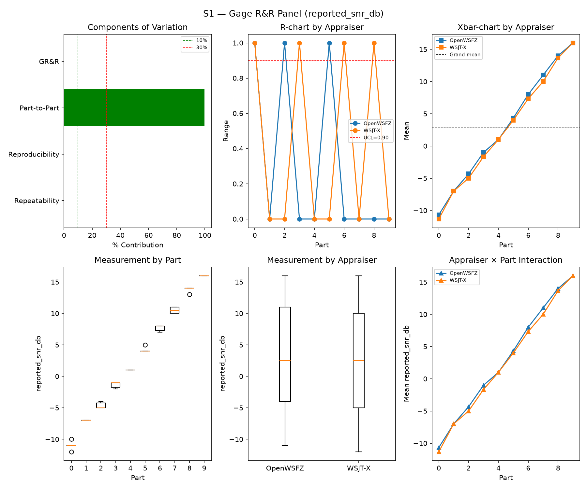
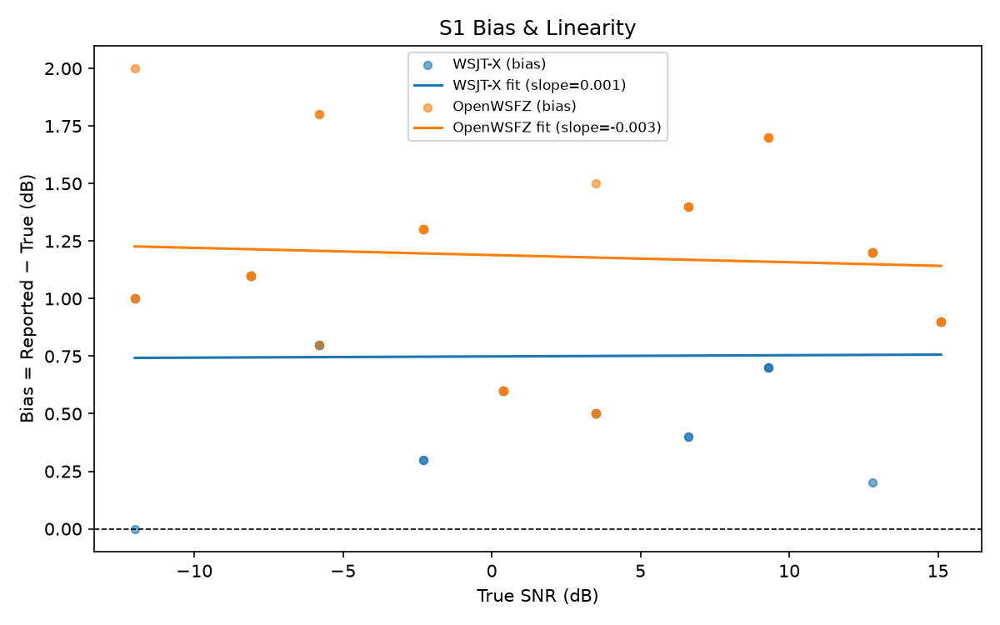
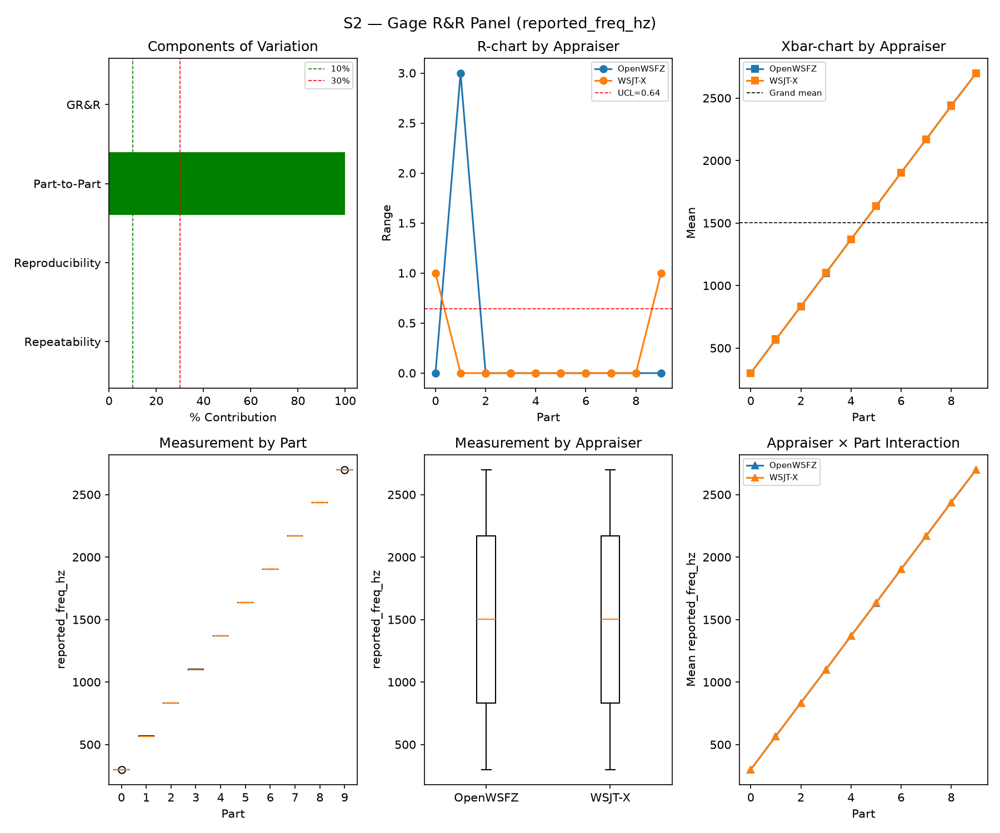
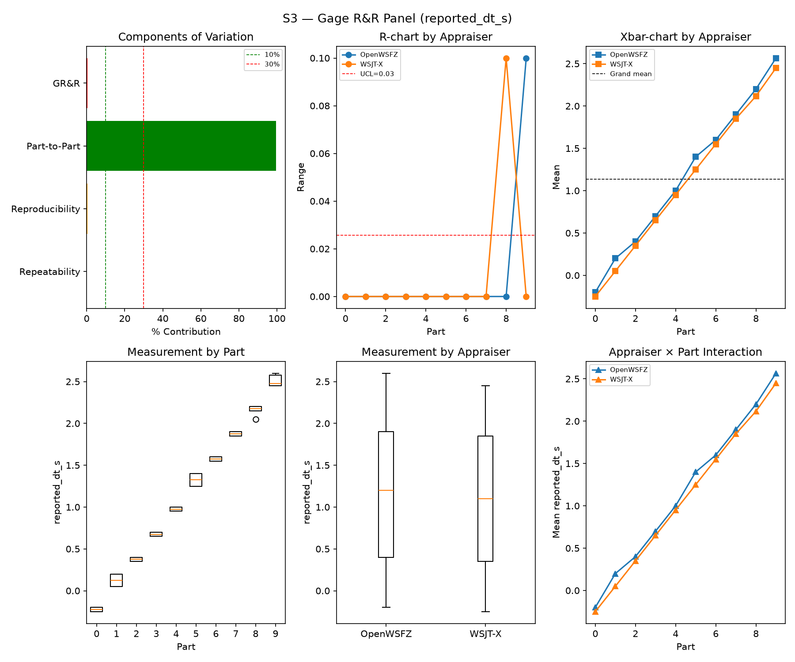
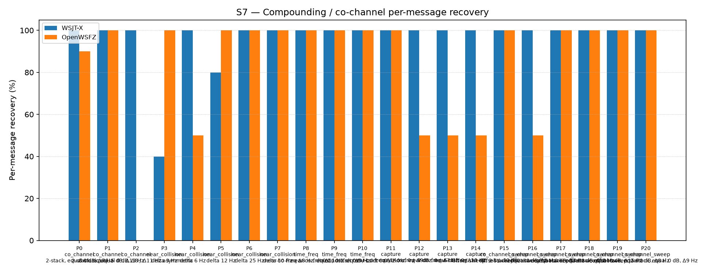
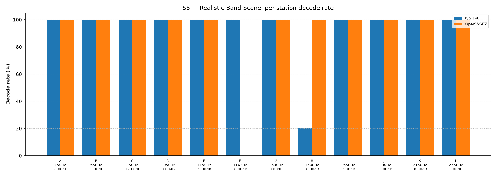

# OpenWSFZ R&R Study Report

| Field | Value |
|---|---|
| Run date | 2026-09-29 |
| OpenWSFZ SHA | `0d6b19377febf2a2aa5c2477742d543e27625407` (**corrected by hand, see below; the analyser wrote `62e8e74a…`**) |
| Flag | `decoder.subtractionEnabled = true` (**measurement run**) |
| WSJT-X version | WSJT-X 2.7.0 (inferred from binary date 2025-02-04) |

> 🔴 **SHA field corrected (HK-022), third occurrence.** `analyse.py` read `git rev-parse HEAD` from the QA
> tooling worktree (`62e8e74a`, branch `qa/live-gap-map`), not from the daemon's build. The daemon was
> `feat/sub-feas-native-subtraction` @ `0d6b1937`, `libft8.dll` SHA-256 `5a6a4dc0…e38c5`, shim `20260055`
> (`arm_config.json` of supervisor run `20260929_1731_run`). This is one half of a **paired** run; the
> flag-OFF half is `../2026-09-29-0d6b193-OFF/`. The comparison, Sections 1/5/6 and the runtime data are in
> `../2026-09-29-0d6b193-subfeas-off-vs-on/report.md`. The body below is the analyser's own output, unedited.

## S1 — reported_snr_db

### Variance Components

| Component | σ² | %Contribution |
|---|---|---|
| Repeatability | 0.12 | 0.14% |
| Reproducibility | 0.11 | 0.13% |
| Part-to-Part | 82.55 | 99.72% |
| Total GR&R | 0.23 | 0.28% |
| Total | 82.78 | 100.00% |

### Study Metrics

| Metric | Value | Verdict |
|---|---|---|
| %Contribution (GR&R) | 0.28% | PASS |
| %Tolerance (GR&R) | 28.64% | — |
| %Study Var (GR&R) | 5.25% | — |
| ndc | 26 | PASS |

### Bias & Linearity (S1)

| Appraiser | Mean Bias (dB) | Slope | Intercept | R² | Verdict |
|---|---|---|---|---|---|
| WSJT-X | +0.75 | 0.001 | 0.749 | 0.000 | PASS |
| OpenWSFZ | +1.18 | -0.003 | 1.189 | 0.004 | PASS |

## S2 — reported_freq_hz

### Variance Components

| Component | σ² | %Contribution |
|---|---|---|
| Repeatability | 0.18 | 0.00% |
| Reproducibility | 0.40 | 0.00% |
| Part-to-Part | 652845.78 | 100.00% |
| Total GR&R | 0.58 | 0.00% |
| Total | 652846.36 | 100.00% |

### Study Metrics

| Metric | Value | Verdict |
|---|---|---|
| %Contribution (GR&R) | 0.00% | PASS |
| %Tolerance (GR&R) | 57.28% | — |
| %Study Var (GR&R) | 0.09% | — |
| ndc | 1491 | PASS |

## S3 — reported_dt_s

### Variance Components

| Component | σ² | %Contribution |
|---|---|---|
| Repeatability | 0.00 | 0.04% |
| Reproducibility | 0.00 | 0.47% |
| Part-to-Part | 0.82 | 99.49% |
| Total GR&R | 0.00 | 0.51% |
| Total | 0.83 | 100.00% |

### Study Metrics

| Metric | Value | Verdict |
|---|---|---|
| %Contribution (GR&R) | 0.51% | PASS |
| %Tolerance (GR&R) | 97.79% | — |
| %Study Var (GR&R) | 7.18% | — |
| ndc | 19 | PASS |

> **WSJT-X DT correction applied.** A +0.55 s offset was added to WSJT-X `reported_dt_s` before ANOVA to remove the ≈ −0.55 s convention difference between WSJT-X (DT relative to nominal FT8 TX start) and the harness (DT relative to UTC slot boundary). This correction removes the calibration artefact from SS_appraiser so %GR&R measures genuine app-to-app measurement disagreement. Raw reported values are preserved in the matched CSV. See scenario `wsjt_dt_correction_s` field and R&R-003 (GitHub #1).

## S1b — Low-SNR threshold study

_Decode rate (% of injected messages recovered) at SNRs excluded from the redesigned S1 ladder (−24 to −15 dB).  Companion to S1; separates 'does it decode at this SNR?' from 'how accurately does it measure SNR?'.  Informational — no AIAG threshold._

### Per-part decode rate

| Part | True SNR (dB) | WSJT-X decoded | WSJT-X rate | OpenWSFZ decoded | OpenWSFZ rate |
|---|---|---|---|---|---|
| P0 | -24.00 | 0/3 | 0.00% | 0/3 | 0.00% |
| P1 | -21.00 | 2/3 | 66.67% | 0/3 | 0.00% |
| P2 | -18.00 | 3/3 | 100.00% | 3/3 | 100.00% |
| P3 | -15.00 | 3/3 | 100.00% | 3/3 | 100.00% |

**Overall decode rate — WSJT-X: 66.67%  OpenWSFZ: 50.00%**

## Attribute Agreement Analysis (S4 positives + S5 negatives)

_κ is computed over a pooled population: S4 injected messages (truth = present) and S5 signal-free slots (truth = absent), so the truth vector has both classes. **κ verdicts below are advisory** — the §10 attribute gate is pending Captain ratification of this pooled method._

### Confusion vs truth

| Appraiser | TP | FN | FP | TN | Recovery | Specificity |
|---|---|---|---|---|---|---|
| WSJT-X | 100 | 8 | 0 | 180 | 92.59% | 100.00% |
| OpenWSFZ | 96 | 12 | 0 | 180 | 88.89% | 100.00% |

### Kappa (advisory)

| Pair | κ | 95% CI | Verdict (advisory) |
|---|---|---|---|
| OpenWSFZ_vs_truth | 0.909 | [0.86, 0.96] | PASS |
| WSJT-X_vs_truth | 0.940 | [0.90, 0.98] | PASS |
| between_appraisers | 0.954 | — | PASS |

### Within-app repeatability (decision consistency across trials)

| Appraiser | Consistent groups |
|---|---|
| WSJT-X | 95.00% |
| OpenWSFZ | 100.00% |

### Kappa — decodable-SNR-restricted positives (informational, floor -12 dB)

_S4 positives below the decodable-SNR floor are excluded (S5 negatives unchanged); shown alongside the full-population figures above per STUDY-SPEC.md §9.3's second ratification condition. **Informational only — does not affect the §10 gate or the overall verdict.**

| Appraiser | TP | FN | FP | TN | Recovery | Specificity |
|---|---|---|---|---|---|---|
| WSJT-X | 80 | 1 | 0 | 180 | 98.77% | 100.00% |
| OpenWSFZ | 81 | 0 | 0 | 180 | 100.00% | 100.00% |

| Pair | κ | 95% CI | Verdict (informational) |
|---|---|---|---|
| OpenWSFZ_vs_truth | 1.000 | [1.00, 1.00] | PASS |
| WSJT-X_vs_truth | 0.991 | [0.97, 1.00] | PASS |
| between_appraisers | 0.991 | — | PASS |

### False-positive rate (S5) — Gate A (AWGN, parts 0/1)

| Appraiser | FP events / slots | Event rate | 95% UB | Decode rate | Verdict |
|---|---|---|---|---|---|
| WSJT-X | 0 / 120 | 0.00% | 2.47% | 0.00% | INFO |
| OpenWSFZ | 0 / 120 | 0.00% | 2.47% | 0.00% | INFO |

_Per-sweep reading (STUDY-SPEC §10, ratified 2026-07-04, R&R-004; population re-affirmed S5-GATE-SIZING Amendment 1, 2026-09-06) of the per-slot FP **event rate** on AWGN slots (parts 0/1) ONLY, one-sided 95% Clopper–Pearson **upper bound** shown for reference. Decode rate is reported for reference only. **SUPERSEDED as a gate by R&R-011 (2026-09-08): always INFO.** At N=120 this reading cannot separate 'unchanged' (P(FAIL)=0.739 at the established 3.182% rate) from 'twice as bad' (P(FAIL)=0.984) — see the ratified compliance verdict in **Gate A-W** below, which reads this same quantity on a trailing 480-slot window instead. **Never pooled with Check B below, nor with Gate A-W/Gate A-Δ** — see those tables' own notes._

### False-positive rate (S5) — Gate A-W / Gate A-Δ (trailing window, R&R-011)

| Gate | Value | Verdict |
|---|---|---|
| **Gate A-W** (compliance) | 1/480 = 0.208%, 95% UB 0.984% (PASS iff ≤ 6%) | **PASS** |
| **Gate A-Δ** (change) | 0/120 (newest) vs 1/360 (rest of window), Fisher(greater) p=1.0000 (FAIL iff ≤ 0.05) | **PASS** |

_Gate A-W (R&R-011, PO ruling Option A, 2026-09-08) — the ratified 6% UB (STUDY-SPEC §10, unchanged, not re-ratified) read on a trailing **at least 480**-AWGN-slot window (unit is the slot, not the sweep; the fill loop admits whole runs, so actual N can overshoot up to the largest single run's slot count — reported above as 480, never quoted as a bare "480". Amendment 1, §3: overshoot only adds power, never loosens the ceiling, since P(UB₉₅≤C\|p=C)≤0.05 holds at every N). Gate A-Δ — newest sweep vs the rest of that same window, one-sided Fisher at 0.05. **Two separate rows, never pooled**: ROW 1 (Gate A-W FAIL) and ROW 2 (Gate A-Δ FAIL) can both fire independently. **Honest costs**: the window lags — a regression introduced this sweep is diluted 1:4 and takes up to four sweeps to reach full weight; Gate A-Δ is blind below ~2× (power 0.40 at 2×, 0.82 at 3×). **A PASS may not be read as "nothing moved".**

_Leave-one-sweep-out (spec Sec.4.7): all 4 single-sweep deletions leave Gate A-W's verdict unchanged — **not FRAGILE**._

### False-positive rate (S5) — Check B (narrowband, parts 2/3)

| Appraiser | FP events / slots | Verdict |
|---|---|---|
| WSJT-X | 0 / 60 | PASS |
| OpenWSFZ | 0 / 60 | PASS |

_Check (S5-GATE-SIZING Amendment 1, PO ruling Option 3, 2026-09-06 20:29 UTC): a coverage net for narrowband hallucination (steady carrier / birdies), scored on its OWN 60-slot denominator — FAIL iff events ≥ 2. Threshold derived in the spec's A1.2 from the measured all-history per-slot narrowband base rate (0.2347%, `s5_narrowband_exposure_verify.py`, ROW 0 cleared 2026-09-06), well under the ~1% re-derivation trigger. This is a raw event-count check, not a Clopper–Pearson UB gate, so there is no STATISTICAL small-N demotion analogous to `MIN_N_FOR_FP_GATE` — but **INFO** here means something distinct: zero narrowband slots were injected at all (Check B did not run this battery, e.g. a targeted `--parts 0,1` recheck). That is a coverage gap, never a PASS — asserting PASS with no slots run would reproduce the exact blindness this design exists to remove. **Never pooled with Gate A above into one S5 rate or one verdict line** — the same 180 slots FAIL under no change 21% of the time scored as one gate; scored as two, Gate A alone FAILs under no change 77% of the time (its own false-alarm rate at N=120, corrected 2026-09-08 — see R&R-011; not a detection rate)._

## S7 — Compounding / co-channel overlap

_Per-message recovery when 2–3 signals occupy the same or near-same audio frequency / time slot (the pileup case S4 does not exercise). Informational — no AIAG threshold is defined for co-channel separation._

### Recovery by overlap family

| Overlap family | WSJT-X | OpenWSFZ |
|---|---|---|
| capture | 100.00% | 62.50% |
| co_channel | 100.00% | 54.29% |
| co_channel_sweep | 100.00% | 91.67% |
| near_collision | 84.00% | 90.00% |
| time_freq | 100.00% | 100.00% |
| **all** | **96.28%** | **80.93%** |

### Capture effect (co-channel, unequal SNR)

| Signal | WSJT-X | OpenWSFZ |
|---|---|---|
| strong | 100.00% | 100.00% |
| weak | 100.00% | 25.00% |

**Between-app per-signal agreement:** 77.21%

### Per-part detail

| Part | Family | Condition | WSJT-X | OpenWSFZ |
|---|---|---|---|---|
| P0 | co_channel | 2-stack, equal 0 dB, Δ7 Hz | 10/10 | 9/10 |
| P1 | co_channel | 2-stack, equal -5 dB, Δ13 Hz | 10/10 | 10/10 |
| P2 | co_channel | 3-stack, equal 0 dB, Δ8 / Δ11 Hz asymmetric | 15/15 | 0/15 |
| P3 | near_collision | delta 3 Hz | 4/10 | 10/10 |
| P4 | near_collision | delta 6 Hz | 10/10 | 5/10 |
| P5 | near_collision | delta 12 Hz | 8/10 | 10/10 |
| P6 | near_collision | delta 25 Hz | 10/10 | 10/10 |
| P7 | near_collision | delta 50 Hz | 10/10 | 10/10 |
| P8 | time_freq | near-co-freq Δ8 Hz, dt 0.0 / 0.5 s | 10/10 | 10/10 |
| P9 | time_freq | near-co-freq Δ11 Hz, dt 0.0 / 1.0 s | 10/10 | 10/10 |
| P10 | time_freq | near-co-freq Δ9 Hz, dt 0.0 / 2.0 s | 10/10 | 10/10 |
| P11 | capture | near-co-freq Δ14 Hz, 0 / -3 dB | 10/10 | 10/10 |
| P12 | capture | near-co-freq Δ9 Hz, 0 / -6 dB | 10/10 | 5/10 |
| P13 | capture | near-co-freq Δ7 Hz, 0 / -10 dB | 10/10 | 5/10 |
| P14 | capture | near-co-freq Δ11 Hz, +3 / -10 dB | 10/10 | 5/10 |
| P15 | co_channel_sweep | offset-sweep: 2-stack, equal 0 dB, Δ5 Hz | 10/10 | 10/10 |
| P16 | co_channel_sweep | offset-sweep: 2-stack, equal 0 dB, Δ7 Hz | 10/10 | 5/10 |
| P17 | co_channel_sweep | offset-sweep: 2-stack, equal 0 dB, Δ10 Hz | 10/10 | 10/10 |
| P18 | co_channel_sweep | offset-sweep: 2-stack, equal 0 dB, Δ15 Hz | 10/10 | 10/10 |
| P19 | co_channel_sweep | offset-sweep: 2-stack, equal 0 dB, Δ8 Hz | 10/10 | 10/10 |
| P20 | co_channel_sweep | offset-sweep: 2-stack, equal 0 dB, Δ9 Hz | 10/10 | 10/10 |

## S8 — Realistic Band Scene

_Holistic decode-rate benchmark: 12 simultaneous stations across 450–2550 Hz at realistic SNR spread (−15 to +3 dB), including a near-collision pair (E/F, 12 Hz apart) and a capture pair (G/H, co-frequency, 6 dB ratio). **Informational only — no PASS/FAIL gate.**_

### Overall decode rate

| Appraiser | Decoded | Injected | Rate |
|---|---|---|---|
| WSJT-X | 56 | 60 | 93.33% |
| OpenWSFZ | 55 | 60 | 91.67% |

**Between-appraiser delta (OpenWSFZ − WSJT-X): -1.7 pp**

### Per-station breakdown

| Stn | Freq (Hz) | SNR (dB) | WSJT-X decoded/total | OpenWSFZ decoded/total |
|---|---|---|---|---|
| A | 450 | -8.00 | 5/5 | 5/5 |
| B | 650 | -3.00 | 5/5 | 5/5 |
| C | 850 | -12.00 | 5/5 | 5/5 |
| D | 1050 | 0.00 | 5/5 | 5/5 |
| E | 1150 | -5.00 | 5/5 | 5/5 |
| F | 1162 | -8.00 | 5/5 | 0/5 |
| G | 1500 | 0.00 | 5/5 | 5/5 |
| H | 1500 | -6.00 | 1/5 | 5/5 |
| I | 1650 | -3.00 | 5/5 | 5/5 |
| J | 1900 | -15.00 | 5/5 | 5/5 |
| K | 2150 | -8.00 | 5/5 | 5/5 |
| L | 2550 | 3.00 | 5/5 | 5/5 |

## Unexplained decodes (informational — no gate)

_Every appraiser decode whose message text + frequency matches no injected truth row in its own cycle, across the **whole battery** — not just S5's signal-free slots (see False-positive rate above). Uses the harness's own match predicates (exact whitespace-normalised text AND ±4 Hz), not a frequency-blind text check. **Not a gate — no threshold is pre-registered (HK-021) for this metric.** Δf is the distance from the decode's reported frequency to the nearest frequency-bearing truth row in the same cycle; '—' means every truth row sharing that cycle was signal-free (e.g. a pure S5 slot). Counts and distances only, per NFR-021 — never message text or callsigns; see Section 6 for the historical series._

| Appraiser | Scenario | Count | Min Δf (Hz) | Median Δf (Hz) |
|---|---|---|---|---|
| **WSJT-X** | **all** | **0** | | |
| OpenWSFZ | S7 | 1 | 3.0 | 3.0 |
| **OpenWSFZ** | **all** | **1** | | |

## Summary

| Metric | Scope | Value | Verdict |
|---|---|---|---|
| %GR&R | S1 | 0.3% | PASS |
| ndc | S1 | 26 | PASS |
| %GR&R | S2 | 0.0% | PASS |
| ndc | S2 | 1491 | PASS |
| %GR&R | S3 | 0.5% | PASS |
| ndc | S3 | 19 | PASS |
| Kappa (advisory) | WSJT-X_vs_truth | 0.940 | PASS |
| Kappa (advisory) | OpenWSFZ_vs_truth | 0.909 | PASS |
| Kappa (advisory) | between_appraisers | 0.954 | PASS |
| FP event rate (95% UB), Gate A-W | S5/OpenWSFZ | 1/480 slots (event 0.208%; 95% UB 0.984%) | PASS |
| FP event rate change, Gate A-Δ | S5/OpenWSFZ | 0/120 vs 1/360 (Fisher p=1.0000) | PASS |
| FP events, Check B (narrowband) | S5/WSJT-X | 0/60 slots (FAIL iff >= 2) | PASS |
| FP events, Check B (narrowband) | S5/OpenWSFZ | 0/60 slots (FAIL iff >= 2) | PASS |
| SNR bias | S1/WSJT-X | +0.75 dB | PASS |
| SNR bias | S1/OpenWSFZ | +1.18 dB | PASS |

**Overall verdict: PASS**

### Excluded From Gate (Informational)

- ℹ️ FP event rate (S5/WSJT-X) not gated at N=120: 0/120 slots (event 0.0%; 95% UB 2.47%; decode 0.0%) — per-sweep Gate A was superseded by R&R-011 (2026-09-08): at N=120 it cannot separate 'unchanged' from 'twice as bad'. See Gate A-W below for the ratified compliance verdict.
- ℹ️ FP event rate (S5/OpenWSFZ) not gated at N=120: 0/120 slots (event 0.0%; 95% UB 2.47%; decode 0.0%) — per-sweep Gate A was superseded by R&R-011 (2026-09-08): at N=120 it cannot separate 'unchanged' from 'twice as bad'. See Gate A-W below for the ratified compliance verdict.
