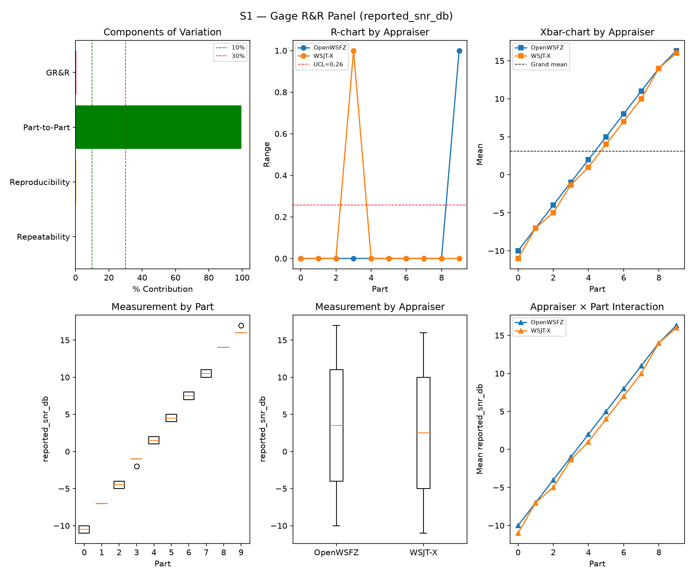
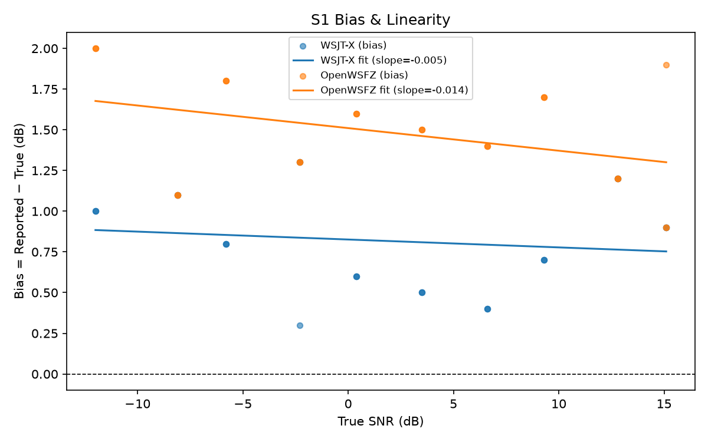
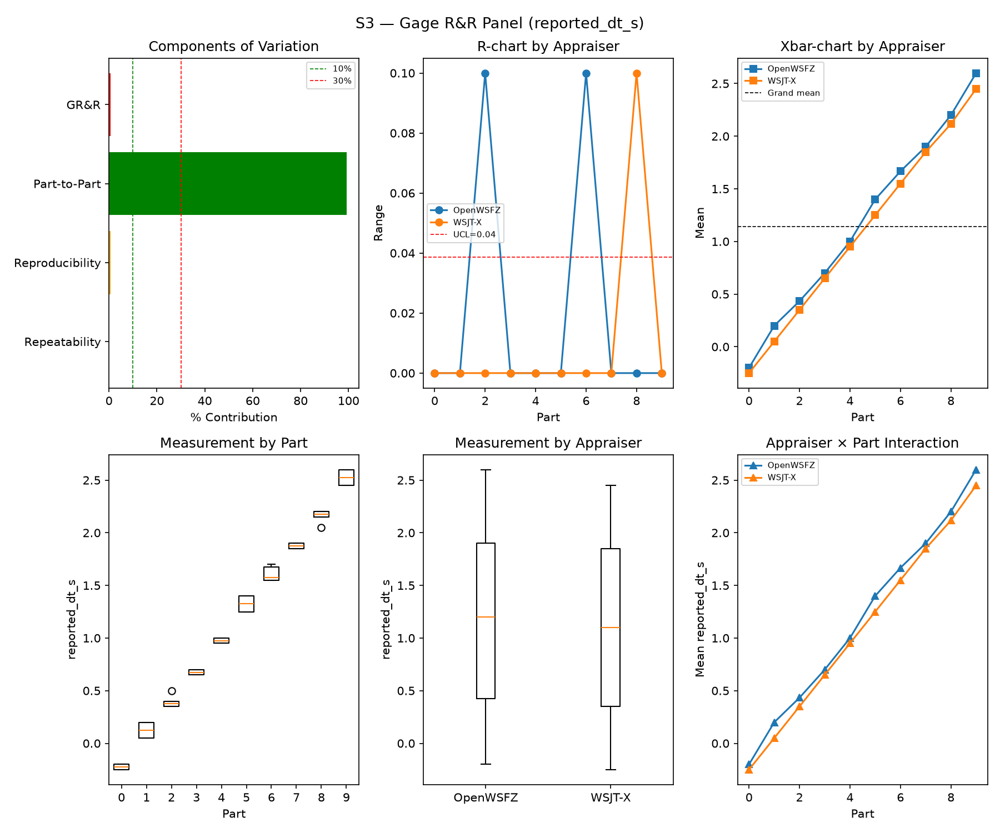
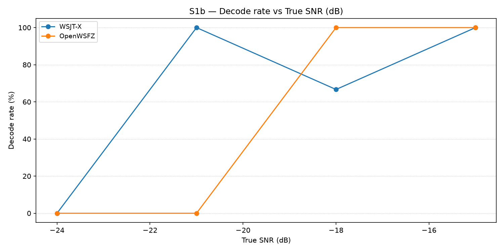
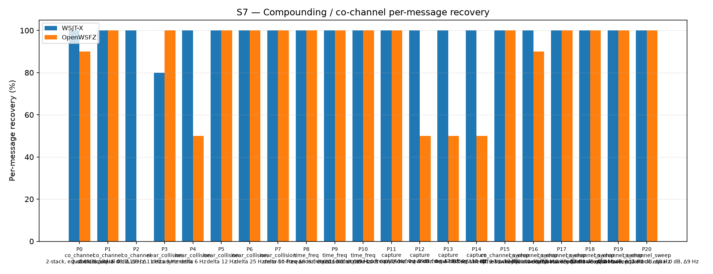

# OpenWSFZ R&R Study Report

| Field | Value |
|---|---|
| Run date | 2026-10-08 |
| OpenWSFZ SHA | `3276573bc25c0c4fb4028d751f0cd62d46e2e31d` (the daemon build, from arm_config.json; the analysis worktree's HEAD was `0a1ff63e`) |
| `libft8.dll` SHA-256 | `2029b0804a9abcc378fa037893b28236e4e5dec4459ba443d31c2027a58d82bb` (shim 20260060, daemon 0.56) |
| Decoder flags (read back) | `kMinScorePass2` = 10, `nhard40MigrationApplied` = True, `osdCorrThreshold` = 0.1, `osdNhardMax` = 40, `subtractionEnabled` = True, `subtractionMaxThreads` = 0, `subtractionOnMigrationApplied` = True |
| WSJT-X version | WSJT-X 2.7.0 (inferred from binary date 2025-02-04) |

**This run:** the OSD sign-fix build, `feat/osd-sign-fix` `3276573b` (shim 20260060, issue #215), flag ON, nhard 40; run 2026-10-08 19:40:31Z to 21:34:01Z (battery to supervisor end, `date -u`). **This is a branch build, not `main`:** the Developer's commit is local only and awaits the Captain's diff review (HK-011); it is not merged. The run directory is named after the QA tooling HEAD (`0a1ff63`), not the build; the build is in the table above and in `arm_config.json`. Compare against `2026-10-04-766f9cc` (`main` `766f9cc2`, shim 20260058, the last sweep) and the baseline-194 pair.

> The analyser's body below is its own output, unedited (copy: `report.analyser-original.md`). Sections 1, 5 and 6, the
> #194 scan section and the S3c section are authored or quoted; the header table above is the analyser's (its build SHA is
> correct: it was read from `arm_config.json`).

## Section 1 — Study hypothesis

**Purpose.** The Captain asked for an R&R S1-S8 sweep "with the latest build and the fix turned on" (QA's window, 2026-10-08, station ready: FT-991A cleaned, WSJT-X running, Monitor ON, `Voicemeeter AUX Input` -> B1). The fix is the default in this build (the harness switch that turns it off exists only in the harness), so nothing had to be switched on. The battery is synthetic: it contains no real-signal decode population, so it can show **harm** (a gate moving, a false positive), and it cannot show whether the fix helps real decoding. The OSD-FIX arm's own measurement is the interleaved TRAIN/TEST on recorded audio (`qa/rr-study/osd-fix/`), not this sweep.

**Null hypotheses in scope (none was pre-registered with a numeric bar; this is a compliance and range check, like `2026-10-04-766f9cc`).**
- **H0(no harm):** every gate PASSES, S5 shows no false-positive event on AWGN slots, no daemon exception.
- **H0(OSD fix is invisible to the batch):** the corrected OSD only changes decodes that reach the OSD fallback, which on recorded audio is a small share (A-SIGN′, on recorded pilot rows: 9 of 50), so no headline metric should leave the earlier runs' range. Whether the synthetic scenes reach the OSD at all was NOT checked here. A prediction about the batch metrics only.
- **H0(S3c):** no S3c-WSJT-X validity FAIL and no S3c-OWSFZ guard FAIL.
- **H0(chain stable):** the scan finds no `RUN-LEVEL` offset, config drift is silent, and the audio-setup sampler finds no change that touches the played level.

**What actually happened.** All four hold. Overall verdict PASS; S5 0/120 per app (Gate A-W 0/480, Gate A-Δ 0/120 vs 0/360); Check B 0/60 and 0/60; S3c PASS (both rows); scan completed, not SKIPPED, largest run-level offset 0.06 dB; no `CONFIG-DRIFT` row. Headline, this run vs `2026-10-04-766f9cc` and the baseline-194 runs: S1 %GR&R 0.41% vs 0.17%, 0.14%, 0.19%; S3 0.67% vs 0.72%, 0.51%, 0.71%; S8 (WSJT-X / OpenWSFZ) 91.67% / 91.67% as in all three; S7 recovery 99.07% / 82.79% vs 97.21% / 83.26%, 95.35% / 79.53% and 99.07% / 82.79%; pooled OpenWSFZ-of-WSJT-X 86.94% (233/268) vs 88.64%, 86.92%, 86.62%. **The one figure outside the earlier range is S1 %GR&R (0.41%, PASS at a 10% threshold, a 0.2 pp rise); it is read in Section 5, item 3.**

**Provenance.** `feat/osd-sign-fix` `3276573b` (shim 20260060, VERSION 0.56 per the analyser), self-contained non-AOT publish from the scratch worktree `D:\Projects\claude\_qa-scratch\rr-fix\tree` (`tools/publish_selfcontained.py`, then `capture_build_provenance.py`, tree clean). `libft8.dll` SHA-256 `2029b0804a9abcc3…82bb`: checked equal in the source file and in the published folder before the run (the pin from the Developer's R6 commit). Flags read back from the running daemon into `arm_config.json`: `subtractionEnabled` true, `osdNhardMax` 40, both migration markers true (`earlyDecodeEnabled` true in the config file, not part of the read-back, as for the last run). Config: a copy of `2026-10-04-766f9cc`'s with the output folder changed. No `--filter` applies (a battery, not a test run). Pre-flight (daemon on the same config, 19:39Z): chain-quiet RMS 0.0 over 12 s on B1 and a warm-up cycle in both ALL.TXT. `qa/config_drift.py` ran beside the battery (12 keys, 19:41Z to 21:34Z): **no `CONFIG-DRIFT` row**; its one `CONFIG-POLL-FAILED` line is 21:34:51Z, after the daemon was stopped at 21:34:01Z. The audio-setup sampler ran (Section 5, item 7). **Exceptions:** none in the battery.

## S1 — reported_snr_db

### Variance Components

| Component | σ² | %Contribution |
|---|---|---|
| Repeatability | 0.03 | 0.04% |
| Reproducibility | 0.30 | 0.37% |
| Part-to-Part | 81.19 | 99.59% |
| Total GR&R | 0.33 | 0.41% |
| Total | 81.52 | 100.00% |

### Study Metrics

| Metric | Value | Verdict |
|---|---|---|
| %Contribution (GR&R) | 0.41% | PASS |
| %Tolerance (GR&R) | 34.64% | — |
| %Study Var (GR&R) | 6.39% | — |
| ndc | 22 | PASS |

### Bias & Linearity (S1)

| Appraiser | Mean Bias (dB) | Slope | Intercept | R² | Verdict |
|---|---|---|---|---|---|
| WSJT-X | +0.82 | -0.005 | 0.826 | 0.021 | PASS |
| OpenWSFZ | +1.48 | -0.014 | 1.510 | 0.146 | PASS |

## S2 — reported_freq_hz

### Variance Components

| Component | σ² | %Contribution |
|---|---|---|
| Repeatability | 0.18 | 0.00% |
| Reproducibility | 0.40 | 0.00% |
| Part-to-Part | 652865.44 | 100.00% |
| Total GR&R | 0.58 | 0.00% |
| Total | 652866.03 | 100.00% |

### Study Metrics

| Metric | Value | Verdict |
|---|---|---|
| %Contribution (GR&R) | 0.00% | PASS |
| %Tolerance (GR&R) | 57.28% | — |
| %Study Var (GR&R) | 0.09% | — |
| ndc | 1491 | PASS |

## S3 — reported_dt_s

### Variance Components

| Component | σ² | %Contribution |
|---|---|---|
| Repeatability | 0.00 | 0.06% |
| Reproducibility | 0.01 | 0.61% |
| Part-to-Part | 0.83 | 99.33% |
| Total GR&R | 0.01 | 0.67% |
| Total | 0.83 | 100.00% |

### Study Metrics

| Metric | Value | Verdict |
|---|---|---|
| %Contribution (GR&R) | 0.67% | PASS |
| %Tolerance (GR&R) | 112.08% | — |
| %Study Var (GR&R) | 8.19% | — |
| ndc | 17 | PASS |

> **WSJT-X DT correction applied.** A +0.55 s offset was added to WSJT-X `reported_dt_s` before ANOVA to remove the ≈ −0.55 s convention difference between WSJT-X (DT relative to nominal FT8 TX start) and the harness (DT relative to UTC slot boundary). This correction removes the calibration artefact from SS_appraiser so %GR&R measures genuine app-to-app measurement disagreement. Raw reported values are preserved in the matched CSV. See scenario `wsjt_dt_correction_s` field and R&R-003 (GitHub #1).

## S1b — Low-SNR threshold study

_Decode rate (% of injected messages recovered) at SNRs excluded from the redesigned S1 ladder (−24 to −15 dB).  Companion to S1; separates 'does it decode at this SNR?' from 'how accurately does it measure SNR?'.  Informational — no AIAG threshold._

### Per-part decode rate

| Part | True SNR (dB) | WSJT-X decoded | WSJT-X rate | OpenWSFZ decoded | OpenWSFZ rate |
|---|---|---|---|---|---|
| P0 | -24.00 | 0/3 | 0.00% | 0/3 | 0.00% |
| P1 | -21.00 | 3/3 | 100.00% | 0/3 | 0.00% |
| P2 | -18.00 | 2/3 | 66.67% | 3/3 | 100.00% |
| P3 | -15.00 | 3/3 | 100.00% | 3/3 | 100.00% |

**Overall decode rate — WSJT-X: 66.67%  OpenWSFZ: 50.00%**

## Attribute Agreement Analysis (S4 positives + S5 negatives)

_κ is computed over a pooled population: S4 injected messages (truth = present) and S5 signal-free slots (truth = absent), so the truth vector has both classes. **κ verdicts below are advisory** — the §10 attribute gate is pending Captain ratification of this pooled method._

### Confusion vs truth

| Appraiser | TP | FN | FP | TN | Recovery | Specificity |
|---|---|---|---|---|---|---|
| WSJT-X | 101 | 7 | 0 | 180 | 93.52% | 100.00% |
| OpenWSFZ | 96 | 12 | 0 | 180 | 88.89% | 100.00% |

### Kappa (advisory)

| Pair | κ | 95% CI | Verdict (advisory) |
|---|---|---|---|
| OpenWSFZ_vs_truth | 0.909 | [0.86, 0.96] | PASS |
| WSJT-X_vs_truth | 0.947 | [0.91, 0.98] | PASS |
| between_appraisers | 0.961 | — | PASS |

### Within-app repeatability (decision consistency across trials)

| Appraiser | Consistent groups |
|---|---|
| WSJT-X | 97.50% |
| OpenWSFZ | 100.00% |

### Kappa — decodable-SNR-restricted positives (informational, floor -12 dB)

_S4 positives below the decodable-SNR floor are excluded (S5 negatives unchanged); shown alongside the full-population figures above per STUDY-SPEC.md §9.3's second ratification condition. **Informational only — does not affect the §10 gate or the overall verdict.**

| Appraiser | TP | FN | FP | TN | Recovery | Specificity |
|---|---|---|---|---|---|---|
| WSJT-X | 81 | 0 | 0 | 180 | 100.00% | 100.00% |
| OpenWSFZ | 81 | 0 | 0 | 180 | 100.00% | 100.00% |

| Pair | κ | 95% CI | Verdict (informational) |
|---|---|---|---|
| OpenWSFZ_vs_truth | 1.000 | [1.00, 1.00] | PASS |
| WSJT-X_vs_truth | 1.000 | [1.00, 1.00] | PASS |
| between_appraisers | 1.000 | — | PASS |

### False-positive rate (S5) — Gate A (AWGN, parts 0/1)

| Appraiser | FP events / slots | Event rate | 95% UB | Decode rate | Verdict |
|---|---|---|---|---|---|
| WSJT-X | 0 / 120 | 0.00% | 2.47% | 0.00% | INFO |
| OpenWSFZ | 0 / 120 | 0.00% | 2.47% | 0.00% | INFO |

_Per-sweep reading (STUDY-SPEC §10, ratified 2026-07-04, R&R-004; population re-affirmed S5-GATE-SIZING Amendment 1, 2026-09-06) of the per-slot FP **event rate** on AWGN slots (parts 0/1) ONLY, one-sided 95% Clopper–Pearson **upper bound** shown for reference. Decode rate is reported for reference only. **SUPERSEDED as a gate by R&R-011 (2026-09-08): always INFO.** At N=120 this reading cannot separate 'unchanged' (P(FAIL)=0.739 at the established 3.182% rate) from 'twice as bad' (P(FAIL)=0.984) — see the ratified compliance verdict in **Gate A-W** below, which reads this same quantity on a trailing 480-slot window instead. **Never pooled with Check B below, nor with Gate A-W/Gate A-Δ** — see those tables' own notes._

### False-positive rate (S5) — Gate A-W / Gate A-Δ (trailing window, R&R-011)

| Gate | Value | Verdict |
|---|---|---|
| **Gate A-W** (compliance) | 0/480 = 0.000%, 95% UB 0.622% (PASS iff ≤ 6%) | **PASS** |
| **Gate A-Δ** (change) | 0/120 (newest) vs 0/360 (rest of window), Fisher(greater) p=1.0000 (FAIL iff ≤ 0.05) | **PASS** |

_Gate A-W (R&R-011, PO ruling Option A, 2026-09-08) — the ratified 6% UB (STUDY-SPEC §10, unchanged, not re-ratified) read on a trailing **at least 480**-AWGN-slot window (unit is the slot, not the sweep; the fill loop admits whole runs, so actual N can overshoot up to the largest single run's slot count — reported above as 480, never quoted as a bare "480". Amendment 1, §3: overshoot only adds power, never loosens the ceiling, since P(UB₉₅≤C\|p=C)≤0.05 holds at every N). Gate A-Δ — newest sweep vs the rest of that same window, one-sided Fisher at 0.05. **Two separate rows, never pooled**: ROW 1 (Gate A-W FAIL) and ROW 2 (Gate A-Δ FAIL) can both fire independently. **Honest costs**: the window lags — a regression introduced this sweep is diluted 1:4 and takes up to four sweeps to reach full weight; Gate A-Δ is blind below ~2× (power 0.40 at 2×, 0.82 at 3×). **A PASS may not be read as "nothing moved".**

_Leave-one-sweep-out (spec Sec.4.7): all 4 single-sweep deletions leave Gate A-W's verdict unchanged — **not FRAGILE**._

**Window members (newest first; events/slots):** this run `0a1ff63` 0/120, 2026-10-04 `766f9cc` 0/120, 2026-10-02 `96077a0` 0/120, 2026-10-02 `96077a0` 0/120.

_Reading the members: a trend row with the same SHA7 as this run is excluded from the window (the key is the analysis worktree's HEAD, shared by two runs of one baseline), so a repeat run does not see the run before it. `trend.csv` has no flag column: **until four flag-ON `main` sweeps exist (4 x 120 AWGN slots) the window is MIXED** (older rows are flag-OFF or other builds). Read Gate A-W as a compliance reading across builds, not as a flag-ON-only one, and never as evidence about the flag._

### False-positive rate (S5) — Check B (narrowband, parts 2/3)

| Appraiser | FP events / slots | Verdict |
|---|---|---|
| WSJT-X | 0 / 60 | PASS |
| OpenWSFZ | 0 / 60 | PASS |

_Check (S5-GATE-SIZING Amendment 1, PO ruling Option 3, 2026-09-06 20:29 UTC): a coverage net for narrowband hallucination (steady carrier / birdies), scored on its OWN 60-slot denominator — FAIL iff events ≥ 2. Threshold derived in the spec's A1.2 from the measured all-history per-slot narrowband base rate (0.2347%, `s5_narrowband_exposure_verify.py`, ROW 0 cleared 2026-09-06), well under the ~1% re-derivation trigger. This is a raw event-count check, not a Clopper–Pearson UB gate, so there is no STATISTICAL small-N demotion analogous to `MIN_N_FOR_FP_GATE` — but **INFO** here means something distinct: zero narrowband slots were injected at all (Check B did not run this battery, e.g. a targeted `--parts 0,1` recheck). That is a coverage gap, never a PASS — asserting PASS with no slots run would reproduce the exact blindness this design exists to remove. **Never pooled with Gate A above into one S5 rate or one verdict line** — the same 180 slots FAIL under no change 21% of the time scored as one gate; scored as two, Gate A alone FAILs under no change 77% of the time (its own false-alarm rate at N=120, corrected 2026-09-08 — see R&R-011; not a detection rate)._

## S7 — Compounding / co-channel overlap

_Per-message recovery when 2–3 signals occupy the same or near-same audio frequency / time slot (the pileup case S4 does not exercise). Informational — no AIAG threshold is defined for co-channel separation._

### Recovery by overlap family

| Overlap family | WSJT-X | OpenWSFZ |
|---|---|---|
| capture | 100.00% | 62.50% |
| co_channel | 100.00% | 54.29% |
| co_channel_sweep | 100.00% | 98.33% |
| near_collision | 96.00% | 90.00% |
| time_freq | 100.00% | 100.00% |
| **all** | **99.07%** | **82.79%** |

### Capture effect (co-channel, unequal SNR)

| Signal | WSJT-X | OpenWSFZ |
|---|---|---|
| strong | 100.00% | 100.00% |
| weak | 100.00% | 25.00% |

**Between-app per-signal agreement:** 81.86%

### Per-part detail

| Part | Family | Condition | WSJT-X | OpenWSFZ |
|---|---|---|---|---|
| P0 | co_channel | 2-stack, equal 0 dB, Δ7 Hz | 10/10 | 9/10 |
| P1 | co_channel | 2-stack, equal -5 dB, Δ13 Hz | 10/10 | 10/10 |
| P2 | co_channel | 3-stack, equal 0 dB, Δ8 / Δ11 Hz asymmetric | 15/15 | 0/15 |
| P3 | near_collision | delta 3 Hz | 8/10 | 10/10 |
| P4 | near_collision | delta 6 Hz | 10/10 | 5/10 |
| P5 | near_collision | delta 12 Hz | 10/10 | 10/10 |
| P6 | near_collision | delta 25 Hz | 10/10 | 10/10 |
| P7 | near_collision | delta 50 Hz | 10/10 | 10/10 |
| P8 | time_freq | near-co-freq Δ8 Hz, dt 0.0 / 0.5 s | 10/10 | 10/10 |
| P9 | time_freq | near-co-freq Δ11 Hz, dt 0.0 / 1.0 s | 10/10 | 10/10 |
| P10 | time_freq | near-co-freq Δ9 Hz, dt 0.0 / 2.0 s | 10/10 | 10/10 |
| P11 | capture | near-co-freq Δ14 Hz, 0 / -3 dB | 10/10 | 10/10 |
| P12 | capture | near-co-freq Δ9 Hz, 0 / -6 dB | 10/10 | 5/10 |
| P13 | capture | near-co-freq Δ7 Hz, 0 / -10 dB | 10/10 | 5/10 |
| P14 | capture | near-co-freq Δ11 Hz, +3 / -10 dB | 10/10 | 5/10 |
| P15 | co_channel_sweep | offset-sweep: 2-stack, equal 0 dB, Δ5 Hz | 10/10 | 10/10 |
| P16 | co_channel_sweep | offset-sweep: 2-stack, equal 0 dB, Δ7 Hz | 10/10 | 9/10 |
| P17 | co_channel_sweep | offset-sweep: 2-stack, equal 0 dB, Δ10 Hz | 10/10 | 10/10 |
| P18 | co_channel_sweep | offset-sweep: 2-stack, equal 0 dB, Δ15 Hz | 10/10 | 10/10 |
| P19 | co_channel_sweep | offset-sweep: 2-stack, equal 0 dB, Δ8 Hz | 10/10 | 10/10 |
| P20 | co_channel_sweep | offset-sweep: 2-stack, equal 0 dB, Δ9 Hz | 10/10 | 10/10 |

## S8 — Realistic Band Scene

_Holistic decode-rate benchmark: 12 simultaneous stations across 450–2550 Hz at realistic SNR spread (−15 to +3 dB), including a near-collision pair (E/F, 12 Hz apart) and a capture pair (G/H, co-frequency, 6 dB ratio). **Informational only — no PASS/FAIL gate.**_

### Overall decode rate

| Appraiser | Decoded | Injected | Rate |
|---|---|---|---|
| WSJT-X | 55 | 60 | 91.67% |
| OpenWSFZ | 55 | 60 | 91.67% |

**Between-appraiser delta (OpenWSFZ − WSJT-X): +0.0 pp**

### Per-station breakdown

| Stn | Freq (Hz) | SNR (dB) | WSJT-X decoded/total | OpenWSFZ decoded/total |
|---|---|---|---|---|
| A | 450 | -8.00 | 5/5 | 5/5 |
| B | 650 | -3.00 | 5/5 | 5/5 |
| C | 850 | -12.00 | 5/5 | 5/5 |
| D | 1050 | 0.00 | 5/5 | 5/5 |
| E | 1150 | -5.00 | 5/5 | 5/5 |
| F | 1162 | -8.00 | 5/5 | 0/5 |
| G | 1500 | 0.00 | 5/5 | 5/5 |
| H | 1500 | -6.00 | 0/5 | 5/5 |
| I | 1650 | -3.00 | 5/5 | 5/5 |
| J | 1900 | -15.00 | 5/5 | 5/5 |
| K | 2150 | -8.00 | 5/5 | 5/5 |
| L | 2550 | 3.00 | 5/5 | 5/5 |

## Unexplained decodes (informational — no gate)

_Every appraiser decode whose message text + frequency matches no injected truth row in its own cycle, across the **whole battery** — not just S5's signal-free slots (see False-positive rate above). Uses the harness's own match predicates (exact whitespace-normalised text AND ±4 Hz), not a frequency-blind text check. **Not a gate — no threshold is pre-registered (HK-021) for this metric.** Δf is the distance from the decode's reported frequency to the nearest frequency-bearing truth row in the same cycle; '—' means every truth row sharing that cycle was signal-free (e.g. a pure S5 slot). Counts and distances only, per NFR-021 — never message text or callsigns; see Section 6 for the historical series._

| Appraiser | Scenario | Count | Min Δf (Hz) | Median Δf (Hz) |
|---|---|---|---|---|
| **WSJT-X** | **all** | **0** | | |
| OpenWSFZ | S2 | 1 | 4.0 | 4.0 |
| OpenWSFZ | S7 | 1 | 0.0 | 0.0 |
| **OpenWSFZ** | **all** | **2** | | |

## Summary

| Metric | Scope | Value | Verdict |
|---|---|---|---|
| %GR&R | S1 | 0.4% | PASS |
| ndc | S1 | 22 | PASS |
| %GR&R | S2 | 0.0% | PASS |
| ndc | S2 | 1491 | PASS |
| %GR&R | S3 | 0.7% | PASS |
| ndc | S3 | 17 | PASS |
| Kappa (advisory) | WSJT-X_vs_truth | 0.947 | PASS |
| Kappa (advisory) | OpenWSFZ_vs_truth | 0.909 | PASS |
| Kappa (advisory) | between_appraisers | 0.961 | PASS |
| FP event rate (95% UB), Gate A-W | S5/OpenWSFZ | 0/480 slots (event 0.000%; 95% UB 0.622%) | PASS |
| FP event rate change, Gate A-Δ | S5/OpenWSFZ | 0/120 vs 0/360 (Fisher p=1.0000) | PASS |
| FP events, Check B (narrowband) | S5/WSJT-X | 0/60 slots (FAIL iff >= 2) | PASS |
| FP events, Check B (narrowband) | S5/OpenWSFZ | 0/60 slots (FAIL iff >= 2) | PASS |
| SNR bias | S1/WSJT-X | +0.82 dB | PASS |
| SNR bias | S1/OpenWSFZ | +1.48 dB | PASS |

**Overall verdict: PASS**

### Excluded From Gate (Informational)

- ℹ️ FP event rate (S5/WSJT-X) not gated at N=120: 0/120 slots (event 0.0%; 95% UB 2.47%; decode 0.0%) — per-sweep Gate A was superseded by R&R-011 (2026-09-08): at N=120 it cannot separate 'unchanged' from 'twice as bad'. See Gate A-W below for the ratified compliance verdict.
- ℹ️ FP event rate (S5/OpenWSFZ) not gated at N=120: 0/120 slots (event 0.0%; 95% UB 2.47%; decode 0.0%) — per-sweep Gate A was superseded by R&R-011 (2026-09-08): at N=120 it cannot separate 'unchanged' from 'twice as bad'. See Gate A-W below for the ratified compliance verdict.

### Audio-setup sampler (#194)

- **Sampler output: OK** — coverage 100.0 % of 6796 s (heartbeats with no gap over 70 s; max gap 60.5 s; PARTIAL below 98 %).
- Worker crashes: **0**; restarts: **0**.
- First (cold) sample 680.0 ms; warm sample max 131.0 ms.
- Setup changes logged: **23**; `unverified_start_diff` (excluded from the join): 3.
- `VBVMR_IsParametersDirty`: 1349 calls, 4 returned non-zero, longest loop 3 calls.
- Scan join window: detected_utc in [S-30 s, S+40 s].
- **Scan-flagged slots with at least one setup change in the window: 2 of 37** (detected_utc in [S-30 s, S+40 s]; `unverified_start_diff` excluded), from `summarize.py <jsonl> --flagged <flagged_slots.csv>` run after the scan.
- Unavailable sources: ['wsjtx: unavailable: OSError']
- Teardown: return code 0, force-killed False, pidfile removed True, orphans found [].

## Captured-audio scan (#194)

This section is quoted from `captured-audio-scan/scan_report.md` of THIS run. The scan ran after the gather, was not SKIPPED, and found no decoder defect by construction: a WAV is recorded before either decoder runs.

- Scan commit/freeze: `eng/194-scan` (`d06b01d9`, on `main` since `b87529a3`); harness commit `0a1ff63e` (`qa/osd-fix`, the QA tooling HEAD; the build under test is `3276573b`, a branch build; the scan tooling is unchanged since `d06b01d9`).
- Frozen `thresholds.json` SHA-256 (LF): `c1d793ec773520267dcc0545f0d114bec635d63436b9c1960b3e7891b4a26d8d`; `scan_core.py` `582f422e27e7d9f2d949de7ac10f6fb0cee07c2c48d53c7dbcb6dbc4c7722a21`; calibration run `2026-09-23-5f17b43`.
- Tool: `qa/rr-study/captured-audio-scan/` (`scan_run.py measure`, `scan_apply.py`). Measure wall time: **170.2 s** (V3, one core).

- Flagged slots: **37** distinct slots of 407 scanned per side (81 slot-family findings).

| scenario | BOTH | CROSS | OWSFZ-ONLY | WSJTX-ONLY |
|---|---:|---:|---:|---:|
| S1 | 3 | 0 | 0 | 0 |
| S3 | 3 | 0 | 0 | 3 |
| S4 | 2 | 0 | 1 | 0 |
| S5 | 23 | 0 | 3 | 12 |
| S7 | 15 | 0 | 8 | 5 |
| S8 | 1 | 0 | 1 | 1 |

### Headline, quoted verbatim

- **47** slot-family findings are **BOTH** (shared playback path), **13** OpenWSFZ-only, **21** WSJT-X-only, **0** cross-side, over 37 flagged slots of 407 owsfz / 407 wsjt-x scanned.
- 🔴 **Holes.** 30 (side, group, metric) cells are DESCRIPTIVE and never flag (12 of them DESCRIPTIVE-ABOVE-RANGE). **With these thresholds the scan cannot detect a short added sound (a Windows notification, a beep) or a click in the groups where `tile_excess_db` / `click_max` are above range** (owsfz: single, multi, tone2, tone3 tiles; wsjt-x: single, multi, tone3 tiles and multi, noise, tone3 clicks).
- **Blind spots stated:** WSJT-X's last 600 ms (it writes 14.4 s then zeros) cannot show a dropout; slots whose **reference** is lag-ambiguous (steady carriers) have no timing check: owsfz: {'single': 3, 'tone2': 30, 'tone3': 30}, wsjtx: {'single': 3, 'tone2': 30, 'tone3': 30}.
- **REF-UNVERIFIABLE** (mapping rests on the file name ↔ `cycle_utc` identity alone): owsfz: 175/407 (43 %), wsjtx: 175/407 (43 %) (limit 50 %).

### Validation rows, quoted verbatim

| Row | Result |
|---|---|
| R0c literal (rule as written, run-wide neighbour max) | owsfz fails 12/407 (2.9 %), wsjt-x 27/407 (6.6 %): **FAIL as written** (kept per ruling A1) |
| R0c per slot (A1), discriminating slots | owsfz 0.0 % fail of 232; wsjt-x 0.0 % of 232: PASS |
| V1 coverage, owsfz | 454 WAV files = 454 classified {'UNPLANNED': 47, 'SCANNED': 407}: PASS |
| V1 coverage, wsjt-x | 455 WAV files = 455 classified {'UNPLANNED': 48, 'SCANNED': 407}: PASS |
| V1 truth slots with no WAV on either side (MISSING) | 0 |
| V2 sidecar integrity, owsfz | 454 files re-hashed fresh, 0 mismatch: PASS |
| V2 sidecar integrity, wsjt-x | 455 files re-hashed fresh, 0 mismatch: PASS |
| V3 runtime | 170.2 s to measure 407 paired slots (reference renders ≈ 30 s per run extra) |

### Run-level line, quoted verbatim

### Run-level lines (A11)

(a) run median `g_db` minus the calibration median, per (side, group); `RUN-LEVEL` if |Δ| > 0.5 dB:
- owsfz single: -0.05 dB
- owsfz multi: -0.00 dB
- owsfz noise: +0.06 dB
- owsfz tone2: -0.00 dB
- owsfz tone3: +0.00 dB
- wsjtx single: -0.01 dB
- wsjtx multi: +0.00 dB
- wsjtx noise: -0.01 dB
- wsjtx tone2: -0.00 dB
- wsjtx tone3: -0.00 dB
(b) the run's own median `tau_ms` offset per (side, group) and `dtau_ms` offset: descriptive only, in the table below.

Reading: every `g_db` run-level offset is within the 0.5 dB limit (largest |offset| 0.06 dB, owsfz noise): no `RUN-LEVEL` event, so the chain's level was stable for the whole run. The scan carries its holes: it cannot see a short added sound or a click in the groups above range.

## S3c start-time edge guard (#194 part B step 2)

- Flag state: `subtractionEnabled = true`  (reference rates from a flag-OFF edge run: labelled, never pooled)
- Build: `3276573bc25c0c4fb4028d751f0cd62d46e2e31d`  DLL SHA-256 prefix: `2029b0804a9abcc3`
- Scenario SHA-256: `dc3a3fe87de0f227bf51e952cd085888ef3c873cc2a912f345c909a0af9604aa`

| decoder | part | L (s) | X / 32 | cycles with >= 1 decode | r_ref | k* | row |
|---|---|---:|---:|---:|---:|---:|---|
| WSJT-X | S3c-L90 | +2.75 | 32 | 4 of 4 | 0.893 | 24 | PASS |
| WSJT-X | S3c-L50 | +3.00 | 0 | 0 of 4 | 0.000 | 0 | DESCRIPTIVE (k* = 0) |
| WSJT-X | S3c-E90 | -1.75 | 32 | 4 of 4 | 0.893 | 24 | PASS |
| WSJT-X | S3c-E50 | -2.00 | 32 | 4 of 4 | 0.843 | 22 | PASS |
| OpenWSFZ | S3c-L90 | +2.75 | 32 | 4 of 4 | 0.893 | 24 | PASS |
| OpenWSFZ | S3c-L50 | +3.00 | 0 | 0 of 4 | 0.000 | 0 | DESCRIPTIVE (k* = 0) |
| OpenWSFZ | S3c-E90 | -1.75 | 32 | 4 of 4 | 0.893 | 24 | PASS |
| OpenWSFZ | S3c-E50 | -2.00 | 23 | 3 of 4 | 0.282 | 4 | DESCRIPTIVE (cycle-clustered, effective n ~ cycles) |

### Rows

- **S3c-WSJT-X (validity):** PASS
- **S3c-OWSFZ (guard):** PASS

A FAIL of the OpenWSFZ guard is a flag, not a verdict (one battery's 32 signals per part cannot tell a regression from bad luck at the 1 % level). ~8 % chance of at least one false FAIL somewhere per battery (4 parts x 2 decoders at 1 %), accepted by the spec. Counts only (NFR-021).

OpenWSFZ S3c-E50 (E -2.00) is a DESCRIPTIVE row from the battery after 2026-10-05 (Architect ruling 4c): the cell passes or fails a whole cycle at a time, so read 'cycles with >= 1 decode, of 4' beside the count; the early-side guard is S3c-E90.
- WSJT-X: planted slots with any decode pass 8/8; planted texts in the wrong cycle: 0
- OpenWSFZ: planted slots with any decode pass 8/8; planted texts in the wrong cycle: 0

## Section 5 — Recommendations

No gate FAILED and no metric is MARGINAL, so there is no defect to attribute. One figure left the earlier range (item 3). Next steps:

1. **Record this run as a branch-build row** (`feat/osd-sign-fix@3276573b`, shim 20260060), not a `main` row. It shares the flag-ON, nhard-40 configuration with the `main` series but not its code, so it is read against `2026-10-04-766f9cc` and the baseline-194 pair, never pooled with them. It is one run: it can say "inside the known range", not more. It cannot say whether the OSD fix helps real decoding (Section 1).
2. **Pooled ratio 86.94% (233/268) against 88.64% (234/264), 86.92% (226/260) and 86.62% (233/269): do not cite as an OpenWSFZ gain or loss.** OpenWSFZ's own pooled count is flat (226, 233, 234, 233); the ratio moves with WSJT-X's reference count (260, 269, 264, 268), and WSJT-X's decoder did not change. Footnote 17's framing.
3. **S1 is the one figure outside the earlier range: %GR&R 0.41% (PASS; 0.14%, 0.19%, 0.17% before), reproducibility σ² 0.30 (0.01 on 2026-10-04), OpenWSFZ mean bias +1.48 dB (+0.88 dB on 2026-10-04; WSJT-X +0.82, +0.85).** The same +1.45 dB OpenWSFZ bias was seen on 2026-09-29 on three different builds (footnote 16), and the Captain dropped that follow-up that day; this run does not reopen it. The scan's descriptive S1 chain gain, for the record only: OpenWSFZ median `g_db` -1.68 dB, WSJT-X -0.67 dB (n = 30 each). **One run cannot say whether the OSD fix has anything to do with it, and the cause is NOT established.** If the next sweep shows it again, on this or another build, it is the next thing to separate.
4. **S3c, the fourth battery that includes it.** Both rows PASS (S3c-WSJT-X validity, S3c-OWSFZ guard). OpenWSFZ S3c-E50 (E -2.00) is 23/32 in 3 of 4 cycles (DESCRIPTIVE since the 2026-10-05 ruling; was 32/32 in 4 of 4 on 2026-10-04 and 17, 16 of 32 in the baseline-194 runs): consistent with the cycle-clustered reading of item 3 in the last report, not a regression row. The early-side guard S3c-E90 is 32/32. Nothing else on the grid moved.
5. **S7:** OpenWSFZ 82.79% (83.26%, 79.53%, 82.79% before) and WSJT-X 99.07% (97.21%, 95.35%, 99.07%): both inside the known range, gap 16.3 pp. S7 is instrument-suspect by standing rule and no bare S7 mean is cited. **S1b:** OpenWSFZ 0/3 at -21 dB (and at -24 dB) as in every run; WSJT-X 3/3 at -21 dB, 0/3 at -24 dB (reference noise at n = 3).
6. **Scan:** 37 slots flagged of 407 (49, 38 and 47 before), mostly the shared playback path (47 slot-family findings BOTH, 13 OpenWSFZ-only, 21 WSJT-X-only); none is a decoder defect by construction. The scan's holes stand (30 descriptive cells). R0c "as written" FAILS as in the earlier runs (kept per the Architect's ruling A1; the per-slot rule PASSES). Largest run-level offset 0.06 dB: the played level was stable for the whole run.
7. **Unexplained decodes:** OpenWSFZ 2 (S2 1 at Δf 4.0 Hz, S7 1 at Δf 0.0 Hz), WSJT-X 0; the earlier three runs had 3, 3 and 3 for OpenWSFZ. Informational, no gate.
8. **Unconfirmed early rows, counted at the Captain's request (he saw several in the decode panel at about 20:13Z and asked for the count; he was clear it was a remark).** The decode panel's early rows are resolved by `EarlyDecodeMatcher` against the final decode: confirmed only if a final row has the SAME message text within the frequency tolerance; every other early row is unconfirmed. The daemon logs how many early rows each cycle had but not the outcome, so a passive WebSocket listener (counts only, no message text, HK-037; `D:\Projects\claude\_qa-scratch\rr-fix\ws_early_counter.py`) recorded the frames from 20:25:42Z to the end of the run. **Not covered: S1 to S4 and S5 before 20:25:42Z.** The slots in the Captain's screenshot (20:12:30 to 20:13:00Z) belong to **S4** (the density scenario: `truth.csv` gives S4 as 20:09:30 to 20:13:00Z), which is not covered. Counts, from the listener, by scenario window taken from `truth.csv`: **S5** (20:25:42 to 21:00:45Z): 0 early rows, 140 final frames, 0 final rows (consistent with the 0/120 FP result); **S7**: 175 early rows, 173 confirmed, **2 unconfirmed (1.1%)**, 178 final rows; **S8**: 55 early rows, 55 confirmed, 0 unconfirmed; **S3c and the tail to the daemon's stop (21:30:00 to 21:34:02Z)**: 88 early rows, 87 confirmed, **1 unconfirmed**. No disconnect except after the daemon stopped (13 reconnect attempts from 21:34:01Z). **Reading:** where covered, the unconfirmed share is about 1%. The pattern in the screenshot (an early row of a real transmitted text far in frequency from the final row of the same text, for example 2369 Hz against 1541 Hz) is from the dense scenario and is NOT measured here. Whether those early rows are the previous slot's signal (a capture-path question, #194) or the matcher's text-plus-frequency rule meeting a dense scene is NOT established. **Open, needs the Captain's go (station): re-play S4 alone with the listener running** (about 4 minutes of playback) and count the unconfirmed rows per cycle; if they are echoes of the previous slot, the finding goes on #194, otherwise on a new issue.
9. **Audio-setup sampler (#194): the first integrated run (row 1 of the five-run review in `qa/audio-setup/integrated_runs.csv`).** Coverage 100.0% of 6,796 s, 0 worker crashes, 0 restarts. **23 setup changes were logged** (3 start-snapshot differences are listed separately and excluded): 2 Voicemeeter reads (strip 0 `B1` 1 -> 0 at 19:49:25Z, strip 3 gain -24 -> -15 dB at 19:49:45Z, both in S1b) and 21 events of seven appearances or disappearances of a `vlc.exe` audio session on the PC (19:48:55Z, 20:01:26Z and 20:01:31Z, 20:45:00Z and 20:45:05Z, 20:47:26Z and 20:47:51Z). The sampler does not say what caused them. **Update 2026-10-08 (after this report was written; the Captain, relayed by the Architect): all 23 were his own changes. He removed everything that could output to B1 (the `vlc.exe` sessions and the strip 0 B1 and strip 3 gain changes near 19:49Z), so this is a true detection of a real operator change, not an unexplained event.** **2 of the 37 scan-flagged slots have a change inside their [S-30 s, S+40 s] window.** The scan's run-level offsets (item 6) say the played level did not move, so none of the changes shows in the WAVs at the 0.5 dB limit. The station rule is "nothing else on the PC"; the `vlc.exe` session was present from 19:48:55Z except for short gaps.
10. **Not done here:** the S4 early-row count (item 8), a replay of this run's audio on the main build (a separate decision), and any reading of this run as evidence about the OSD fix beyond "the synthetic battery did not move".

## Section 6 — Historical trend: every full S1–S8 sweep to date

**HK-031: Section 6 of the last report (`2026-10-04-766f9cc`, thirty-two rows, footnotes 1-25) was read in full before any analysis above; this section is that table carried forward with this run's one row appended and footnotes 26-28 added. Footnotes 1-25 are copied verbatim.** `%GR&R` is each stage's
own Summary-table figure (AIAG %Contribution, threshold ≤ 10% PASS). S5 FP: from `4cc1984` onward the
ratified gate is the trailing-window Gate A-W/Gate A-Δ (R&R-011). S7/S8 are the "all"/overall
decode-recovery percentages. The final column is OpenWSFZ's pooled S7+S8 matched-decode count as a
percentage of WSJT-X's own.

**S4/κ is not a column in this table** (duplicate-row attribution defect, fixed at source from
`4584900d` onward; it annotates no cell here, so it carries no footnote number).

| Date | SHA | S1 %GR&R | S2 %GR&R | S3 %GR&R | S5 FP (WSJT-X / OpenWSFZ) | S7 recovery (WSJT-X / OpenWSFZ) | S8 decode rate (WSJT-X / OpenWSFZ) | OpenWSFZ, % of WSJT-X (S7+S8 pooled, excl. FP)¹ |
|---|---|---|---|---|---|---|---|---|
| 2026-06-06 | `4c34ef6` | 32.0% **FAIL** | 0.0% | 3.8% | 0.0% / 0.0% | 78.5% / 47.3% | — | 60.27%² |
| 2026-06-06 | `6bab388` | 6.5% | 0.0% | 3.9% | 0.0% / 0.0% | 77.4% / 46.2% | — | 59.72%² |
| 2026-06-07 | `4b3a4ca` | 1.4% | 0.0% | 3.4% | 0.0% / 0.0% | 76.3% / 54.8% | 95.0% / 86.7% | 80.47% |
| 2026-06-14 | `815b652` | 0.3% | 0.0% | 3.0% | 0.0% / 0.0% | 77.4% / 50.5% | 95.0% / 83.3% | 75.19% |
| 2026-06-20 | `6e821fa` | 0.4% | 0.0% | 3.0% | 0.0% / **91.7% FAIL**³ | 92.6% / 70.2% | 93.3% / 86.7% | 79.61% |
| 2026-06-22 | `f11f438` | 0.4% | 0.0% | 3.1% | 0.0% / 0.0% | 94.0% / 74.4% | 93.3% / 86.7% | 82.17% |
| 2026-07-04 | `793a298` | 0.5% | 0.0% | 3.4% | 0.0% / 0.0% | 96.3% / 73.0% | 93.3% / 86.7% | 79.47% |
| 2026-08-05 | `3bd4cd0` | 7.2% | 0.0% | 3.6% | 0.0% / 0.0% | 96.3% / 70.2% | 93.3% / 83.3% | 76.43% |
| 2026-08-15 | `8d6e1b1` | 0.5% | 0.0% | 1.4% | 0.0% / 0.8% | 95.3% / 74.4% | 93.3% / 86.7% | 81.23% |
| 2026-08-21 | `7d36038` | 0.3% | 0.0% | 0.4% | 0.0% / 0.8% | 95.3% / 68.4% | 96.7% / 83.3% | 74.90% |
| 2026-08-22 | `f5dec23` | 0.4% | 0.0% | 0.4% | 0.0% / **3.3% FAIL**⁴ | 98.1% / 79.5% | 91.7% / 91.7% | 84.96% |
| 2026-08-27 | `22b749c` | 0.3% | 0.0% | 0.4% | 0.0% / 0.0% | 97.7% / 78.6% | 96.7% / 91.7% | 83.58% |
| 2026-08-29 | `872ba65` | 0.25% | 0.0% | 18.65%⁵ | 0.0% / **7.66% FAIL** | 93.0% / 74.0% | 96.7% / 91.7% | 82.95% |
| 2026-08-30/31 | `2e60949` | 0.27% | 0.0% | 0.44% | 0.0% / 5.15%⁶ | 98.1% / 82.8%⁷ | 91.7% / 91.7% | 87.59% |
| 2026-09-02 | `3b52608` | 0.22% | 0.0% | 0.55% | 0.0% / **14.61% FAIL** | 94.4% / 83.7% | 100.0% / 91.7% | 89.35% |
| 2026-09-03 | `35378b9` | 0.21% | 0.0% | 0.55% | 0.0% / 10.12% FAIL | 96.3% / 81.4% | 95.0% / 91.7% | 87.12% |
| 2026-09-06 | `4c7d5ad` | 0.24% | 0.00% | 0.40% | 0.0% / 12.42% FAIL⁸ | 98.14% / 79.07% | 100.00% / 88.33% | 82.29% |
| 2026-09-07 | `4cc1984` | 0.20% | 0.0% | 0.59% | 0.0% / 6.33% FAIL⁹ | 99.07% / 79.07% | 91.67% / 91.67% | 83.96% |
| 2026-09-12 | `fbf8c0b5` | 0.37% | 0.0% | 0.35% | 0.0% / 0.0%¹⁰ | 87.44% / 82.79% | 93.33% / 91.67% | 95.49%¹¹ |
| 2026-09-12/13 | `4584900d #1` | 0.18% | 0.0% | 0.55% | 0.0% / 0.0%¹³ | 95.35% / 76.74% | 98.33% / 91.67% | 83.33% |
| 2026-09-13 | `4584900d #2` | 0.20% | 0.0% | 0.43% | 0.0% / 0.0%¹³ | 100.00% / 80.00% | 91.67% / 91.67% | 84.07% |
| 2026-09-13 | `4584900d #3` | 0.20% | 0.0% | 0.43% | 0.0% / 0.0%¹³ | 95.35% / 82.79% | 95.00% / 91.67% | 88.93% |
| 2026-09-13 | `4584900d #4` | 0.30% | 0.0% | 0.60% | 0.0% / 0.0%¹³ | 96.28% / 82.33% | 91.67% / 91.67% | 88.55% |
| 2026-09-13 | `4584900d #5` | 0.20% | 0.0% | 0.60% | 0.0% / 0.0%¹³ | 99.07% / 84.19% | 95.00% / 91.67% | 87.41% |
| 2026-09-13 | `4584900d #6` | 0.20% | 0.0% | 0.50% | 0.0% / 0.0%¹³ | 97.21% / 80.47% | 91.67% / 91.67% | 86.36% |
| 2026-09-14 | `db3a3085` | 0.19% | 0.0% | 0.75% | 0.0% / 0.83%¹⁴ | 94.42% / 81.86% | 96.67% / 91.67% | 88.51% |
| 2026-09-23 | `decoding_improvement@84cac119`¹⁵ | 0.19% | 0.0% | 0.72% | 0.0% / 0.0%¹³ | 90.70% / 83.72% | 91.67% / 91.67% | 94.00%¹¹ ¹² |
| **2026-09-29** | **`feat/sub-feas-native-subtraction@0d6b1937`, flag OFF¹⁶** | **0.39%** | **0.0%** | **0.73%** | **0.0% / 0.0%¹⁸** | **94.42% / 77.21%** | **93.33% / 91.67%** | **85.66%¹⁷** |
| **2026-09-29** | **`feat/sub-feas-native-subtraction@0d6b1937`, flag ON¹⁶** | **0.28%** | **0.0%** | **0.51%** | **0.0% / 0.0%¹⁸** | **96.28% / 80.93%** | **93.33% / 91.67%** | **87.40%¹⁷** |
| 2026-10-02 | `main@cddd7e34`, flag ON, run 1 (baseline)¹⁹ | 0.14% | 0.0% | 0.51% | 0.0% / 0.0%²¹ | 95.35% / 79.53% | 91.67% / 91.67% | 86.92%²² |
| **2026-10-03** | **`main@cddd7e34`, flag ON, run 2 (confirmation)**²⁰ | 0.19% | 0.0% | 0.71% | 0.0% / 0.0% | 99.07% / 82.79% | 93.33% / 91.67% | 86.62%²² |
| **2026-10-04** | **`main@766f9cc2`, flag ON, first sweep after #122 step 4 (shim 20260058)**²³ | 0.17% | 0.0% | 0.72% | 0.0% / 0.0%²⁴ | 97.21% / 83.26% | 91.67% / 91.67% | 88.64%²⁵ |
| **2026-10-08** | **`feat/osd-sign-fix@3276573b`, flag ON, the OSD sign-fix build (shim 20260060)**²⁶ | 0.41% | 0.0% | 0.67% | 0.0% / 0.0%²⁷ | 99.07% / 82.79% | 91.67% / 91.67% | 86.94%²⁸ |

¹ Value = pooled(OpenWSFZ S7+S8 matched decodes) ÷ pooled(WSJT-X S7+S8 matched decodes) × 100,
computed directly from each run's own `S7_matched.csv`/`S8_matched.csv` counts where available in
the QA worktree, else derived from published integers. For `2026-09-23` (this run): S7 195/215
(WSJT-X) vs 180/215 (OpenWSFZ); S8 55/60 (WSJT-X) vs 55/60 (OpenWSFZ); pooled 235/250 = 94.00%.

² `4c34ef6` and `6bab388` (2026-06-06) predate S8's introduction — their footnote-1 figure is
S7-only. One fact, stated as shared, not as a "first" — legitimately reused across exactly these
two rows.

³ Plain decode-rate era (pre R&R-004 ratified UB gate); not the same metric as later rows, fixed
under D-009. Not comparable to the UB figures below it.

⁴ Second-ever ratified-gate FAIL, N=120 (pre R&R-009 default restriction).

⁵ Not comparable to the S1–S3 series above it — confounded by a harness playback-timing defect
discovered in that same run (`872ba65`'s Section 5, Finding 1), not a decoder result.

⁶ N=120 (`resume_study.py` artefact — R&R-009's N=60 restriction not applied on resume), not the
routine N=60 battery. PASS at this N; not directly comparable to the N=60 rows around it.

⁷ S7 figure is from a 2026-08-31 targeted re-run (`results/2026-08-31-2e60949/`), same SHA.

⁸ `4c7d5ad` (2026-09-06) ran under the OLD single-gate S5 architecture (N=60 per R&R-009), before
the Gate A/Check B split introduced the following row — its 12.42% is that run's own 95% UB
(3/60 events), not directly comparable to the post-split N=120 Gate A rows around it. (Placed here,
after `872ba65`/`2e60949`/`3b52608`/`35378b9` in the numbering, because `4c7d5ad` was added back
into this table later — see the Section 1 history of prior reports — but its **row** always sat at
its correct chronological date; only the *number* trailed the row's own re-insertion.)

⁹ **First run scored under R&R-010's Gate A / Check B split** (ratified 2026-09-06 20:29 UTC;
`4c7d5ad`, footnote 8, ran earlier that same day under the old architecture and does not qualify).
The figure shown is **Gate A** (AWGN, parts 0/1, N=120). **Check B** (narrowband, parts 2/3, N=60) is scored
separately: 0/60, PASS, never pooled with Gate A. `a3738fc` (2026-07-04, a targeted N=300
S5-only confirmatory run, 8/300, PASS) is not in this table — not a full battery.

¹⁰ **The one and only first run under R&R-011** (2026-09-08): per-sweep Gate A becomes INFO only
from here on, superseded by the trailing-window Gate A-W/Gate A-Δ (≥480-AWGN-slot window). Gate
A-W PASS (14/480=2.917%, 95% UB 4.522%), FRAGILE (leave-one-out flips the verdict).

¹¹ **Reference-driven, not an OpenWSFZ improvement — this row and the `2026-09-23` row below
share the same mechanism and reuse this note (Architect finding, 2026-09-23 16:34Z; QA
footnoted 2026-09-25, HK-022, fixed where it lives — previously this cell carried no
qualifier at all).** This row's 95.49% (the series high until the row below) is carried by
WSJT-X's own S7 recovery dropping to 87.44% — the N=215-era low for that appraiser: every row
from `6e821fa` onward, once S7 moved to its current 215-message design, sat ≥92.6%, and the
earlier N=93-era sweeps ran 76.3–78.5%, below this reading — not by OpenWSFZ moving (82.79%,
within its established 170–180/215 range since `2e60949`). 🛑 **Do not cite 95.49% (or the row
below's 94.00%) as an OpenWSFZ-vs-WSJT-X gain** — read both through the same S7 instrument-suspect
flag every S7 movement carries under this table's own standing rule, not as narrowing the gap.

¹² **`2026-09-23`'s own counterfactual (Architect arithmetic, 2026-09-23 16:34Z, from this row's
own integers; footnote 11 above is the general framing this specific number supports — Section 5
of this report separately struck the underlying S7 P2 cell as instrument-suspect, no action
needed).** WSJT-X's S7 fall on this row is concentrated almost entirely in one cell: P2 read 3/15
against a constant 15/15 in every comparable row. Restoring P2 to its usual 15/15 (+12) gives a
counterfactual WSJT-X S7 of 207/215 and a counterfactual pooled ratio of 235/262 ≈ **89.7%** — in
line with the `db3a3085` row's 88.51%, not a step up. The published 94.00% is not wrong, but it is
this row's noisiest single input, not evidence of an OpenWSFZ gain.

¹³ **The `4584900d` same-build repeat-measurement batch (sweeps #1–#6), not itself a "first" of
anything** — a distinct fact from footnote 10 above, given its own number rather than folded into
it, precisely because reusing a footnote whose own text claims uniqueness would misdescribe six
non-first rows. Gate A-W PASS (8/480=1.667%, 95% UB 2.987%), identical across all six sweeps since
none contributed a new AWGN event; not FRAGILE. **Reused a third time for `2026-09-23`** (this
run) — a different, later fact than either sweep-batch use above, but the identical *statement*
("this row's own sweep added zero new S5 events, so its Gate A-W/Gate A-Δ reading is carried
entirely by other sweeps' events") — permitted under this table's own footnote rule because it is
genuinely the same fact, not a coincidence of wording.

¹⁴ **`db3a3085`'s own S5 Gate A-W/Gate A-Δ reading — a distinct fact again, not the same
number as 10 or 13.** This sweep is the first to register a new AWGN event since the batch above,
so its figures differ from every row footnotes 10 and 13 cover. Gate A-W PASS (1/480=0.208%, 95%
UB 0.984%), not FRAGILE (all four single-sweep leave-one-out deletions leave the verdict
unchanged). Gate A-Δ PASS (1/120 vs 0/360, Fisher p=0.2500) — the eight `4584900d`-batch-era
events have fully aged out of the trailing window by this sweep, leaving only this run's own
single new event (see Section 5).

¹⁵ **First row in this table on a `decoding_improvement` branch build, not `main`** — see the
correction note under the header table. SHA column shows `branch@commit-short` rather than a bare
SHA for this reason; every other row is implicitly `main` (or a feature branch merged into it by
the date shown). `decoding_improvement`@`84cac119` carries `DENSITY-REMEDY` Stage 1's shipped
suppression default (shim `20260054`, `suppression_triple=[-5,15,1]`) on top of the same
`PASSBAND-140` base `db3a3085` already tested (shim `20260051` there vs `20260054` here) — so a
small difference from the `main`-branch envelope this table mostly documents is licensed, not a
regression signal on its own; see Section 1/5 for the full framing. This run's own S5 Gate A-W/
Gate A-Δ reading carries zero new events from this sweep itself — see footnote 13's third use,
immediately above. Its own pooled-ratio reading (94.00%) is reference-driven, not an OpenWSFZ
gain — see footnotes 11–12.

¹⁶ **A same-day paired measurement, not two independent sweeps: first rows on the SUB-FEAS native
subtraction build** (`feat/sub-feas-native-subtraction` @ `0d6b1937`, shim `20260055`, `main`
lineage, `libft8.dll` SHA-256 `5a6a4dc0…e38c5`). The two rows are the **identical DLL and config**,
differing only in `decoder.subtractionEnabled`: OFF is the control (the design's "flag OFF leaves
output unchanged" path), ON is the measurement. OFF ran first; ON began about 5 minutes after OFF
ended. The SHA column shows `branch@commit-short` and the flag state; the analyser's own SHA field
for these runs (`62e8e74a`, the QA tooling worktree) is wrong — see the correction under the header
table. Both rows also carry a first-time S1 signature not seen in the 13 preceding sweeps in `trend.csv` (2026-09-02 onward): OpenWSFZ
S1 SNR bias of +1.45 dB (OFF) and +1.18 dB (ON) against 0.82–1.12 dB (this section's own
`trend.csv` column), see Section 5, item 5. That signature is present with the flag OFF, so it is
not attributable to subtraction; the flag-OFF control then showed it is identical (+1.45 dB) in the
merge-base, the `decoding_improvement` DLL and this build, so it is **neither this change nor the
build lineage** (cause: the captured audio or configuration, unseparated).

¹⁷ Same derivation as footnote 1, from each run's own `S7_matched.csv` / `S8_matched.csv`. **OFF:**
S7 203/215 (WSJT-X) vs 166/215 (OpenWSFZ); S8 55/60 vs 55/60; pooled 221/258 = 85.66%. **ON:** S7
207/215 vs 174/215; S8 55/60 vs 55/60; pooled 229/262 = 87.40%. 🛑 **Reference-driven and
instrument-noise-sized — do not cite the 1.74 pp movement between these two rows as an OpenWSFZ gain, nor
as an effect of the subtraction flag.** WSJT-X, whose decoder did not change, moved by +4 S7
messages between the same two runs (6 flips up, 2 down on identical seeds), and OpenWSFZ's +8 sits
inside its own 165–181/215 range since the N=215 design (footnote 11's framing). See Section 2.

¹⁸ **Both rows: this sweep itself contributed ZERO new AWGN events** (0/120 each) — the same
statement as footnote 13's third use, so Gate A-W/Gate A-Δ read 1/480 and 0/120 vs 1/360 for both
(the single event still inside the window is `db3a3085`'s). Check B (narrowband) 0/60 both. The
flag-ON row's 0/120 is the operative safety reading for the subtraction build (no phantom decodes
on signal-free AWGN slots); at N=120 its 95% upper bound is 2.47%, so it excludes a gross
problem, not a small one.

¹⁹ `main` `cddd7e34` (src identical to `b87529a3`; docs-only commits since), `libft8.dll` SHA-256 `ee00d118523ee216...`, shim 20260056, published with `tools/publish_selfcontained.py`; `subtractionEnabled` true read back, nhard 40, both migration markers true. **This starts the flag-ON `main` series** (the 2026-09-29 flag-ON row is a different build lineage, shim 20260055). Never pool with flag-OFF rows. Run 1 is the BASELINE.

²⁰ Run 2 = the confirmation run, identical build, config, scenario list, seeds and station set-up, 01:16Z to 03:10Z (run 1: 23:16Z to 01:09Z). S7 moved by +3.7 pp (WSJT-X) and +3.3 pp (OpenWSFZ): S7 is instrument-suspect by standing rule, and the OpenWSFZ-minus-WSJT-X gap stays inside the known band (about 16 pp in both runs; do not cite a bare S7 mean).

²¹ Check B (narrowband, parts 2/3): run 1 WSJT-X 1/60 (PASS, FAIL iff >= 2), OpenWSFZ 0/60; run 2 0/60 and 0/60. Gate A-W 0/480 for both runs. **Gate A-W window members** (reconstructed from `trend.csv` as it stood before each run, with the analyser's own functions): run 1 = this run + 2026-09-29 `0d6b193` (flag OFF) + 2026-09-29 `0d6b193` (flag ON, branch `feat/sub-feas-native-subtraction`, shim 20260055) + 2026-09-23 `345e75f` (`decoding_improvement@84cac119`), 4 x 120 = 480 slots, 0 events. **Run 2's window has the same four-member shape: run 1 is NOT in it**, because the trend key (the analysis worktree HEAD `96077a0`) is identical for both runs and a same-SHA7 row is excluded. The window is therefore MIXED (flag-OFF and other-build members): until four flag-ON `main` sweeps exist it is a compliance reading across builds, not a flag-ON-only one (the analyser prints the members from the next run on).

²² Pooled S7+S8 matched decodes, OpenWSFZ as a percentage of WSJT-X: run 1 226/260, run 2 233/269 (from each run's own `S7_matched.csv`/`S8_matched.csv`).

²³ `main` `766f9cc2` (VERSION 0.56), `libft8.dll` SHA-256 `2fa6d99302c6c602...`, shim 20260058, the first sweep after #122 step 4 (early decode, panel only, default ON; `earlyDecodeEnabled` true in the config file, not part of the read-back). Published with `tools/publish_selfcontained.py`; `subtractionEnabled` true read back, nhard 40, both migration markers true. Same flag-ON `main` series as the 2026-10-02/03 rows (shim 20260056 there); never pool with flag-OFF rows. Battery 13:31:02Z to 15:24:13Z. A single run: it has no confirmation partner.

²⁴ Check B (narrowband, parts 2/3): WSJT-X 0/60, OpenWSFZ 0/60. Gate A-W 0/480, Gate A-Δ 0/120 vs 0/360. **Window members** (printed by the analyser): this run 0/120, `96077a0` 0/120 twice (the two baseline-194 runs; the analyser labels both 2026-10-02), `0d6b193` 0/120. The window is still MIXED (it holds a 2026-09-29 row from another build lineage).

²⁵ Pooled S7+S8 matched decodes, OpenWSFZ as a percentage of WSJT-X: 234/264 (S7 and S8 `*_matched.csv`, matched = True). Baseline-194: 226/260 and 233/269 (footnote 22). OpenWSFZ's own count is flat across the three runs; the ratio moved with WSJT-X's reference count. Do not cite the movement as a gain (footnote 17's framing).

²⁶ `feat/osd-sign-fix` `3276573b` (Developer's build for #215: the OSD fallback gets LLRs in its own sign convention and its gate reads the same array; R6 diagnostics), VERSION 0.56, shim 20260060, `libft8.dll` SHA-256 `2029b0804a9abcc3…82bb`. **A branch build, not `main`: the commit is local, awaiting the Captain's diff review (HK-011), and is not merged.** It shares the flag-ON, nhard-40 configuration of the `main` series (`subtractionEnabled` true read back, both migration markers true) but not its code, so this row is read against the `main` rows and never pooled with them. Published with `tools/publish_selfcontained.py` from a scratch worktree; DLL pin checked equal in the source and the published folder. Battery 19:40:31Z to 21:34:01Z. A single run: it has no confirmation partner.

²⁷ Check B (narrowband, parts 2/3): WSJT-X 0/60, OpenWSFZ 0/60. Gate A-W 0/480, Gate A-Δ 0/120 vs 0/360. **Window members** (printed by the analyser): this run 0/120, `766f9cc` 0/120, `96077a0` 0/120 twice. All four are flag-ON runs, but this run is a branch build, so the window is a compliance reading across builds, not a reading about the OSD fix.

²⁸ Pooled S7+S8 matched decodes, OpenWSFZ as a percentage of WSJT-X: 233/268 (S7: 178 vs 213; S8: 55 vs 55; `*_matched.csv`, matched = True). The earlier runs: 226/260, 233/269 (footnote 22) and 234/264 (footnote 25). OpenWSFZ's own count is flat across the four runs; the ratio moves with WSJT-X's reference count. Do not cite the movement as a gain or a loss (footnote 17's framing).
