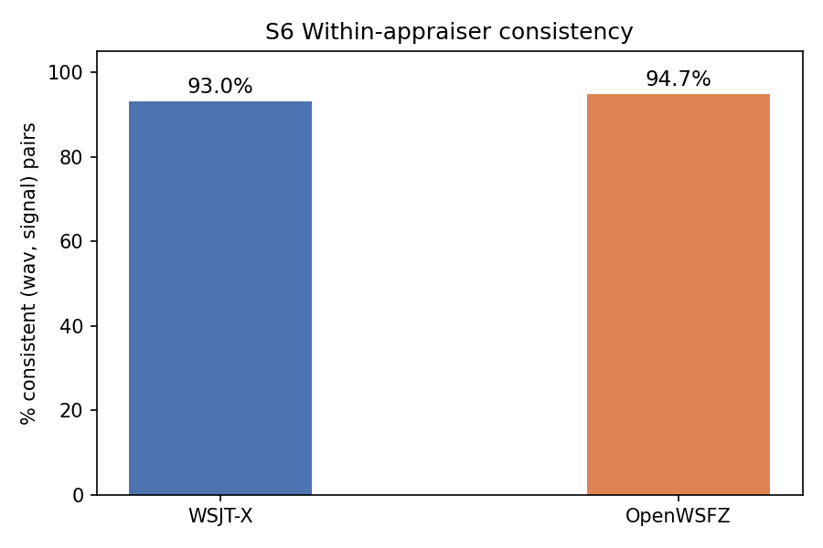
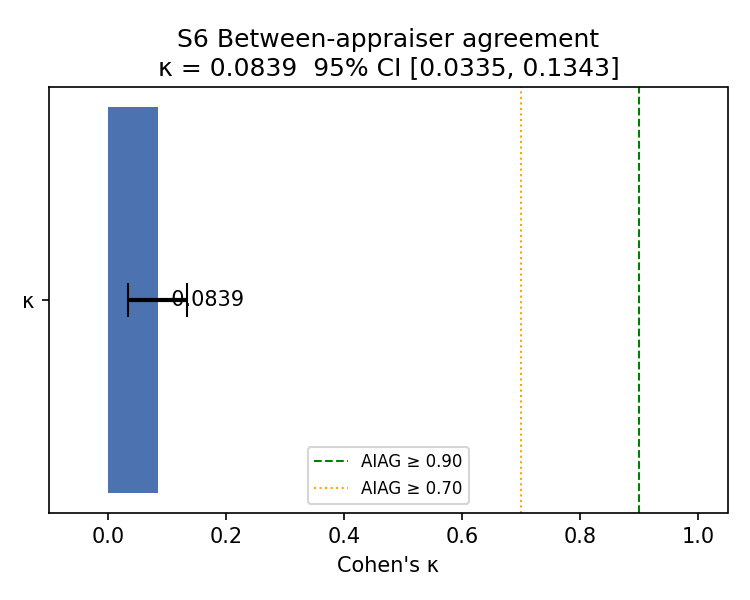
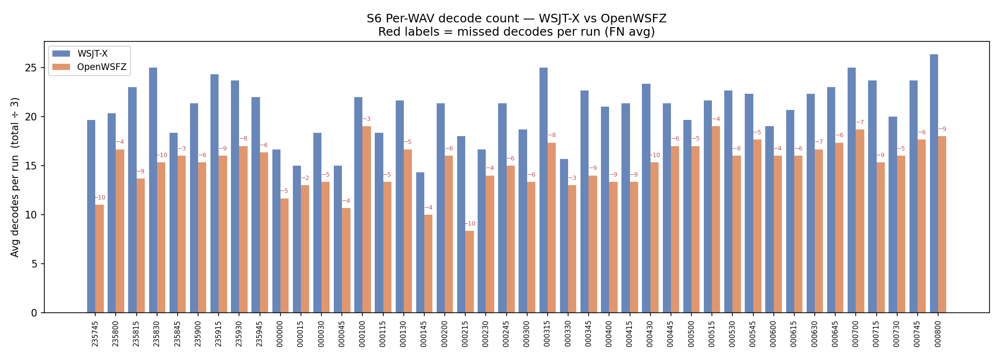
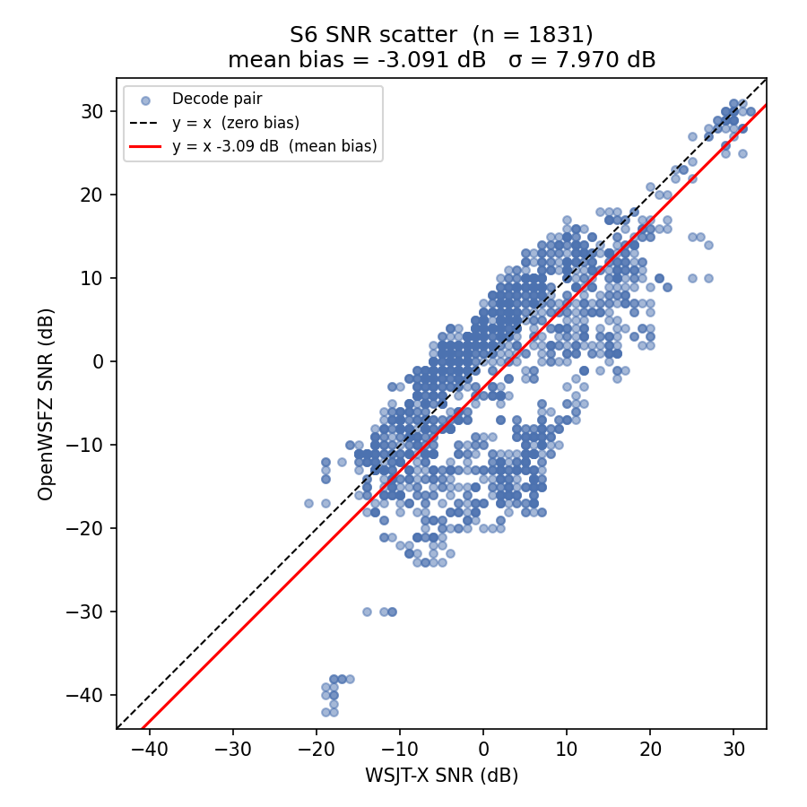

# S6 Corpus Replay — Analysis Report

## Study Context

**Purpose:** S6 is an attribute and SNR measurement study conducted on a real off-air corpus rather than synthetic signals. It has two objectives:

1. **Attribute agreement** — do OpenWSFZ and WSJT-X agree on which signals are present? (Cohen's κ)
2. **SNR accuracy field validation** — does the D-002 bias correction (shim constant −26.5 dB, FT8_SHIM_VERSION 20260006) hold under real-world multi-signal conditions?

**Corpus:** 42 off-air WAVs (~35 minutes of live 20 m FT8 activity recorded 2026-05-28/29). Each WAV is one 15-second FT8 slot. The corpus is git-ignored per NFR-021; only the analysis artefacts are committed.

**Acceptance thresholds:**

| Metric | Threshold | Source |
|---|---|---|
| Between-appraiser κ | ≥ 0.90 (PASS) / ≥ 0.70 (conditional) | AIAG attribute study |
| Within-appraiser consistency | ≥ 90% | AIAG attribute study |
| SNR bias (mean delta) | ±2.0 dB | spec §SNR accuracy / D-002 |
| SNR spread (σ of delta) | ≤ 4.0 dB | D-004 acceptance criterion |

| Field | Value |
|---|---|
| Run date | 2026-06-11 |
| OpenWSFZ SHA | `unknown` |
| WSJT-X version | WSJT-X 2.7.0 |
| WAV files | 42 |
| Runs (K) | 3 |
| Total observations | 2799 |

## 1. Within-Appraiser Consistency

_A (WAV, signal) pair is consistent if the decode decision is identical across all K runs for that appraiser. Measures measurement system stability, not agreement between appraisers._

| Appraiser | (WAV, signal) pairs | Consistent | % Consistent | Verdict |
|---|---|---|---|---|
| WSJT-X | 933 | 868 | 93.0% | PASS |
| OpenWSFZ | 933 | 884 | 94.7% | PASS |

## 2. Between-Appraiser Agreement (Cohen's κ)

_Measures how much more often the two appraisers agree than would be expected by chance alone. Landis-Koch (1977) scale: < 0.20 Slight, 0.20–0.40 Fair, 0.40–0.60 Moderate, 0.60–0.80 Substantial, ≥ 0.80 Almost perfect._

**κ = 0.0839**  (95% CI [0.0335, 0.1343])  — Slight  **[FAIL]**

_AIAG thresholds: κ ≥ 0.90 = acceptable; κ ≥ 0.70 = conditionally acceptable; κ < 0.70 = unacceptable. The gap is driven almost entirely by Section 3 (missed decodes — D-001)._

| | WSJT-X decoded | WSJT-X not decoded |
|---|---|---|
| **OpenWSFZ decoded** | 1831 (TP) | 78 (FP) |
| **OpenWSFZ not decoded** | 795 (FN) | 95 (TN) |

## 3. Decode Gap — D-001 Field Evidence

_Informational — no pass threshold is set pending a D-001 fix. Establishes the real-world decode gap baseline._

OpenWSFZ decoded **1,831** of the **2,626** signals found by WSJT-X (**69.7%**). **795** signals were decoded by WSJT-X but missed by OpenWSFZ (30.3%).

### Worst-gap files (top 10 by missed decodes, averaged over K runs)

| WAV | WSJT-X avg | OpenWSFZ avg | Missed avg | OpenWSFZ rate |
|---|---|---|---|---|
| 260528_235830.wav | 25.0 | 15.3 | 10.3 | 59% |
| 260529_000430.wav | 23.3 | 15.3 | 10.0 | 57% |
| 260528_235745.wav | 19.7 | 11.0 | 9.7 | 51% |
| 260529_000215.wav | 18.0 | 8.3 | 9.7 | 46% |
| 260529_000800.wav | 26.3 | 18.0 | 9.3 | 65% |
| 260528_235815.wav | 23.0 | 13.7 | 9.3 | 59% |
| 260529_000415.wav | 21.3 | 13.3 | 9.0 | 58% |
| 260529_000715.wav | 23.7 | 15.3 | 9.0 | 62% |
| 260528_235915.wav | 24.3 | 16.0 | 8.7 | 64% |
| 260529_000400.wav | 21.0 | 13.3 | 8.7 | 59% |

## 4. SNR Reporting Accuracy — D-004 Field Validation

Mean SNR delta (OpenWSFZ − WSJT-X) = **-3.091 dB** (threshold ±2.0 dB)  **[FAIL]**

σ = **7.970 dB** (threshold ≤ 4.0 dB)  **[FAIL]**

n = 1,831 matched decode pairs (both appraisers decoded the same signal)

_Positive delta = OpenWSFZ reports higher SNR than WSJT-X. The synthetic S1 baseline (run `0682106`) returned +1.78 dB mean — within threshold. This run uses real off-air signals; any systematic difference indicates the shim constant fix does not generalise to field conditions (D-004)._

## 5. Order-Effect Test

_Spearman ρ between WAV presentation slot rank and per-WAV decode count. A significant result (p < 0.05) would indicate session-state carryover (e.g. decoder warm-up artefacts, ALL.TXT accumulation). No effect expected in a correctly executed corpus replay._

**WSJT-X:** No order effect detected — Spearman ρ = 0.0132, p = 0.8833.

**OpenWSFZ:** No order effect detected — Spearman ρ = 0.033, p = 0.7136.

## Summary

| Metric | Value | Threshold | Verdict |
|---|---|---|---|
| Within-appraiser consistency (WSJT-X) | 93.0% | ≥ 90% | PASS |
| Within-appraiser consistency (OpenWSFZ) | 94.7% | ≥ 90% | PASS |
| Between-appraiser κ | 0.0839 | ≥ 0.70 | FAIL |
| OpenWSFZ decode rate vs WSJT-X | 69.7% | — (informational) | — |
| SNR bias (mean delta) | -3.091 dB | ±2.0 dB | FAIL |
| SNR spread (σ) | 7.970 dB | ≤4.0 dB | FAIL |

**Overall verdict: FAIL**

### Defect Notices

- ❌ FAIL — Between-appraiser κ = 0.0839 (threshold ≥ 0.70). Root cause: D-001 decode gap (795 missed decodes, 30.3% miss rate).
- ❌ FAIL — SNR bias = -3.091 dB (threshold ±2.0 dB). See D-004.
- ❌ FAIL — SNR σ = 7.970 dB (threshold ≤4.0 dB). See D-003/D-004.

---

_Callsigns scrubbed per NFR-021. Real callsigns replaced with `[CALL]` before commit._
