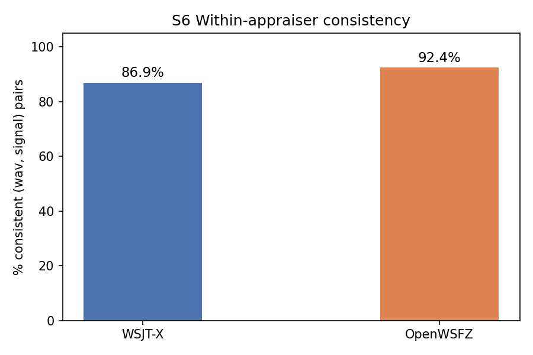
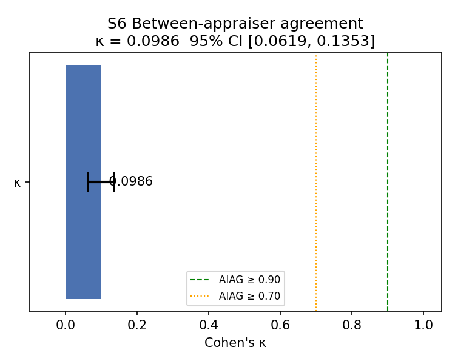
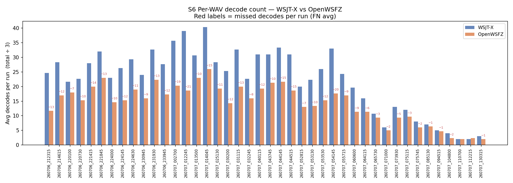
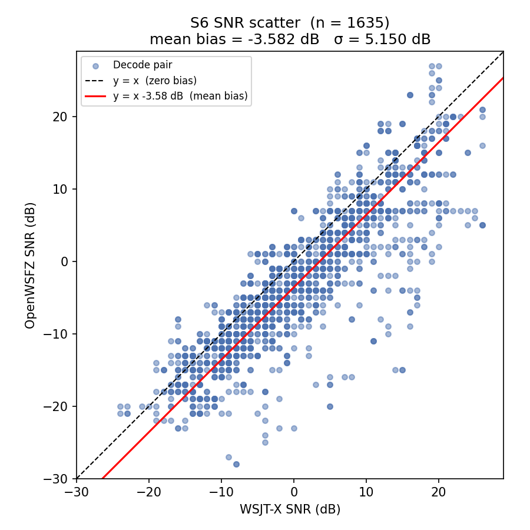

# S6 Corpus Replay — Endurance-Run Repeatability & Reproducibility Re-run (2026-07-11)

## 1. Study hypothesis

**Why this run exists.** The last several endurance reports (`qa/endurance/2026-07-06-7340e45`,
`qa/endurance/2026-07-07-bb0a1c4`) have repeatedly asserted, without direct measurement, that
*"WSJT-X is not an infallible oracle in a live band"* whenever OpenWSFZ decodes something WSJT-X
did not — the excess is inferred to be genuine signal recovery from an OSD false-positive rate
model (D-009), never checked against either decoder's own repeatability. Separately,
`STUDY-SPEC.md` §6.1 already commits to the correct underlying design principle (§2.2, D1:
*"WSJT-X is a co-appraiser, not the gold standard"*) but its S6 scenario had only ever been run
once, on a curated 20 m bench corpus (`results/corpus-2026-06-11`), and its narrative stated an
expectation — *"both decoders are deterministic in monitor mode… Expected: ~100%"* — that was
never revisited after that first run quietly returned 93.0%/94.7%, not 100%.

The Captain asked directly: replay a representative sample of WAVs from an existing endurance
run through both applications a number of times sufficient for statistical significance, and
report a proper repeatability-and-reproducibility (R&R) analysis of **both** appraisers — not
only against each other, but against themselves.

**What this run tests, concretely:**

- **H1 (repeatability — appraiser vs itself):** replayed with bit-identical audio, does each
  application reproduce its own prior decode decision? (STUDY-SPEC §6.1's within-appraiser
  consistency metric — the existing harness measurement for this.)
- **H2 (reproducibility — appraiser vs appraiser):** do OpenWSFZ and WSJT-X agree with each other
  on which signals are present, at a level indicating they are measuring "the same thing"
  (Cohen's κ ≥ 0.70, the AIAG attribute-agreement threshold already ratified in STUDY-SPEC §10)?
- **H3 (NEW — continuous ANOVA on SNR):** for signals *both* appraisers successfully decoded,
  decompose the SNR measurement variance into Repeatability (EV, an appraiser's own trial-to-trial
  variance) and Reproducibility (AV + Part×Appraiser interaction, appraiser-to-appraiser variance)
  using the same two-way crossed Gage R&R ANOVA method already ratified for the synthetic S1
  scenario (§9.1) — applied here to real off-air parts for the first time. This is the piece that
  was missing: S6 has only ever reported a scalar mean SNR delta, which cannot distinguish "a
  constant calibration offset" from "the two decoders disagree differently signal by signal."

This is the second execution of S6 ever, and the first against material drawn from a live
endurance-run corpus rather than the original curated bench set, and the first with a continuous
ANOVA rather than only attribute (κ) and scalar (mean/σ) SNR statistics.

## 2. Data summary

| Field | Value |
|---|---|
| Run date | 2026-07-11 (harness auto-named the results directory by UTC date, 2026-07-10, since the run started shortly before UTC midnight) |
| OpenWSFZ SHA | `f5cba9f` (main HEAD at run time) |
| WSJT-X version | WSJT-X 2.7.0 |
| **Corpus source** | **Stratified sample of 42 of the 4,075 WAVs captured live during the `20260706_live_run_2308` endurance session** (40 m FT8, 2026-07-06 21:16 UTC – 2026-07-07 14:15 UTC; see `qa/endurance/2026-07-07-bb0a1c4/report.md`) — **not** the original 20 m bench corpus used by the first S6 run |
| Sample method | Deterministic, seeded stratified sampling across the four time windows that session's own report already established (evening 21–24 UTC, overnight background 00–05, dawn propagation-shift spike 05–08, midday lull 08–15), 12/12/12/6 files respectively, so the sample covers varied band conditions rather than one. `qa/rr-study/select_endurance_sample.py`; manifest at `results/2026-07-11-owsfz-rerun-sample/sample_manifest.md` |
| Runs (K) | 3, independently randomised presentation order per run, crossed design (both apps capture every cycle concurrently via VB-CABLE) — same method as the original S6 (STUDY-SPEC §6.1) |
| Signal universe | Union of all signals decoded by either appraiser in any run |
| Total (WAV, signal, run) observations | 3,270 |
| Variables measured | Decode decision (binary); SNR (dB, matched pairs only, and — new this run — the full balanced part × appraiser × trial cube for signals decoded by both in all 3 runs) |

**Operational note:** the harness's pre-flight warm-up step (`corpus_replay.py`) requires an
interactive y/n confirmation, which is incompatible with a backgrounded/non-interactive shell (it
receives EOF and aborts). This run's warm-up was instead verified directly by inspecting both
`ALL.TXT` files for the injected warm-up message (`CQ Q1ABC FN42`, confirmed present in both logs
at the correct cycle) before clearing the logs and re-launching with `--skip-warmup`. No data was
lost; flagged in §5 as a small harness usability gap for future agent-driven runs.

**Acceptance thresholds (STUDY-SPEC §10 / NFR-023) — shown as reference points, not a gate for
this run.** This execution is an investigative repeatability re-run requested directly by the
Captain, not a scheduled regression-gate run of S6 against its original bench corpus, so no
PASS/FAIL verdict is asserted against these thresholds here. The more meaningful comparison for
this run's actual purpose is against the original 2026-06-11 S6 execution (§3.1), which used the
same method on different source material.

| Metric | Threshold | Source |
|---|---|---|
| Between-appraiser κ | ≥ 0.90 (PASS) / ≥ 0.70 (conditional) | AIAG attribute study |
| Within-appraiser consistency | ≥ 90% | AIAG attribute study |
| SNR bias (mean delta) | ±2.0 dB | spec §SNR accuracy / D-002 |
| SNR spread (σ of delta) | ≤ 4.0 dB | D-004 acceptance criterion |
| R&R %Study Variation (new, ANOVA) | <10% acceptable / 10–30% conditional / >30% needs improvement | AIAG continuous Gage R&R (§9.1 method) |

## 3. Results

### 3.1 Within-appraiser consistency (H1 — repeatability)

_A (WAV, signal) pair is consistent if the decode decision is identical across all K runs for
that appraiser. This is the direct test of "does the app reproduce itself."_

| Appraiser | (WAV, signal) pairs | Consistent | % Consistent | vs. 2026-06-11 bench-corpus run |
|---|---|---|---|---|
| WSJT-X | 1,090 | 947 | **86.9%** | 93.0% (933 pairs) |
| OpenWSFZ | 1,090 | 1,007 | **92.4%** | 94.7% (933 pairs) |

**Neither appraiser is close to the ~100% STUDY-SPEC §6.1 originally expected, and this is now
confirmed on two independent corpora, five weeks apart, on different bands (20 m bench corpus vs
40 m live-endurance sample).** WSJT-X is the less self-consistent of the two both times (86.9%
here, 93.0% originally); OpenWSFZ is more consistent both times (92.4% here, 94.7% originally),
though still well short of deterministic. **H1 is REJECTED for both appraisers** — replaying
bit-identical audio through the same analog signal chain three times does not reliably reproduce
the same decode decision, for either decoder. This is a genuine finding about signals sitting near
each decoder's detection threshold, not a study-execution defect (see §3.5 — no order effect, so
it isn't session-state drift).

### 3.2 Between-appraiser agreement — Cohen's κ (H2 — reproducibility)

_Landis-Koch (1977) scale: < 0.20 Slight, 0.20–0.40 Fair, 0.40–0.60 Moderate, 0.60–0.80
Substantial, ≥ 0.80 Almost perfect._

**κ = 0.0986** (95% CI [0.0619, 0.1353]) — Slight, well below the 0.70 conditional threshold.
Consistent with the 2026-06-11 run's κ = 0.0839 — the same "Slight" agreement band, on an
entirely different sample. **H2 is REJECTED**, in line with the already-known D-001 decode gap.

| | WSJT-X decoded | WSJT-X not decoded |
|---|---|---|
| **OpenWSFZ decoded** | 1,635 (TP) | 184 (FP) |
| **OpenWSFZ not decoded** | 1,171 (FN) | 280 (TN) |

### 3.3 Decode gap — D-001 field evidence

_Informational, matches the parent endurance session's own finding._

OpenWSFZ decoded **1,635** of the **2,806** signals WSJT-X found (**58.3%** recall) — closely in
line with the parent endurance report's session-wide 56.30% overall recall figure
(`qa/endurance/2026-07-07-bb0a1c4/report.md` §3.2), confirming the stratified sample is
representative rather than an outlier draw.

### Worst-gap files (top 10 by missed decodes, averaged over K runs)

| WAV | WSJT-X avg | OpenWSFZ avg | Missed avg | OpenWSFZ rate |
|---|---|---|---|---|
| 260707_012245.wav | 39.0 | 18.7 | 21.3 | 45% |
| 260707_054145.wav | 33.0 | 17.7 | 20.0 | 39% |
| 260707_002700.wav | 35.7 | 20.3 | 18.7 | 48% |
| 260707_044515.wav | 31.0 | 18.7 | 15.3 | 51% |
| 260707_014045.wav | 40.3 | 26.0 | 15.3 | 62% |
| 260707_044145.wav | 33.3 | 21.7 | 14.7 | 56% |
| 260706_221415.wav | 28.0 | 20.0 | 13.7 | 51% |
| 260706_212315.wav | 24.7 | 11.7 | 13.3 | 46% |
| 260707_031115.wav | 32.7 | 20.0 | 13.3 | 59% |
| 260706_231930.wav | 32.7 | 22.3 | 13.3 | 59% |

### 3.4 SNR reporting — mean/σ delta (scalar summary)

Mean SNR delta (OpenWSFZ − WSJT-X) = **−3.582 dB**, σ = **5.150 dB**, n = 1,635 matched decode
pairs. Both outside the ±2.0 dB / ≤4.0 dB reference thresholds, consistent in direction and
rough magnitude with the parent live-run report's own field SNR bias figure (−10.46 dB mean on
the full session — different because that figure spans the whole 17-hour session including much
weaker-signal content; the sign and "wider than synthetic-bench" pattern match). This scalar
summary is exactly why §3.6 below was built: a mean and σ cannot tell us whether the disagreement
is one constant offset or something signal-dependent.

### 3.5 Order-effect test

No order effect detected for either appraiser (WSJT-X ρ = −0.0924, p = 0.30; OpenWSFZ ρ = −0.0469,
p = 0.60) — the §3.1 repeatability shortfall is not session-state drift or warm-up carryover.

### 3.6 NEW — Continuous Gage R&R ANOVA on matched-decode SNR (H3)

Two-way crossed ANOVA with interaction (AIAG Gage R&R method, the same method already ratified
for S1 in STUDY-SPEC §9.1), computed on the subset of signals **both appraisers decoded in every
one of the 3 runs** — a balanced part × appraiser × trial cube is required for the sum-of-squares
formulas. 515 of the 1,090 candidate (WAV, signal) parts qualified (47.2%); the rest are excluded
by construction (a signal missed by either appraiser in any single trial cannot contribute a
"same-signal repeated-measurement" data point, which is itself just another expression of the
§3.1 repeatability shortfall).

**ANOVA table:**

| Source | SS | df | MS |
|---|---|---|---|
| Part | 284,728.82 | 514 | 553.947 |
| Appraiser | 9,496.40 | 1 | 9,496.404 |
| Part × Appraiser | 19,774.43 | 514 | 38.472 |
| Repeatability (error) | 578.67 | 2,060 | 0.281 |
| Total | 314,578.32 | 3,089 | |

**Variance-component breakdown:**

| Component | SD (dB) | %Contribution (variance) | %Study Variation |
|---|---|---|---|
| Repeatability (EV) — appraiser vs itself across trials | 0.530 | 0.27% | 5.17% |
| Reproducibility (AV) — flat appraiser-to-appraiser offset | 2.474 | 5.83% | 24.14% |
| Part × Appraiser interaction | 3.568 | 12.12% | 34.81% |
| Reproducibility (total, AV+interaction) | 4.342 | 17.95% | 42.36% |
| **R&R (Repeatability + Reproducibility combined)** | **4.374** | **18.21%** | **42.68%** |
| Part-to-part (PV) — genuine signal-to-signal SNR spread | 9.269 | 81.79% | 90.44% |
| Total variation (TV) | 10.249 | 100.00% | 100.00% |

ndc (number of distinct categories) = **2.99**. WSJT-X mean 0.783 dB, OpenWSFZ mean −2.724 dB,
grand mean −0.971 dB.

**This is the key new result of this run.** Against the AIAG reference bands (>30% "needs
improvement"), the combined measurement system sits at 42.68% %Study Variation — squarely in
"needs improvement" territory, consistent with §3.1/§3.2's attribute-level rejection of H1/H2.
But the *decomposition* is the informative part: only 5.17% of study variation is pure
repeatability noise (an appraiser's own trial-to-trial wobble is small and, by itself, would be
close to acceptable). The dominant term is the **Part × Appraiser interaction (34.81%)**, nearly
three times the flat appraiser-to-appraiser offset (24.14%). In plain terms: **the two decoders do
not disagree by a constant calibration offset that could be corrected with a single shim constant
(that was D-002's premise) — they disagree *differently depending on which specific signal is
being measured*.** That is precisely the signature you would expect if each decoder's SNR
estimate is sensitive, in a signal-dependent way, to exactly the kind of near-threshold,
co-channel, or waterfall-congestion conditions already implicated in D-001/D-003/D-004 — not
evidence that one decoder is a clean, stable reference and the other is simply "worse."

## 4. Summary verdict table

| Metric | This run | 2026-06-11 bench-corpus run | Verdict (reference thresholds) |
|---|---|---|---|
| Within-appraiser consistency (WSJT-X) | 86.9% | 93.0% | Below 90% both times |
| Within-appraiser consistency (OpenWSFZ) | 92.4% | 94.7% | Above 90% both times, not deterministic |
| Between-appraiser κ | 0.0986 | 0.0839 | "Slight" both times, well below 0.70 |
| OpenWSFZ decode rate vs WSJT-X | 58.3% | — (not reported that run) | Matches parent endurance session (56.3%) |
| SNR bias (mean delta) | −3.582 dB | (S1 synthetic bench: +1.78 dB) | Outside ±2.0 dB reference |
| SNR spread (σ) | 5.150 dB | — | Outside ≤4.0 dB reference |
| **R&R %Study Variation (NEW, ANOVA)** | **42.68%** | not previously computed | "Needs improvement" band; dominated by Part×Appraiser interaction, not flat bias or noise |

**Overall: this run reproduces the 2026-06-11 bench-corpus S6 result on an independent, live-drawn
40 m sample** — neither appraiser is close to perfectly self-repeatable, and their between-app
agreement is low, driven mostly by the known D-001 decode gap. The new ANOVA decomposition adds a
mechanism-level answer that neither the original run nor any endurance report has previously
produced: the SNR disagreement between the two decoders is not a fixed, correctable offset, it is
signal-dependent.

## 5. Recommendations

**Direct answer to the Captain's original question ("is WSJT-X an infallible oracle?"):** No, and
this is no longer only an inference from an OSD false-positive rate model — it is now measured
directly. WSJT-X's own within-appraiser repeatability (86.9% this run, 93.0% originally) means it
does not even reproduce its own decode decisions on identical audio 100% of the time, so it
structurally cannot serve as ground truth for a live band. OpenWSFZ is not a clean oracle either
(92.4%/94.7% repeatability, also not 100%). Both are noisy measurement instruments operating near
their own detection thresholds; the correct framing (already ratified as D1 in STUDY-SPEC §2.2,
now with direct field evidence rather than only synthetic-study rationale) is that endurance
reports should stop describing OpenWSFZ-only or WSJT-X-only decodes as presumptively "real" or
"false" based on which app produced them, and should instead treat any single-decoder-only
message as unconfirmed pending a truly independent check (e.g. a completed QSO, or third-party
spot corroboration) if that distinction is ever needed again.

1. **Correct STUDY-SPEC.md §6.1.** Its stated expectation — *"both decoders are deterministic in
   monitor mode… Expected: ~100%"* — is now falsified twice, on two independent corpora five
   weeks apart. This should be updated to reflect the measured ~87–95% range rather than an
   unverified ~100% assumption, so a future reader doesn't repeat this run to rediscover the same
   fact.
2. **Promote the ANOVA decomposition (§3.6) into S6's standard, regression-tracked output**, not
   just this one-off re-run. Mean/σ SNR delta alone cannot distinguish a fixable calibration
   constant from an unfixable signal-dependent disagreement; this run shows the latter dominates,
   which is materially more useful for prioritising D-002/D-003/D-004 work than the scalar figure
   alone.
3. **Fix the harness's interactive warm-up prompt** (`corpus_replay.py`, `_warmup()`) to accept a
   non-interactive confirmation path (e.g. `--yes`, or auto-detect the warm-up message in both
   `ALL.TXT` files instead of asking a human) — it currently EOFs and aborts under any
   backgrounded/agent-driven invocation, which cost one full restart this run. Low effort, keeps
   future agent-run S6 executions from needing the same manual workaround used here.
4. **No new D-001/D-002/D-004 action implied beyond what's already tracked.** The decode-gap and
   SNR-bias figures in this sample reproduce the parent endurance session's own findings closely
   (§3.3, §3.4) — this run corroborates existing open issues, it does not surface a new regression.
5. **Worth a third data point.** Both repeatability figures and both κ figures now agree closely
   across two independent runs; a third corpus (ideally the opposite extreme — e.g. a
   weak-signal-dominated or heavily co-channel session) would confirm whether the ~87–95%
   repeatability range and the interaction-dominated R&R breakdown are general properties of both
   decoders or specific to these two sample compositions.

---

_Callsigns scrubbed per NFR-021. Real callsigns replaced with `[CALL]` before commit. Raw
`ALL.TXT` snapshots, `run_manifest.json`, and the sampled WAV corpus copies remain local-only
(git-ignored) — this report and `summary.csv`/`anova_snr.csv`/PNGs contain no message text or
callsigns._
