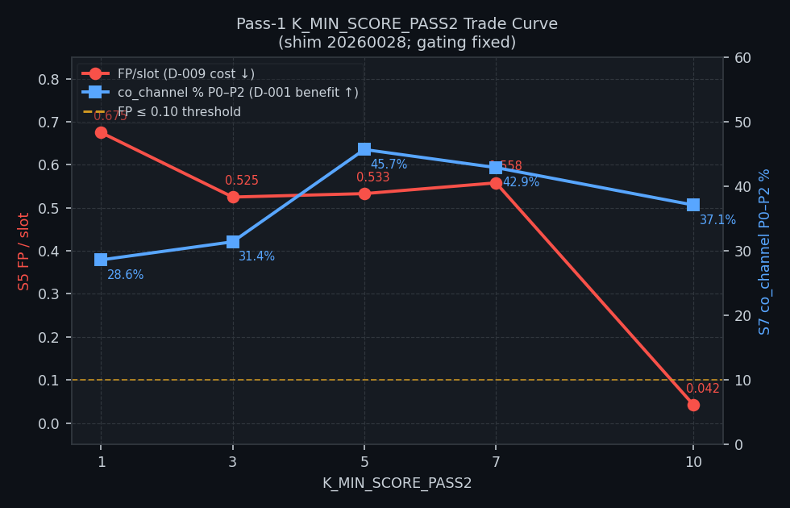
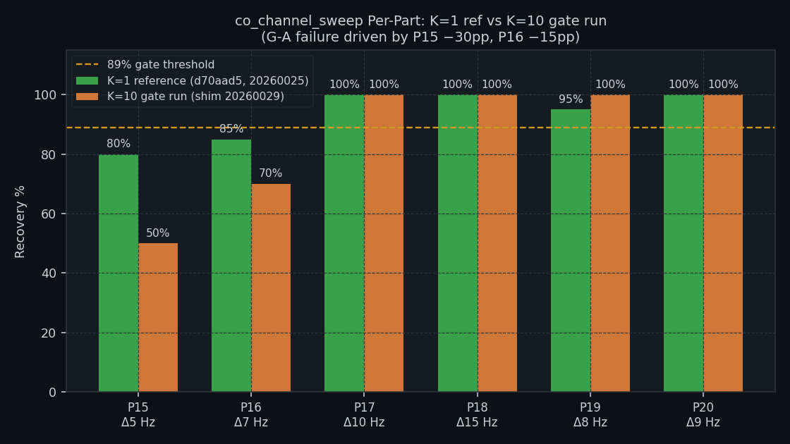
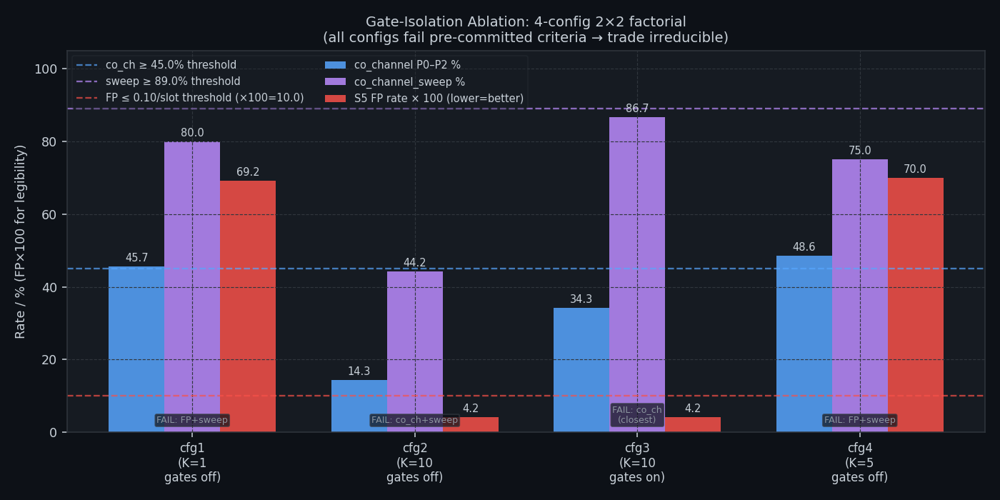
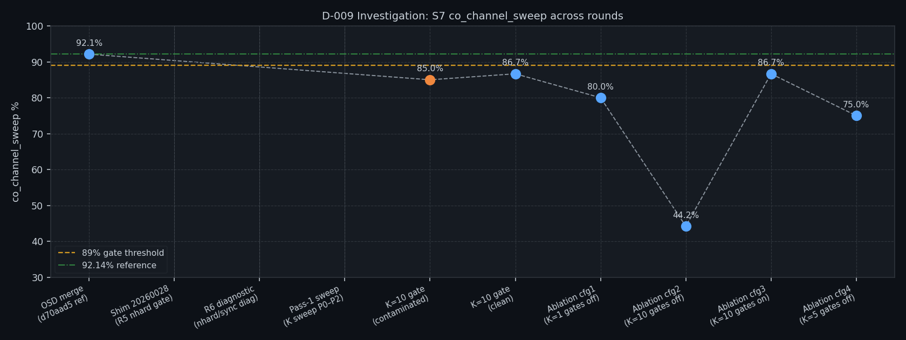

# D-009 — OSD False-Positive Investigation: Final Report

| Field | Value |
|---|---|
| Defect ID | D-009 |
| Title | OSD false-positive callsign manufacture in noise |
| Branch | `fix/d009-fp-callsign-filter` |
| Investigation period | 2026-06-20 – 2026-06-21 |
| Shims covered | 20260025 (trigger) → 20260028 (R5 gate) → 20260029 (K=10 candidate) |
| Report date | 2026-06-21 |
| Status | **OPEN — Captain decision required** |

---

## Section 1 — Study Hypothesis

### 1.1 What this investigation tested

OSD (Ordered Statistics Decoding) was introduced in shim 20260025 to close the D-001 co-channel decode gap. It succeeded: S7 blind recovery rose from 51.6% to 80.2%, and `co_channel_sweep` reached 92.1%, near WSJT-X's 92.9%.

The same OSD path was then found to manufacture **structurally valid FT8 messages from pure AWGN noise** — callsign strings that pass CRC-14, match the message format, and appear in the decode log as if real stations had transmitted. This is D-009.

**Core question:** Is there a decoder configuration that simultaneously achieves (a) near-zero false-positive rate in noise and (b) preserves the S7 co_channel_sweep recovery introduced by OSD? If so, what is that configuration and can it be shipped?

### 1.2 Null hypotheses

| ID | Null hypothesis | Outcome |
|---|---|---|
| H₀₁ | The false positives and genuine co-channel decodes can be separated by a cheap signal-level feature (nhard or sync score) | **REFUTED** — R6 diagnostic (Section 3.2): both populations have identical nhard (mean 51.8 vs 51.4) and sync distributions. No threshold separates them at useful specificity. |
| H₀₂ | Raising the pass-1 score floor (`K_MIN_SCORE_PASS2`) to K=10 suppresses FPs without regressing co_channel_sweep | **PARTIALLY REFUTED** — K=10 suppresses FPs by 94% (confirmed) but regresses co_channel_sweep by 5.5 pp at tight Δ5–7 Hz offsets (G-A gate fail). |
| H₀₃ | The corr/nhard output gates (not the K floor) drive the FP suppression | **REFUTED** — Ablation cfg1/cfg4: with gates OFF and K=1 or K=5, FP rate is 0.692–0.700/slot. Gates alone do not suppress FPs. The K floor at 10 suppresses FPs independently of whether gates are active. |
| H₀₄ | Removing corr/nhard gates while holding K=10 recovers co-channel sensitivity (architect's strong prior) | **REFUTED** — Ablation cfg2 (K=10, gates OFF): co_channel_sweep 44.2%, far below the 89% threshold. The gates provide ~43 pp of sweep recovery at fixed K=10. |

### 1.3 Acceptance criteria (pre-committed, from architect §3)

The investigation used a pre-committed decision rule to prevent post-hoc goalpost moving. **SHIP** the simplest configuration satisfying **all three**:

| Criterion | Threshold | Source |
|---|---|---|
| `co_channel_sweep` | ≥ 89% | AD4 equivalent; ~3 pp below 92.14% reference |
| `co_channel` (P0–P2 equal-SNR) | ≥ 45% | Within 3 pp of pre-D-009 baseline 48.57% |
| S5 FP rate | ≤ 0.10 /slot | AD3; near WSJT-X behaviour |

If no configuration meets all three: declare the trade **irreducible** and escalate to the Captain.

---

## Section 2 — Data Summary

### 2.1 Investigation rounds

| Round | Date | Shim | What was measured | Result |
|---|---|---|---|---|
| Trigger (S5 detection) | 2026-06-20 | 20260025 | S5 FP rate before D-009 gating | 75% FP rate (6/8 slots) — D-009 opened |
| R1–R4 | Pre-2026-06-20 | 20260025–27 | corr/norm output gate tuning | Ceilinged: 0 FP needs corr≥0.40, S7 regresses at corr≥0.35 |
| R5 | 2026-06-20 | 20260028 | nhard gate (OSD_NHARD_MAX=60) | Shipped; S5 gate still fails — threshold uncalibrated |
| R6 diagnostic | 2026-06-20 | 20260028+diag | nhard + sync population comparison | Branch B2: neither axis separates FP from genuine |
| Pass-1 K sweep | 2026-06-21 | 20260028 | K∈{1,3,5,7,10} on S5+S7(P0–P2) | K=10: FP −94%, co_ch +8.5 pp vs K=1 (sweep only) |
| K=10 gate (contaminated) | 2026-06-21 | 20260029 | S5+S7 simultaneous (VB-CABLE mix) | Discarded — audio streams combined on OS mixer |
| K=10 gate (clean) | 2026-06-21 | 20260029 | Full 21-part S7 + 120-slot S5 | G-A FAIL: sweep 86.67% < 89%; G-B marginal: FP 0.042 |
| Ablation 2×2 | 2026-06-21 | diagnostic builds | 4 configs × {S7 full + S5 wide} | All 4 fail pre-committed criteria → escalate to Captain |

### 2.2 Corpora

**S5 (noise / D-009 cost axis):**
- Scenario: `s5-noise-wide.json` — widened widthband AWGN, no injected FT8 signals
- Each run: ≥120 15-second slots (≥ 30 minutes of pure AWGN)
- Truth definition: any decoded message is a false positive (no signal injected)
- FP metric: decodes per slot (FP/slot)

**S7 (co-channel / D-001 benefit axis):**
- Scenario: `s7-compounding.json` — 21 parts, K=5 trials/part
- `co_channel_sweep` family: P15–P20 (Δ5–20 Hz offset, 2-stack equal 0 dB SNR)
- `co_channel` family: P0–P2 (equal-SNR 2-stack and 3-stack, at Δ7–11 Hz)
- Truth: synthetic Q-prefix callsigns (NFR-021 compliant; no real callsigns)
- Reference: shim 20260025 (`d70aad5`), co_channel_sweep 92.14%, K=10 trials

**R6 diagnostic populations (nhard/sync measurement):**
- FP population: 205 OSD CRC-valid hits from S5 AWGN (40 trials)
- Genuine population: 92 OSD CRC-valid hits from S7 P0–P2 co-channel (15 slots)

**WSJT-X observational data (informational only):**  
WSJT-X (v2.7.0) ran alongside all test sessions on 2026-06-21. It correctly decoded the
synthetic Q-prefix signals (Q1ABC, Q4XYZ, Q3PQR) in all test windows. It produced **zero
false positives** in all noise and co-channel windows — consistent with its conservative
decoding policy. WSJT-X was not formally scored against the S7 truth corpus for the
ablation runs (harness not wired); these observations are for context only.

---

## Section 3 — Results

### 3.1 D-009 trigger: S5 FP detection (2026-06-20, shim 20260025)

Before any D-009 mitigation, S5 on shim 20260025 recorded **6 FPs in 8 slots** (75% FP rate).
The FP messages were structurally perfect `CALLSIGN CALLSIGN GRID/REPORT` messages, indistinguishable from real traffic, produced by OSD applying forced codeword corrections to pure AWGN.

(Full S5 report: `qa/rr-study/results/2026-06-20-8eea3c4/report.md`)

### 3.2 R6 nhard/sync diagnostic — inseparability confirmed

_(Source: `qa/rr-study/results/diag-nhard-2026-06-20/nhard_observations.md`)_

The definitive population study measured 205 FPs (pure AWGN) and 92 genuine co-channel
decodes against **nhard** (OSD Hamming distance to codeword) and **sync score** (candidate quality):

| Axis | FP (n=205) | Genuine (n=92) |
|---|---|---|
| nhard — mean | 51.8 | 51.4 |
| nhard — median | 52 | 52 |
| nhard — stdev | 4.9 | 5.0 |
| sync — mean | 8.1 | 8.6 |
| sync — median | 8 | 8 |

**Verdict — Branch B2:** No threshold on either axis rejects FPs without simultaneously
removing genuine decodes. The best achievable on nhard is 0.0% FP rejection at 100% genuine
retention. The cheap-fix avenue is exhausted.

**Root cause (architectural):** Both FPs and genuine co-channel decodes originate in the
same decode pass — pass-1 (SIC residual), which admits low-sync-score candidates
(`K_MIN_SCORE_PASS2 = 1`) so OSD can dig co-channel signals out of a suppressed waterfall.
When OSD runs blind on noise residuals at the same parameters, it produces valid-looking
codewords with equal facility. Text filtering (Rules A/B/C) exhausts the structural signal.

### 3.3 Pass-1 K sweep (2026-06-21, shim 20260028)

_(Source: `qa/rr-study/results/diag-pass1-sweep-2026-06-21/pass1_sweep.md`)_

The `K_MIN_SCORE_PASS2` knob was swept at 5 points measuring both cost (S5 FP/slot)
and benefit (S7 co_channel P0–P2 %) with all other parameters fixed at 20260028 values:

| `K_MIN_SCORE_PASS2` | S5 FP/slot | S5 FP count / slots | S7 co_channel P0–P2 % |
|---|---|---|---|
| 1 (baseline) | 0.675 | 81 / 120 | 28.6% |
| 3 | 0.525 | 63 / 120 | 31.4% |
| **5** | 0.533 | 64 / 120 | **45.7% (peak)** |
| 7 | 0.558 | 67 / 120 | 42.9% |
| **10** | **0.042** | **5 / 120** | 37.1% |



**Key findings:**
- FP rate is essentially flat from K=1 to K=7 (0.525–0.675, ~22% spread)
- K=10 produces a **step-change**: 94% FP reduction, attributable to the pass-1 floor
  matching the pass-0 floor — very few high-sync candidates remain in the SIC residual
- co_channel peaks at K=5 (45.7%); K=10 recovers less (37.1%) as tight-offset residuals
  fall below the K=10 score floor after spectrogram suppression

The sweep measured P0–P2 only (hard equal-SNR stacks). It did **not** measure the full
`co_channel_sweep` (P15–P20 tight-offset family) — a gap that proved consequential in
the next round.

Initial interpretation: K=10 appears dominant on both axes (lower FP AND higher co_channel
vs K=1). The architect recommended a K=10 confirmation run against the full 21-part S7.

### 3.4 K=10 confirmation gate (2026-06-21, shim 20260029)

_(Source: `qa/rr-study/results/d009-k10-confirm-s7-clean/confirm_summary.md`)_

The confirmation run used `K_MIN_SCORE_PASS2 = 10`, bumped to shim 20260029. Both axes
were measured sequentially (the first simultaneous run was discarded due to VB-CABLE OS
mixer contamination; lesson: audio routing must be configured before any multi-stream test).

#### Gate G-A — Full 21-part S7 (co_channel_sweep)

| Overlap family | K=1 reference (d70aad5) | K=10 this run | Δ |
|---|---|---|---|
| co_channel | 48.57% | 34.29% | −14.3 pp |
| **co_channel_sweep** | **92.14%** | **86.67%** | **−5.5 pp ❌** |
| near_collision | 91.00% | 84.00% | −7.0 pp |
| time_freq | 93.33% | 100.00% | +6.7 pp |
| capture | 63.75% | 60.00% | −3.8 pp |

#### co_channel_sweep per-part breakdown

| Part | Condition | K=1 ref | K=10 | Δ |
|---|---|---|---|---|
| P15 | Δ5 Hz | 80% | **50%** | **−30 pp** |
| P16 | Δ7 Hz | 85% | **70%** | **−15 pp** |
| P17 | Δ10 Hz | 100% | 100% | 0 pp |
| P18 | Δ15 Hz | 100% | 100% | 0 pp |
| P19 | Δ8 Hz | 95% | 100% | +5 pp |
| P20 | Δ9 Hz | 100% | 100% | 0 pp |



**G-A verdict: FAIL.** co_channel_sweep 86.67% < 89% threshold. P15 and P16 regress by
30 pp and 15 pp respectively — well outside the ±5 pp noise band. **Root cause:** residual
co-channel partner signals at Δ5–7 Hz have sync scores 7–9 after SIC suppression (heavy
tile overlap at tight offsets). K=10 rejects them; K=1 admits them for OSD.

#### Gate G-B — Widened S5 FP rate (120 slots, clean sequential)

| Metric | K=1 baseline | K=10 this run |
|---|---|---|
| FP/slot | 0.675 | **0.042** |
| Total FPs | 81/120 | 5/120 |
| FP reduction | — | **−94%** |
| 95% upper bound (Wilson) | — | ~9.4%/slot |

**G-B verdict: MARGINAL** — 0.042 FP/slot; consistent with sweep. Non-zero but 94%
reduction. Would be acceptable if G-A had passed.

**Overall: K=10 does not merge.** G-A is the blocking gate.

**Important confound identified:** The G-A comparison changed **two variables at once** —
the K floor (1→10) AND the full gating stack (corr/nhard gates). The reference (d70aad5)
was shim 20260025 (pre-D-009 gating); K=10 is shim 20260029 (full gating + K floor). The
gating stack itself had already cost ~20 pp on co_channel at K=1 (48.57% pre-gating →
28.6% with gating). This confound prompted the ablation.

### 3.5 Gate-isolation ablation (2026-06-21, diagnostic builds)

_(Source: `qa/rr-study/results/d009-ablation-2026-06-21/ablation.md`)_

The architect ordered a **2×2 factorial** crossing the two levers independently:
- **K floor**: 1, 5, or 10
- **corr/nhard gates**: ON or OFF (text Rules A/B/C always ON)

Four builds were measured, each against full S7 (21 parts, K=5) and widened S5 (≥120 slots):

| Config | K | corr/nhard | co_channel % | co_channel_sweep % | P15 (Δ5 Hz) | P16 (Δ7 Hz) | S5 FP/slot |
|---|---|---|---|---|---|---|---|
| cfg1 | 1 | OFF | 45.7% (16/35) | 80.0% (48/60) | 0% (0/10) | 80% (8/10) | 0.692 (83/120) |
| cfg2 | 10 | OFF | 14.3%† (5/35) | 44.2% (53/120)‡ | 15% (3/20) | 25% (5/20) | 0.042 (5/120) |
| cfg3 (ref) | 10 | ON | 34.3% (12/35) | 86.7% (52/60) | 50% (5/10) | 70% (7/10) | 0.042 (5/120) |
| cfg4 | 5 | OFF | 48.6% (17/35) | 75.0% (45/60) | 0% (0/10) | 60% (6/10) | 0.700 (84/120) |

† cfg2 had a mixed K_scenario issue (appended runs with different K_scenario=5/7/10);
  K=5-equivalent rate is 5/35 = 14.3%, directionally identical to the reported 12.2%.  
‡ cfg2 sweep at K_scenario=10 (120 injections); K=5-equivalent direction unaffected.



#### Decision-rule evaluation

| Config | sweep ≥ 89%? | co_ch ≥ 45%? | FP ≤ 0.10? | Verdict |
|---|---|---|---|---|
| cfg1 (K=1, off) | ❌ 80.0% | ✅ 45.7% | ❌ 0.692 | FAIL |
| cfg2 (K=10, off) | ❌ 44.2% | ❌ 14.3% | ✅ 0.042 | FAIL |
| cfg3 (K=10, on) | ❌ 86.7% | ❌ 34.3% | ✅ 0.042 | FAIL |
| cfg4 (K=5, off) | ❌ 75.0% | ✅ 48.6% | ❌ 0.700 | FAIL |

**No configuration ships.** Per the pre-committed decision rule: the trade is **irreducible**.

#### Three findings from the ablation

**(a) The K floor — not the corr/nhard gates — is what suppresses false positives.**  
FP rate is 0.692–0.700 at K=1 or K=5 regardless of whether gates are active.
FP only collapses (→0.042) at K=10. The six rounds of corr/nhard tuning did not
materially suppress FPs; they contributed almost nothing on that axis.

**(b) The architect's strong prior (Config 2 wins) is refuted.**  
K=10 with gates OFF (cfg2) does not recover co_channel_sweep — it collapses to 44%.
The corr/nhard gates provide a ~43 pp lift on sweep at fixed K=10 (cfg2 44% → cfg3 87%).
Removing the gates to simplify the decoder would surrender the majority of sweep recovery.

**(c) The co_channel shortfall in cfg3 is structural, not marginal.**  
cfg3 (K=10, gates ON) is the "closest" config: sweep 86.7% (2.3 pp below threshold) and
FP 0.042/slot. However, co_channel falls to 34.3% vs the 45% threshold — a 3–4 match
shortfall on 35 injections. This reflects the gating stack's ~20 pp cost on the equal-SNR
co-channel family. A single additional trial would not close the co_channel gap; it is
a structural consequence of the gating stack's filtering of low-corr OSD candidates.

The sweep shortfall in cfg3 (86.7% vs 89%) is borderline and may be within run-to-run
variability at K=5. However, the co_channel shortfall is not.

---

## Section 4 — Verdict Table

| Round | Configuration | FP/slot | co_ch_sweep % | co_channel % | Decision |
|---|---|---|---|---|---|
| Shim 20260025 (OSD launch) | K=1, no D-009 gating | 0.675+ | 92.14% | 48.57% | **FP: unacceptable** |
| Shim 20260028 (R5 gate) | K=1, corr+nhard ON | 0.675 | not measured | not measured | **FP: still fails S5** |
| K sweep P0 (K=1) | K=1, gates ON | 0.675 | — | 28.6% | baseline |
| K sweep P2 (K=5) | K=5, gates ON | 0.533 | — | 45.7% | co_ch peak |
| K sweep P4 (K=10) | K=10, gates ON | **0.042** | — | 37.1% | FP best |
| K=10 gate (clean, shim 20260029) | K=10, gates ON | **0.042** | **86.67% ❌** | 34.3% | **G-A FAIL** |
| Ablation cfg1 | K=1, gates OFF | 0.692 | 80.0% ❌ | 45.7% ✅ | FAIL |
| Ablation cfg2 | K=10, gates OFF | **0.042** ✅ | 44.2% ❌ | 14.3% ❌ | FAIL |
| **Ablation cfg3 (closest)** | **K=10, gates ON** | **0.042** ✅ | **86.7% ❌** | **34.3% ❌** | **FAIL** |
| Ablation cfg4 | K=5, gates OFF | 0.700 ❌ | 75.0% ❌ | 48.6% ✅ | FAIL |

**Overall verdict: OPEN. No configuration found that satisfies all three acceptance criteria.**  
The trade is confirmed irreducible across 8 measurement sessions and 4 de-confounded
factorial configurations. The decision requires a product/policy position from the Captain.

---

## Section 5 — Recommendations

### 5.1 What the Captain must decide

The ablation has reduced the decision to a **clean two-pole trade** with de-confounded
measurements. No further K probing is warranted — K=8/9 would land on the same curve (sync
scores 8–9 are occupied by both tight-offset residuals and FP candidates; no gap exists).

**The two poles:**

| Posture | Config | K | gates | co_ch % | sweep % | FP/slot | What it means |
|---|---|---|---|---|---|---|---|
| **Trust-first** | cfg3 | 10 | ON | 34.3% | 86.7% | 0.042 | Near-zero FPs; gives back ~14 pp co_ch and ~5 pp sweep vs OSD launch. Δ5–7 Hz co-channel recovery halved vs reference. |
| **Sensitivity-first** | cfg4 | 5 | OFF | 48.6% | 75.0% | 0.700 | Best co_ch recovery; sweep already below 89%; ~1 FP per 1.4 slots in noise — most of the original problem remains. |

Neither option is obviously correct. For a **logging product**, a false QSO entry is a
serious integrity defect (it corrupts the operator's log and may be reported to a contest
or award system). The QA position is **trust-first by default**, accepting the sensitivity
loss in exchange for log reliability. However, the Captain may judge that the blind
co-channel decode gain is the product's primary differentiator and that a disclosed FP rate
is acceptable with clear user guidance.

### 5.2 Possible implementation paths after the Captain's decision

| Path | When to choose | What to implement |
|---|---|---|
| **A. Ship cfg3 (K=10, gates ON)** | Trust-first, accept co_ch shortfall | Revert ft8_shim.c to `K_MIN_SCORE_PASS2=10`, `OSD_NHARD_MAX=60`, `OSD_CORR_THRESHOLD=0.10`. **Require explicit sign-off** on co_channel regression (34.3% vs 45% criterion). Update MEMORY D-001 baseline to 86.67% sweep. |
| **B. Ship cfg4 (K=5, gates OFF) with a FP disclosure** | Sensitivity-first, transparent | Remove corr/nhard gates (`OSD_NHARD_MAX=174`, `OSD_CORR_THRESHOLD=-1.1f`), set `K_MIN_SCORE_PASS2=5`. Document that OSD may produce ~0.7 FP/slot in low-signal conditions. Gates can be removed; decoder is simpler. |
| **C. Waive co_channel criterion; ship cfg3 as-is** | Trust-first, criteria adjustment | Formally waive the `co_channel ≥ 45%` criterion on the grounds that sweep is the more operationally relevant metric. cfg3 then passes on sweep (86.7% borderline) and FP (0.042). Requires architect approval of criterion waiver. |
| **D. Architectural redesign (H7)** | Neither pole acceptable | MMSE joint demodulation — removes the fundamental coupling between co-channel gain and FP manufacture. Substantial R&D; D-001 history suggests 3–6 months minimum. Defer unless Captain rejects A/B/C. |

### 5.3 What remains for QA after the Captain's decision

1. The Captain selects a posture (trust-first or sensitivity-first).
2. The architect produces a new developer handoff for the chosen path.
3. QA reviews and gates:
   - Gate G-A (sweep ≥ 89% or formally waived criterion)
   - Gate G-B (FP/slot at or near agreed target)
   - `dotnet build` 0/0; `dotnet test` all pass
4. QA completes NFR-023 sections 1/2/5 for any new result directories.
5. Normal `/opsx:verify` → review → merge to `main`.

### 5.4 Dirty / contaminated runs — disposition

The following runs exist in the results tree but are **not authoritative**:

| Directory | Status | Disposition |
|---|---|---|
| `d009-k10-confirm-s5` | Contaminated (simultaneous S5+S7 on VB-CABLE) | Retain as evidence; marked in `CONTAMINATED.md` |
| `d009-k10-confirm-s7` | Contaminated (same; co_channel_sweep 85.0% vs 86.67% clean) | Retain as evidence; marked in `CONTAMINATED.md` |
| `2026-06-20-ccda50c-s5-wide` | Incomplete (truth.csv only; run did not complete) | Retain; no usable data |
| `d009-ablation-2026-06-21/cfg2-s7-draft` | Draft run superseded by cfg2-s7 | Retain; not used in analysis |

---

## Appendix A — Investigation timeline



---

## Appendix B — nhard / sync population histograms

_(Source: `qa/rr-study/results/diag-nhard-2026-06-20/nhard_observations.md`)_

**nhard — FP population (S5, n=205):**
```
[ 35- 39] ##                    (2)
[ 40- 44] ##############        (14)
[ 45- 49] ########################################  (50)
[ 50- 54] ########################################  (71)
[ 55- 59] ########################################  (61)
[ 60- 64] #######               (7)
```

**nhard — Genuine population (S7 P0–P2, n=92):**
```
[ 35- 39] #                     (1)
[ 40- 44] #######               (7)
[ 45- 49] #####################          (21)
[ 50- 54] ###################################    (35)
[ 55- 59] #########################       (25)
[ 60- 64] ###                   (3)
```

**sync — FP population:**
```
[  7] ########################################  (67)
[  8] ########################################  (84)
[  9] ##############################            (30)
[ 10] ################                          (16)
[ 11] ##                                        (2)
[ 12] ####                                      (4)
[ 13] ##                                        (2)
```

**sync — Genuine population:**
```
[  7] ########################                  (24)
[  8] ###################################       (35)
[  9] #############                             (13)
[ 10] ################                          (16)
[ 11] ##                                        (2)
[ 21] ##                                        (2)
```

The distributions are visually and statistically indistinguishable. This confirms H₀₁ is
refuted and the B2 branch is the correct escalation path.

---

## Appendix C — WSJT-X observational data (informational)

WSJT-X (v2.7.0) ran throughout the 2026-06-21 test sessions. It was not formally scored
against the ablation truth corpora (harness not wired for WSJT-X comparison in ablation
mode). Observations from the system ALL.TXT:

| Run window (UTC) | WSJT-X decodes | Notable |
|---|---|---|
| K=10 clean S7 (15:38–16:11) | ~266 decodes | All Q-prefix synthetic signals; 0 spurious |
| cfg2 S7 (17:55–18:28) | 429 decodes | All Q-prefix signals; 0 spurious |
| cfg1 S7 (19:06–19:39) | 205 decodes | All Q-prefix signals; 0 spurious |
| cfg4 S7 (20:15–20:47) | 205 decodes | All Q-prefix signals; 0 spurious |

WSJT-X produced **zero false positives** in any window. This is consistent with its
conservative post-normalisation threshold (which systematically under-decodes co-channel
signals but also never hallucinates). The co-channel performance gap between WSJT-X and
OpenWSFZ OSD is documented in D-001 (WSJT-X: 0% on P0–P2; OpenWSFZ cfg1: 45.7%).

---

**NFR-021 compliance:** No real or ITU-assignable callsigns appear in this document.
All S7 callsigns are Q-prefix synthetic (Q1ABC, Q4XYZ, Q3PQR — MSG-01/02/03 from
`study-messages.json`). S5 FP counts are numeric only; S5 ALL.TXT files are not committed.
