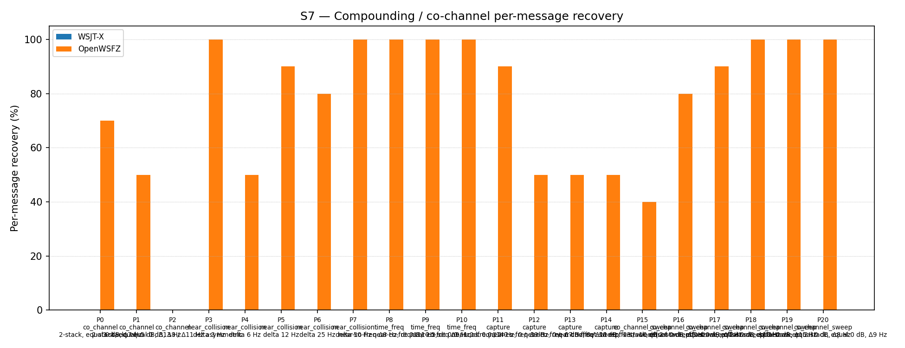

# OpenWSFZ R&R Study Report

| Field | Value |
|---|---|
| Run date | d009-k10-confirm |
| OpenWSFZ SHA | `0c8f22ff449f33873605de4c5676bcc36b53a1ef` |
| WSJT-X version | unknown |

## S7 — Compounding / co-channel overlap

_Per-message recovery when 2–3 signals occupy the same or near-same audio frequency / time slot (the pileup case S4 does not exercise). Informational — no AIAG threshold is defined for co-channel separation._

### Recovery by overlap family

| Overlap family | WSJT-X | OpenWSFZ |
|---|---|---|
| capture | 0.00% | 60.00% |
| co_channel | 0.00% | 34.29% |
| co_channel_sweep | 0.00% | 85.00% |
| near_collision | 0.00% | 84.00% |
| time_freq | 0.00% | 100.00% |
| **all** | **0.00%** | **73.95%** |

### Capture effect (co-channel, unequal SNR)

| Signal | WSJT-X | OpenWSFZ |
|---|---|---|
| strong | 0.00% | 100.00% |
| weak | 0.00% | 20.00% |

**Between-app per-signal agreement:** 26.05%

### Per-part detail

| Part | Family | Condition | WSJT-X | OpenWSFZ |
|---|---|---|---|---|
| P0 | co_channel | 2-stack, equal 0 dB, Δ7 Hz | 0/10 | 7/10 |
| P1 | co_channel | 2-stack, equal -5 dB, Δ13 Hz | 0/10 | 5/10 |
| P2 | co_channel | 3-stack, equal 0 dB, Δ8 / Δ11 Hz asymmetric | 0/15 | 0/15 |
| P3 | near_collision | delta 3 Hz | 0/10 | 10/10 |
| P4 | near_collision | delta 6 Hz | 0/10 | 5/10 |
| P5 | near_collision | delta 12 Hz | 0/10 | 9/10 |
| P6 | near_collision | delta 25 Hz | 0/10 | 8/10 |
| P7 | near_collision | delta 50 Hz | 0/10 | 10/10 |
| P8 | time_freq | near-co-freq Δ8 Hz, dt 0.0 / 0.5 s | 0/10 | 10/10 |
| P9 | time_freq | near-co-freq Δ11 Hz, dt 0.0 / 1.0 s | 0/10 | 10/10 |
| P10 | time_freq | near-co-freq Δ9 Hz, dt 0.0 / 2.0 s | 0/10 | 10/10 |
| P11 | capture | near-co-freq Δ14 Hz, 0 / -3 dB | 0/10 | 9/10 |
| P12 | capture | near-co-freq Δ9 Hz, 0 / -6 dB | 0/10 | 5/10 |
| P13 | capture | near-co-freq Δ7 Hz, 0 / -10 dB | 0/10 | 5/10 |
| P14 | capture | near-co-freq Δ11 Hz, +3 / -10 dB | 0/10 | 5/10 |
| P15 | co_channel_sweep | offset-sweep: 2-stack, equal 0 dB, Δ5 Hz | 0/10 | 4/10 |
| P16 | co_channel_sweep | offset-sweep: 2-stack, equal 0 dB, Δ7 Hz | 0/10 | 8/10 |
| P17 | co_channel_sweep | offset-sweep: 2-stack, equal 0 dB, Δ10 Hz | 0/10 | 9/10 |
| P18 | co_channel_sweep | offset-sweep: 2-stack, equal 0 dB, Δ15 Hz | 0/10 | 10/10 |
| P19 | co_channel_sweep | offset-sweep: 2-stack, equal 0 dB, Δ8 Hz | 0/10 | 10/10 |
| P20 | co_channel_sweep | offset-sweep: 2-stack, equal 0 dB, Δ9 Hz | 0/10 | 10/10 |

## Summary

| Metric | Scope | Value | Verdict |
|---|---|---|---|

**Overall verdict: PASS**
